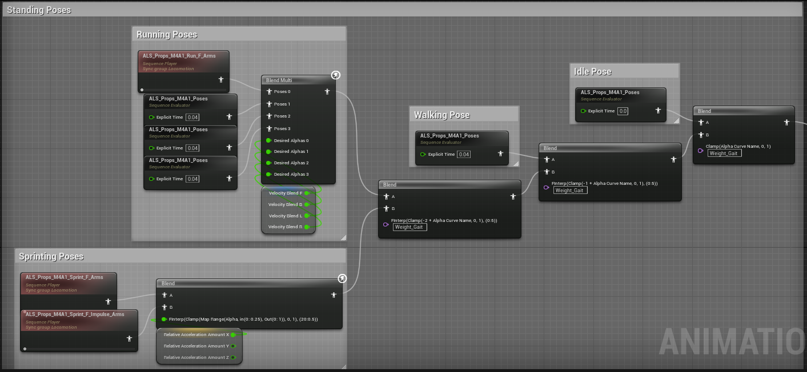
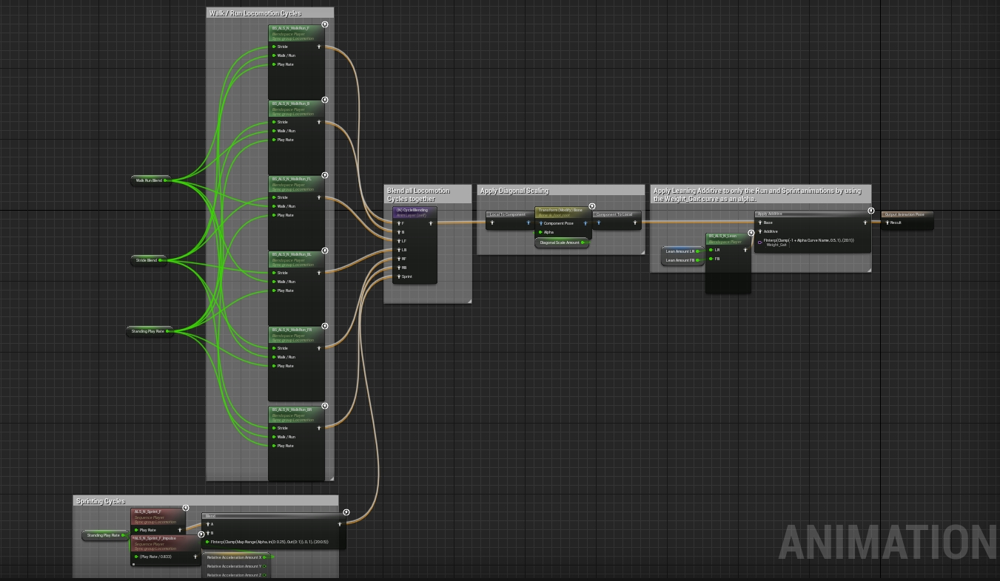
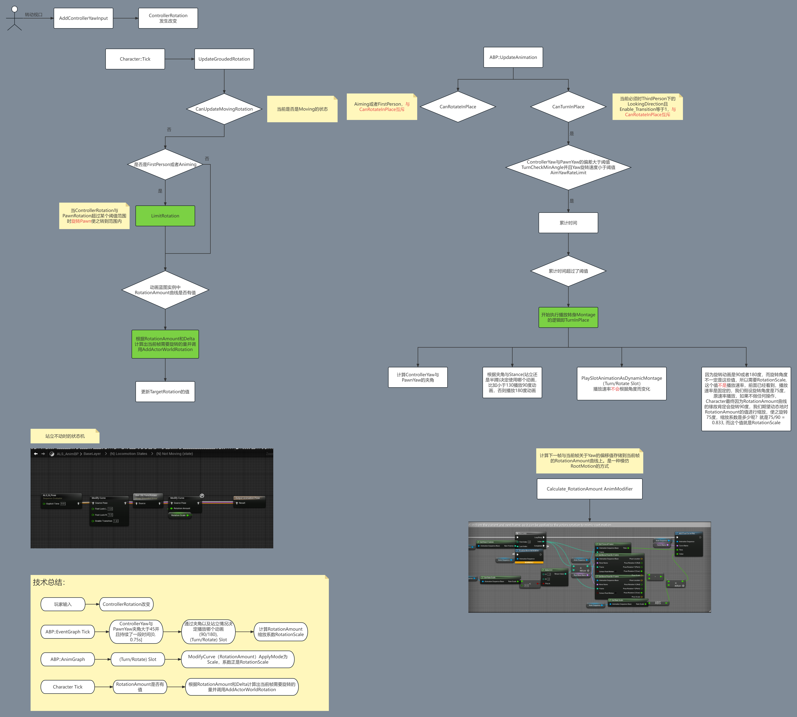

# Ragdoll

可以看到只有当MovementState为Ragdoll时才会走Ragdoll States.

Ragdoll蓝图部分的代码主要在ALS_Base_CharacterBP的Ragdoll System页签下.

简单来说就是启用Ragdoll(X键)时，调用RagdollStart(碰撞设置，启用物理以及关闭所有蒙太奇)，RagdollUpdate是在Ragdoll期间执行的工作(包括更新速度信息，物理模拟设置，更新重力设置以及调用SetActorLocationDuringRagdoll等)，SetActorLocationDuringRagdoll保障胶囊体不要脱离Mesh太多，否则相机不会跟随Mesh，同时避免胶囊体嵌到地面中；结束Ragdoll时(再次X键)会调用RagdollEnd,除了会执行RagdollStart中相反的操作以外，会调用SavePoseSnapshot以及播放起身的Montage

* SavePoseSnapshot的作用是当关闭物理到播放起身Montage这个期间能够平滑播放；当关闭物理那一刻Mesh的Pose为PoseA,关闭物理时动画蓝图会完全接管，紧接着播放起身Montage，比如BlendInTime是0.2，如果不做任何处理，在这0.2s期间，起身动画可能会与其他动画进行融合，但我们希望的是跟PoseA融合，所以我们可以通过SavePoseSnapshot把那一帧的Pose保存起来并用于融合；

* 会根据Ragdoll脸的朝向以及Overlay播放不同的起身动画, 你可以看到配置的所以起身动画都是起到半蹲状态的，如果在执行Ragdoll之前是站立状态，则Stance为Standing, 半蹲则为Crouthing, 当播放起身动画后，动画状态机会执行MainGroundedStates, 如果执行Ragdoll之前是Standing状态，播放起身动画后，状态机会依次走(CLF)Crouching LF-> (C)->(N)->(CLF)->(N)Transition, 所以可以看到GetUp->Crouch->Stand的变化。

还有一个细节就是攀爬的过程中如果Ragdoll的话，需要把MantleTimeline Stop掉，否则会出很多问题，OnMovementStateChanged就是来处理这类问题的(也可以说ALS_Base_CharacterBP中的On***Changed都是处理这类状态切换时需要特殊处理的问题的)。

进一步的细节可参考资料：

[布娃娃系统-ALS V4实现方案详解](https://zhuanlan.zhihu.com/p/383134963)

[UE4高级运动系统（Advanced Locomotion System V3）插件分析](https://zhuanlan.zhihu.com/p/101477611)

# OverlayLayer

## Default

Default为默认的Overlay动画，它定义了一个很标准的Overlay模板，基本上点出了其他Overlay动画应该考虑哪些参数。

Idle/MovementPoses考虑了角色在不同Gait(Idle/Walk/Run/Sprint)以及姿态(Stand/Crouching)的Pose表现

可以看到部分的Overlay动画是三帧，分别对应Idle/(Walk，Run,Sprint)/Crouching的情况

InAirPoses考虑到了在空中的事情

SecondaryMotion叠加了呼吸动画

可以看到ALS_StanceVariation_Normal中Layering_***和Layering_
***_Add都为1，表示最后希望给Overlay上叠上全部的Locomotion效果。

## Masculine(男性化)

跟Default一致，ALS_StanceVariation_Normal中Layering_***和Layering_
***_Add都为1，表示最后希望给Overlay上叠上全部的Locomotion效果。

## Feminine(女性化)

Feminine的结构跟Default一致，但Curves值不太一样。

Layering_Arm_L_Add和Layering_Arm_R_Add的数值不是1而是0.75，我们先看下如果改成1后的效果：

{Arm_Add为1.mp4}

可以看到当疾跑时角色女性化的手臂动画和疾跑手臂甩动动画合并效果不理想，我们希望手臂甩动幅度小一些即叠加的Locomotion效果减一些，所以把Layering_Arm_L_Add和Layering_Arm_R_Add的数值改成了0.75，而其他数值不变，所以仅仅改变了手臂的叠加效果。

{Arm_Add为0.75.mp4}

## HandsTied(双手被捆)

HandsTied的结构跟Default一致，但Curves值不太一样。

双手被捆的情况下，不管是什么Gait情况下，双手的状态应该是始终保持不变，即双手的状态不受Locomotion影响，所以需要将Layering_Arm_L_Add和Layering_Arm_R_Add的数值改成0，即Arm相关的动画只使用Overlay，不做任何叠加

## Injured(受伤)

Injured的结构跟Default一致，但Curves值不太一样。

左腹受伤的情况下，ArmL应该只使用Overlay，不会叠加甩臂的动画，所以Layering_Arm_L_Add为0，Layering_Arm_R_Add为1

## Box(搬箱子)

一般情况下，我们第一直觉会是跟HandsTied一样的设计，我们看下如果跟HandsTied设置一样会出现什么问题。

{Box只设置Arm.mp4}

很明显的问题是左手没有启用IK, 还有一个不是很明显的问题，如下图：

可以看到在搬箱子疾跑状态下，头和身体的姿态不太合理，头部和身体应该挺起来一些，而不是“埋头苦干”，可以调整Laying_Head_Add和Layering_Spline_Add的数值

我们再看下最终的效果:

{Box设置ArmHead以及Spline.mp4}

跟Defualt相比，下面的Curves的值不太一样:

Enable_HandIK_L 1

Layering_Arm_L_Add 0

Layering_Arm_R_Add 0

Layering_Head_Add 0.5

Layering_Spline_Add 0.75

Box的结构跟Default略有不同，可以看到Box考虑到了攀爬，翻滚和Ragdoll起身的特殊情况

> _去掉关于Overlay Override State的判断也不怎么影响表现，所以不再解释_

添加Enable_HandIK_L Curve后左手IK会自动生效，但有意思的是，项目中没有写任何有关的IK逻辑比如左手应该在哪个位置，IK是如何知道目标位置的呢？这其实涉及到一个概念“SpaceSwitch”即空间转换，我们必须得搞明白为什么出现了左手脱离箱子的情况，子骨骼的位置是通过从root到该骨骼依次相乘得到的而且动画师只在一些帧上key动画，这就导致中间的部分都是插值得到的(hips会插值，spline会插值，arm会插值等等)，这些插值后的骨骼再依次相乘得到的位置可能会跟理想位置有些出入，这就导致了抖动的问题。而虚拟骨骼就是为了解决这类问题的。

关于虚拟骨骼的参考资料：

[虚幻引擎新增动画特性](https://www.bilibili.com/video/BV1UE41147jS/?share_source=copy_web&vd_source=e00408fe4d52d25a32600d385dd6b894)

## Battel(扛桶)

Injured的结构跟Default一致，但Curves值不太一样。

非Crouching情况下可以看到Enable_HandIK_R为0，而Crouching下为1，因为Crouching的状态下需要右手扶着桶。

还有就是在Crouching状态下，由于右手已经在扶桶了，因此不用再叠加Locomotion的动画了，所以Layering_Arm_R_Add在Crouching下为0

有些设置跟Box类似，比如Layering_Head_Add等。

## Binoculars(手持双筒镜)

从这里开始，Overlay动画开始变的复杂了。。。

Binoculars的动画蓝图跟上面的那些略有不同，因为从这里开始有区分是否是AnimingPose。我们先从简单的开始看，NotAimingPoses的动画蓝图跟之前的类似，但这里对Sprint单独做了区分，因为在Sprint下左手要松开Binoculars，所以Sprint的动画也做了单独的配置。

如何区分的呢？我们知道Weight_Gait 0表示Idle, 1表示Walk(包括半蹲或者站立)，2表示Run, 3表示Sprint,因此Blend中使用的是Clamp(-2+CurveValue, 0, 1)因此Sprint时Alpha为1，其他情况则小于等于0

查看ALS_Props_Binoculars_Poses动画我们可以发现Sprint下，Enable_HandIK_L为0, 而且Layering_Arm_L也为0, 即左胳膊完全使用BaseLayer动画，Layering_Arm_R变成了0.75，Layering_Arm_R_Add为0即希望右胳膊在手持Binoculars情况下也有轻微摆动而不是死死地固定在胸前。

{Layering_Arm_R为0.75的情况.mp4}

{Layering_Arm_R为1的情况.mp4}

接下来看下AimingPoses的动画蓝图：

NotAniming与Animing模式下的动画在Curves配置上有些差别，我们以Idle举例:

Enable_SpineRotation (0 -> 1)

Layering_Arm_L_LS (1 -> 0)

Layering_Arm_R_LS (1 -> 0)

Layering_Head_Add (1 -> 0)

Layering_Spline_Add (1 -> 0.5)

Enable_SpineRotation稍后再说，Layering_Arm_L_LS和Layering_Arm_R_LS都变成了0，变成0的意思并不是说手臂的动作不使用了，而是换成MeshSpace去叠加(LayerBlending会详细讲)，Layering_Arm_L/R_MS的值始终等于(1 - Layering_Arm_L/R_LS)

再看下Enable_SpineRotation, 当Enable_SplineRotation为1时，AimOffsetBehaviors不再生效，而是直接旋转Pelvis, Spline_01, Spline_02, Spline_03, 比如当前角色看的目标点是右方40度的位置，那么四个骨骼分别向右旋转10度。启用Enable_SplineRotation对于武器瞄准特别有用，如果不使用Enable_SplineRotation可以看到角色没有向目标位置观察/瞄准。
(这里有一个问题，Pelvis也参与了旋转，但是Pelvis的旋转会直接导致腿部的旋转，如果保障腿部不旋转呢？可以看FootIK章节)

Enable_SplineRotation负责左右的瞄准，而AimSweepTime负责上下的瞄准。实现上也很简单，即提供一个长度为30帧即1s的MeshSpace叠加动画,内容是从仰视90度到俯视90度的内容，下面的蓝图内容完成了从AimingAngleY到AimSweepTime的映射。

## Torch(手持火把)

Torch的动画蓝图结构与Binoculars几乎一模一样，在动画的Curves上可能有些细微的差别，比如Torch在Aiming的情况下手臂仍然有一些摆动等等

## Rifle(步枪)

Rifle应该算是OverlayLayer里面最复杂的之一了，其他的如Pistol1H, Pistol2H, Bow的结构都与Rifle类似，所以只分析Rifle一个就可以了(状态机结构一样，只不过动画内部的CurveValues不同)。

大致来看，跟之前的结构特别类似，对不同的OverlayOverrideState做了不同处理，但不同的是由于Rifle细节处理很多，这次添加了RifleStates的状态机。

**Rifle Relaxed**: 放松状态，主要区别与瞄准状态

**Rifle Ready**: 主要用于瞄准状态到放松状态一个过渡状态，可以理解成一个警觉状态

**Rifle Aiming**: 瞄准状态

先看Rifle Relaxed，跟其他状态机一样处理了Crouched，InAir以及SecondaryMotion的情况，我们直接看StandingPoses的情况。

正如上面所提到的，我们可以利用Weight_Gait对Idle, Walk, Run和Sprint做不同的处理，值得注意的是Run和Sprint对于手臂摆动做了不一样的处理。Run的做法是让一个手臂摆动动画与多个静止动画帧BlendMulti, 一个摆臂动画和一个静止动画帧融合，结果就是权重不同摆动的幅度不同。Weights参数使用的是VelocityBlend，这个参数由CalculateVelocityBlend计算所得，CalculateVelocityBlend计算逻辑是将Velocity(WorldSpace)转为LocalVelocity(LocalSpace), 并且做简单的归一化处理，返回的结果包含前后左右四个方向的值。Sprint的做法是两个甩臂动画的Blend, Weights参数由CalculateRelativeAccelerationAmount计算所得，CalculateRelativeAccelerationAmount计算逻辑跟CalculateVelocityBlend类似，不过计算的是加速度Acc。Weights参数只使用了X分量即向前的方向。

>*可以看到所有的甩臂动画只包含了左右臂的曲线，而且这里打开了一个思路即如果Layering_Arm_L_Add效果不理想的情况下可以考虑加入单独的手臂动画*

Relaxed状态下如果瞄准的话则先进入Rifle Ready状态紧接着会马上进入Rifle Aiming状态，那么我们先看Rifle Aiming状态。

Rifle Aiming状态机跟之前提到的很类似，所以我们只重点关注Aiming状态下的CurveValues：

Enable_SplineRotation 1: 允许左右瞄准

HipOrientation_Bias 1: 瞄准的时候臀部朝向应该为右边(比如向左移动过程中开启瞄准，看到Hips有个转向)

Layering_Arm_L/R 1, Layering_Arm_L/R_Add 0, Layering_Arm_L/R_LS 0: 左右手臂完全使用Overlay动画

Layering_Head_Add 0.5：头部叠一点Locomotion动作

Layering_Spline_Add 0.75: Spline叠一点Locomotion动作

>*可以看到左右手臂全部使用的是Overlay单帧动画，如果不加SecondaryMotion的话会显的特别僵硬*

当不再瞄准时会从Rifle Aiming状态过渡到Rifle Ready状态，Rifle Ready可以理解成一个警戒状态，区别于一个放松状态，可以快速地再次切入到Aiming状态。状态机结构很简单，不再赘述。

# LayerBlending

在讲解LayerBlending之前一定要知道Curves的基础知识。我们在EventGraph和AnimGraph中都可以调用GetCurveValue这个函数，而且在AnimGraph放置的AnimSequence中也可能有Curve曲线，那现在有个问题，以下图为例，Blend使用的Layering_Legs的数值来源在哪里，是ALS_N_Walk_LB那里直接拿到的吗？还是后面ModifyCurve先计算的1？都不是，**是上一次AnimGraph返回的OutputPose存储的**，我们知道OutputPose不仅仅存储Pose还存储了Curves, Attributes等，其实我们看GetCurveValue内部实现就知道了，它拿的是AnimProxy中的数据，而AnimSequence中的Curves曲线数据和ModifyCurve修改的都是本次Evaluation中的FPoseContext::Curve数据，当然了，最终Evaluation生成的FPoseContext::Curve数据最终也是存储到AnimProxy中去的。

LayeringBlending如何处理BaseLayer和Overlay返回的Curves的呢？**相加即可**, 下面的节点做的工作就是Curves相加(下图中左边第一个LayeredBlendPerBone做的事情)并且完全覆盖掉BasePose传过来的Curves(下图中左边第二个LayeredBlendPerBone做的事情),因为BasePose传过来的Curves已经经历过很多Blend操作，没有任何价值了。

>_ApplyAdditive和ApplyMeshAdditive如何处理CurveValues的呢？**两者数值相加**_

* Layering_***表示是否需要融合Overlay相关部位的动画，0表示不融合，完全使用BaseLayer中的动画，大于0表示最终效果可能需要Overlay和BaseLayer的综合效果(记住并不是表示完全使用Overlay)，具体比例得看下面的参数

* Layering_Arm_L_Add表示将(BaseLayer-BasePose)这个叠加动画叠加到Overlay的程度，如果是1表示最终动画需要无删减的显示Overlay和BaseLayer的综合效果；如果是0表示完全使用Overlay的效果，BaseLayer的中这个部位的效果被舍弃。

常见场景：
如果Layering_***为0，则Layering_
***_Add参数不考虑，表示直接使用BaseLayer的效果，调试模式下显示为黑色($\color{red}{TODO 举例}$)

如果Layering_***为1，Layering_
***_Add为0，表示完全使用Overlay的效果，调试模式下显示为白色($\color{red}{TODO 举例}$)

如果Layering_***为1，Layering_
***_Add为1，表示是Overlay和BaseLayer的综合效果，调试模式下为红色($\color{red}{TODO 举例}$)

($\color{red}{如果两个数值都是大于0小于1的时候时，需要举例例子说明什么情况下调整哪个数值，毕竟两个数值都可以表示融合的程度}$)

参考资料：

[UE4分层混合节点LayeredBlendPerBone设置](https://zhuanlan.zhihu.com/p/428242048)

# BaseLayer

BaseLayer里描述了角色的基础Locomotion，包括地面运动(直立以及半蹲)，空中等。放在BaseLayer都是最基础的运动，不论拿什么武器，什么状态(休闲，警戒，战斗等)都需要在这些基础运动上叠加，因此拿什么武器，什么状态都是放在Overlay里面的。

BaseLayer内部有很多分层状态机，这里要提出一个很有意思的问题，**分层的依据是什么**?我们先看下BaseLayer的层结构图：

可以看到下一层的层级状态机都是封装好后给上层服务的，因此分层时可以从顶层往下看，以ALS为例，从顶层来看，先区分空中和地面运动，具体地面运动很多细节先不管，因此率先分出了Main Movement State层，继续往下走，地面运动再从大的范围上分为站立和半蹲，因此又分出了Main Grounded States，依次类推。这种拆分特别类似于从顶向下的模块编程。

## MainMovementStates

正如上面提到的，BaseLayer从最大范围拆分的话分为空中(InAir)和地面运动(Grounded), MainMovementStates处理的就是InAir和Grounded的关系，ALS的注释注释也提到如果要新增Flying, Swimming和Climbing的话，也可以在这里添加。

跟Overlay类似，这里同样使用导管处理不同的MovementState, 并且各个State的入口都是导管来处理。

### Jump

Jump在这里做了一个很多3A游戏都会处理的一个细节：区分起步/起跳/停步时左右脚的情况，怎么区分的？最简单有效的方式就是动画里设置CurveValues了，ALS也是这样的，曲线名为Feet_Position，这个曲线配置在所有移动相关的动画上，Feet_Position可以区分目前哪个脚打算Planted或者哪个脚已经Planted了(详细可以参考下面Curves解释章节)。通过Feet_Position可以区分起跳时双脚的情况，如果起跳时左脚Planted，则状态机走JumpLeftFoot，否则走JumpRightFoot。JumpLeft/RightFoot则是根据JumpPlayRate(奔跑速度越快JumpPlayRate越大)和Speed做了一个简单Blend, 打开ALS_N_JumpWalk动画，有两条曲线：Layering_Legs和Mask_LandPrediction

Layering_Legs: -0.5, 我们第一次看到了Curves可以为负值，负值代表了什么含义呢？上面LayerBlending我们提到过最终的Curve等于BaseLayer和Overlay的对应的Curve和，而Overlay往往会对一些曲线值进行调整比如Layering_*
系列的曲线用于调整最终的叠加效果，调整范围一般为[0, 1], 但本例中跳跃时我们不希望Overlay调整的原因导致跳跃时丢失太多的腿部的动作细节，相对比BaseLayer和Overlay的混合效果，我们更希望看到的是跳跃时BaseLayer很原汁原味的腿部细节，因此Layering_
*设置为负值是希望在这个区间内最终效果更加偏向于BaseLayer的效果，尽可能削弱Overlay带来的影响。

Mask_LandPrediction: 动画蓝图中有一个CalculateLandPrediction的函数，该函数在预测\`落地时间\`时使用，返回值的范围为[0, 1], 0认为没有要落地的迹象，1表示已经落地，因此这里提到的\`落地时间\`并不是绝对时间，这个数值在动画蓝图播放落地动画时特别有用。CalculateLandPrediction的实现也特别简单，从当前位置向运动方向做Capsule的碰撞检测，当前速度越快检测距离越远，返回结果后再判断是否可行走(IsWalkable)以及碰撞位置在Start和End的那个位置上(FHitResult::Time), 然后从LandPredictionCurve上取值(可以简单理解为1 - time), 到这一步其实可以将这个值返回的，但ALS加上了Mask_LandPrediction的曲线控制，为什么加这个控制呢？以JumpWalk动画为例，我们可能会刚起跳没多久就检测到需要播放Land动画(比如跳到一个不高的台阶上)，我们这时候希望起跳的前半段动画能够播放完再去混合Land动画，Mask_LandPrediction如果是1的话可以强制让CalculateLandPrediction返回0，Mask_LandPrediction如果是小于1的值会让计算结果跟0做个融合。因此Mask_LandPrediction可以解释为屏蔽Land动画的程度。

还有一个有意思的点是JumpLoop和Flail的条件始终为true，因此状态机刚到JumpLoop会马上跳到Flail上，但Transition设置的BlendTime为1，因此前1s会是JumpLoop和Flail的一个融合效果，后面会一直是Flail，因此不要认为JumpLoop没有任何作用。

Jump后面又对Lean, LandPrediction的情况做了处理，重点是LandPrediction，可以看空中到即将落地这段时间里状态仍然是Jump，Jump处理LandPrediction的好处是从Jump过渡到Land状态时会更加平滑自然(因为Jump已经提前过渡到了ALS_N_Land_Heavy/Light的第一帧)。

### Land/LandMovement

Land/LandMovement处理的就是跳到地面那一段时间腿部的状态，Land即没有任何输入下落地-站立的过程，而LandMovement处理的是落地的瞬间有输入的情况，做法就是MainGroundedStates的基础上添加Land_Additive，这样落地后可以马上行走并且又有落地后膝盖下压又起来的效果。

在ALS_N_Land_Light/Heavy动画中有两条曲线，分别是Mask_FootstepSound, Mask_Sprint:

Mask_FootstepSound: 配合Footstep_AnimNotify使用，用于控制音效的音量大小，如果OverrideMaskCurve为false，则生成的音效音量等于(1 - GetCurveValue(Mask_FootstepSound)) * VolumeMultiplier; 如果如果OverrideMaskCurve为true，Mask_FootstepSound不生效，直接使用VolumeMultiplier。

>_为什么处理CurveValue时都要(1 - CurveValue)呢？因为Curve默认值一般都为0，当动画没有任何曲线时应该保证正常运行_

Mask_Sprint: 我们看下如果把Mask_Sprint删除掉会发生什么，删除后我们始终sprinting前进时起跳落地，落地后的状态如下：

可以看到腿部已经有些变形了，原因在于Sprint的动作本身使身体有些下倾，再加上Land_Additive+FootIK的影响导致了怪异的Pose, 而Mask_Sprint曲线的作用就是在这段时间暂时减弱Sprint动画的比重，因为后面提到的前进动画是Walk/Run和Sprint融合的结果，减弱Sprint动画的比重就会使得Walk/Run动画的比重增加，Hips不会压得太低。

从LandMovement到Grounded有一个Transition条件是AutomaticRuleBasedOnSequencePlayerInState为true, 这个属性的含义是**当前动画状态中的"相关性"动画播放节点的剩余时间 < 混合持续时间(Transition中的混合时间)**时自动触发，而LandMovement中的相关性动画就是Land_Additive，因此状态机会在Land_Additive动画播放完毕前自动切换到Grounded状态上。

>_Land导管可以分别进入Land或者LandMovement, 但红色的Transition始终为true并且优先级也是1,根据InAir的设置，我觉得这里应该是个bug, 红色的Transition的优先级应该是2_

这里要说导管的一个细节，假设当前状态在Entry, 图内的4个Transitions都为true, Conduit内部条件不确定，那么状态机执行逻辑是什么呢？会先比较1和2的PriorityOrder, 率先执行PriorityOrder小的，Conduit属性面板里面没有PriorityOrder，**则使用默认值1**，如果1的PriorityOrder小则会执行状态A, 否则会先检查下Conduit内部的条件：
* 如果为true然后再次比较3和4，PriorityOrder小的则执行其状态；
* 如果Conduit内部条件为false，则会执行A。

## MainGroundedStates

正如上面提到的，MainGroundedStates主要定义的是Standing与Crouching的转换逻辑。先看下MainGroundedStates上的属性设置，MaxTransitionsPerFrame设置为1，表示只做第一层的Transtions检测，即状态机进入Entry状态(不会进入到Entry状态里面执行)后会立即做第一层的检测，因此可以初始时就进入FromRoll或者(N)Standing或者(CLF)CRouchingLF状态。

### Entry

可以看到Entry->(N)Standing的Transition和Entry->(CLF)CrouchingLF的Transtion是互斥的，因此状态机一定不会在Entry上停留，会迅速跳转到其他状态上，但Entry的属性LeftStateEvent上配置了Notify，因为离开Entry状态时会执行该Notify, 该Notify的逻辑就是把GroundedEntryState重置。

### FromRoll

执行完Roll动画后状态会走到这里，这是个起身后的单帧动画。这里着重注意的是，FromRoll->(N)Standing中有一个Transition是AutomaticRuleBasedOnSequencePlayerInState为true，但刚才提到了FromRoll仅仅是一帧动画，这时候"相关性"动画播放节点的剩余时间等于多少呢？**等于所取的那一帧到动画末尾的时间**，因为ALS_N_LandRoll_F长度为1.5，而所取的帧正好也是1.5s, 因为剩余时间始终小于Transition中的混合时间，因此这是个恒为true等Transition, 因此FromRoll->(N)Standing的第二个Transition就没有必要了。

### (N)Standing/(CLF)CrouchingLF

Standing使用的是(N)LocomotionStates, 而CrouchingLF使用的是(CLF)LocomotionStates, 在不同的状态执行了不同LocomotionStates, 状态机在这里做了一个大的分叉。

## (N/CLF)LocomotionStates

MainGroundedStates处理完了是Standing与Crouching的转换逻辑，而(N)LocomotionStates处理Standing状态下NotMoving/Moving/Stop/AnimingRotation之间的转换逻辑，(CLF)LocomotionStates同理。

## NotMoving

如果是静止不动的话，状态机不再会有深的嵌套了，NotMoving直接在这里使用了ALS_N_Pose作为最末端的Pose, 因此站立不动的情况下状态机不会再走LocomotionDetail和LocomotionCycles。

在离开NotMoving状态时会调用AnimNotify_StopTransition

## Moving

进入Moving状态时也会调用AnimNotify_StopTransition。内部逻辑是LocomotionDetail状态机的结果。

Outpin有两个，一个指向NotMoving另一个指向Stop，指向NotMoving的条件是Not ShouldMove, 指向Stop的条件是Not ShouldMove AND StateWeight(Moving) == 1, 比如说摁下前进后又迅速松开，这时候StateWeight(Moving) < 1, 因此没有必要走完整的Stop流程，直接Blend到NotMoving即可。

## Stop

停步(Stop)是LocomotionStates里面的核心内容，我们知道很多3A游戏都对停步做了很细致的处理，比如停步时左脚或者右脚在前时要执行不同的逻辑，我们重点看下ALS做了哪些细致的处理。

>_Moving->Stop的TransitionDuration为0，而Stop->NotMoving的条件是GetInstanceStateWeight == 1.0,TransitionDuration为0.3,因此Stop播放一帧就慢慢切换到NotMoving了，因此不会出现播放DynamicStopMontage无法切换到NotMoving的问题_

在上面Jump章节已经提到了通过Feet_Position曲线可以知道当前两个脚的情况，通过abs(Feet_Position)可以区分相应的脚是已经落地还是即将落地，通过正负值可以区分是左脚还是右脚，总体分为如下四种情况：

### 左脚已经落地

LockLeftFoot内部很简单，在继续使用LocomotionDetail的前提下将FootLockL设置为1，但进入LockLeftFoot的状态时调用了一个->NStopL的Event，这个Event的作用就是播放了一个动态蒙太奇，动画是ALS_N_Stop_L_Down，这是个腿部整理动画，特别重要的是这是一个**叠加动画**，动画从0.4s开始播放，也是右脚从抬起到落下的一个表现，Slot在GroundedSlot，在播放动态叠加蒙太奇的同时State逐渐过渡回了NotMoving。

更详细的可以查看下面视频:

{停步时左脚已经Planted.mp4}

>_需要注意的是Pre-Stop->FootDown->LockLeftFoot的TransitionTime为0，因此会立即切换到LockLeftFoot上_

### 右脚已经落地

原理同上

### 左脚在空中即将落地

相比于上面左脚已落地，这里有两个不同之处：

1. PlantLeftFoot状态如下：
   
   

   可以看到添加了LayeredBlendPerBone相关节点，我们当前的情况是左脚在空中即将落地，但是还没有落地，那么左脚落地后的Pose是什么样子呢？LayeredBlendPerBone和BlendMulti做的事情就是根据当前Velocity的情况推算出左脚的落地Pose，并将这个左脚Pose跟LocomotionDetail做一个组合。

   
   黄色是LayeredBlendPerBone后的Pose，红色是LocomotionDetail的Pose

2. 假如上一帧还在空中下一帧就将左脚切到地面上会有一些突兀，这里将PreStop->PlantLeftFoot的TransitionTime设置为了0.1，保证有0.1s的时间既能让左脚通过LocomotionDetail完成一个落地动作，还能保证最终锁脚的效果。

### 右脚在空中即将落地

原理同上

## RotateLeft/Right90

具体细节可以参考下面的RotationSystem

## (N)LocomotionDetail

下面的(N)LocomotionCycles已经处理了从Walk到Run的动画过渡，那为什么还需要LocomotionDetail呢？这里的“Detail”指的就是状态改变时的细节变化，比如身体的倾斜。

>_由于半蹲没有Walk和Run的状态，也不存在速度变化时的细节，因此CLF没有LocomotionDetail_

### Walking

这里有一个很意思的事情，既然状态改变时需要发生身体倾斜，为什么Walking的Outpin中有Running呢，一切转换都走->Run导管流程不好吗？这是因为LocomotionCycles中对于**加速度Acceleration**(注意是根据上下帧计算处理的加速度而不是InputAcceleration)不为0是已经做了身体前倾的处理，试想这个情景，Walking状态下翻滚然后突然Run, 这个时候Acceleration有值因为LocomotionCycles会给身体做了一个身体前倾，如果这里再前倾的话，那么最终的效果如下:

Walking是走Running还是->Run导管有一个重要的判断条件是MachineWeight(MainGroundedStates)是否为1，因为当出现翻滚或者空中时，因为Slot的缘故，MainGroundedStates会短暂的处于未激活状态，因此MachineWeight(MainGroundedStates) < 1的话表明是刚刚落地/站立, MachineWeight(MainGroundedStates)= 1表示已经稳定了一段时间了。

>_MachineWeight表示这个状态机节点最终权重值_

进入->Run导管后仍然有两个选择：RunStart或者Walk->Run，当然这里我们可以新建一些变量比如Walking/Running持续时间, 或者ShouldMove持续时间等等，还有一个办法就是ALS用到的MachineWeight, 在上面LocomotionStates里面已经讲过存在NotMoving和Moving两个States, 当处于NotMoving时最终动画是一个站立Pose, 当处于Moving时才会走LocomotionDetail，当起步从NotMoving过渡到Moving时，NotMoving状态的权重逐渐降低，Moving的权重逐渐升高也意味着LocomotionDetail的权重也从0逐渐变为1，因此可以知道当MachineWeight(LocomotionDetail) < 1时意味着处于NotMoving->Moving的过渡期即RunStart, 等于1意味着一直处于Moving状态。

>_打开两个Transitions看到使用的是MachineWeight((N)LocomotionStates),这是引擎显示的一个bug，如果你复制再粘贴这个节点可以看到使用的是MachineWeight((N)LocomotionDetail)_

### RunStart/Walk->Run/FirstPivot/Second Pivot

状态机内部实现很简单，都是叠加不同方向的倾斜动画。

### Pivot

下面的DirectionalStates中将会看到，当运动方向发生很大的改变时，会在**transition**中配置Pivot事件。比如向前跑(MoveF)的过程中突然后退(MoveB)。

## (N/CLF)LocomotionCycles

LocomotionCycles是整个Locomotion系统的核心部分，因此这里重点介绍讲解下。

上面的图从左边开始看，看到了三个变量: WalkRunBlend, StrideBlend以及StandingPlayRate。

* WalkRunBlend：当是Walking时值为0，当是Running或者Sprinting时为1，不存在其他值, 因此后面BlendSpace返回的动画都是同Gait Blend后的结果，不会存在Walk和Run融合后的Pose（过渡除外）

* StrideBlend: CalculateStrideBlend函数的结果，速度转为步伐长度，速度越大，迈的步伐越大。Walk/Run/Crouch速度与步伐的对应关系配置在Curves曲线中。

* StandingPlayRate: CalculateStandingPlayRate函数的结果，通过速度值并且参考StrideBlend得到播放速率，速度越大，播放速率越快，这里有意思的是，速度变快时调整步伐或者调整播放速率都可以，但StrideBlend的上线值是1，此时如果速度再加快时，希望的是步伐为1的同时播放速率变的更快，因此CalculateStandingPlayRate在计算播放速率时考虑到了StrideBlend的影响，如果StrideBlend能解决匹配的问题，通过除于StrideBlend会得到约等于1的播放速率。

继续往右看，看到很多的BlendSpace, 它们分别是前行，后退，前行可直接融合的左移动(Hips朝左)，后退可直接融合的左移动(Hips朝右)，前行可直接融合的右移动(Hips朝右)，后退可直接融合的右移动(Hips朝左)以及Sprint等，我们以一个举例，比如前行：

横轴表示步伐长度，纵轴表示步态，步态在WalkRunBlend中已经说过非0即1(过渡除外)，通过一个二维的BlendSpace可以很轻易地把多种步态的动画放进一个BS里面；这里说下BS是如何实现步伐长度的，可以看到ALS_N_WalkPose_F和ALS_N_RunPose_F都是静止不动的Anim, 虽然静止不动，但两个动画内部都标记了Left/Right SyncMaker, 根据Phase同步的原理，当BS中的X轴从0变向1时，步伐的长度会越来越大, 可以简单理解为FeetPos = Blend(静止Anim时FeetPos, 正常行走Anim时FeetPos, XValue)。

>_由于与静止Anim Blend的缘故，当XValue变小，步伐长度变小的同时步伐的高度同样也在变矮，因此会有拖着脚走路的感觉，一个优化的方法是ALS_N_WalkPose_F和ALS_N_RunPose_F替换为原地踏步动画_

再往右汇聚到了CycleBlending，在CycleBlending中左边定义了F, B, LF, LB, RF, RB, Sprint众多Pose, CycleBlending在一个时间点只会使用其中的几个Pose, 其他的Pose会处于非激活的状态即不参与Evaluation; 有一点需要注意的是Walk/Run和Sprint其实是互斥的，因此接下来会选择是使用F还是Sprint, 然后就是Mask_Sprint的处理，这在上面已经提到过了。

接下来就是Directional States:

默认会进入MoveF State中，MoveF使用的是F, B, LF, RF按照VelocityBlend进行MultiBlend, MultiBlend选中的这几个Pose有个要求是这个几个Pose必须可以平滑的相互Blend, 不可以存在FeetCrossing的问题，下图就是常见的FeetCrossing问题：

每个State里面还会设置YawOffset, YawOffset的值以及作用会在RotationSystem中讲解。

上面提到了MoveF是四个Pose融合的结果，并不是说摇杆必须直直按着前才会在MoveFState偏一点点就会切到其他状态上，其实是在一个扇形区域内都始终处于MoveF State中，那么什么情况下就会从MoveF过渡到MoveLF呢？在说明之前我们先看另外一个变量MovementDirection，MovementDirection是一个复杂后的结果，表示当前角色相对于角色朝向应该朝那个方向Strafing移动(Looking或者Aiming才有意义)，结果可以是Forward, Left, Right, Backward, MovementDirection是由CalculateMovementDirection计算所得，这个函数大致的思想就是通过Velocity和AimingRotation转换为MovementDirection, 状态机不需要使用InputVector，ActorRotation等特别原始的数据，直接使用MovementDirection进行状态切换，MovementDirection变成Left了，那就切换状态到MoveLF或者MoveLB, 以此类推。

CalculateMovementDirection的实现大致来说，就是根据Velocity相对于AimingRotation的Yaw偏移，角度落在哪个区间就使用哪个MovementDirection。

>_CalculateQuadrant这里的计算明显是错误的，因为传给IncreaseBuffer的值永远是true，我觉得这里应该改成如果Current = Forward，那么在判断是否继续是Forward时，IncreateBuffer是true, 否则是false, 因为Buffer的本意应该是避免在临界点附近出现摇摆不定的问题，因此一旦在某个MovementDirection的时候，应该偏向于它从而避免flip flopping_

我们继续回到Directional States话题，图中标记的Transition1的条件就是MovementDirection == Left的时候，Transaction2条件时MovementDirection == Forward的时候。我们接下来继续看MoveLF的状态。

MoveLF中的L指的是Left, F指的是Forward可直接融合，同理，MoveRB中的R指的是Right, B指的是Backward可直接融合。与MoveLF状态关系很密切的动画是ALS_N_WalkRun_FL, 这个动画如下图所示，有个明显的特点是向左移动的时候身体朝向也是向左, 右脚在前。

与此对应的还有一个动画是ALS_N_WalkRun_BL, B指的是Backward可直接融合，这个动画的特别是向左移动的时候身体朝向是朝右，左脚在前。

你肯定会有这样一个疑问，为什么要提供两套向左移动的动画呢？这就涉及到了Strafing要解决的一个核心问题：上面提到的FeetCrossing，如果没有ALS_N_WalkRun_BL，当ALS_N_WalkRun_FL与ALS_N_Walk_B融合时会出现如下问题:

{FeetCrossing.mp4}

如果使用ALS_N_WalkRun_BL和ALS_N_Walk_B融合，就不会出现任何问题，如下：

{ALS_N_WalkRun_BL和ALS_N_Walk_B融合.mp4}

为了解决Strafing的FeetCrossing问题，ALS在动画融合时有三个原则：

1. MoveF只能与MoveLF, MoveRF，MoveB直接连接，不可以与MoveLB, MoveRB直接连接

2. Hips同朝向的可以直接连接，否则不可以连接，比如MoveLF和MoveRB, Hips都朝向左边，因此可以连接，MoveLF和MoveRF Hips朝向不同，不可以连接

3. 没有特殊要求下，向左移动时偏向于使用MoveLF, 向右移动时偏向于使用MoveRF

根据这些原则，当向左移动的过程中突然向右移动，状态机会MoveLF->MoveRB->MoveRF

有了上面的理解，我们再看MoveLF和MoveLB之间的Transition34567就很容易理解了：

* Transition3 MovementDirection == Backward, 即需要马上转换为MoveB, 但MoveLF无法直接转为MoveB，需要过渡到MoveLB
* Transition4 HipOrientation_Bias指定朝右并且当前时机合适，比如手持Pistol_2H瞄准时，动画指定了HipOrientation_Bias为1，这就是上面原则3提到的特殊要求，因此即使向左移动，也不会再偏向于使用MoveLF, 而是使用MoveLB
* Transition5 MovementDirection == Forward, 即需要马上转换为MoveF, 但MoveLB无法直接转为MoveF，需要过渡到MoveLF
* Transition6 HipOrientation_Bias指定朝左并且当前时机合适
* Transition7 PriorityOrder为1，会优先check, 判断条件有一项为HipOrientation_Bias < 0.5, 我们知道如果没有特殊要求，曲线的默认值为0，因此这就印证了上面的原则3，向左移动时偏向于使用MoveLF

以上就是DirectionalStates重要的东西，其他细节的动画不再赘述。

那么这套方案真的解决了FeetCrossing的问题吗？其实并没有。原因在于：

1. MoveLF中，BlendMulti依然使用了Backward动画

2. Transition3中提到的，当MovementDirection == Backward时需要马上转换为MoveB, 这时候不会也来不及考虑Feet是否有FeetCrossing的隐患

{依然没有解决FeetCrossing.mp4}

# AimOffsetBehaviors

# FootIK

# HandIK

# RotationSystem

## 不移动的情况下的原地旋转

## 瞄准情况下的原地旋转

# Curves解释

Weight_Gait, 0表示Idle, 1表示Walk(包括半蹲或者站立)，2表示Run, 3表示Sprint

Weight_InAir, 0表示地面上，1表示在空中

————————————————
一般根据MovementDirection切换状态。在MoveLB和MoveLF,MoveRB和MoveRF是会根据HipOrientation_Bias和Feet_Crossing切换。

HipOrientation_Bias是臀部朝向的。HipOrientation_Bias<-0.5是hip left , HipOrientation_Bias>0.5是hip right。HipOrientation_Bias曲线在ALS_Props_Bow_Poses，ALS_Props_M4A1_Poses，ALS_Props_Pistol_1H_Poses，ALS_Props_Pistol_2H_Poses，ALS_Props_Torch_Poses动画里。

Feet_Crossing值是脚的交叉。1是交叉，0是不交叉。Feet_Crossing曲线在ALS_CLF_Walk_L，ALS_CLF_Walk_R，ALS_CRF_Walk_L，ALS_CRF_Walk_R，ALS_N_Run_LB，ALS_N_Run_RB，ALS_N_Walk_LB，ALS_N_Walk_LF，ALS_N_Walk_RB，ALS_N_Walk_RF动画里。

原文链接：https://blog.csdn.net/u013507300/article/details/105726598
————————————————

Feet_Position:数值一般是-1，-0.2，0.2，1，负值表示左脚，正值表示右脚，abs(Feet_Position) < 0.5表示相应脚在空中即将planted，abs(Feet_Position) > 0.5 表示相应脚已经planted。比如0.2代表的含义是右脚在空中即将planted, 而1表示已经planted。该曲线一般用于起步/停步/跳跃时区分左右脚播放不同的动画。

Mask_LandPrediction: 动画蓝图中有一个CalculateLandPrediction的函数，该函数在预测\`落地时间\`时使用，返回值的范围为[0, 1], 0认为没有要落地的迹象，1表示已经落地，因此这里提到的\`落地时间\`并不是绝对时间，这个数值在动画蓝图播放落地动画时特别有用。CalculateLandPrediction的实现也特别简单，从当前位置向运动方向做Capsule的碰撞检测，当前速度越快检测距离越远，返回结果后再判断是否可行走(IsWalkable)以及碰撞位置在Start和End的那个位置上(FHitResult::Time), 然后从LandPredictionCurve上取值(可以简单理解为1 - time), 到这一步其实可以将这个值返回的，但ALS加上了Mask_LandPrediction的曲线控制，为什么加这个控制呢？以JumpWalk动画为例，我们可能会刚起跳没多久就检测到需要播放Land动画(比如跳到一个不高的台阶上)，我们这时候希望起跳的前半段动画能够播放完再逐渐混合Land动画，Mask_LandPrediction如果是1的话可以强制让CalculateLandPrediction返回0，Mask_LandPrediction如果是小于1的值会让计算结果跟0做个融合。因此Mask_LandPrediction可以解释为屏蔽Land动画的程度。

Mask_Lean: 无使用。

# Others

Overlay Override State: 

* 0: 默认

* 1：Mantle(1m)攀爬

* 2: Rolling翻滚

* 3: Rolldog后GetUp起身

# ModifyCurve

Grounded  EnableFootIKL 1.0, EnableFootIKR 1.0

Fall BasePoseN 1.0, WeightInAir 1.0

Jump BasePoseN 1.0, WeightInAir 1.0

Land EnableFootIKL 1.0, EnableFootIKR 1.0, FootLockL 1.0, FootLockR 1.0, BasePoseN 1.0

LandMovement EnableFootIKL 1.0, EnableFootIKR 1.0, BasePoseN 1.0

Standing BasePoseN 1.0

Crouching WeightCrouching 1.0, BasePoseCLF 1.0

FromRoll FootLockL 1.0, FootLockR 1.0

(CLF)NotMoving FootLockL 1.0, FootLockR 1.0, EnableTransition 1.0, RotationAmount RotationScale

(CLF)RotateLeft RotationAmount RotateRate

(CLF)RotateRight RotationAmount RotateRate

(CLF)Stop FootLockL 1.0, FootLockR 1.0

(N)NotMoving FootLockL 1.0, FootLockR 1.0, EnableTransition 1.0, RotationAmount RotationScale

LockLeftFoot FootLockL 1.0

LockRightFoot FootLockR 1.0

PlantLeftFoot FootLockL 1.0

PlantRightFoot FootLockR 1.0

(N)RotateLeft90 RotationAmount RotationScale

(N)RotateRight90 RotationAmount RotationScale

Torch LayeringArmLAdd 0.0

Box LayeringSpineAdd 0.5, LayeringHeadAdd 0.5

Rifle LayeringArmLAdd 0.0, LayeringArmRAdd 0.0

Bow LayeringArmLAdd 0.5

(N)MoveF/(N)MoveB/(N)MoveRF/(N)MoveRB/(N)MoveLF/(N)MoveLB YawOffset FYaw

(CLF)MoveF/(CLF)MoveB/(CLF)MoveRF/(CLF)MoveRB/(CLF)MoveLF/(CLF)MoveLB YawOffset FYaw

# 参考资料

[浅谈MeshSpace和LocalSpace](https://zhuanlan.zhihu.com/p/33234659)
[Automatic Rule Based on Sequence Player in State](https://zhuanlan.zhihu.com/p/64624188)

# TODO

如果一个状态机里面有特别多的Blend节点，那么GetRelevantAssetPlayerFromState()返回哪个动画呢？具体细节？