## 准备

AES查找工具：[AESKeyFinder](https://github.com/GHFear/AESKeyFinder-By-GHFear)

usmap生成工具：[UnrealMappingsDumper](https://github.com/TheNaeem/UnrealMappingsDumper)

Blender关于PSK和PSA插件：[io_scene_psk_psa](https://github.com/DarklightGames/io_scene_psk_psa)

工具：FModel(引擎使用GAME_FinalFantasy7Remake) + AESKey(0x23989837645C9D28BA58072B2076E895B853A7C9E1C5591B814C4FD2A2D7B782) 或者定制版本的UModel64

## 如何导出模型和动画资源

视频教程：[UModel导出模型和动画资源](https://www.youtube.com/watch?v=S0_0-7TcR4s)

1. 先双击打开骨骼体资源，如下图：

   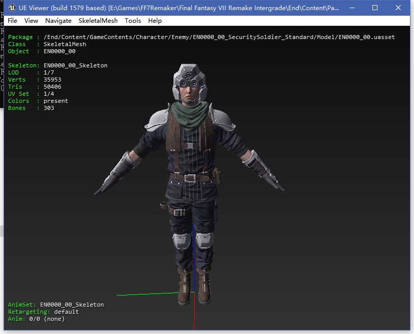

2. 摁O键去选择要导出的动画资源，如下那样选择Open(add to loaded set)：
   
   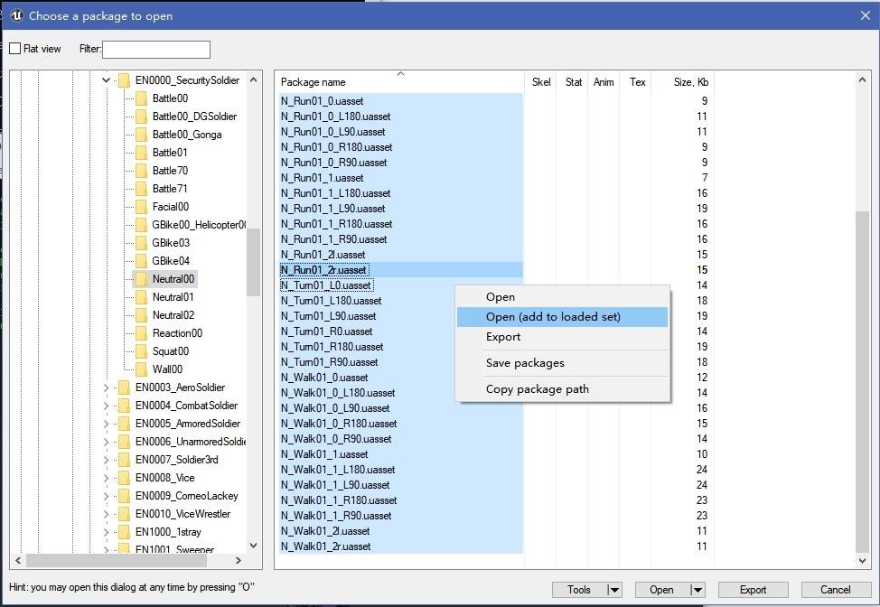

3. Tools/Export current object, 导出当前的所有资源：
   
   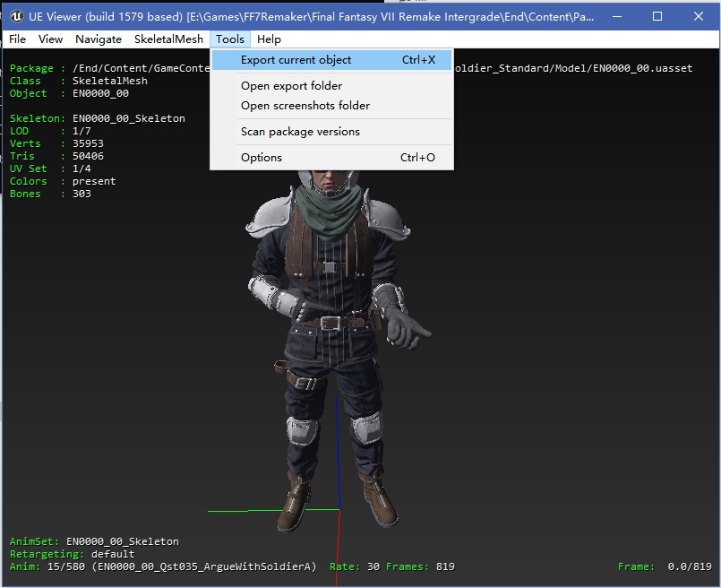

4. 生成psk(模型)和psa(动画集)文件
   
   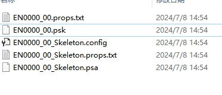

5. 先导入PSK骨骼体
   
   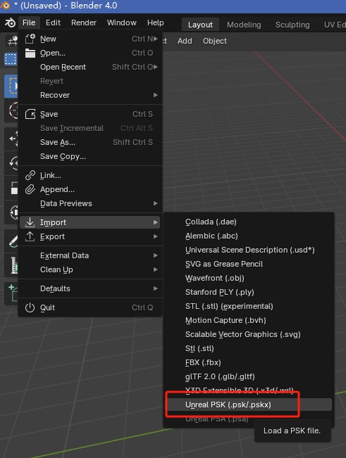

6. 在Blender，Maya或者Max中，建议角色的朝向是-Y，向上轴是+Z，这样设置的话导入虚幻引擎时不用任何设置就能正确导入(导入虚幻后角色朝向是+Y, 向上轴是+Z)。操作就是选择父节点设置好Transform后在视口摁下Ctrl+A，选择AllTransforms，这个类似于其他DCC的FreezeTranforms操作:
   
   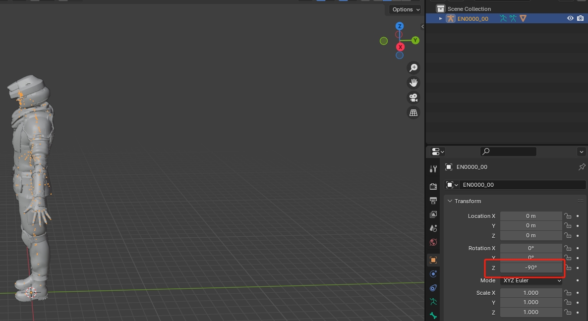

   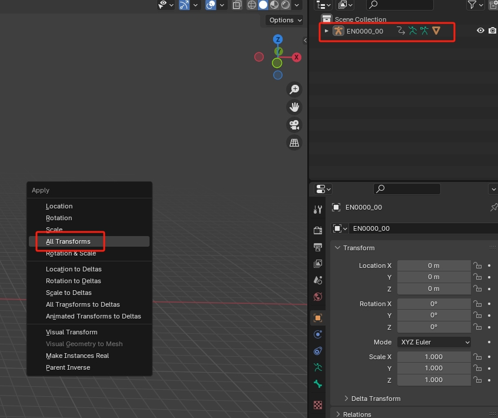

7. 从UModel导出的骨骼体默认会添加一个名字为骨骼体名字的根骨骼，而实际的根骨骼变成了子骨骼，因此我们需要进行UnParent的操作，我不太会使用Blender, 因此我把这个操作放到了MotionBuilder中进行。因此需要先导出fbx, MotionBuilder中打开，编辑，再保存。这样我们就生成了一个完整的骨骼体资源。
   
   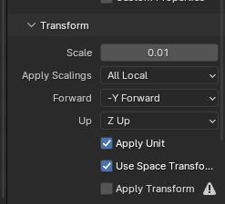

8. 导入骨骼体的fbx后紧接着导入PSA动画集：
   
   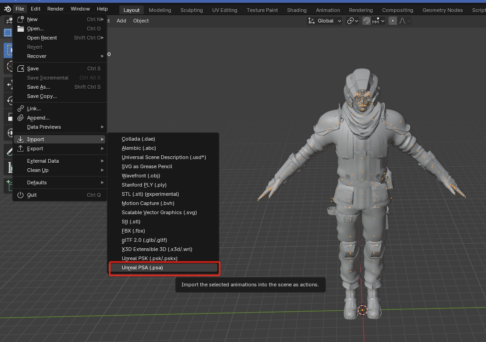

9. 如果想浏览动画，可以在ActionEditor中浏览：
   
   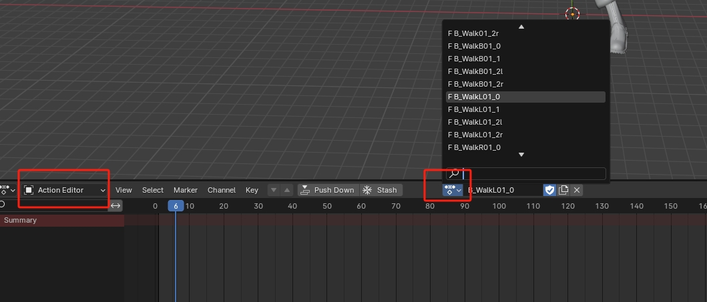

   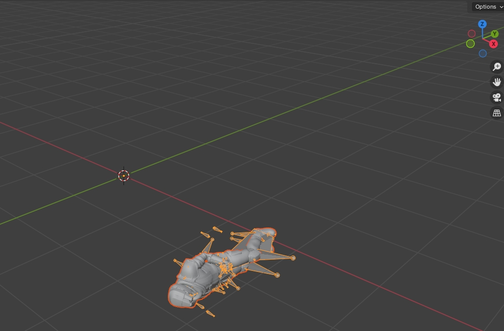

10. 我们发现动画的角色朝向和模型操作不对，因为我们在上面执行了6的操作，我们再次旋转角色然后执行Freeze操作(Apply Rotation即可)：
  
  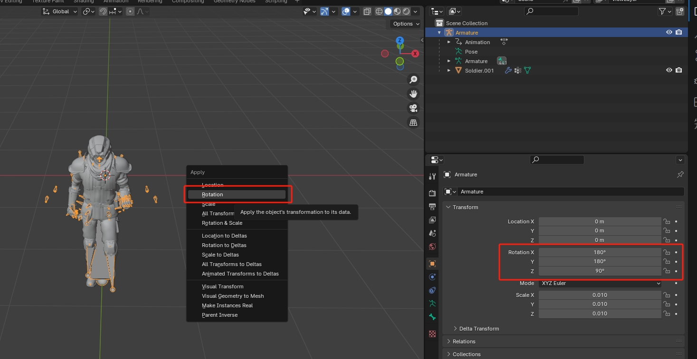

11.  将动画导出成fbx
     
12.  导入到虚幻引擎中，导入后角色朝向为+Y:
    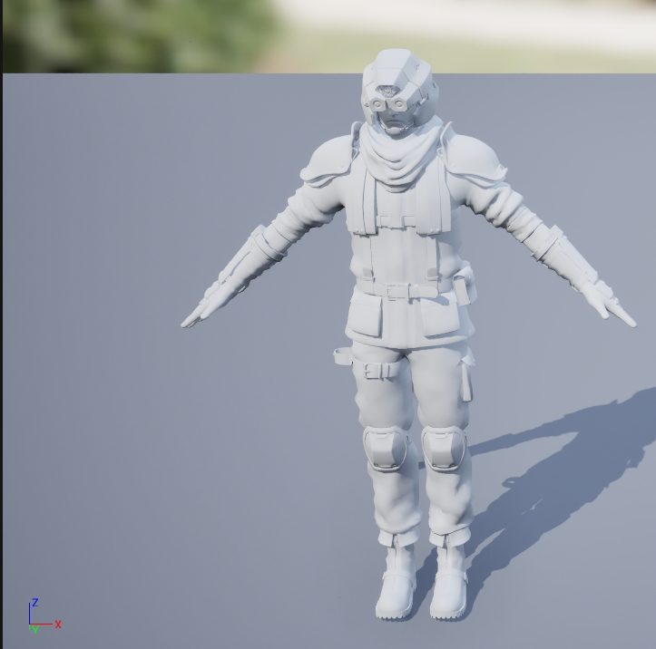

## 探索

AnimNotify:
AnimNotify_EndEmotion
AnimNotify_EndModifyFootIK
AnimNotify_EndOverrideAttackDirection
AnimNotify_EndForceFeedbackRange
AnimNotify_EndPlayParticleEffect
AnimNotify_EndOverrideAdditiveDamage
AnimNotify_EndModifyPlayRate         --B_NAttack01_1
AnimNotify_EndModifyRootMotionScale  --B_NAttack01_1

EndAnimNotifyBattleStateChange
EndAnimNotifyBattleOffensiveModeIdleConnection
EndAnimNotifyBattleDamage
EndAnimNotifyBattleCancelGuard
EndAnimNotifyBattleCancelDodge
EndAnimNotifyBattleCancelCounter
EndAnimNotifyBattleChangeAerialNormalAttackFall
EndAnimNotifyBattleAbilityCancel
EndAnimNotifyBattleAbilityCorrection
EndAnimNotifyBattleAbilityCancelStart
EndAnimNotifyBattleAbilityKeepEnd
EndAnimNotifyBattleGuardMode
EndAnimNotifyBattleSetNormalAttackOverrideCount
EndAnimNotifyBattleEnableLeaderChange

EndAnimNotifyPlayVoice
EndAnimNotifyPlayWeaponSound
EndAnimNotifyPlayCharacterSound
EndBattleCameraShakeNotify

AnimState:
EndAnimNotifyStateEffectCharaProperty
EndAnimNotifyStateOverrideCameraParams
EndAnimNotifyStatePlayCharacterSound
EndAnimNotifyStateBattleDamage
EndAnimNotifyStateBattleAbilityCorrectionInvalid
EndAnimNotifyStateBattleAddSpecialStatusChange
EndAnimNotifyStateBattleStatusChangeDebuffDisable
EndAnimNotifyStateBattleInputDirectionRotate

SQEX_AnimNotifyState_Bonamik_CharaWind
SQEX_AnimNotifyState_Bonamik_Weight