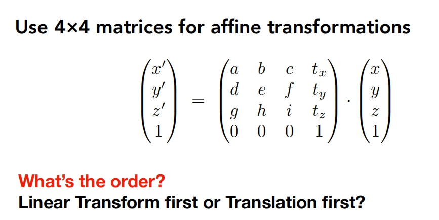

# （3）矩阵变换

## 如何构建旋转矩阵

因为约定的是列向量形式，因此第一列表示基向量(1, 0)旋转之后的结果，第二列是基向量(0, 1)旋转之后的结果。

## 什么是齐次坐标？

齐次坐标就是将一个原本是n维的向量用一个n+1维向量来表示，简单说就是升维，比如2维的矩阵变成了3维矩阵。

## 为什么需要齐次坐标？

如上图所示，如果使用2维的矩阵无法进行平移操作，这对于想通过矩阵的组合实现复杂变换是不方便的。因此通过齐次坐标引入n+1维达到实现平移的目的。

## 向量或者点如何变成齐次坐标？

这里的规则是如果是Point那么添加的那一个轴的数值是1，如果是Vector则为0，这样约定有什么好处呢？

* 点如果应用平移操作则会改变点的位置，而向量只有方向性因此平移后点的位置不变。

  

  

* 依然能够满足点和向量的基本性质
  

## 列向量应用矩阵的顺序从右到左

## 如果围绕一个指定的点旋转？

先将指定的点平移到(0, 0)点，然后旋转，最后在平移回原来的位置

## 先线性变换再平移

可以看到先线性变换最后再加上平移变换

# (4) Transformation Cont

正交矩阵性质：逆矩阵和转置矩阵为同一矩阵

（TODO 配图）

绕固定坐标轴旋转的公式：

（TODO 配图）

绕通过原点的任意轴旋转公式：

（TODO 配图）

>_四元数一个主要的用途在于插值方便_

变换中的MVP,模型变换，视角变换，投影变换

（TODO 配图）

（TODO Y为Up, -Z为Lookat）

大概步骤：
1. 所有模型和相机移动到原点（Y为Up, -Z为Lookat）
2. 正交/投影变换
3. 缩放到[-1, 1]区间
4. 视口变换

想到正交投影的Z处理，一般会直接弃掉Z, 但标准做法是上面的步骤3，会映射到[-1, 1]的立方体中。

（TODO 配图 正交投影的矩阵）

挤压过程中的不变式：
1. n平面不变
2. f平面Z不变
3. 中心线上的n, f的数据不变

（TODO 推导过程）

（TODO 完整公式）

（TODO 为什么作业的结果是推远）

（TODO 为什么不是Z不变）

