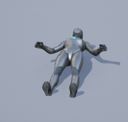
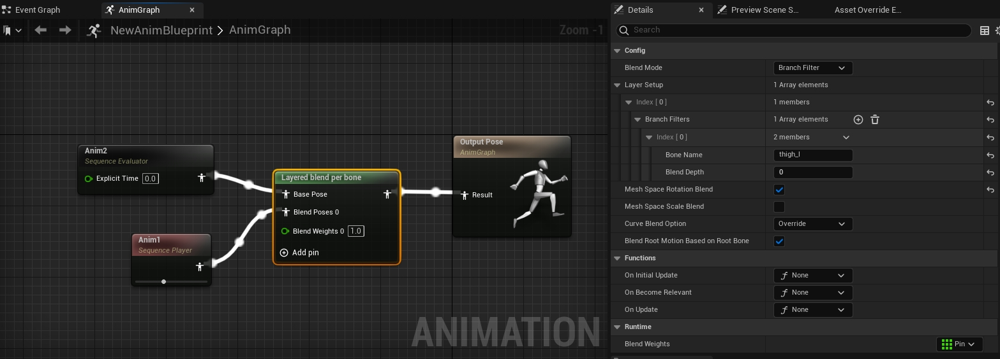

现准备两个动画

Anim1为一个抬左腿的动画，包括thigh_l和calf_l的旋转。

<video src="./UE5LayeredByBoneMov/Anim1动画.mp4"></video>

Anim2为一个躺下的动画：

动画蓝图和LayeredBlendPerBone设置如下：

* BoneName设置的是thigh_l, 刚才已经知道Anim1旋转的就是Thigh_l和calf_l

* MeshSpaceRotationBlend设置为true

我们看下效果：

<video src="./UE5LayeredByBoneMov/MeshSpaceRotationBlend.mp4"></video>

我们把MeshSpaceRotationBlend设置为false，再看下效果：

<video src="./UE5LayeredByBoneMov/LocalSpaceRotationBlend.mp4"></video>

我们在BranchFilters中再添加一个calf_l, BlendDepth为-1，表现如下：

<video src="./UE5LayeredByBoneMov/只想组合一段骨骼链上的动画.mp4"></video>

我们可以得出如下结论：

1. BranchFilters设置的BoneName为thigh_l，那么最后合成后的动画也包括thigh_l自身在父骨骼上的旋转(简单说就是包含设置的Bone自己)。

2. MeshSpaceRotationBlend为true和false的区别，当为true时，其实是骨骼相对于世界的旋转最后反算到父骨骼空间上再设置。

3. 如果只想组合一段骨骼链上的动画，比如有A->B->C->D->E骨骼链，A是B的父骨骼以此类推，如果只想组合B到D的动画，可以在BranchFilters设置两项：
   
   BoneName: B BlendDepth: 0
   
   BoneName: E BlendDepth: -1