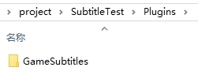
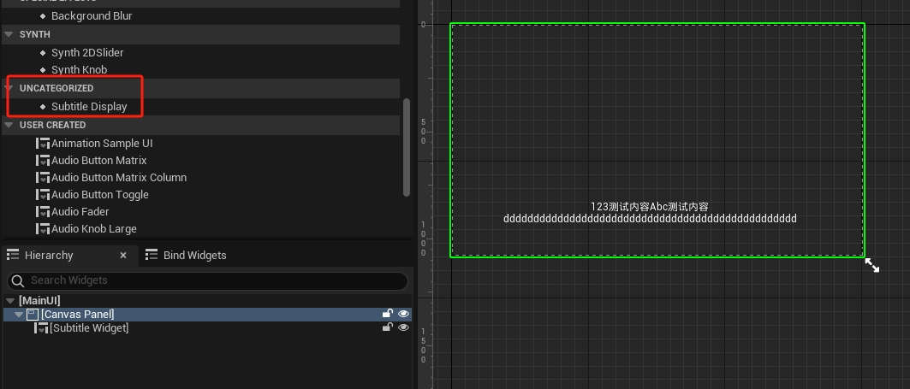
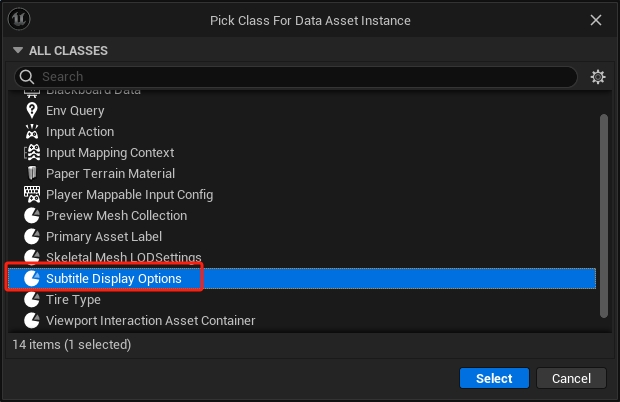
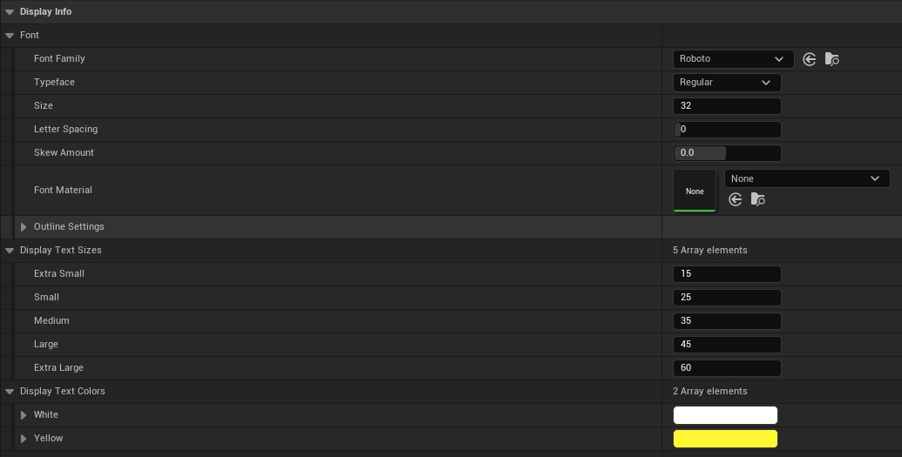
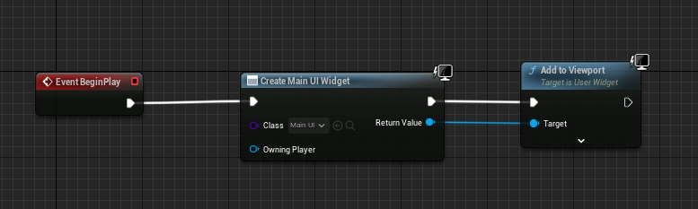
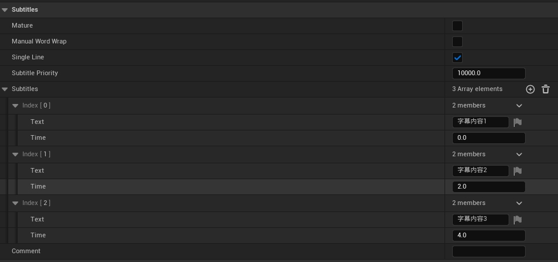
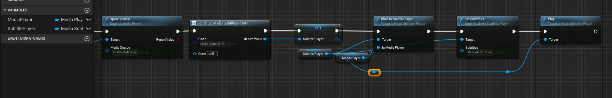
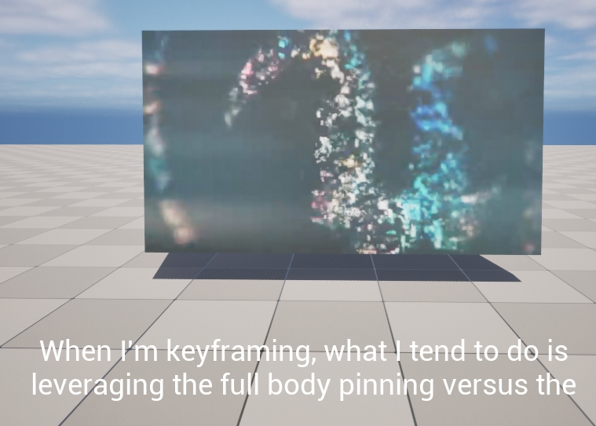
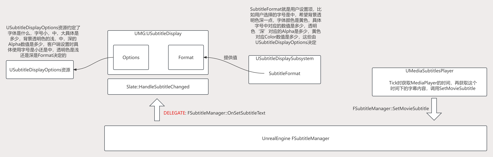
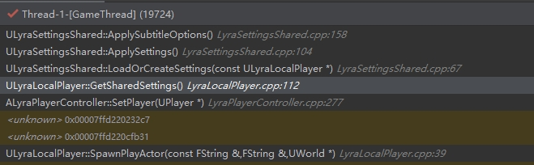

# Lyra中的GameSubtitles

## 前言
GameSubtitles是Lyra中一个极其简单的Plugin, 把它作为一个学习Lyra的开始再合适不过， 而且GameSubtitles是一个极其通用的插件，所有的游戏都可以直接在项目中使用它。

## GameSubtitles

### 是什么？

GameSubtitles提供了UMG资源用于**Media资源中字幕的显示**,而且还提供了DataAsset用于字体颜色，背景色等配置，GameSubtitles对于底层的调用进行了Hook，因此在使用UMG时不必在乎实现细节，使用后自动就会显示字幕内容。

### 怎么用？

我们新建一个空项目，将GameSubtitles插件拷贝到这个空项目中。

打开项目后手动启用这个插件，重启后我们创建一个UMG，命名为MainUI, 将**SubtitleDisplay**拖入到面板中。

SubtitleDisplay必须设置一项Options, 因此需要再创建一个DataAsset资源，新建DataAsset资源，选择SubtitleDisplayOptions为指定Class

对于这个DataAsset做一个简单的配置，设置Font,最主要的是设置DisplayTextSizes，需要指定设置中的小，中，大分别对应多大的字号，白色和黄色的颜色RGB等。

设置完后将这个DataAsset设置给MainUI中SubtitleDisplay的Options, 然后在关卡蓝图里就可以直接显示这个UI了。

向场景中放置一个Trigger,Overlap时播放一个Sound2D，我们在SoundWave中设置了一些字幕内容。

可以看到，当角色走进这个Trigger时，MainUI自动显示出了这些字幕内容。

GameSubtitles还有一种功能是播放视频的时候，可以设置字幕内容，我们先按照教程[在虚幻引擎中播放视频文件](https://docs.unrealengine.com/5.3/zh-CN/play-a-video-file-in-unreal-engine/)设置可以播放视频文件，最后在OpenSource后面添加如下代码：

代码的含义是先创建一个MediaSubtitlesPlayer, 然后将MediaPlayer与MediaSubtitlesPlayer做一个绑定，然后调用SetSubtitles设置字幕内容，随后调用Play即可。

>_`提示：`将视频的srt文件拖入到编辑器中就会生成字幕文件UBasicOverlay, SetSubtitles就是设置的UBasicOverlay资源。_

>_`提示：`MediaSubtitlesPlayer调用Play, Stop的时机与MediaPlayer一致。_

### 逻辑结构图

## 读取存档设置

可以看到角色初始化时会尝试读取存档设置，如果第一次读取的话会SyncLoad并且Apply。存档位置在Lyra/Saved/SaveGames/SharedGameSettings.sav, 存档的内容就是逻辑结构图中的SubtitleFormat。

## SubtitleDisplaySubsystem

SubtitleDisplaySubsystem是我们碰到的第一个Subsystem，存档系统在应用设置时调用的是USubtitleDisplaySubsystem::SetSubtitleDisplayOptions，Widget在显示时应该使用什么设置项来显示使用的也是Subsystem传过来的值，SubtitleDisplaySubsystem作为一个全局系统可以方便的调用和获取数值。

Subsystem的特点：
* 全局访问，既可以设置(Apply)也可以获取(Get)
* 按照游戏的Features划分，比如ScoreSubsystem, TaskSubsystem等
* 可以存储全局数据，比如USubtitleDisplaySubsystem::SubtitleFormat

Subsystem是Manager的替代品，具体讲解SubSystem的文档参考[《InsideUE4》GamePlay架构（十一）Subsystems](https://zhuanlan.zhihu.com/p/158717151)