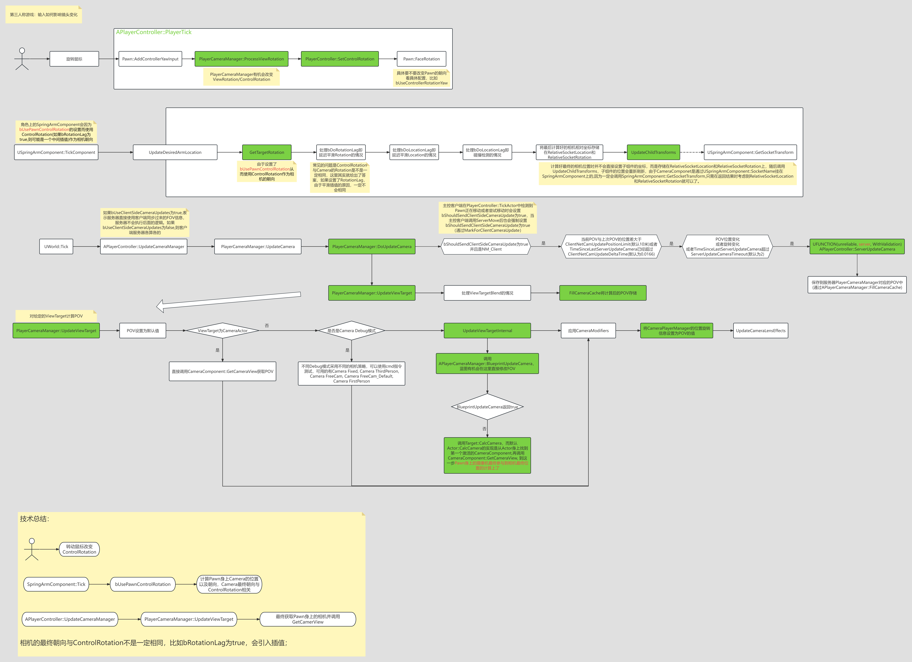

# Lyra中的相机系统

## 前言

本篇会先讲UE5相机系统流程以及TPS中SpringArmComponent的实现，然后说下Lyra中如何实现数据驱动的相机系统，最后总结下Lyra实现的优势和目前的不足。

## 引擎默认的相机系统

### CameraSystem流程图

### SpringArm

## Lyra相机系统

### 流程图

(PawnData中配置以及如何生效)

### LyraCameraStack

### LyraCameraMode

#### LyraCameraMode_ThirdPerson

#### LyraCameraMode_TopDownArenaCamera

### LyraPenetrationAvoidanceFeeler

## Lyra示例

### 过肩视角

### 开镜实现

### 射击时目标判断

(AimUI以及碰撞判定逻辑)

## Lyra对比传统方案的优势以及不足

数据驱动的优势
Feeler对比SpringArm的优势

## 总结

(项目中可以借鉴的地方)
1. Feeler方式
2. CameraStack和CameraMode模式，DataDriven，有数据驱动的优势，可配置在Experiences中
3. 有些可惜代码在开发中，还有很多需要填补的