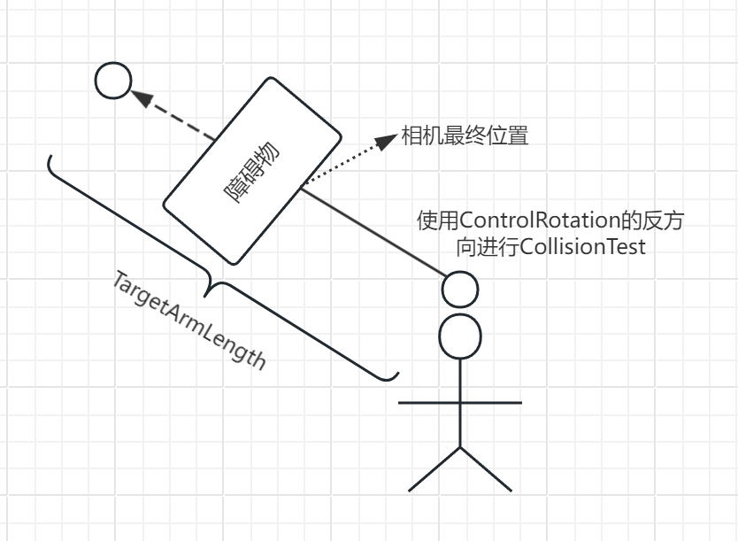
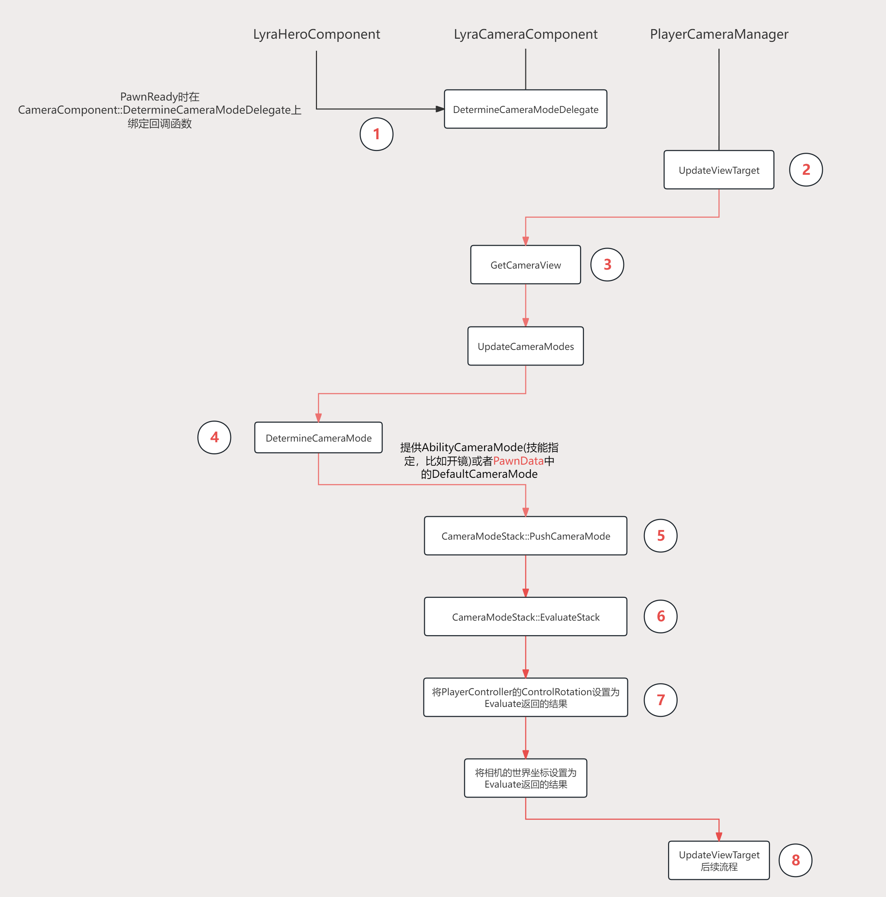
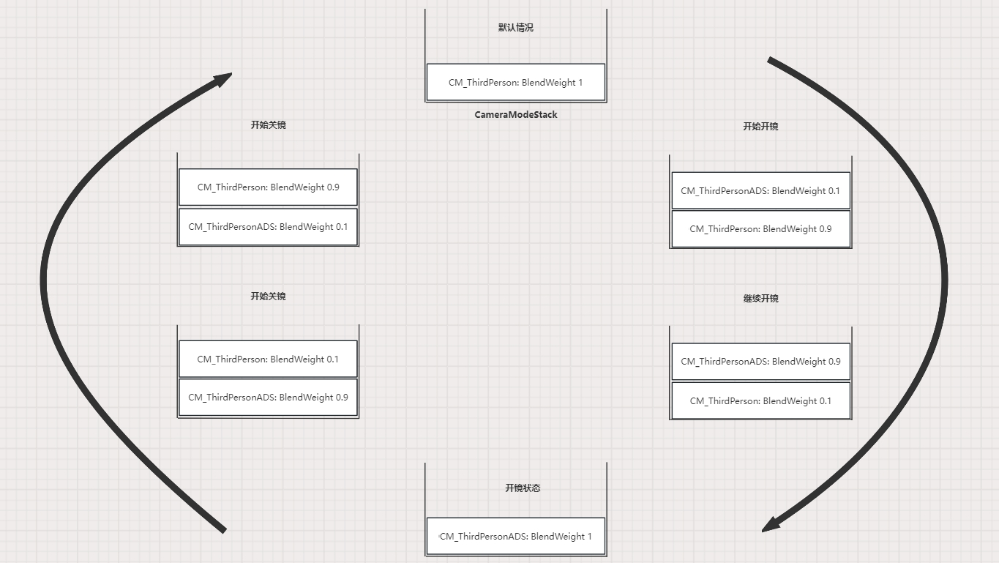
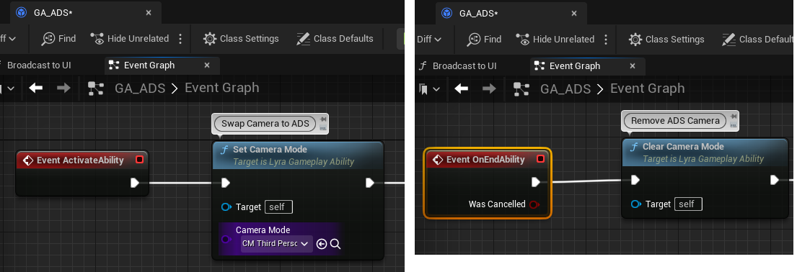

# Lyra中的相机系统

## 前言

本篇会先讲UE5相机系统流程以及TPS中SpringArmComponent的实现，然后说下Lyra中如何实现数据驱动的相机系统，最后总结下LyraCameraSystem实现的优势和目前的不足。

## 引擎默认的相机系统

### CameraSystem流程图


CameraSystem有几个要点：
* 输入改变ControlRotation;SpringArmComponent使用ControlRotation改变ChildActor(即CameraComponent)的RelativeTransform;CameraManager在计算最终相机POV时最终调用的是Pawn身上挂载的CameraComponent的GetCameraView函数

* SpringArmComponent的核心在于UpdateDesiredArmLocation函数，这个函数会计算相机最终的位置和朝向，如果设置了bUsePawnControlRotation那么会使用ControlRotation, 而最终位置就需要使用CollisionTest的函数，比如SweepSingleByChannel，如果发生了碰撞，那么最终的位置跟碰撞点有关，如下图所示：
  
  

* PlayerCameraManager中有个很重要的函数是UpdateViewTarget，只要重载这个函数就可以接管Gameplay中Camera的管理。

* CameraComponent中的重要函数是GetCameraView，正如上面所提到的计算最终的POV时调用的函数正是CameraComponent::GetCameraView, 因此重载这个函数可以做很多Gameplay相关的逻辑或者设计，Lyra正是利用了这一点。

## Lyra相机系统

我们知道Lyra的设计理念是数据驱动和ModularPlay，不管是玩法，技能还是UI, 当然还有Camera，我们先通过流程图看下配置的CameraMode是如何参与进来的，然后再说下CameraMode以及相关的代码解释。

### 流程图



1. 正如在[UE5中的ModularGameplay](https://zhuanlan.zhihu.com/p/692606168)提到的，PawnReady的时候会设置Input, Ability，Camera相关的设置，这里只是注册了回调函数DetermineCameraMode，这个函数每帧会告诉LyraCameraComponent当前应该使用哪个CameraMode配置

2. 每帧更新相机POV(PointofView)信息时都会从PlayerCameraManager::UpdateViewTarget开始

3. 通过上面的CameraSystem流程图可以知道，POV的结果由角色身上CameraComponent::GetCameraView函数返回

4. GetCameraView会调用到UpdateCameraModes, 这个函数会调用第1步时注册的代理函数，LyraCameraComponent就知道了这一帧要使用哪个CameraMode配置

5. 第4步会返回CameraMode的Class, 这一步会NewObject这个CameraMode(如果还没有创建过)，并将这个实例放入CameraModeStack的栈顶

6. CameraModeStack内部可能有多个CameraMode, 这一步会遍历所有的CameraMode并得到每一个CameraMode返回的POV, 再结合每个CameraMode的BlendWeight计算最终的POV

7. 得到最终的POV后，将PlayerController的ControlRotation设置为返回的ControlRotation，同样将PlayerComponent的世界坐标设置为返回的结果，这样POV, ControlRotation和CameraComponent的Transform数据一致

8. CameraSystem流程图中的后续流程，比如ViewTargetBlend等等

我们以第三人称角色开镜举例, 流程图如下：



在虚幻提供的TPS模板中，角色身上需要挂载CameraComponent和SpringArmComponent，而在Lyra中只需挂载一个LyraCameraComponent即可。

### LyraCameraComponent

LyraCameraComponent继承自CameraComponent，只不过它通过重载GetCameraView函数实现了一套Stack-CameraMode的模式，实现了更为精细的碰撞检测以及数据驱动，这对于Experiences想要实现的玩法可配置是很重要的。

通过上面的流程图可以看到LyraCameraComponent的核心函数在于GetCameraView，我们看下它的实现细节：

#### 决定这一帧使用哪个CameraMode

>_CameraMode是用来数据驱动镜头的资源文件，后面会详细讲解LyraCameraMode, 这里只要知道CameraMode是镜头相关的设置即可_

* DefaultCameraMode: DefaultCameraMode是LyraPawnData中的一个配置项，定义了角色在默认情况下的镜头规则，比如碰撞检测，FOV，Blend算法等等

* AbilityCameraMode: 由技能系统在GA激活时设置，比如开镜或者死亡时
  

我们看下LyraPawnData和Ability中的镜头设置是如何参与进来的。

上面的流程图可以看到，PlayerCameraManager每次更新时都会调用LyraHeroComponent的DetermineCameraMode函数，而这个函数的伪代码如下：

```C++
TSubclassOf<ULyraCameraMode> ULyraHeroComponent::DetermineCameraMode() const
{
	if (AbilityCameraMode)
	{
		return AbilityCameraMode;
	}

  //...
  {
    return PawnData->DefaultCameraMode;
  }
}
```

因此我们可以知道，当技能中尝试修改镜头设置时优先使用AbilityCameraMode, 否则使用默认的DefaultCameraMode。

#### 将CameraMode压入栈顶以及Evaluate

上面流程图里已经说明了。

#### LyraCameraMode_ThirdPerson

数据配置分为两大类：镜头Pitch调整位置规则和碰撞规则

* Pitch调整位置规则：在没有任何碰撞的前提下，镜头Pitch不同则镜头偏移不同，这种规则不像SpringArmComponent只有一个数值控制，因此CameraComponent只能在一个半径为ArmLength的球体表面上移动，而LyraCameraMode_ThirdPerson的规则是先得到当前镜头的Pitch是多少，而且查表会得到一个(X，Y, Z), 我们还有当前的PivotLocation(可以理解为CharacterActorLocation)和PivotRotation(ControlRation), 最终的相机位置等于PivotLocation + PivotRotation.RotateVector(XYZ), 其实就是将XYZ应用到了PivotRotation的局部坐标系下。通过这个规则我们可以很轻易的实现比如过肩视角，椭圆表面等等，细节更为丰富。
  
  1. TargetOffsetCurve，类型为UCurveVector，横轴是Pitch，上面说的查表
  2. bUseRuntimeFloatCurves，TargetOffsetX，TargetOffsetY，TargetOffsetZ 类型为FRuntimeFloatCurve，与TargetOffsetCurve作用相同，只不过FRuntimeFloatCurve在PIE下存在bug，一旦这个bug解决后TargetOffsetCurve将会被移除
  3. CrouchOffsetBlendMultiplier，角色触发半蹲时可以控制镜头向下移动的快慢

* 碰撞规则：


#### LyraCameraMode_TopDownArenaCamera

### LyraPenetrationAvoidanceFeeler

## Lyra示例

### 过肩视角

### 开镜实现

### 射击时目标判断

(AimUI以及碰撞判定逻辑)

## Lyra对比传统方案的优势以及不足

数据驱动的优势
Feeler对比SpringArm的优势

## 总结

(项目中可以借鉴的地方)
1. Feeler方式
2. CameraStack和CameraMode模式，DataDriven，有数据驱动的优势，可配置在Experiences中
3. 有些可惜代码在开发中，还有很多需要填补的