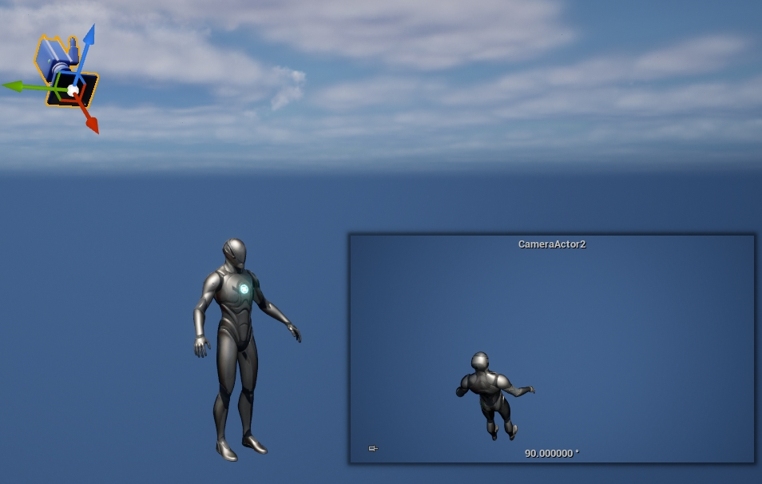

# Lyra中的相机系统

## 前言

本篇会先讲UE5相机系统流程以及TPS中SpringArmComponent的实现，然后说下Lyra中如何实现数据驱动的相机系统，最后总结下LyraCameraSystem实现的优势和目前的不足。

## 引擎默认的相机系统

### CameraSystem流程图


CameraSystem有几个要点：
* 输入改变ControlRotation;SpringArmComponent使用ControlRotation改变ChildActor(即CameraComponent)的RelativeTransform;CameraManager在计算最终相机POV时最终调用的是Pawn身上挂载的CameraComponent的GetCameraView函数

* SpringArmComponent的核心在于UpdateDesiredArmLocation函数，这个函数会计算相机最终的位置和朝向，如果设置了bUsePawnControlRotation那么会使用ControlRotation, 而最终位置就需要使用CollisionTest的函数，比如SweepSingleByChannel，如果发生了碰撞，那么最终的位置跟碰撞点有关，如下图所示：
  
  

* PlayerCameraManager中有个很重要的函数是UpdateViewTarget，只要重载这个函数就可以接管Gameplay中Camera的管理。

* CameraComponent中的重要函数是GetCameraView，正如上面所提到的计算最终的POV时调用的函数正是CameraComponent::GetCameraView, 因此重载这个函数可以做很多Gameplay相关的逻辑或者设计，Lyra正是利用了这一点。

## Lyra相机系统

我们知道Lyra的设计理念是数据驱动和ModularPlay，不管是玩法，技能还是UI, 当然还有Camera，我们先通过流程图看下配置的CameraMode是如何参与进来的，然后再说下CameraMode以及相关的代码解释。

### 流程图


1. 正如在[UE5中的ModularGameplay](https://zhuanlan.zhihu.com/p/692606168)提到的，PawnReady的时候会设置Input, Ability，Camera相关的设置，这里只是注册了回调函数DetermineCameraMode，这个函数每帧会告诉LyraCameraComponent当前应该使用哪个CameraMode配置

2. 每帧更新相机POV(PointofView)信息时都会从PlayerCameraManager::UpdateViewTarget开始

3. 通过上面的CameraSystem流程图可以知道，POV的结果由角色身上CameraComponent::GetCameraView函数返回

4. GetCameraView会调用到UpdateCameraModes, 这个函数会调用第1步时注册的代理函数，LyraCameraComponent就知道了这一帧要使用哪个CameraMode配置

5. 第4步会返回CameraMode的Class, 这一步会NewObject这个CameraMode(如果还没有创建过)，并将这个实例放入CameraModeStack的栈顶

6. CameraModeStack内部可能有多个CameraMode, 这一步会遍历所有的CameraMode并得到每一个CameraMode返回的POV, 再结合每个CameraMode的BlendWeight计算最终的POV

7. 得到最终的POV后，将PlayerController的ControlRotation设置为返回的ControlRotation，同样将PlayerComponent的世界坐标设置为返回的结果，这样POV, ControlRotation和CameraComponent的Transform数据一致

8. CameraSystem流程图中的后续流程，比如ViewTargetBlend等等

我们以第三人称角色开镜举例, 流程图如下：


在虚幻提供的TPS模板中，角色身上需要挂载CameraComponent和SpringArmComponent，而在Lyra中只需挂载一个LyraCameraComponent即可。

### LyraCameraComponent

LyraCameraComponent继承自CameraComponent，只不过它通过重载GetCameraView函数实现了一套Stack-CameraMode的模式，实现了更为精细的碰撞检测以及数据驱动，这对于Experiences想要实现的玩法可配置是很重要的。

通过上面的流程图可以看到LyraCameraComponent的核心函数在于GetCameraView，我们看下它的实现细节：

#### 决定这一帧使用哪个CameraMode

>_CameraMode是用来数据驱动镜头的资源文件，后面会详细讲解LyraCameraMode, 这里只要知道CameraMode是镜头相关的设置即可_

* DefaultCameraMode: DefaultCameraMode是LyraPawnData中的一个配置项，定义了角色在默认情况下的镜头规则，比如碰撞检测，FOV，Blend算法等等

* AbilityCameraMode: 由技能系统在GA激活时设置，比如开镜或者死亡时
  

我们看下LyraPawnData和Ability中的镜头设置是如何参与进来的。

上面的流程图可以看到，PlayerCameraManager每次更新时都会调用LyraHeroComponent的DetermineCameraMode函数，而这个函数的伪代码如下：

```C++
TSubclassOf<ULyraCameraMode> ULyraHeroComponent::DetermineCameraMode() const
{
	if (AbilityCameraMode)
	{
		return AbilityCameraMode;
	}

  //...
  {
    return PawnData->DefaultCameraMode;
  }
}
```

因此我们可以知道，当技能中尝试修改镜头设置时优先使用AbilityCameraMode, 否则使用默认的DefaultCameraMode。

#### 将CameraMode压入栈顶以及Evaluate

上面流程图里已经说明了。

#### LyraCameraMode_ThirdPerson

数据配置分为两大类：镜头Pitch调整位置规则和碰撞规则

* Pitch调整位置规则：在没有任何碰撞的前提下，镜头Pitch不同则镜头偏移不同，这种规则不像SpringArmComponent只有一个数值控制，因此CameraComponent只能在一个半径为ArmLength的球体表面上移动，而LyraCameraMode_ThirdPerson的规则是先得到当前镜头的Pitch是多少，而且查表会得到一个(X，Y, Z), 我们还有当前的PivotLocation(可以理解为CharacterActorLocation)和PivotRotation(ControlRation), 最终的相机位置等于PivotLocation + PivotRotation.RotateVector(XYZ), 其实就是将XYZ应用到了PivotRotation的局部坐标系下。通过这个规则我们可以很轻易的实现比如过肩视角，椭圆表面等等，细节更为丰富。
  
  1. TargetOffsetCurve，类型为UCurveVector，横轴是Pitch，上面说的查表
  2. bUseRuntimeFloatCurves，TargetOffsetX，TargetOffsetY，TargetOffsetZ 类型为FRuntimeFloatCurve，与TargetOffsetCurve作用相同，只不过FRuntimeFloatCurve在PIE下存在bug，一旦这个bug解决后TargetOffsetCurve将会被移除
  3. CrouchOffsetBlendMultiplier，角色触发半蹲时可以控制镜头向下移动的快慢

* 碰撞规则：正如上面所提到的，SpringArmComponent做的碰撞检测特别简单，在复杂地形下简单的规则容易导致镜头反复跳转，而这里可以配置1+n个检测射线，尽可能在复杂地形下也能找到合适的位置。
  1. bPreventPenetration，是否要开启碰撞检测，默认为true
  2. bDoPredictiveAvoidance，是否要使用多条检测线，如果false的话那么机制就跟SpringArmComponent一致了
  3. CollisionPushOutDistance，做射线检测时为了避免射线在初始化位置就遭遇碰撞，一般会向胶囊体内部移动一小段距离
  4. ReportPenetrationPercent，当触发碰撞的位置离角色很近的时候需要将这个消息通过ILyraCameraAssistInterface发送给感兴趣的Actor,方便做一些处理比如隐藏手枪等等
  5. PenetrationBlendInTime, 当新的碰撞位置离ViewTarget**更近**时，需要一个速度平滑的插值过去，BlendInTime就定义了这个速度
  6. PenetrationBlendOutTime，当新的碰撞位置离ViewTarget**更远**时，需要一个速度平滑的插值过去，BlendOutTime就定义了这个速度
  7. PenetrationAvoidanceFeelers，定义了多个碰撞检测的规则，参考下面碰撞检测流程

### 相机位置流程

两个步骤：


根据ViewRotation的Pitch查表得到XYZ，在相机的本地坐标系下应用得到下面的ViewTransform



这个得到的ViewTransform是目前的待选位置，需要再通过下面的碰撞检测流程加以修正。

### 碰撞检测流程

UpdatePreventPenetration流程：


1. ClosestPointOnLineToCapsuleCenter, CapsuleCenter与ViewTransform射线上最近的点

2. 整个Capsule表面距离ClosestPointOnLineToCapsuleCenter最近的点

3. 对于2的临时位置做下处理，沿着1指向2的矢量方向平移一段距离，避免碰撞检测在起始位置就遭遇碰撞，得到的点就是碰撞检测的起始位置SafeLocation

这里知道的条件是起始检测位置是SafeLocation, 终点检测位置是ViewLocation的位置

>_这里注意SafeLocation并不在ViewTransform朝向的射线上，比如ViewTransform看向的是右肩，而SafeLocation在胶囊体内的一个位置点上_

接下来是碰撞检测的流程：

上面提到了PenetrationAvoidanceFeelers这个参数，我们假设定义如下，然后再看下这些参数代表了什么：

```C++
	PenetrationAvoidanceFeelers.Add(FLyraPenetrationAvoidanceFeeler(FRotator(+00.0f, +00.0f, 0.0f), 1.00f, 1.00f, 14.f, 0));
	PenetrationAvoidanceFeelers.Add(FLyraPenetrationAvoidanceFeeler(FRotator(+00.0f, +16.0f, 0.0f), 0.75f, 0.75f, 00.f, 3));
	PenetrationAvoidanceFeelers.Add(FLyraPenetrationAvoidanceFeeler(FRotator(+00.0f, -16.0f, 0.0f), 0.75f, 0.75f, 00.f, 3));
	PenetrationAvoidanceFeelers.Add(FLyraPenetrationAvoidanceFeeler(FRotator(+20.0f, +00.0f, 0.0f), 1.00f, 1.00f, 00.f, 4));
	PenetrationAvoidanceFeelers.Add(FLyraPenetrationAvoidanceFeeler(FRotator(-20.0f, +00.0f, 0.0f), 0.50f, 0.50f, 00.f, 4));
```

检测的形状大概如下：


上面可以看到小球位置是上面所提到的SafeLocation，一红四绿是五条检测碰撞的线，红色检测线是主线，即SafeLocation到ViewTransform的直接检测，四绿是可选碰撞线可以提前预判碰撞位置，提前让相机向ViewTarget的方向移动，避免相机瞬切或者反复横跳。

先说下PenetrationAvoidanceFeeler各个参数的含义：

* AdjustmentRot：如果全是0表示射线方向就是SafeLocation到ViewTransform位置，命名为BaseRay, 如果Yaw或者Pitch有值时，表示以BaseRay为ForwardVector, 用AdjustmentRot的数值对BaseRay进行旋转，得到的新Vector就是检测方向

* PawnWeight, WorldWeight: 代码有bug, 没有使用

* Extent：碰撞检测使用的是球体，Extent表示检测球体的半径，0表示线

* TraceInterval：每几帧执行一次检测，主线一般是每帧都检测，设置为0，可选碰撞检测线一般为了性能考虑需要加检测间隔时间

PenetrationAvoidanceFeelers第一个必须是主线的设置，后面可以设置多个可选碰撞检测线。

检测的细节如下：

1. 遍历PenetrationAvoidanceFeelers数组，对于满足条件(时间间隔到了)的Feelers都要执行碰撞检测，因为主线是第一个，因此第一个检测的肯定是主线

2. 遍历过程中，发生碰撞的记录碰撞点在整条碰撞线的比例位置，这里命名为TempPct，比如在起始点发生碰撞就是0，在末点位置发生碰撞就是1，含义跟Hit.Time一样，只不过Hit.Time没有考虑CollisionPushOutDistance，设想一下如果直接把相机设置到碰撞点的话，相机的画面会处于一个穿模的状态，因此会往ViewTarget方向移动一点，CollisionPushOutDistance就定义了移动的距离

3. 遍历结束后DistBlockedPctThisFrame存储了所有Feelers在碰撞检测中最小的TempPct, HardBlockedPct存储了主线的TempPct, SoftBlockPct存储了所有可选线最小的TempPct

4. 如果上一帧的DistBlockedPct小于DistBlockedPctThisFrame，说明这时候相机位置需要往远离ViewTarget的位置移动即SmoothlyOut；

5. 如果上一帧的DistBlockedPct大于DistBlockedPctThisFrame，说明相机需要往靠近ViewTarget的位置移动，这时候需要判断是因为主线的缘故还是可选线的缘故，如果是主线的缘故即DistBlockedPct > HardBlockedPct说明碰撞物直接挡住了玩家的视野，可以直接移动过去；如果DistBlockedPct <= HardBlockedPct说明主线在远离ViewTarget的位置上，而可选线嗅到了即将要面临的碰撞物，因此会使用SoftBlockedPct

6. 通过最终计算的Pct, 在**BaseRay**上找到位置，设置给ViewLocation

需要注意的细节：

1. 最终的位置是在BaseRay上选取的，其他可选线只是辅助计算一个理想的Pct, 并不会在这些可选线上选点！

2. 一旦可选线本帧发生了碰撞会强制下一帧也继续检测，避免静止状态下多个可选线在一段时间里选出不同的Pct, 导致镜头位置抖动

多个可选线有什么优势呢？

假如角色头顶上是这些障碍物，角色需要在这些障碍物下面穿过。


这一帧时因为主线已经发生了碰撞，假如Pct等于0.5, 那么通过比较发现主线的Pct最小最终使用的Pct等于0.5，相机位置在障碍物下方，可以清晰看到角色。

角色继续移动：


可以看到主线检测过程中没有发生碰撞，因此主线得到的Pct为1，如果没有可选线的话相机的位置会立即到障碍物上方，持续行走的话相机位置反复跳变。

加上Feers的功能后, 虽然主线没有发生碰撞，但是可选线发生了碰撞，比如这些可选线返回的最小Pct为0.4，根据上面的流程提到的，相机会平滑的位移一点点。可以看到这些可选线像触角一样，提前感知到了附近的障碍物，提前计算好了一个合适的位置来应对这些障碍物。

如果在这一帧不动了，上面提到过一旦可选线本帧发生了碰撞会强制下一帧也继续检测，因此不会出现抖动的问题，因此后面得到的一直是0.4

## Lyra示例

### 过肩视角

TargetOffsetY，在相机位置流程时通过偏移控制相机位置


### 开镜实现

CM_ThirdPersonADS，上面已经提到过的第三人称角色开镜举例

### 射击时目标判断

UI为W_WeaponReticleHost


可以看到HorizontalAlignment和VerticalAlignment都是Fill, 因此准心一直是UI的中心点位置。

瞄准时碰撞检测的代码在ULyraGameplayAbility_RangedWeapon::PerformLocalTargeting中，而获取碰撞检测起始点位置和朝向则调用的是ULyraGameplayAbility_RangedWeapon::GetTargetingTransform, 不同游戏可能碰撞起始点位置朝向不同，比如基于相机，基于真实武器位置等等，Lyra基于的是相机朝向，跟PlayerController::GetPlayerViewPoint函数相关。

## Lyra对比传统方案的优势以及不足

SpringArm方案中，相机和Character是强绑定，游戏中经常出现强制旋转角色的需求，这时候相机会有一两帧的抖动, 而Lyra方案则更为灵活；

>_调用完Character::SetRotation后再调用SpringArmComponent->TickComponent(0, ELevelTick::LEVELTICK_All, nullptr)可以解决这个问题_

数据驱动的优势，利用Stack-CameraMode模式，玩法可以动态替换而不用替换或者修改CameraComponent；

Feeler对比SpringArm的优势，对于复杂地形更加稳定；

不足是代码处于半成品，很多bug以及TODO；

## 总结

(项目中可以借鉴的地方)
1. Feeler方式
2. CameraStack和CameraMode模式，DataDriven，有数据驱动的优势，可配置在Experiences中
3. 有些可惜代码在开发中，还有很多需要填补的
4. [Modular Camera Dynamics](https://www.fab.com/listings/175bb327-880f-4fdc-b1e7-e2e866f74efb)视乎也是一种不错的选择

(添加视频)