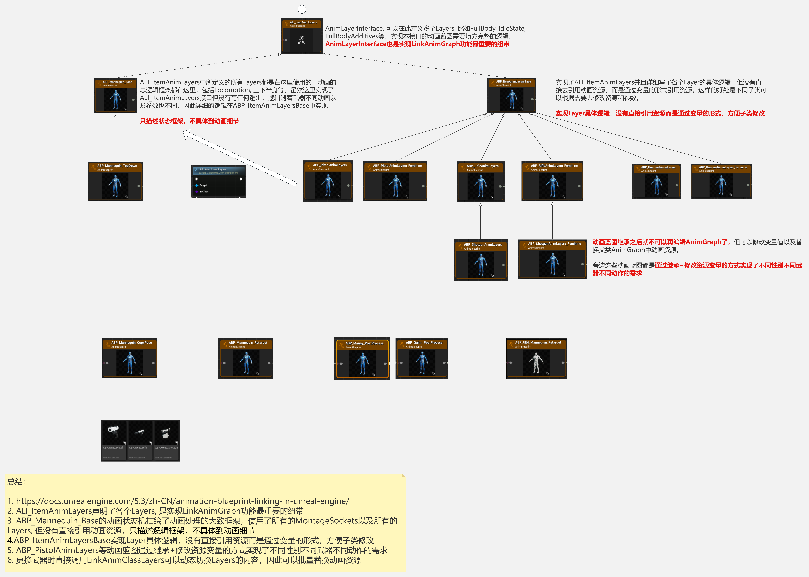

# Lyra动画系统(一) Locomotion

## 前置知识

### AnimNode中的Functions执行顺序


可以看到每个AnimNode都可以绑定这三个函数：

* OnInitialUpdate 初次调用Update时
* OnBecomeRelevant 下面解释
* OnUpdate 每次更新时

调用的地方在void FPoseLinkBase::Update(const FAnimationUpdateContext& InContext)中

```C++
if (LinkedNode != nullptr)
{
	FAnimationUpdateContext LinkContext(InContext.WithNodeId(LinkID));
	TRACE_SCOPED_ANIM_NODE(LinkContext);
	UE::Anim::FNodeFunctionCaller::InitialUpdate(LinkContext, *LinkedNode);
	UE::Anim::FNodeFunctionCaller::BecomeRelevant(LinkContext, *LinkedNode);
	UE::Anim::FNodeFunctionCaller::Update(LinkContext, *LinkedNode);
	LinkedNode->Update_AnyThread(LinkContext);
}
```

可以看到判定的顺序跟定义的顺序一致，依次为InitialUpdate, BecomeRelevant和Update;还有就是函数调用都是在**Update_AnyThread前** 而不是Evaluation阶段。


调用顺序为OnUpdateA，OnUpdateB, OnUpdateC, 从右到左，如果了解动画Update和Evaluation的话会更容易理解。

### BecomRelevant

BecomeRelevant的含义是指该Node上一帧的Weight还是0，这一帧就变成大于0的值了，因此如果一个Node在BlendOut的过程中(Weight没有变成0)又BlendIn的话，不会触发BecomRelevant

## Lyra动画框架一览



上图大致描述了Lyra的动画框架，ABP_Mannequin_Base负责逻辑框架， ABP_ItemAnimLayersBase实现Layer具体逻辑，ABP_PistolAnimLayers等动画蓝图通过继承+修改资源变量的方式实现了不同性别不同武器不同动作的需求，通过这种方式使得配置新武器方便了许多。

>_LinkAnimClassLayers函数的一个细节是调用后动画是直接替换的，不带有任何融合效果_

## 主状态机结构

ABP_Mannequin_Base中的逻辑框架如下：


我们再看下4.17版本时官方的动画蓝图：


相比较于4.17时的结构，现在的动画蓝图注重：

* 拆，将部分PostProcess的逻辑拆到AnimBPPostProcess动画蓝图中去
* 复用，利用TempleteAnimBP可以让不同骨架复用相同的动画蓝图逻辑
* 可扩展，为了防止主蓝图内容臃肿，使用LinkAnimGraph功能将具体实现细节拆到不同Layers中去，扩展性强

## Locomotion

### Functions的使用

### DistanceMatching

### StrideWarping

### OrientationWarping

### TurnInPlace

### AnimNodeTag

### SyncGroup

### StateAlias

### SyncGroupNameToRequireValidMarkersRule

### WasAnimNotifyStateActieInSourceState

### Locomotion大致流程

## 总结

* Lyra动画框架，包括LinkAnimBlueprint，如何拆分，如何配置，如何生效等；
* LinkAnimBlueprint在动态切换时，两个不同的LinkAnim是如何过渡的；
* 在这个框架下，如果添加新武器需要配置哪些内容，跟ALS相比有哪些优势；