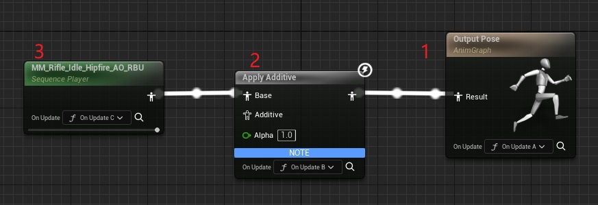

# Lyra动画系统(一) Locomotion

## 前置知识

### AnimNode中的Functions执行顺序


可以看到每个AnimNode都可以绑定这三个函数：

* OnInitialUpdate 初次调用Update时
* OnBecomeRelevant 下面解释
* OnUpdate 每次更新时

调用的地方在void FPoseLinkBase::Update(const FAnimationUpdateContext& InContext)中

```C++
if (LinkedNode != nullptr)
{
	FAnimationUpdateContext LinkContext(InContext.WithNodeId(LinkID));
	TRACE_SCOPED_ANIM_NODE(LinkContext);
	UE::Anim::FNodeFunctionCaller::InitialUpdate(LinkContext, *LinkedNode);
	UE::Anim::FNodeFunctionCaller::BecomeRelevant(LinkContext, *LinkedNode);
	UE::Anim::FNodeFunctionCaller::Update(LinkContext, *LinkedNode);
	LinkedNode->Update_AnyThread(LinkContext);
}
```

可以看到判定的顺序跟定义的顺序一致，依次为InitialUpdate, BecomeRelevant和Update;还有就是函数调用都是在**Update_AnyThread前** 而不是Evaluation阶段。



调用顺序为OnUpdateA，OnUpdateB, OnUpdateC, 从右到左，如果了解动画Update和Evaluation的话会更容易理解。

### BecomRelevant

BecomeRelevant的含义是指该Node上一帧的Weight还是0，这一帧就变成大于0的值了，因此如果一个Node在BlendOut的过程中(Weight没有变成0)又BlendIn的话，不会触发BecomRelevant

## Lyra动画框架一览


上图大致描述了Lyra的动画框架，ABP_Mannequin_Base负责逻辑框架， ABP_ItemAnimLayersBase实现Layer具体逻辑，ABP_PistolAnimLayers等动画蓝图通过继承+修改资源变量的方式实现了不同性别不同武器不同动作的需求，通过这种方式使得配置新武器方便了许多。

>_LinkAnimClassLayers函数的一个细节是调用后动画是直接替换的，不带有任何融合效果_

## 主状态机结构

ABP_Mannequin_Base中的逻辑框架如下：


我们再看下4.17版本时官方的动画蓝图：


相比较于4.17时的结构，现在的动画蓝图注重：

* 拆，包括将不同武器拆分到不同的动画蓝图中以及将部分PostProcess的逻辑拆到AnimBPPostProcess动画蓝图中去
* 复用，利用TempleteAnimBP可以让不同骨架复用相同的动画蓝图逻辑
* 可扩展，为了防止主蓝图内容臃肿，使用LinkAnimGraph功能将具体实现细节拆到不同Layers中去，扩展性强
* 节省内存，LinkAnimGraph机制保证无关的动画资源不会加载到内存中

## Locomotion

### Locomotion大致流程


默认状态为Idle，当有输入时会进入起步Start状态，随后会进入循环Cycle状态，这时如果没有输入的话会进入停步状态Stop, 或者输入方向反转时会进入Pivot状态。当处于前面这些所有状态时都有可能会被Jump或者落入空中所打断，JumpStart是Jump上升阶段时的状态，JumpApex则是开始自由落体时的状态，JumpStart最终会走过JumpApex状态，随后状态经过FallLoop和FallLand, 最后根据条件进入Idle或者Cycle。

注意这里并没有像ALS那样为Crouching单独创建一个状态机，而是在各个State中都判断了当前是否是Crouch, 类似的还有是否在瞄准(IsADS)。


### Functions的使用

#### 案例1


我们先以最简单的为例，Idle状态在随机时间后会进入到IdleBreak中，可以为枯燥的Idle加入一点随机动作，IdleBreaks数组中可以配置多个动画轮流播放，这里可以看到是在OnBecomeRelevant里面写了逻辑，取动画->SetSequence->CurrentIndex+1, 之所以放在OnBecomeRelevant中是希望这个节点开始'相关'时调用一次设置，后面Update期间不用再管。

>_`重要：`如果要在Functions中根据逻辑设置不同的Sequence，那么必须将SequencePlayer或者SequenceEvaluator中的Sequence变量设置成Dynamic_

>_`注意：`由于多线程安全的缘故，不能在Functions里面调用不安全的随机函数，这里的技巧是获取当前角色的位置，(X+Y)%MaxNum计算所得。_

#### 案例2


这里使用OnUpdate而非OnBecomeRelevant的原因也很简单，是因为在Idle状态不变的情况下也会出现更换Sequence的情况，比如Crouch, 因此需要OnUpdate中时刻监视是否需要更换Sequence。

>_`注意：`OnUpdate更改Sequence调用的是SetSequenceWithInertialBlending而不是SetSequence, 因为希望动画切换时能够平滑过渡。_

#### 案例3


SequenceEvaluator与SequencePlayer最大的不同是SequencePlayer的动画是自动播放，即它的播放时间是自动更新的，而SequenceEvaluator如果不手动更新时间的话(ExplicitTime)，那它始终是在那一帧。上图在处于StartState时，OnBecomeRelevant负责选择动画，OnUpdate负责更新ExplicitTime。

>_`重要：`如果有更新ExplicitTime的需要，必须把ExplicitTime变量设置成Dynamic_

### DistanceMatching

Lyra中共有4个States用到了DistanceMatching，分别是Start, Stop, Pivot以及FallLand，接下来我们逐个分析下它们是如何使用DistanceMatching的。

动画资源准备：
* 动画必须有RootMotion数据
* 给动画添加上DistanceCurve相关的曲线数据，引擎中已经内置了DistanceCurveModifier
* 起步动画的CurveValue是从0向一个**正值**变化，停步动画是从一个**负值**向0变化，而Pivot先从**负值**变向0，然后向**正值**变化，总之CurveValue一定是单调递增的
* 动画的CurveCompressionSettings必须设置为UniformIndexable

  

#### Start
首先先看下StartAnimation中的CurveValue代表了什么含义，下图中CurveValue**从0变向一个正值，含义表示离出发点的距离**


起步的核心函数是AdvanceTimeByDistanceMatching, 主要的参数如下：

* DistanceTraveled: 移动的距离，始终 >= 0
* DistanceCurveName: DistanceCurve曲线的名字
* PlayRateClamp: PlayRate的区间，避免动画播放过快或者过慢

主要的逻辑如下：


使用AdvanceTimeByDistanceMatching时不要预测将来的位置点(区别于Stop), 只跟移动的距离有关，简单总结就是：**提供了不按照DeltaTime而是按照移动距离(反算DeltaTime)去AdvanceTime的机制**

在Start的UpdateStartAnim函数中，还有一些变量用于协调StrideWarping，比如StrideWarpingBlendInStartOffset和StrideWarpingBlendInDurationScaled，Start可能在刚开始的时候不希望StrideWarping早早的介入，在经过StrideWarpingBlendInStartOffset时间后StrideWarping再慢慢BlendIn进来，在接下来的StrideWarpingBlendInDurationScaled的时间里，BlendAlpha从0逐渐变为1，并且BlendAlpha从0逐渐变为1期间，PlayRateClamp也希望是逐渐过渡的。


#### Stop

下图可以看到，StopAnimation中的CurveValue从一个**负值变向0，含义表示离站定点的距离**


停步的核心函数在于DistanceMatchToTarget，我们先看下停步时都发生了什么。

1. 角色在跑动过程中，松开摇杆/键盘，角色的Pose如下：

    

2. 利用当前速度，摩擦力，阻力系数等一系列参数，计算位移的距离是多少，如下图所示，位移的距离为d, 会停在A点上。
    

3. 通过DistanceMatchToTarget函数可以查询到距离目标点d距离应该对应动画的哪一帧，如果下图所示，如果d=141, 那么对应的就是0.18s这一帧，DistanceMatchToTarget同时SequenceEvaluator设置到这一帧
    

4. 下次更新如果计算的位移距离大于0，则回到步骤2，否则的话不在使用DistanceMatchToTarget, 直接AdvanceTime即可

>_步骤1和步骤3的Pose可能脚步相差很大，标准融合可能表现上会有些突兀，这里一个优化的方式是使用FastFeet的BlendProfile，使脚步能够快速融合_


至此，DistanceMatching的两个核心函数我们都使用过了，简单总结就是**离开站定位置的使用AdvanceTimeByDistanceMatching，去往站定位置的使用DistanceMatchToTarget**。

#### FallLand


#### Pivot


### StrideWarping

### OrientationWarping


### TurnInPlace和RotateRootBone

### AnimNodeTag

### SyncGroup

### StateAlias

### SyncGroupNameToRequireValidMarkersRule

### WasAnimNotifyStateActieInSourceState

## 总结

* Lyra动画框架，包括LinkAnimBlueprint，如何拆分，如何配置，如何生效等；
* LinkAnimBlueprint在动态切换时，两个不同的LinkAnim是如何过渡的；
* 在这个框架下，如果添加新武器需要配置哪些内容，跟ALS相比有哪些优势；