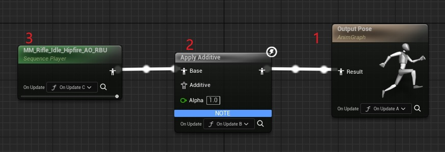

# 学习目标

1. Lyra动画框架，制作规范，C/S端执行流程，新特性使用及其原理等
   * Lyra动画框架，包括LinkAnimBlueprint，如何拆分，如何配置，如何生效等；
   * 在这个框架下，如果添加新武器需要配置哪些内容，跟ALS相比有哪些优势；
   * DS端一般不执行动画蓝图的逻辑，Curves有时没数据，如何解决？
   * DS端不执行动画蓝图的情况下，如何正确的伤害判定？
   * 新特性PropertyAccess，UE5新的Update, Evaluation原理
  
2. C/S模型下3C的执行流程，特别是Movement, 比如Movement如何写
   * CharacterMovement如何重写，以及CharacterMovement原理解析

3. 其他框架，比如GAS, GF, SubSystem, 进副本流程，GameMode与Experience等

## Lyra动画框架

### AnimNode中的Functions执行顺序

调用顺序为OnUpdateA，OnUpdateB, OnUpdateC, 从右到左，如果了解动画Update和Evaluation的话会更容易理解。

> _`BecomeRelevant`的含义是指该Node上一帧的Weight还是0，这一帧就变成大于0的值了，因此如果一个Node在BlendOut的过程中(Weight没有变成0)又BlendIn的话，不会触发BecomRelevant_

