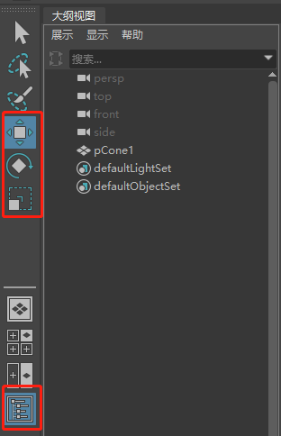

视频链接[零基础入门教程](https://www.bilibili.com/video/BV1ps411B7jL?p=1)

(我使用的是Maya2019,视频Up主用的是Maya2014,所以有些地方会有不同)

按住`空格键`，就会弹出热盒工具，快捷使用其他功能.

`Ctrl + 空格键` 进入/退出全屏模式(Maya2014快捷键为`Ctrl + Shift + 空格键`)

通过新建场景文件进行项目管理,注意导入和打开的区别，导入是叠加上，打开是移除所有重新打开;拖入资源是导入的过程

视图操作中，`Alt`按键经常使用，`Alt + 鼠标左键`场景内的旋转，`Alt + 鼠标右键`视图内的细粒度缩放，`Alt + 鼠标中键`视图内的平移，`鼠标滚轮`视图内粗粒度缩放

快捷键`A`会重置镜头位置保证能看到所有场景物体;快捷键`F`可以快速Focus到选中的物体上；`点击空格`切到视图选择界面，包含了透视图，顶视图，前视图和侧视图，鼠标停留在某个视图上，再次`点击空格`就会切到指定视图上；也可以通过热盒进行切换，弹出热盒后，点击中间的Maya就可以看到各种视图，甚至可以自定义摄像机；(视频里还介绍了可以使用视图盒子，我在Maya2019中没有找到，查了下可以改配置显示出来，我就不尝试了，快捷键已经很好用了~)

右图可以看到，上面三个按钮分别可以进行平移(快捷键`W`)，旋转(快捷键`E`)和缩放(快捷键`R`)的操作；值得注意的是，旋转有很多方式，按照轴进行旋转，可以按照当前相机的方向旋转(外边黄线)以及任意旋转(黄线内空白处)；在视口内按住`Shift`的同时通过鼠标点选可以选择多个物体；如果在大纲视图内的话，按住`Ctrl`的同时通过鼠标点选，大纲视图内按住`Shift`可以范围选择；默认情况可以框选多个物体，如果想额外选中其他物体，摁住`Shift`的同时可以鼠标点选或者框选其他物体，注意的是，如果选中了已经被选中的物体，那么该物体会修改成未选中状态(类似于Toggle)，这种需求下建议使用`Ctrl + Shift +点选/框选`；摁住`Ctrl`点选或者框选只能移除选中状态，不能添加成选中状态

右侧面板为通道盒，为编辑对象的属性界面，可以在其中进行精确的属性调整，比如位移，缩放，细分数（Poly*面板里）等; 按`D`或者`Insert`可以进行轴心点的设置; 选择某个物体，点击`修改`菜单中的`重置变换`可以重置该物体的变换信息;如果仅仅想重置轴心点的话，点击`修改`菜单中的`中心枢轴`即可;`Ctrl + Z`撤销操作，`Shift + Z`恢复撤销的操作

物体的显示模式：
* 数字键`1` 低精度显示
* 数字键`2` 加上平滑
* 数字键`3` 去掉线框的平滑 
* 数字键`4` 线框显示 
* 数字键`5`着色显示 
* 数字键`6` 纹理显示 
* 数字键`7` 灯光显示

物体的编辑模式: 鼠标`右键`包括顶点，顶点面，面，边，多重，UV以及对象模式等

选中物体的情况下，按下`Ctrl + D`复制该物体，移动好后按`Shift + D`可以按照移动的规则复制该物体，对于成排的物体创建特别方便！

按住`Ctrl + Shift`的同时点击菜单项，可以将该菜单项加入到当前的工具架中，包括自定义，方便快捷使用;选中多个物体，按下`P`键或者`编辑`菜单中的`建立父子关系`，最后一个选中的物体设置为父物体，其他为子物体(并不是子物体，孙物体等，而是并列子物体),`Shift + P`或者`编辑`菜单中的`断开父子关系`执行断开操作;选中多个物体按下`Ctrl + G`或者`编辑`菜单中的`分组`可以对选中的多个物体设置同一个父物体，该父物体为一个Group对象，大纲视图内可以看到并且选中，如果没有打开大纲视图，选中任意一个组内物体，按`向上方向键`亦可选中Group

通过控制细分数，可以增加模型的点数边数和面数从而进行更加细致的处理;切换到`建模`界面，`编辑网格`菜单中可以选择`挤出`对单个面进行编辑，比如制作下图这种凹槽等;`插入循环边`可以添加环形边

先选中墙物体A再选择门物体B,点击`网格/布尔/差集`可以在墙上扣一个门洞

打开动画首选项设置界面(下图)，将时间滑条播放设置为24fps

下图中详细解释：
* A为时间轴界面
* B可以设置当前时间，时间轴可以直接跳转到输入的帧号
* C为各种播放功能
* D可以进行动画范围的设置，最左和最右设置动画起始帧和结束帧，左二和右二设置时间轴显示的范围，滑动中间的滑条时间轴的显示也会改变
* E为自动关键帧切换，打开后会自动Key关键帧

Key关键帧的步骤为`先`移动时间轴`再`挪物体Key帧; Key可以通过快捷键`S`或者菜单`关键帧/设置关键帧`

时间轴上关键帧的几种操作方法：
* 移动关键帧。按住`Shift`的`同时`鼠标`点击`关键帧(前提是视口内选中了物体)，可以选中关键帧，松开`Shift`进行拖动

* 复制关键帧。一种办法是在关键帧上鼠标`右键`弹出菜单选择`复制`，在目标帧上鼠标`右键`进行`粘贴`;另外一个办法时间轴切到待复制的关键帧上，鼠标`中键拖动`关键帧，拖动到目标帧位置后`松开`鼠标然后按下快捷键`S`即可(因为中键拖动过程中物体并没有任何移动)

* 删除关键帧。在关键帧上鼠标`右键`弹出菜单选择`删除`
* 移动范围内的全部关键帧。按住`Shift`的`同时`鼠标`滑动`时间轴可以进行范围选择，选择后拖动`中间的方向按钮`进行挪动

* 插入空白帧。如果需要整体挪动关键帧，范围选择就有麻烦，可以在空白帧上鼠标`右键`选择`关键帧/插入中间帧`或者`移除中间帧`

打开脚本编辑器，选中脚本，按住鼠标`中键`拖动到自定义工具栏中可以快捷使用

在动画时间轴上，鼠标`右键`弹出菜单中选择`切线`，里面有各种插值算法，Clamp, Const等

打开曲线编辑器:菜单`窗口/动画编辑器/曲线图编辑器`，操作时间轴有两种方式，一是可以直接拖动上面的时间轴，二是按住快捷键`K`然后鼠标滑动;按`A`键可以整体显示所有Key帧,按`F`键区域Focus;关键帧之间`默认`是`淡入淡出`的曲线;鼠标`左键`或者`中键`可以直接拖动节点或者整条曲线;点击左上角有个按钮是`插入关键帧`，随后可以在曲线上按鼠标`中键`插入关键帧，方便对中间部分曲线调整,按`回车键`完成本次插值操作;按住`Alt + Shift`的同时，鼠标`右键`可以横行或者纵向进行缩放;

断开切线的按钮可以单独控制左右切线的斜率

`Alt + B`可以进行视图背景颜色的切换,深色，浅色，黑色，灰色等等

在点选Rig中的控制器时经常点到模型的曲面上，通过关闭曲面选择，可以更加容易点选到控制器上

输入window+R，输入regedit，然后找到HKEY_CURRENT_USER\Software\Classes\.htm，把默认值改成ChromeHTML，就把maya和其他的软件的帮转浏览器换成谷歌浏览器了~