# 快捷键

`Ctrl + 1` 一个视口

`Ctrl + 2` 两个视口

`Ctrl + 3` 三个视口

`Ctrl + 4` 四个视口

`Ctrl + T` 顶视图，再次`Ctrl + T`底视图

`Ctrl + F` 前视图，再次`Ctrl + F`后视图

`Ctrl + R` 右视图，再次`Ctrl + R`左视图

`Ctrl + E` 透视图，再次`Ctrl + E`循环切换场景内的相机

`Ctrl + W` 场景Node模式

`Ctrl + A`循环设置Model模式， X-Ray模式， 正常模式

如果交互模式设置的为Maya:

`W` 物体平移，`E`物体旋转，`R`物体缩放

`S` 添加关键帧

按`F`快速聚集到选中的物体上

按`A`聚集所有物体

选中物体`Shift + H`隐藏该物体，`Ctrl + H`显示该物体; 也可以在视口左上角的`Display`中点击设置

ObjectMode有三种模式：
`Q` 为物体模式，`Insert` 修改轴心点位置，即轴心模式，`V`即顶点模式,对于编辑3DCurve特别方便

如果在FCurves窗口内：

`Alt`+ `鼠标右键`可以横纵向缩放，`Alt`+`鼠标中键`可以平移，`F`和`A`键可以快速聚焦到所有关键帧或者某个关键帧上

框选所有关键帧可以整体横纵向缩放

# 变换物体
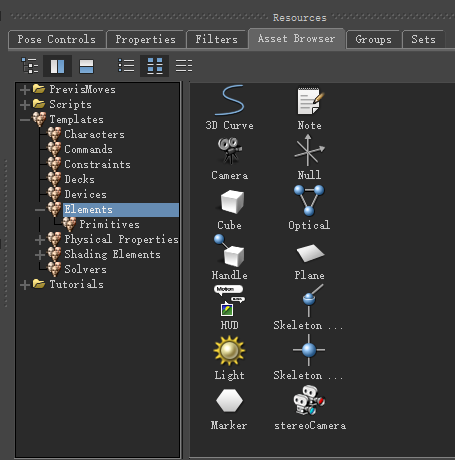

上图表示在AssetBorwser预设的几种几何体，可以`拖动`到场景中生成也可以`双击`几何体后在场景中再`点击`生成, 继续`点击`继续生成，直到按下`Enter`键完成。后者对于编辑3DCurve特别方便

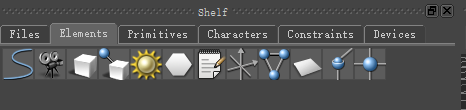

也可以通过OpenReality/Tools/Shelf生成置物架，但无法执行`双击`的操作，所以使用3DCurve时略微麻烦些

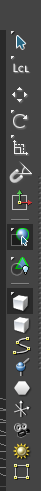

当执行旋转时，需要每次旋转的最小角度为固定值，比如1或者10，那么可以选择右侧的`Snap Rotation`, 右键可以设置一些预设角度

当执行缩放时，在`Scale Volumic`中有两种设置，`Scale Uniform`为默认缩放，`Scale Volumetric`为保持体积不变的缩放，可以方便模拟物体压缩后的形态

点击右侧的`ReferenceMode`,可以在物体坐标系(Lcl)和全局坐标系(Gbl)中切换，编辑物体位置或者旋转时根据需要切换使用

下面的几个Mask为选择蒙版，在框选大量物体时使用，当只希望框选Camera时，可以勾选上`CameraSelectionMask`，这样框选所有场景物体时，只有Camera的物体可以被选中

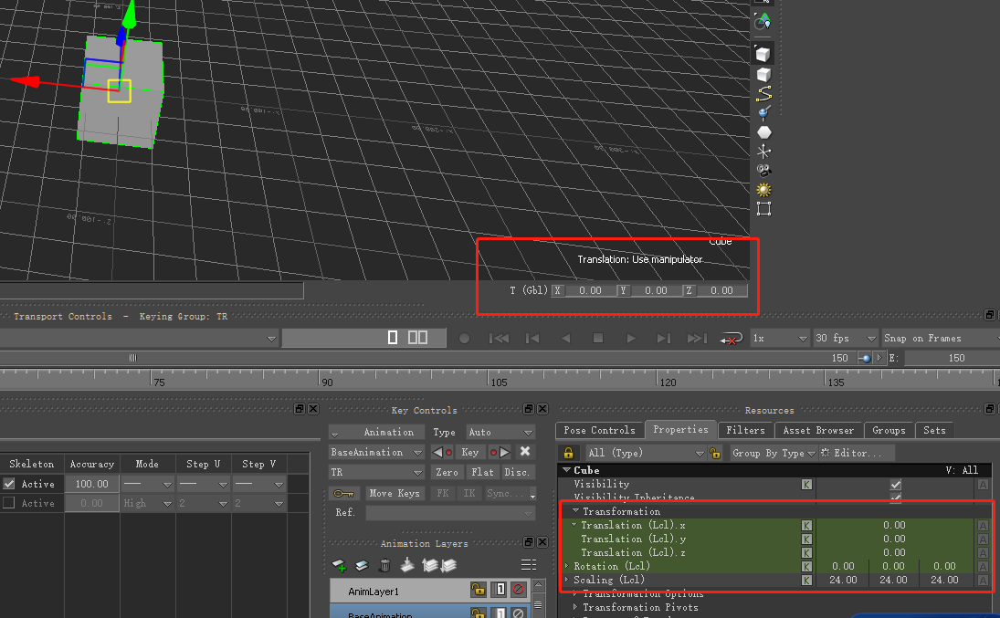
两个地方可以修改属性

# 物体关系建立

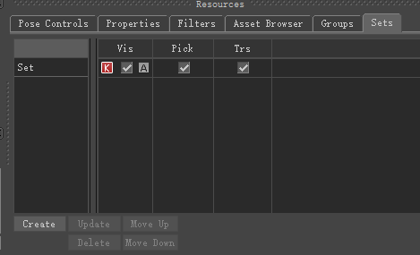
选择多个物体后，Resources/Groups或者Sets页签下点击Create可以为这些物体创建Group或者Set，可以批量进行显隐设置(Show/Vis), 是否可以被选中(Pick)以及是否锁定Transitions(Trs), Sets不同于Group的一点是可以Key关键帧

也可以通过指定父子的方式建立关系，简单的方式是在`Navigator`下将子物体拖动到父物体下即可

右键物体弹出菜单，有一项为`Zero`表示将属性值清零，包括位移，旋转，缩放等，注意缩放的`Zero`表示设置为1

# 时间轨道

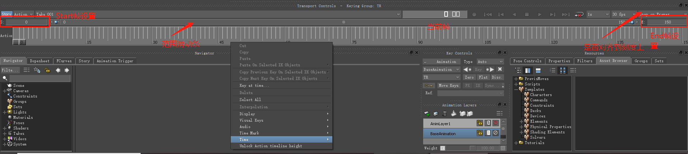

# 动画控制面板

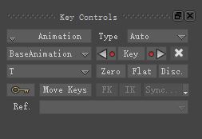

* Animation是个菜单项，点开后有总多设置项
* Type为关键帧之间插值方式，有Auto, Linear, Spline等
* BaseAnimation中选择的是哪个层Layer, 可以选择或者新建
* 快速定位到上一个关键帧的位置
* 设置关键帧
* 快速定位到下一个关键帧的位置
* 删除关键帧
* 设置关键帧属性信息，比如设置的关键帧只包括Translation或者Rotation
* Zero表示将属性值清零后再添加关键帧
* Flat表示添加一个Flat的关键帧，该关键帧
* Disc.表示生成的关键帧可以打断切线
* 小钥匙表示会自动生成Key

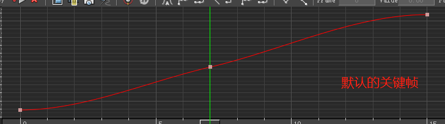
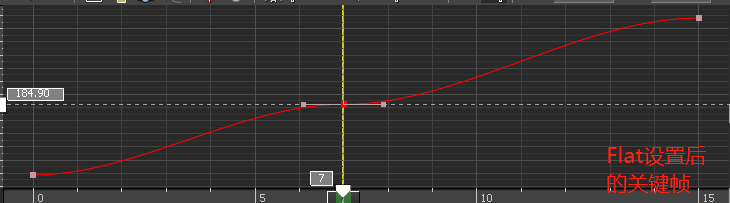
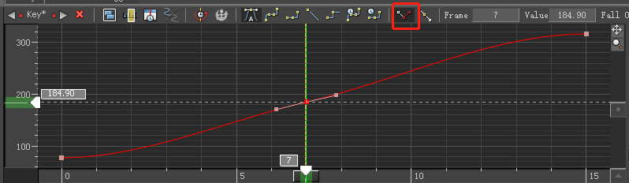

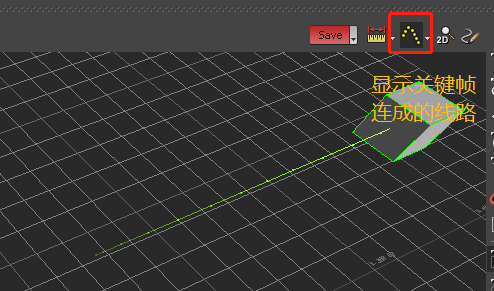

# Take的应用
每个Take可以存储一段表演，多个Take多段不同的表演。可以将多个Take放入到Story进行组合表演，调整后可以再次生成新的Take并将当前的Scene绘制到当前的Take上，这样新的Take就包含了多段表演了

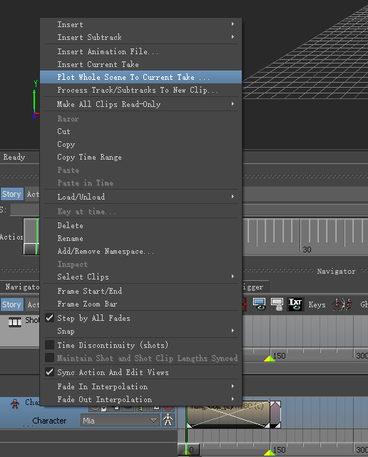

# 摄影表的应用
摄影表可以对同类型或者某个Group的所有物体批量修改其关键帧信息，比如位置，或者说所有关键帧缩放等。左边的All(Type)可以修改成T, TR或者TRS等，起到过滤器(Filter)的作用; 右边的GroupByType是按照物体类型进行分组，当然也可以在右边的Groups选中自定义的组进行批量处理;

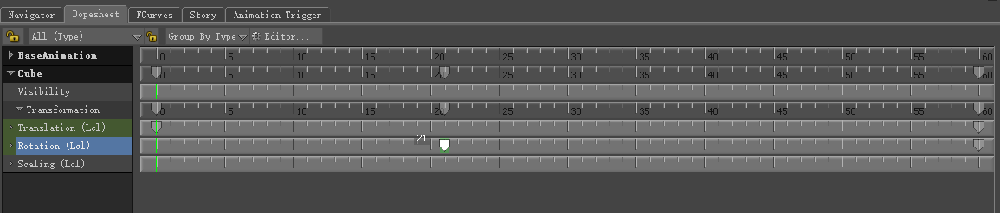

# FCurves窗口

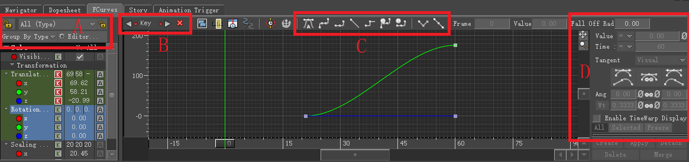

动画师大部分的时间都花费在这里了，我们详细说明下：
* A区域与摄影表中的相应控件功能相同，用于过滤和分组
* B区域可以快捷Key关键帧
* C区域与动画控制面板中的Type一一对应，比如Auto, Linear, Spline等
* D区域有些功能与C区域部分重复，可以以数值的方式精确控制，Wt可以解锁从而拉长控制线

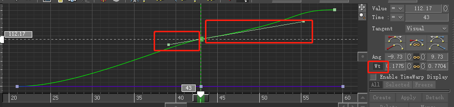

编辑完后鼠标右键可以向前或者向后添加有限次数的循环或者无限循环

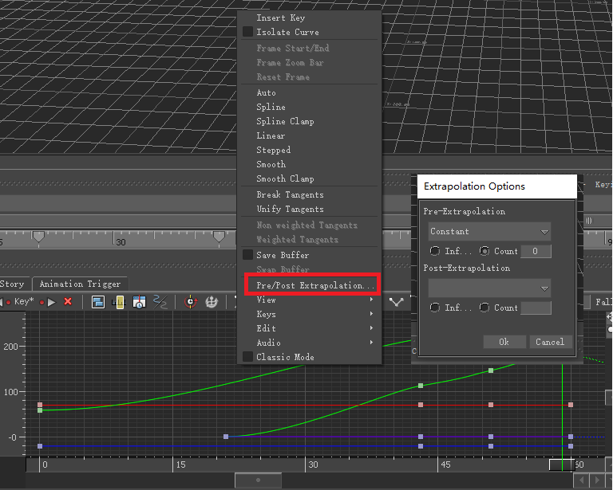

# TimeWarp
TODO 整体缩放

# DynamicEditor
TODO 

# 过滤器Filters
选中骨骼或者控制器后，可以SetStart，SetStop设置过滤区域，从而进行Smooth或者Resample处理，Smooth对于处理BVH动捕数据不稳定的问题特别有用，而Resample可以保证效果的同时减少关键帧数量

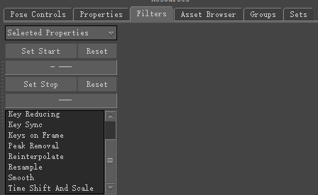

# 动画层
在层上编辑不影响源数据，随改随删

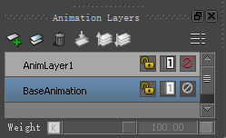

可以看到下面的Weight，可以对各个层的Weight进行Key值

TODO 解释实现，比如additive

# PoseControls

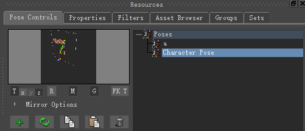

可以点击加号把一些关键的Pose存储起来，在粘贴Pose时特别有用(双击该Pose即可)

M表示是否影像，G表示Y轴方向是否启用重力

# 路径动画

第一种办法是手动创建Object和3DCurve，然后再创建一个Path约束，手动建立好联系后就可以让物体沿着Curve移动了

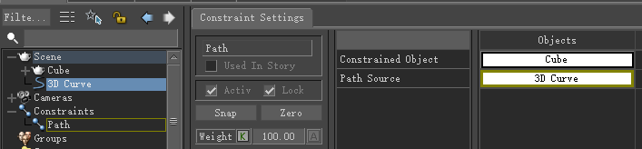

另外一种办法是选中物体，选择菜单中的CreateAnimationPath，这样可以对物体Key位置信息，MB会自动生成Curve信息

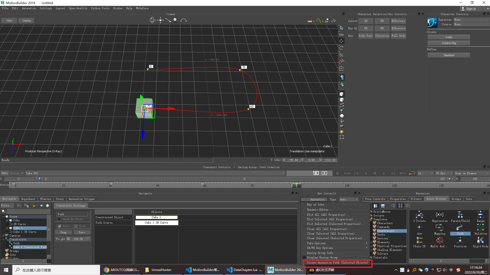

# HumanIK

