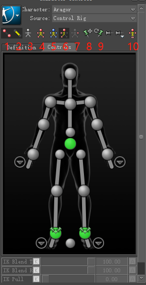

# 快捷键

`Ctrl + 1` 一个视口

`Ctrl + 2` 两个视口

`Ctrl + 3` 三个视口

`Ctrl + 4` 四个视口

`Ctrl + T` 顶视图，再次`Ctrl + T`底视图

`Ctrl + F` 前视图，再次`Ctrl + F`后视图

`Ctrl + R` 右视图，再次`Ctrl + R`左视图

`Ctrl + E` 透视图，再次`Ctrl + E`循环切换场景内的相机

`Ctrl + W` 场景Node模式

`Ctrl + A` 循环设置Model模式， X-Ray模式， 正常模式

`Ctrl + Space` 播放/暂停动画

`Ctrl + 左箭头` 将Timeline设置到上一帧的位置

`Ctrl + 右箭头` 将Timeline设置到下一帧的位置

`Ctrl + 上箭头` 正常播放/暂停动画

`Ctrl + 下箭头` 逆方向播放/暂停动画

如果交互模式设置的为Maya:

`W` 物体平移，`E`物体旋转，`R`物体缩放，选中物体后按住`X`键+`鼠标左键`拖动物体(MotionBuilder模式为`Alt`+`鼠标左键`)

`S` 添加关键帧

按`F`快速聚集到选中的物体上

按`A`聚集所有物体

选中物体`Shift + H`隐藏该物体，`Ctrl + H`显示该物体; 也可以在视口左上角的`Display`中点击设置

ObjectMode有三种模式：
`Q` 为物体模式，`Insert` 修改轴心点位置，即轴心模式，`V`即顶点模式,对于编辑3DCurve特别方便

如果在FCurves窗口内：

`Alt`+ `鼠标右键`可以横纵向缩放，`Alt`+`鼠标中键`可以平移，`F`和`A`键可以快速聚焦到所有关键帧或者某个关键帧上

框选所有关键帧可以整体横纵向缩放

Timeline使用``鼠标中键``点击也可以跳到直接位置。按住`Shift` + 框选可以在Timeline选择多个关键帧

# 变换物体

上图表示在AssetBorwser预设的几种几何体，可以`拖动`到场景中生成也可以`双击`几何体后在场景中再`点击`生成, 继续`点击`继续生成，直到按下`Enter`键完成。后者对于编辑3DCurve特别方便

也可以通过OpenReality/Tools/Shelf生成置物架，但无法执行`双击`的操作，所以使用3DCurve时略微麻烦些

当执行旋转时，需要每次旋转的最小角度为固定值，比如1或者10，那么可以选择右侧的`Snap Rotation`, 右键可以设置一些预设角度

当执行缩放时，在`Scale Volumic`中有两种设置，`Scale Uniform`为默认缩放，`Scale Volumetric`为保持体积不变的缩放，可以方便模拟物体压缩后的形态

点击右侧的`ReferenceMode`,可以在物体坐标系(Lcl)和全局坐标系(Gbl)中切换，编辑物体位置或者旋转时根据需要切换使用

下面的几个Mask为选择蒙版，在框选大量物体时使用，当只希望框选Camera时，可以勾选上`CameraSelectionMask`，这样框选所有场景物体时，只有Camera的物体可以被选中

两个地方可以修改属性

# 物体关系建立

选择多个物体后，Resources/Groups或者Sets页签下点击Create可以为这些物体创建Group或者Set，可以批量进行显隐设置(Show/Vis), 是否可以被选中(Pick)以及是否锁定Transitions(Trs), Sets不同于Group的一点是可以Key关键帧

也可以通过指定父子的方式建立关系，简单的方式是在`Navigator`下将子物体拖动到父物体下即可

右键物体弹出菜单，有一项为`Zero`表示将属性值清零，包括位移，旋转，缩放等，注意缩放的`Zero`表示设置为1

# 时间轨道

# 动画控制面板

* Animation是个菜单项，点开后有众多设置项
* Type为关键帧之间插值方式，有Auto, Linear, Spline等
* BaseAnimation中选择的是哪个层Layer, 可以选择或者新建
* 快速定位到上一个关键帧的位置
* 设置关键帧
* 快速定位到下一个关键帧的位置
* 删除关键帧
* 设置关键帧属性信息，比如设置的关键帧只包括Translation或者Rotation
* Zero表示将属性值清零后再添加关键帧
* Flat表示添加一个Flat的关键帧，该关键帧
* Disc.表示生成的关键帧可以打断切线
* 小钥匙表示会自动生成Key

# Take的应用
每个Take可以存储一段表演，多个Take多段不同的表演。可以将多个Take放入到Story进行组合表演，调整后可以再次生成新的Take并将当前的Scene绘制到当前的Take上，这样新的Take就包含了多段表演了

# 摄影表的应用
摄影表可以对同类型或者某个Group的所有物体批量修改其关键帧信息，比如位置，或者说所有关键帧缩放等。左边的All(Type)可以修改成T, TR或者TRS等，起到过滤器(Filter)的作用; 右边的GroupByType是按照物体类型进行分组，当然也可以在右边的Groups选中自定义的组进行批量处理;

# FCurves窗口

动画师大部分的时间都花费在这里了，我们详细说明下：
* A区域与摄影表中的相应控件功能相同，用于过滤和分组
* B区域可以快捷Key关键帧
* C区域与动画控制面板中的Type一一对应，比如Auto, Linear, Spline等
* D区域有些功能与C区域部分重复，可以以数值的方式精确控制，Wt可以解锁从而拉长控制线

编辑完后鼠标右键可以向前或者向后添加有限次数的循环或者无限循环

# TimeWarp
TODO 整体缩放

# DynamicEditor
TODO 

# 过滤器Filters
选中骨骼或者控制器后，可以SetStart，SetStop设置过滤区域，从而进行Smooth或者Resample处理，Smooth对于处理BVH动捕数据不稳定的问题特别有用，而Resample可以保证效果的同时减少关键帧数量

# 动画层
在层上编辑不影响源数据，随改随删

可以看到下面的Weight，可以对各个层的Weight进行Key值

TODO 解释实现，比如additive

# PoseControls

可以点击加号把一些关键的Pose存储起来，在粘贴Pose时特别有用(双击该Pose即可)

M表示是否影像，G表示Y轴方向是否启用重力

# 路径动画

第一种办法是手动创建Object和3DCurve，然后再创建一个Path约束，手动建立好联系后就可以让物体沿着Curve移动了

另外一种办法是选中物体，选择菜单中的CreateAnimationPath，这样可以对物体Key位置信息，MB会自动生成Curve信息

# HumanIK
TODO IK/FK

# Actor
光学动捕文件为c3d文件，记录了Marker的位置信息，需要匹配到Actor身上进行周转

操作步骤分为以下几个步骤：

* Marker对齐位置，匹配到Actor身上

* 创建MarkerSet并且一一指定，一个部位上最多可选4个Marker

* 最后进行确认

完成之后就可以通过HumanIK进行重定向了

# BVH的使用

如下步骤

1. 导入BVH，所有Rotation进行Zero处理，将坐标中的X和Z设置为0，胳膊旋转到水平位置，然后将这个TPose单独保存成一个fbx, 记得不保存动画信息

2. 重新打开刚才保存的TPose文件，打开后点击HumanIK中的Skeleton，并重命名，随后指定骨骼信息

3. 点击HumanIK中的小锁，并且选择Biped，再次保存，随后就可以直接导入进来BVH动画了

# Character定义的预设

比如我导入一个UE4小白人的角色，第一次我需要手动定义Character, 需要手动指定骨骼的对应关系，但我不希望每次使用类似骨骼层级的时候都要手动定义，这时候可以把定义好的对应关系保存成一个xml文件，下次再需要定义的时候直接Load进来即可。MotionBuilder默认定义好一些预设，比如3dMax/Maya中常见的CAT和Biped等。

# 角色控制器
**一般是在控制器上Key动画的，而不是直接操纵骨骼**

根据上面的步骤，定义好Character之后才可以创建ControlRig

在X-Ray模式下可以看到，红色球状的是IK-Effector, 黄色线状的是FK-Effector，两者都是Effectors, 也终于让我明白Character Selection/Key Controls中的Effectors是代表Select/Key所有Effectors的意思......

接下来我们看下ControlRig中众多控件的含义:

1. X-Ray模式中是否显示IK-Effectors
2. X-Ray模式中是否显示FK-Effectors
3. X-Ray模式中是否显示Skeletons
4. 操纵四个模式之一，是否是FullBodyIK模式，比如拖动手部IK时会影响全身，Key值时也是全身的Effectors
5. 操纵四个模式之一，BodyPart，即拖动手部IK不会影响全身，但Key值时依然是全身的Effectors
6. 操纵四个模式之一，真正意义上的BodyPart，Key值时只是身体局部的Effectors
7. 操纵四个模式之一，只对Selection有效果
8. 位置图钉约束，**代表着其他Effector不会影响到它，不代表着不会移动了，如果移动该Effector然后会移动**
9. 旋转图钉约束，同上
10. 设置为TPose状态

# 地板影响
1. UnlockCharacter
2. 找到Character Definition,设置Floor

3. LockCharacter
4. 设置Character Settings

5. 再将Source切到ControlRig就可以看到效果了

# 原地动画
Character Settings中有In-Place的设置，比如LockY