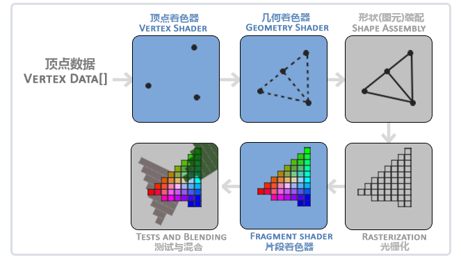
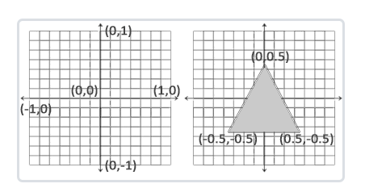
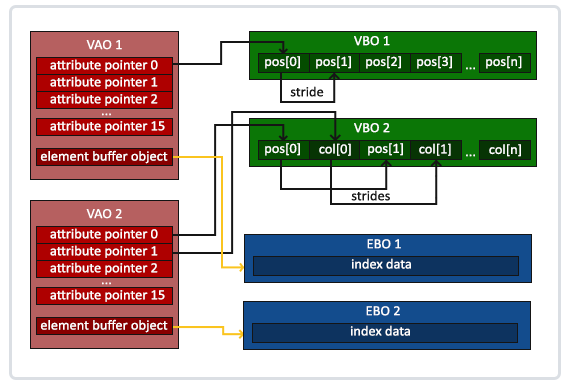

## 你好，窗口

### 双缓冲(Double Buffer)
应用程序使用单缓冲绘图时可能会存在图像闪烁的问题。 这是因为生成的图像不是一下子被绘制出来的，而是按照从左到右，由上而下逐像素地绘制而成的。最终图像不是在瞬间显示给用户，而是通过一步一步生成的，这会导致渲染的结果很不真实。为了规避这些问题，我们应用双缓冲渲染窗口应用程序。前缓冲保存着最终输出的图像，它会在屏幕上显示；而所有的的渲染指令都会在后缓冲上绘制。当所有的渲染指令执行完毕后，我们交换(Swap)前缓冲和后缓冲，这样图像就立即呈显出来，之前提到的不真实感就消除了。

### 状态设置函数和状态使用函数
当使用OpenGL的时候，我们会遇到一些状态设置函数(State-changing Function)，这类函数将会改变上下文。以及状态使用函数(State-using Function)，这类函数会根据当前OpenGL的状态执行一些操作。只要你记住OpenGL本质上是个大状态机，就能更容易理解它的大部分特性。

```C++
glClearColor(0.2f, 0.3f, 0.3f, 1.0f);
glClear(GL_COLOR_BUFFER_BIT);
```

你应该能够回忆起来我们在 OpenGL 这节教程的内容，glClearColor函数是一个状态设置函数，而glClear函数则是一个状态使用的函数，它使用了当前的状态来获取应该清除为的颜色。

## 你好，三角形

OpenGL图形管线流程：



* 顶点着色器，传入过来的顶点属性数据，包括位置，UV，法向量等跟顶点密切相关的，并且这时候顶点位置并不是标准化设备坐标(xy都在[-1, 1]区间)，顶点着色器需要把传入进来的位置转为标准化设备坐标；

  

* 几何着色器，几何着色器将一组顶点作为输入，这些顶点形成图元，并且能够通过发出新的顶点来形成新的(或其他)图元来生成其他形状。在这个例子中，它从给定的形状中生成第二个三角形。

* 图元装配，阶段将顶点着色器（或几何着色器）输出的所有顶点作为输入（如果是GL_POINTS，那么就是一个顶点），并将所有的点装配成指定图元的形状；本节例子中是两个三角形。

* 光栅化，这里它会把图元映射为最终屏幕上相应的像素，生成供片段着色器(Fragment Shader)使用的片段(Fragment)。在片段着色器运行之前会执行裁切(Clipping)。裁切会丢弃超出你的视图以外的所有像素，用来提升执行效率。

  >_光栅化就是在一个连续的空间(任意浮点位置都有数据)采样离散的点数据(屏幕上的像素点)_

* 片段着色器，主要目的是计算一个像素的最终颜色，这也是所有OpenGL高级效果产生的地方。通常，片段着色器包含3D场景的数据（比如光照、阴影、光的颜色等等），这些数据可以被用来计算最终像素的颜色。

* 测试与混合，这个阶段检测片段的对应的深度（和模板(Stencil)）值，用它们来判断这个像素是其它物体的前面还是后面，决定是否应该丢弃。这个阶段也会检查alpha值（alpha值定义了一个物体的透明度）并对物体进行混合(Blend)。所以，即使在片段着色器中计算出来了一个像素输出的颜色，在渲染多个三角形的时候最后的像素颜色也可能完全不同。


OpenGL有很多缓冲对象类型，顶点缓冲对象的缓冲类型是GL_ARRAY_BUFFER。OpenGL允许我们同时绑定多个缓冲，只要它们是不同的缓冲类型。我们可以使用glBindBuffer函数把新创建的缓冲绑定到GL_ARRAY_BUFFER目标上：
glBindBuffer(GL_ARRAY_BUFFER, VBO);  
从这一刻起，我们使用的任何（在GL_ARRAY_BUFFER目标上的）缓冲调用都会用来配置当前绑定的缓冲(VBO)。
>_glBindBuffer用于配置数据_


每个顶点属性从一个VBO管理的内存中获得它的数据，而具体是从哪个VBO（程序中可以有多个VBO）获取则是通过在调用glVertexAttribPointer时绑定到GL_ARRAY_BUFFER的VBO决定的。由于在调用glVertexAttribPointer之前绑定的是先前定义的VBO对象，顶点属性0现在会链接到它的顶点数据。

一般当你打算绘制多个物体时，你首先要生成/配置所有的VAO（和必须的VBO及属性指针)，然后储存它们供后面使用。当我们打算绘制物体的时候就拿出相应的VAO，绑定它，绘制完物体后，再解绑VAO。

应该如何快速理解VAO, VBO, EBO的关系 ?

* VBO, 存储的是顶点属性数据，它仅仅是数据，因此DrawCall调用前必须需要调用glVertexAttribPointer来告诉OpenGL顶点属性数据应该如何解释，比如位置存储在哪个位置，属性之间的步长是多少等等，而glVertexAttribPointer函数解释的数据来源是GL_Array_Buffer, 因此又要求我们调用glVertexAttribPointer前需要先glBindBuffer, 因此正常的流程应该是先bindBuffer然后再glVertexAttribPointer；

* EBO, 存储的是顶点索引数据，它仅仅是数据；

* VAO, 可以把它看成一种管理VBO, EBO的数据结构，它知道顶点属性数据在哪儿，顶点索引数据在哪儿，顶点属性有多少个(位置，UV，法向量等)，哪些属性启用了（对应顶点着色器的layout location），属性步长是多少，它知道需要绘制一个完整物体所需的所有数据，因此在调用DrawCall只需简单的绑定这个VAO就可以了；



## 着色器

### 顶点属性上限

每个输入变量也叫顶点属性(Vertex Attribute)。我们能声明的顶点属性是有上限的，它一般由硬件来决定。OpenGL确保至少有16个包含4分量的顶点属性可用，但是有些硬件或许允许更多的顶点属性，你可以查询GL_MAX_VERTEX_ATTRIBS来获取具体的上限：

```C++
int nrAttributes;
glGetIntegerv(GL_MAX_VERTEX_ATTRIBS, &nrAttributes);
std::cout << "Maximum nr of vertex attributes supported: " << nrAttributes << std::endl;
```

通常情况下它至少会返回16个，大部分情况下是够用了。

### Uniform属性上限

OpenGL限制了它能够处理的uniform数量，这可以通过GL_MAX_VERTEX_UNIFORM_COMPONENTS来查询。

### Vector支持Swizzling

即vector支持类似vec.xxx, vec.xyz, vec.yyz, vec.zyx等操作;

## 纹理

纹理坐标在x和y轴上，范围为0到1之间（注意我们使用的是2D纹理图像）。使用纹理坐标获取纹理颜色叫做采样(Sampling)。纹理坐标起始于(0, 0)，也就是纹理图片的左下角，终止于(1, 1)，即纹理图片的右上角。下面的图片展示了我们是如何把纹理坐标映射到三角形上的。


glBindTexture后，可以调用设置该纹理，比如环绕模式，过滤方法以及Mipmap相关；

你可能会奇怪为什么sampler2D变量是个uniform，我们却不用glUniform给它赋值。使用glUniform1i，我们可以给纹理采样器分配一个位置值，这样的话我们能够在一个片段着色器中设置多个纹理。一个纹理的位置值通常称为一个纹理单元(Texture Unit)。一个纹理的默认纹理单元是0，它是默认的激活纹理单元，所以教程前面部分我们没有分配一个位置值。

纹理单元的主要目的是让我们在着色器中可以使用多于一个的纹理。通过把纹理单元赋值给采样器，我们可以一次绑定多个纹理，只要我们首先激活对应的纹理单元。就像glBindTexture一样，我们可以使用glActiveTexture激活纹理单元，传入我们需要使用的纹理单元：

```C++
glActiveTexture(GL_TEXTURE0); // 在绑定纹理之前先激活纹理单元
glBindTexture(GL_TEXTURE_2D, texture);
```

激活纹理单元之后，接下来的glBindTexture函数调用会绑定这个纹理到当前激活的纹理单元，纹理单元GL_TEXTURE0默认总是被激活，所以我们在前面的例子里当我们使用glBindTexture的时候，无需激活任何纹理单元。

```C++
//---------使用多纹理的一般流程：
unsigned int texture1, texture2, texture3;
glGenTextures(1, &texture1);
glBindTexture(GL_TEXTURE_2D, texture1);
// 为当前绑定的纹理对象设置环绕、过滤方式
glTexParameteri(GL_TEXTURE_2D, GL_TEXTURE_WRAP_S, GL_REPEAT);   
glTexParameteri(GL_TEXTURE_2D, GL_TEXTURE_WRAP_T, GL_REPEAT);
glTexParameteri(GL_TEXTURE_2D, GL_TEXTURE_MIN_FILTER, GL_LINEAR);
glTexParameteri(GL_TEXTURE_2D, GL_TEXTURE_MAG_FILTER, GL_LINEAR);

// 加载图片数据并设置给texture1
int width, height, nrChannels;
unsigned char *data = stbi_load("container.jpg", &width, &height, &nrChannels, 0);
if (data)
{
    glTexImage2D(GL_TEXTURE_2D, 0, GL_RGB, width, height, 0, GL_RGB, GL_UNSIGNED_BYTE, data);
    glGenerateMipmap(GL_TEXTURE_2D);
}
stbi_image_free(data);

// 重复上面的步骤生成并设置texture2, texture3;
// ...

// glActiveTexture之后，接下来的glBindTexture函数调用会绑定这个纹理到当前激活的纹理单元
glActiveTexture(GL_TEXTURE0);
// texture1放到GL_TEXTURE0纹理单元中，即位置值为0
glBindTexture(GL_TEXTURE_2D, texture1);
// 同样先激活后绑定
glActiveTexture(GL_TEXTURE1);
// texture2放到GL_TEXTURE1纹理单元中，即位置值为1
glBindTexture(GL_TEXTURE_2D, texture2);
// 同样先激活后绑定
glActiveTexture(GL_TEXTURE2);
// texture3放到GL_TEXTURE2纹理单元中，即位置值为2
glBindTexture(GL_TEXTURE_2D, texture3);

// ...

ourShader.use(); // 不要忘记在设置uniform变量之前激活着色器程序！

// Shader中定义的uniform sampler2D texture1，这个Sampler2D本质上就是一个int，即纹理单元的数值；
// 上面我们已经把三个纹理绑定到不同的纹理单元上了(也可以理解成槽位上)，接下来需要给shader中的sampler2D设置给值，这样就能引用正确的纹理；

// Shader中的in texture1设置为0，即shader中的这个Sampler2D的值为0，即对应上面的texture1;
glUniform1i(glGetUniformLocation(ourShader.ID, "texture1"), 0); // 手动设置
glUniform1i(glGetUniformLocation(ourShader.ID, "texture2"), 1); // 手动设置
glUniform1i(glGetUniformLocation(ourShader.ID, "texture3"), 2); // 手动设置

glBindVertexArray(VAO);
glDrawElements(GL_TRIANGLES, 6, GL_UNSIGNED_INT, 0);
```

