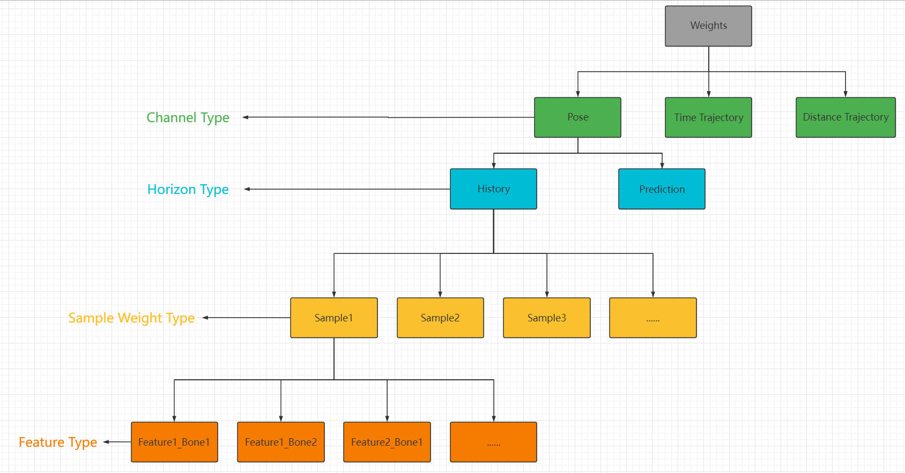

```C++
/**
 *  PoseSearch
*/

// 特别重要的类，主要用来处理将features按照feature vector layout格式写入到buffer中，并且会跟踪当前哪些features已经填入了，从而逐步建立feature vector. 还有就是用于在runtime构建search queries
struct FPoseSearchFeatureVectorBuilder
{
   // functions begin
   // ...
   // functions end

   // 数据指向UPoseSearchSchema，Feature处理过程中会反复用到UPoseSearchSchema数据
   UPROPERTY(Transient)
	TWeakObjectPtr<const UPoseSearchSchema> Schema = nullptr;

   // 数组长度为UPoseSearchSchema->Layout.NumFloats
	TArray<float> Values;
   // 数组长度为UPoseSearchSchema->Layout.NumFloats, Values经过Normalized处理后的数据
	TArray<float> ValuesNormalized;
   // Mask标志，那些Features已经录入了，数组长度为数组长度为UPoseSearchSchema->Layout.Features.Num()
	TBitArray<> FeaturesAdded;
   // 已经录入的Features数量
	int32 NumFeaturesAdded = 0;
}

// 正如注释里说明的，SequenceStartInterval表示Sequence开头多长时间的动画禁止Transition，这样的话，后面的数据帧会有正确的Past trajectory数据
// SequenceEndInterval表示末尾多长时间的动画禁止Transition, 这样的话，不仅前面的数据帧会有正确的future trajectory,并且可以避免transition后瞬间结束的现象
// 这里有个问题是，PoseMatching(即UPoseSearchSequenceMetaData)中其实不需要这两个参数，而且UPoseSearchSequenceMetaData并没有选项设置，导致SequenceEndInterval一直在使用0.2的默认值，如果这时候我设置SampleRange为[0, 0.2]的话其实是无效的，导致没有帧可用了，准备发个Pull Request修改下；DatabaseAsset可以直接设置

//  SequenceStartInterval                      SequenceEndInterval
//  *********************++++++++++...+++++++++*******************
USTRUCT()
struct FPoseSearchBlockTransitionParameters
{
	GENERATED_BODY()

	UPROPERTY(EditAnywhere, Category = "Settings")
	float SequenceStartInterval = 0.0f;

	UPROPERTY(EditAnywhere, Category = "Settings")
	float SequenceEndInterval = 0.2f;
};

// 在FAnimSamplingContext.Init调用后BoneContainer会存储骨骼信息，如果配置了MirrorDataTable则初始化其他镜像功能所需的参数
struct FAnimSamplingContext
{
	// 有限差分法使用的Delta值，用于计算SampleTime - FiniteDelta，SampleTime,SampleTime + FiniteDelta，最后再计算速度信息V(s) ~= (f(s+h) - f(s-h))/2h
	// Time delta used for computing pose derivatives
	static constexpr float FiniteDelta = 1 / 60.0f;

	FBoneContainer BoneContainer;
	
	// 镜像功能使用，指向Schema中的MirrorDataTable
	TObjectPtr<UMirrorDataTable> MirrorDataTable = nullptr;
	
	/* 镜像数据使用，记录了BoneContainer中相关骨骼与镜像骨骼的对应表, 比如foot-l对应的CompactPoseBoneIndex为4，对应的镜像骨骼为foot-r,CompactPoseBoneIndex为7
	比如存储如下数据:
	    [0, 0]root->root
	    [1, 1] pelvis->pelvis
	    [2, 5]thigh_l->thigh_r
	    [3, 6]calf_l->calf_r
	    [4, 7]foot_l->foot_r
	    [5, 2]thigh_r->thigh_l
	    [6, 3]calf_r->calf_l
	    [7, 4]foot_r->foot_l
	*/
	TCustomBoneIndexArray<FCompactPoseBoneIndex, FCompactPoseBoneIndex> CompactPoseMirrorBones;
	
	// 镜像数据使用，记录了CompactPoseBoneIndex对应骨骼在绑定姿势下的组件空间旋转信息
	TCustomBoneIndexArray<FQuat, FCompactPoseBoneIndex> ComponentSpaceRefRotations;
};

// 当采样到[Min, Max]以外的区域时，可以通过本参数预测样点信息。如果想要小于Min时间的样点信息，算法首先算出[Min, Min + SampleTime]时间内的位移信息和旋转信息(大于Max则算出[Max - SampleTime, Max]时间内的位移信息和旋转信息)，有了位移和旋转信息后，通过SampleTime算出平移速度和旋转角速度，如果平移速度大于等于指定的阈值LinearSpeedThreshold则外推时使用该平移速度，否则速度设置为0; 旋转角速度同理，阈值为AngularSpeedThreshold
USTRUCT()
struct FPoseSearchExtrapolationParameters
{
	GENERATED_BODY()

public:
	// If the angular root motion speed in degrees is below this value, it will be treated as zero.
	UPROPERTY(EditAnywhere, Category = "Settings")
	float AngularSpeedThreshold = 1.0f;
	
	// If the root motion linear speed is below this value, it will be treated as zero.
	UPROPERTY(EditAnywhere, Category = "Settings")
	float LinearSpeedThreshold = 1.0f;

	// Time from sequence start/end used to extrapolate the trajectory.
	UPROPERTY(EditAnywhere, Category = "Settings")
	float SampleTime = 0.05f;
};

// 经过Init以及Process函数处理后，Input会赋值为传入的Input，Output会设置为相应的值.
struct FSequenceSampler
{
public:
	struct FInput
	{
		// 传入上述FAnimSamplingContext的指针
		const FAnimSamplingContext* SamplingContext = nullptr;
		// UPoseSearchSchema的指针
		const UPoseSearchSchema* Schema = nullptr;
		// 动画资源的引用
		const UAnimSequence* Sequence = nullptr;
		// 是否为循环动画
		bool bLoopable = false;
		// 目前是常量60，注意该值和Schema中的SampleRate是相互独立的
		// 区别: DistanceSamplingRate是AccumulatedRootDistance样点的密度，SampleRate是取样的密度，即一个是`种`的密度，一个是`摘`的密度
		int32 DistanceSamplingRate = 60;
		// 外推的控制参数
		FPoseSearchExtrapolationParameters ExtrapolationParameters;
	} Input;

	struct FOutput
	{
		// 每个采样点的累计Root移动距离(注意不是采样点到首个采样点的距离，而是相对于上一个采样点的累计距离)，数值的长度为NumDistanceSamples
		TArray<float> AccumulatedRootDistance;
		// 等于 math.ceil(PlayLength * DistanceSamplingRate) + 1
		int32 NumDistanceSamples = 0;
		// 动画的长度
		float PlayLength = 0.0f;
		// 最终累计移动距离 等于AccumulatedRootDistance.Last()
		float TotalRootDistance = 0.0f;
		// 最后一个采样点与首个采样点的相对Transform
		FTransform TotalRootMotion = FTransform::Identity;
	} Output;

    // 重置成员变量，设置Output中的PlayLength以及NumDistanceSamples
	void Init(const FInput& Input);
	// 调用ProcessRootMotion，该函数主要是遍历动画NumDistanceSamples个采样点，计算累计平移量(AccumulatedRootDistance)，最后计算TotalRootMotion和TotalRootDistance
	void Process();

    // 下面这些函数在 FSequenceIndexer 会被调用

    // 从动画中提取Pose, 值得注意的是这个函数需要处理Mirrored的情况(另外还有一个函数是MirrorTransform)
	// Extracts pose from input sequence and mirrors it if necessary
	void ExtractPose(const FAnimExtractContext& ExtractionCtx, bool bMirrored, FAnimationPoseData& OutAnimPoseData) const;

	// Extracts root transform at the given time, using the extremities of the sequence to extrapolate beyond the 
	// sequence limits when Time is less than zero or greater than the sequence length.
	FTransform ExtractRootTransform(float Time) const;

	// Extracts the accumulated root distance at the given time, using the extremities of the sequence to extrapolate 
	// beyond the sequence limits when Time is less than zero or greater than the sequence length
	float ExtractRootDistance(float Time) const;

	// Extracts notify states inheriting from UAnimNotifyState_PoseSearchBase present in the sequence at Time.
	// The function does not empty NotifyStates before adding new notifies!
	void ExtractPoseSearchNotifyStates(float Time, TArray<class UAnimNotifyState_PoseSearchBase*>& NotifyStates) const;

// private functions
}

struct FSamplingParam
{
    // 经过Wrap以及Clamp处理后的值，可以是时间或者距离
	float WrappedParam = 0.0f;
    // 经过了多少Cycle的处理才落在了合理范围内
	int32 NumCycles = 0;
    // 是否经过Clamp处理
	bool bClamped = false;
	
    // 如果不是循环动画的话，经过clamp处理后的余项存储在这里
	float Extrapolation = 0.0f;
};

// 正如下面注释所提到的，这是个helper函数，用于将time或者distance限定在范围内，返回值FSamplingParam表示出处理后的情况
// This is a helper function used by both time and distance sampling. A schema may specify time or distance
// offsets that are multiple cycles of a clip away from the current pose being sampled.
// And that time or distance offset may before the beginning of the clip (SamplingParam < 0.0f)
// or after the end of the clip (SamplingParam > SamplingParamExtent). So this function
// helps determine how many cycles need to be applied and what the wrapped value should be, clamping
// if necessary.
static FSamplingParam WrapOrClampSamplingParam(bool bCanWrap, float SamplingParamExtent, float SamplingParam)

// 

/**
* FPoseSearchIndexAsset具体指代什么呢？因为大部分情况我们不只是只用Origin单个的资源，可能还有它的Mirror版本，资源本身可能还有弃用的片段比如动捕时的TPose情况，所以资源被拆成了多个Ranges, 而且单个资源可能分配到了多个组里面，比如Idle和Battle组，Asset其实是众多组合可能中的一种情况，比如某个Asset可能就是[0, 20]区间Idle组的Mirror信息，一个UPoseSearchDatatable中FPoseSearchIndexAsset数量大致等于SequencesNum * GroupTags * ValidRangesNum * IsNotMirror)

* Information about a source animation asset used by a search index.
* Some source animation entries may generate multiple FPoseSearchIndexAsset entries.
**/
USTRUCT()
struct FPoseSearchIndexAsset
{
    // 单个AnimSequence PoseMatching(即UPoseSearchSequenceMetaData)时不设置
	// 正常PoseSearch时表示所属组在UPoseSearchDatabase::Groups中的索引值(基于0)
    UPROPERTY()
	int32 SourceGroupIdx = INDEX_NONE;

    // 单个AnimSequence PoseMatching(即UPoseSearchSequenceMetaData)时设置为0
	// 正常PoseSearch时资源在UPoseSearchDatabase::Sequences的索引值(基于0)
	UPROPERTY()
	int32 SourceAssetIdx = INDEX_NONE;

    // 是否镜像数据
	UPROPERTY()
	bool bMirrored = false;

    // 有效的采样范围值，单位为时间,例如[0, 2.333f]，用于计算Search后QueryResult的TimeOffsetSeconds
	UPROPERTY()
	FFloatInterval SamplingInterval;

    //在FPoseSearchIndex::Values以及FPoseSearchIndex::PoseMetadata的起始Index(需要进行一些换算)
	UPROPERTY()
	int32 FirstPoseIdx = INDEX_NONE;

    // 在FPoseSearchIndex::Values以及FPoseSearchIndex::PoseMetadata的Pose的数量
	UPROPERTY()
	int32 NumPoses = 0;
}


// 经过Init以及Process函数处理后，Input会赋值为传入的Input，Output会设置为相应的值.
// 该类是BuildIndex计算过程中最核心的类
// FSequenceIndexer的数量等于FPoseSearchIndexAsset的数量
struct FSequenceIndexer
{
public:
	struct FInput
	{
		// 传入FAnimSamplingContext的指针
		const FAnimSamplingContext* SamplingContext = nullptr;
		// 传入UPoseSearchSchema指针
		const UPoseSearchSchema* Schema = nullptr;
		// 传入主动画的FSequenceSampler指针
		const FSequenceSampler* MainSequence = nullptr;
		// PoseMatching(即UPoseSearchSequenceMetaData)中不设置; 正常PoseSearch时先判断SamplingRange.Min是否为0，如果不为0的话LeadInSequence直接传nullptr即可,否则正常传入设置好的LeadInSequence
		const FSequenceSampler* LeadInSequence = nullptr;
		// PoseMatching(即UPoseSearchSequenceMetaData)中不设置;正常PoseSearch时先判断SamplingRange.Min是否为AnimLength，如果不等的话LeadInSequence直接传nullptr即可,否则正常传入设置好的FollowUpSequence
		const FSequenceSampler* FollowUpSequence = nullptr;
		// 是否镜像数据，PoseMatching(即UPoseSearchSequenceMetaData)中不设置
		bool bMirrored = false;
        // 传入采样的范围，单位为时间而不是帧数,范围clamp在[0, AnimLength]内
		FFloatInterval RequestedSamplingRange = FFloatInterval(0.0f, 0.0f);
		// 正如上面说过，PoseMatching(即UPoseSearchSequenceMetaData)时SequenceEndInterval默认值一直是0.2f,如果采样范围小于0.2f的话，会导致采样失败的...这里要特别注意！
		FPoseSearchBlockTransitionParameters BlockTransitionParameters;
	} Input;

	struct FOutput
	{
		// 根据RequestedSamplingRange提供的采样区间算出首个采样点索引(RequestedSamplingRange.Min * Schema->SampleRate)
		int32 FirstIndexedSample = 0;
		// 根据RequestedSamplingRange提供的采样区间算出最后采样点索引(RequestedSamplingRange.Max * Schema->SampleRate)
		int32 LastIndexedSample = 0;
		// 采样点的数量(LastIndexedSample - FirstIndexedSample + 1)
		int32 NumIndexedPoses = 0;
		// 存储每个采样点的FeatureVector情况, 数组长度等于Schema->Layout.NumFloats * NumIndexedPoses
		TArray<float> FeatureVectorTable;
		// 存储每个采样点的PoseMetadata情况，数组长度等于NumIndexedPoses
		TArray<FPoseSearchPoseMetadata> PoseMetadata;
	} Output;

    // 重置成员变量，设置Output中的FirstIndexedSample, LastIndexedSample以及NumIndexedPoses
	void Init(const FInput& Input);
	// 对于每次采样点依次调用SampleBegin, AddPoseFeatures, AddTrajectoryTimeFeatures, AddTrajectoryDistanceFeatures, AddMetadata和SampleEnd
	void Process();

private:
    // Process处理过程中的中间变量，用于存储数据，最后拷贝到FeatureVectorTable和PoseMetadata中
	FPoseSearchFeatureVectorBuilder FeatureVector;
	FPoseSearchPoseMetadata Metadata;

	struct FSampleInfo
	{
		const FSequenceSampler* Clip = nullptr;
		FTransform RootTransform;
		float ClipTime = 0.0f;
		float RootDistance = 0.0f;

		bool IsValid() const { return Clip != nullptr; }
	};

    // private functions
    // ----------Helper functions--------------------
    /* 获取SampleTime采样点的信息
	   Input:
	        SampleTime: 任意正负值
	   Return:
	        FSampleInfo::Clip          SampleTime对应的Clip，可能为LeadInSequence，MainSequence或者FollowUpSequence
			FSampleInfo::RootTransform SampleTime相对于0采样点的Root偏移
			FSampleInfo::ClipTime      SampleTime对应到Clip的哪个时间点上
			FSampleInfo::RootDistance  SampleTime相对于0采样点的Distance偏移
	 */
    FSampleInfo GetSampleInfo(float SampleTime) const;

    /*
	    获取SampleTime的采样点信息，然后将其中的RootTransform以及RootDistance设置为相对于Origin的位置
		TODO RootDistance的计算是不是反了？
	*/
	FSampleInfo GetSampleInfoRelative(float SampleTime, const FSampleInfo& Origin) const;
	const float GetSampleTimeFromDistance(float Distance) const;
	FTransform MirrorTransform(const FTransform& Transform) const;

    // ----------Process 函数执行流如下---------------
    // 采样开始时会重置FeatureVector
  	void SampleBegin(int32 SampleIdx);

	// 根据Schema设置的SampledBones以及PoseSampleTimes信息，算出SampleIdx的对应的f(s-h), f(s)以及f(s+h)的信息，算出位置和速度，最后设置到FeatureVector
	// 需要注意的是，这个过程中计算出来的位置信息都是相对于当前采样点，同样速度方向也是，这样做是为了将来Feature比较时方便
	void AddPoseFeatures(int32 SampleIdx);

	// TODO
	void AddTrajectoryTimeFeatures(int32 SampleIdx);
	void AddTrajectoryDistanceFeatures(int32 SampleIdx);

    // 算出SampleIdx对应采样点的FPoseSearchPoseMetadata, 储存到内部变量MetaData中
    // 计算过程在FSequenceIndexer::AddMetadata函数内. 如果动画为非循环动画，那么RequestedSamplingRange参数会参与到首尾是否BlockTransition的计算(循环的话RequestedSamplingRange不生效)，接下来检查该采样点有哪些NotifyState,比如UAnimNotifyState_PoseSearchBlockTransition的话，说明BlockTransition,如果是UAnimNotifyState_PoseSearchModifyCost的话，说明有额外消耗.(可以看到NotifyState两种用法，一是接收NotfyBegin/Tick/End响应事件，二是仅仅作为标记，外部逻辑通过TriggerTime以及EndTriggerTime自行判断使用)
	void AddMetadata(int32 SampleIdx);

    // 将FeatureVector和MetaData存储到SampleIdx对应的FeatureVectorTable和PoseMetadata中
	void SampleEnd(int32 SampleIdx);
	// ---------Process 执行结束----------------------
    //  ...
}

// AnimSequence添加的Meta数据，保存时会调用PreSave，之后会调用BuildIndex，根据设置好的Schema,SamplingRange以及ExtrapolationParameters生成SearchIndex数据，供Query使用。
// 所以说UPoseSearchSequenceMetaData最核心的成员其实是SearchIndex
UCLASS(BlueprintType, Category = "Animation|Pose Search", Experimental)
class POSESEARCH_API UPoseSearchSequenceMetaData : public UAnimMetaData
{
	GENERATED_BODY()
public:

	UPROPERTY(EditAnywhere, Category="Settings")
	TObjectPtr<const UPoseSearchSchema> Schema = nullptr;

	UPROPERTY(EditAnywhere, Category="Settings")
	FFloatInterval SamplingRange = FFloatInterval(0.0f, 0.0f);

	UPROPERTY(EditAnywhere, Category = "Settings")
	FPoseSearchExtrapolationParameters ExtrapolationParameters;

	UPROPERTY()
	FPoseSearchIndex SearchIndex;

	// functions begin
    // ...

public: // UObject
	virtual void PreSave(FObjectPreSaveContext ObjectSaveContext) override;
   
   // functions end
};


//Weight Param Begin


USTRUCT(BlueprintType, Category = "Animation|Pose Search")
struct POSESEARCH_API FPoseSearchChannelHorizonParams
{
	GENERATED_BODY()

    // 控制该Horizon的Weight权重
	UPROPERTY(BlueprintReadWrite, EditAnywhere, Category = "Settings", meta = (ClampMin = "0.0"))
	float Weight = 1.0f;

	// 如果想每个Sample权重都不相同，则需要调整为true
	UPROPERTY(BlueprintReadWrite, EditAnywhere, Category = "Advanced")
	bool bInterpolate = false;

    // 可以参考FPoseSearchWeights::Init的解释
	UPROPERTY(BlueprintReadWrite, EditAnywhere, Category = "Advanced", meta = (EditCondition = "bInterpolate", ClampMin="0.0", ClampMax="1.0"))
	float InitialValue = 0.1f;

	// 各种插值算法供挑选
	UPROPERTY(BlueprintReadWrite, EditAnywhere, Category = "Advanced", meta = (EditCondition = "bInterpolate"))
	EAlphaBlendOption InterpolationMethod = EAlphaBlendOption::Linear;
};

USTRUCT(BlueprintType, Category = "Animation|Pose Search")
struct POSESEARCH_API FPoseSearchChannelWeightParams
{
	GENERATED_BODY()

	// 整个ChannelWeight
	UPROPERTY(BlueprintReadWrite, EditAnywhere, Category = "Settings", meta = (ClampMin = "0.0"))
	float ChannelWeight = 1.0f;

	// History horizon params (for sample offsets <= 0)
	UPROPERTY(BlueprintReadWrite, EditAnywhere, Category = "Settings")
	FPoseSearchChannelHorizonParams HistoryParams;

	// Prediction horizon params (for sample offsets > 0)
	UPROPERTY(BlueprintReadWrite, EditAnywhere, Category = "Settings")
	FPoseSearchChannelHorizonParams PredictionParams;

	// 每个FeatureType的Weight调整
	UPROPERTY(BlueprintReadWrite, EditAnywhere, Category = "Settings")
	TMap<EPoseSearchFeatureType, float> TypeWeights;

	FPoseSearchChannelWeightParams();
};

// 可以看到运行时可以动态调整四层中的头两层
USTRUCT(BlueprintType, Category = "Animation|Pose Search")
struct POSESEARCH_API FPoseSearchChannelDynamicWeightParams
{
	GENERATED_BODY()

    // 整个ChannelWeight的乘数因子，相乘之后再归一化
	UPROPERTY(BlueprintReadWrite, EditAnywhere, Category = "Settings", meta = (ClampMin = "0.0"))
	float ChannelWeightScale = 1.0f;

	// History Horizon 的乘数因子，相乘之后再归一化
	UPROPERTY(BlueprintReadWrite, EditAnywhere, Category = "Settings", meta = (ClampMin = "0.0"))
	float HistoryWeightScale = 1.0f;

	// Prediction Horizon 的乘数因子，相乘之后再归一化
	UPROPERTY(BlueprintReadWrite, EditAnywhere, Category = "Settings", meta = (ClampMin = "0.0"))
	float PredictionWeightScale = 1.0f;

	//...
};

USTRUCT(BlueprintType, Category = "Animation|Pose Search")
struct POSESEARCH_API FPoseSearchWeightParams
{
	GENERATED_BODY()

	UPROPERTY(BlueprintReadWrite, EditAnywhere, Category = "Settings")
	FPoseSearchChannelWeightParams PoseWeight;

	UPROPERTY(BlueprintReadWrite, EditAnywhere, Category = "Settings")
	FPoseSearchChannelWeightParams TrajectoryWeight;

	FPoseSearchWeightParams();
};


USTRUCT(BlueprintType, Category="Animation|Pose Search")
struct POSESEARCH_API FPoseSearchDynamicWeightParams
{
	GENERATED_BODY()

    // 动态调整Pose Channel Weights的可用参数
	UPROPERTY(BlueprintReadWrite, EditAnywhere, Category = "Settings")
	FPoseSearchChannelDynamicWeightParams PoseDynamicWeights;

    // 动态调整Trajectory Channel Weights的可用参数
	UPROPERTY(BlueprintReadWrite, EditAnywhere, Category = "Settings")
	FPoseSearchChannelDynamicWeightParams TrajectoryDynamicWeights;

    // 如果是true，表示Debug时不希望让weight参与计算Cost，一键禁用Weights(强制把所有weight设置为1)
	UPROPERTY(BlueprintReadWrite, EditAnywhere, Category = "Settings")
	bool bDebugDisableWeights = false;

	//...
};

USTRUCT()
struct POSESEARCH_API FPoseSearchWeights
{
	GENERATED_BODY()

    // 影响Features的权重，参与CompareFeatureVectors的Cost计算，数量等于Schema->Layout.NumFloats
	UPROPERTY(Transient)
	TArray<float> Weights;

	bool IsInitialized() const { return !Weights.IsEmpty(); }

	/*
	Init是计算Weight的核心函数，它的作用是将WeightParams和DynamicWeightParams统一参与到Weights的计算中去，得出Weights值
	在逐行分析代码前，我们先推导几个结论，有了这几个结论后再看代码会非常容易
	      A           B
	     /  \        /  \
	    a1...an     b1...bn

	条件: A+B = 1，a1+a2+...an = 1, b1+b2+...bn = 1
	
	结论1: A*a1 + A*a2 + ... A*an + B*b1 + B*b2 + ... + B*bn = 1
	结论2：A*a1 + A*a2 + ... A*an = A, B*b1 + B*b2 + ... + B*bn = B

	通过对代码的解析可以看到，PoseSearch可以通过至少四个层级进行Weight调整，层级依次为ChannelType(NormalizedChannelWeights)，HorizonType(NormalizedHorizonWeights), SamplePosition(HorizonWeightsBySample)以及FeatureType(WeightsByType)
	*/
	void Init(const FPoseSearchWeightParams& WeightParams, const UPoseSearchSchema* Schema, const FPoseSearchDynamicWeightParams& RuntimeParams)
	{
		using namespace UE::PoseSearch;
	    using namespace Eigen;
    
	    // horizon分为History以及Prediction
	    enum EHorizon : int
	    {
	    	History,
	    	Prediction,
	    	Num
	    };
    
	    // 可以看到Weights的数量等于NumFloats，加权计算时更简单，参考带Weights的CompareFeatureVectors
	    Weights.Reset();
	    Weights.SetNumZeroed(Schema->Layout.NumFloats);
    
	    // 调试方便，通过bDebugDisableWeights一键禁用Weights
	    if (DynamicWeightParams.bDebugDisableWeights)
	    {
	    	for (float& Weight: Weights)
	    	{
	    		Weight = 1.0f;
	    	}
	    	return;
	    }
    
	    // 建立各个参数的索引，方便后面循环内直接引用，这里注意的是，TrajectoryTime和TrajectoryDistance同时使用的TrajectoryWeight
	    constexpr int ChannelNum = MaxChannels;
	    const FPoseSearchChannelWeightParams* ChannelWeightParams[ChannelNum];
	    const FPoseSearchChannelDynamicWeightParams* ChannelDynamicWeightParams[ChannelNum];
    
	    ChannelWeightParams[ChannelIdxPose] = &WeightParams.PoseWeight;
	    ChannelWeightParams[ChannelIdxTrajectoryTime] = &WeightParams.TrajectoryWeight;
	    ChannelWeightParams[ChannelIdxTrajectoryDistance] = &WeightParams.TrajectoryWeight;
    
	    ChannelDynamicWeightParams[ChannelIdxPose] = &DynamicWeightParams.PoseDynamicWeights;
	    ChannelDynamicWeightParams[ChannelIdxTrajectoryTime] = &DynamicWeightParams.TrajectoryDynamicWeights;
	    ChannelDynamicWeightParams[ChannelIdxTrajectoryDistance] = &DynamicWeightParams.TrajectoryDynamicWeights;
    
	    // 归一化ChannelWeights
	    Eigen::Array<float, ChannelNum, 1> NormalizedChannelWeights;
	    for (int ChannelIdx = 0; ChannelIdx != ChannelNum; ++ChannelIdx)
	    {
	    	NormalizedChannelWeights[ChannelIdx] = ChannelWeightParams[ChannelIdx]->ChannelWeight * ChannelDynamicWeightParams[ChannelIdx]->ChannelWeightScale;
    
	    	// 如果FeatureVectors没有任何ChannelIdx的Feature，直接赋0即可
	    	int32 FeatureIdx = INDEX_NONE;
	    	if (!Schema->Layout.EnumerateBy(ChannelIdx, EPoseSearchFeatureType::Invalid, FeatureIdx))
	    	{
	    		NormalizedChannelWeights[ChannelIdx] = 0.0f;
	    	}
	    }
    
	    const float ChannelWeightSum = NormalizedChannelWeights.sum();
	    if (!FMath::IsNearlyZero(ChannelWeightSum))
	    {
	    	NormalizedChannelWeights *= (1.0f / ChannelWeightSum);
	    }	
    
    
	    // 找出最大的Offset方便后面分配存储足够的内存空间
	    int32 MaxChannelSampleOffsets = 0;
	    for (int ChannelIdx = 0; ChannelIdx != ChannelNum; ++ChannelIdx)
	    {
	    	TArrayView<const float> ChannelSampleOffsets = Schema->GetChannelSampleOffsets(ChannelIdx);
	    	MaxChannelSampleOffsets = FMath::Max(MaxChannelSampleOffsets, ChannelSampleOffsets.Num());
	    }
    
	    // WeightsByFeature可以方便地通过Layout中的FeatureIdx查到Weight, 中间生成的Weights结果存于此
	    TArray<float, TInlineAllocator<32>> WeightsByFeatureStorage;
	    WeightsByFeatureStorage.SetNum(Schema->Layout.Features.Num());
	    Eigen::Map<ArrayXf> WeightsByFeature(WeightsByFeatureStorage.GetData(), WeightsByFeatureStorage.Num());
    
	    // HorizonWeightsBySample可以方便地通过Schema中的Channel Sample Offsets查到用户设置的Weight
	    TArray<float, TInlineAllocator<16>> HorizonWeightsBySampleStorage;
	    HorizonWeightsBySampleStorage.SetNum(MaxChannelSampleOffsets);
	    Eigen::Map<ArrayXf> HorizonWeightsBySample(HorizonWeightsBySampleStorage.GetData(), HorizonWeightsBySampleStorage.Num());
    
	    // WeightsByType可以通过FeatureType查到用户设置的Weight
	    Eigen::Array<float, (int)EPoseSearchFeatureType::Num, 1> WeightsByType;
    
    
	    // 遍历每个Channel，计算该Channel下对应Feature的Weight
	    for (int ChannelIdx = 0; ChannelIdx != ChannelNum; ++ChannelIdx)
	    {
	    	// 顶层的ChannelWeight已经为0，下面没有必要再计算了
	    	if (FMath::IsNearlyZero(NormalizedChannelWeights[ChannelIdx]))
	    	{
	    		continue;
	    	}
    
	    	// 定义参数，统一处理
	    	const FPoseSearchChannelWeightParams& ChannelWeights = *ChannelWeightParams[ChannelIdx];
	    	const FPoseSearchChannelDynamicWeightParams& ChannelDynamicWeights = *ChannelDynamicWeightParams[ChannelIdx];
	    	TArrayView<const float> ChannelSampleOffsets = Schema->GetChannelSampleOffsets(ChannelIdx);
    
	    	// 重置为0
	    	WeightsByFeature.setConstant(0.0f);
	    	WeightsByType.setConstant(0.0f);
	    	HorizonWeightsBySample.setConstant(0.0f);
    
    
	    	// 初始化WeightsByType内容
	    	for (int Type = 0; Type != (int)EPoseSearchFeatureType::Num; ++Type)
	    	{
	    		WeightsByType[Type] = ChannelWeights.TypeWeights.FindRef((EPoseSearchFeatureType)Type);
    
	    		// 如果该Type没有启用，设置为0(Database负责设置Weights数值，Schema赋值是否启用)
	    		int32 FeatureIdx = INDEX_NONE;
	    		if (!Schema->Layout.EnumerateBy(ChannelIdx, (EPoseSearchFeatureType)Type, FeatureIdx))
	    		{
	    			WeightsByType[Type] = 0.0f;
	    		}
	    	}
    
	    	// 归一化WeightsByType
	    	float TypeWeightsSum = WeightsByType.sum();
	    	if (!FMath::IsNearlyZero(TypeWeightsSum))
	    	{
	    		WeightsByType *= (1.0f / TypeWeightsSum);
	    	}
	    	else
	    	{
				// 避免不必要的计算
	    		continue;
	    	}
    
	        // 计算Sample Offsets中history and prediction horizons的范围，例如TrajectorySampleOffsets如果是{-3, -2, -1, 0, 1, 2}的话，history range为[0, 4), prediction range为[4, 6)
	    	FInt32Range HorizonSampleIdxRanges[EHorizon::Num];
	    	{
	    		int32 IdxUpper = Algo::UpperBound(ChannelSampleOffsets, 0.0f);
	    		int32 IdxLower = ChannelSampleOffsets[0] <= 0.0f ? 0 : IdxUpper;
	    		HorizonSampleIdxRanges[EHorizon::History] = FInt32Range(IdxLower, IdxUpper);
    
	    		IdxLower = IdxUpper;
	    		IdxUpper = ChannelSampleOffsets.Num();
	    		HorizonSampleIdxRanges[EHorizon::Prediction] = FInt32Range(IdxLower, IdxUpper);
	    	}
    
    
	    	// 初始化NormalizedHorizonWeights
	    	Eigen::Array<float, 1, EHorizon::Num> NormalizedHorizonWeights;
	    	NormalizedHorizonWeights.setConstant(0.0f);
    
	    	if (!HorizonSampleIdxRanges[EHorizon::History].IsEmpty())
	    	{
	    		NormalizedHorizonWeights[EHorizon::History] = ChannelWeights.HistoryParams.Weight * ChannelDynamicWeights.HistoryWeightScale;
	    	}
	    	if (!HorizonSampleIdxRanges[EHorizon::Prediction].IsEmpty())
	    	{
	    		NormalizedHorizonWeights[EHorizon::Prediction] = ChannelWeights.PredictionParams.Weight * ChannelDynamicWeights.PredictionWeightScale;
	    	}
	    	
	    	// 归一化
	    	float HorizonWeightSum = NormalizedHorizonWeights.sum();
	    	if (!FMath::IsNearlyZero(HorizonWeightSum))
	    	{
	    		NormalizedHorizonWeights *= (1.0f / HorizonWeightSum);
	    	}
	    	else
	    	{
	    		// 避免不必要的计算
	    		continue;
	    	}
    
            // 该函数责任是设置HorizonWeightsBySample，即每个采样点对应的Weights, 这里通过bInterpolate以及InitialValue参数可以控制每个采样点的Weight也可以不同(例如-1采样点的影响比-3采样点大)
	    	auto SetHorizonSampleWeights = [&HorizonWeightsBySample, &ChannelSampleOffsets](FInt32Range SampleIdxRange, const FPoseSearchChannelHorizonParams& HorizonParams)
	    	{
	    		// 组成该Horizon的数量
	    		int32 SegmentLength = SampleIdxRange.Size<int32>();
    
	    		if (SegmentLength > 0)
	    		{
	    			int32 SegmentBegin = SampleIdxRange.GetLowerBoundValue();
	    			if (HorizonParams.bInterpolate && SegmentLength > 1)
	    			{
						// 举例，如果TrajectorySampleOffsets为{-3, -2, -1, 0}, InitialValue设置的为0.2，那么计算方法为[-3, 0]映射到[0.2, 0.8]
	    				// InitialValue的妙用在于如果该值大于0.5的话，Weight就开始以降序的方式映射了
	    				FVector2f InputRange(ChannelSampleOffsets[SegmentBegin], ChannelSampleOffsets[SegmentBegin + SegmentLength - 1]);
	    				FVector2f OutputRange(HorizonParams.InitialValue, 1.0f - HorizonParams.InitialValue);
    
	    				for (int32 OffsetIdx = SegmentBegin; OffsetIdx != SegmentBegin + SegmentLength; ++OffsetIdx)
	    				{
	    					float SampleOffset = ChannelSampleOffsets[OffsetIdx];
	    					float Alpha = FMath::GetMappedRangeValueUnclamped(InputRange, OutputRange, SampleOffset);
	    					float Weight = FAlphaBlend::AlphaToBlendOption(Alpha, HorizonParams.InterpolationMethod);
	    					HorizonWeightsBySample[OffsetIdx] = Weight;
	    				}
	    			}
	    			else
	    			{
	    				// 如果不插值，所有的Weight一律平等
	    				HorizonWeightsBySample.segment(SegmentBegin, SegmentLength).setConstant(1.0f);
	    			}
    
	    			// 归一化处理
	    			float HorizonSum = HorizonWeightsBySample.segment(SegmentBegin, SegmentLength).sum();
	    			if (!FMath::IsNearlyZero(HorizonSum))
	    			{
	    				HorizonWeightsBySample.segment(SegmentBegin, SegmentLength) *= 1.0f / HorizonSum;
	    			}
	    		}
	    	};
    
	        // 这里需要注意的是，调用两次SetHorizonSampleWeights后的结果都存储在HorizonWeightsBySample中，各个Horizon进行了归一化，但整体没有归一化，所以HorizonWeightsBySample最后的sum为2
	    	SetHorizonSampleWeights(HorizonSampleIdxRanges[EHorizon::History], ChannelWeights.HistoryParams);
	    	SetHorizonSampleWeights(HorizonSampleIdxRanges[EHorizon::Prediction], ChannelWeights.PredictionParams);
    
    
			// 逐步计算WeightsByFeature中每个FeatureIdx的Weights值，这里是将HorizonWeightsBySample以及WeightsByType参与进来的
			// 这里有个注意点是HorizonSize，乘HorizonSize的好处是可以提高float计算的精度
	    	Eigen::Array<float, 1, EHorizon::Num> HorizonSums;
	    	HorizonSums = 0.0f;
	    	for (int FeatureIdx = INDEX_NONE; Schema->Layout.EnumerateBy(ChannelIdx, EPoseSearchFeatureType::Invalid, FeatureIdx); /*empty*/)
	    	{
	    		const FPoseSearchFeatureDesc& Feature = Schema->Layout.Features[FeatureIdx];
    
	    		for (int HorizonIdx = 0; HorizonIdx != EHorizon::Num; ++HorizonIdx)
	    		{
	    			if (HorizonSampleIdxRanges[HorizonIdx].Contains(Feature.SubsampleIdx))
	    			{
	    				int HorizonSize = HorizonSampleIdxRanges[HorizonIdx].Size<int>();
	    				WeightsByFeature[FeatureIdx] = HorizonWeightsBySample[Feature.SubsampleIdx] * (HorizonSize * WeightsByType[(int)Feature.Type]);
	    				HorizonSums[HorizonIdx] += WeightsByFeature[FeatureIdx];
	    				break;
	    			}
	    		}
	    	}
    
	    	// 通过上面的计算如果再除以HorizonSums的话，能保证每个Horizon都归一化且各自sum等于1，但是总的sum等于2，这里每个Horizon乘以NormalizedHorizonWeights，每个Horizon的sum等于对应的NormalizedHorizonWeights，因为NormalizedHorizonWeights本身是归一化的，所以经过NormalizedHorizonWeights[HorizonIdx] / HorizonSums[HorizonIdx]处理后，WeightsByFeature的sum等于1
	    	for (int FeatureIdx = INDEX_NONE; Schema->Layout.EnumerateBy(ChannelIdx, EPoseSearchFeatureType::Invalid, FeatureIdx); /*empty*/)
	    	{
	    		const FPoseSearchFeatureDesc& Feature = Schema->Layout.Features[FeatureIdx];
    
	    		for (int HorizonIdx = 0; HorizonIdx != EHorizon::Num; ++HorizonIdx)
	    		{
	    			if (HorizonSampleIdxRanges[HorizonIdx].Contains(Feature.SubsampleIdx))
	    			{
	    				float HorizonWeight = NormalizedHorizonWeights[HorizonIdx] / HorizonSums[HorizonIdx];
	    				WeightsByFeature[FeatureIdx] *= HorizonWeight;
	    				break;
	    			}
	    		}
	    	}
    
	    	// 因为此时WeightsByFeature的sum已经等于1，所以乘以NormalizedChannelWeights[ChannelIdx]后，WeightsByFeature.sum()必然等于NormalizedChannelWeights[ChannelIdx]
	    	WeightsByFeature *= NormalizedChannelWeights[ChannelIdx];
    
	    	ensure(FMath::IsNearlyEqual(WeightsByFeature.sum(), NormalizedChannelWeights[ChannelIdx], KINDA_SMALL_NUMBER));
    
	    	// 还有最后一步就是将WeightsByFeature拷贝给Weights, 方法也很简单，计算每个Feature对应多少个Float，然后拷贝即可
	    	for (int FeatureIdx = INDEX_NONE; Schema->Layout.EnumerateBy(ChannelIdx, EPoseSearchFeatureType::Invalid, FeatureIdx); /*empty*/)
	    	{
	    		const FPoseSearchFeatureDesc& Feature = Schema->Layout.Features[FeatureIdx];
	    		int32 ValueSize = GetFeatureTypeTraits(Feature.Type).NumFloats;
	    		int32 ValueTerm = Feature.ValueOffset + ValueSize;
	    		for (int32 ValueIdx = Feature.ValueOffset; ValueIdx != ValueTerm; ++ValueIdx)
	    		{
	    			Weights[ValueIdx] = WeightsByFeature[FeatureIdx];
	    		}
	    	}
	    }
	}
};

// 最顶层的Weight封装，使用者可以直接拿到默认组或者制定组的FPoseSearchWeights
struct FPoseSearchWeightsContext
{
public:
    // UpdateMotionMatchingState会调用此Update, 此函数会检查是否需要重新计算Weights(比如当Database更换或者传入的DynamicWeights同内部缓存的不一致时)
	// 此函数会调用FPoseSearchWeights::Init，FPoseSearchWeights::Init是计算Weights的核心函数
	void Update(const FPoseSearchDynamicWeightParams& DynamicWeights, const UPoseSearchDatabase * Database);

	const FPoseSearchWeights* GetGroupWeights (int32 WeightsGroupIdx) const;
	
private:
    // Weights对应的Database, 当Database发生改变时需要重新计算Weights
	UPROPERTY(Transient)
	TWeakObjectPtr<const UPoseSearchDatabase> Database = nullptr;

    // 下面的Weights都是基于这里的参数生成的，缓存一份是为了比较，当发现不一致时需要重新计算Weights
	UPROPERTY(Transient)
	FPoseSearchDynamicWeightParams DynamicWeights;

    // 默认Weights
	UPROPERTY(Transient)
	FPoseSearchWeights ComputedDefaultGroupWeights;

    // Group的Weights,索引值与ActiveDatabase->Groups一一对应
	UPROPERTY(Transient)
	TArray<FPoseSearchWeights> ComputedGroupWeights;
};

//Weight Param End


// 返回DbSequence.Sequence中的有效采样范围，如果动画中有UAnimNotifyState_PoseSearchExcludeFromDatabase，则分成多个Range返回
// 距离动画SamplingRange设置的是[0, 100],同时UAnimNotifyState_PoseSearchExcludeFromDatabase设置区域为[20, 50],那么返回值为[0, 20)和(50, 100]
void FindValidSequenceIntervals(const FPoseSearchDatabaseSequence& DbSequence, TArray<FFloatRange>& ValidRanges)


// 当保存UPoseSearchDatabase资源时会调用PreSave函数，根据设置项生成SearchIndex数据，供Query使用。
// 正如UPoseSearchSequenceMetaData里提到的，UPoseSearchDatabase的核心成员也是SearchIndex
UCLASS(BlueprintType, Category = "Animation|Pose Search", Experimental)
class POSESEARCH_API UPoseSearchDatabase : public UDataAsset
{
	GENERATED_BODY()
public:

	UPROPERTY(EditAnywhere, BlueprintReadOnly, Category="Database")
	const UPoseSearchSchema* Schema;

	UPROPERTY(EditAnywhere, Category = "Database")
	FPoseSearchWeightParams DefaultWeights;

    // 可以参考FSearchContext::MirrorMismatchCost的解释
	// If there's a mirroring mismatch between the currently playing sequence and a search candidate, this cost will be 
	// added to the candidate, making it less likely to be selected
	UPROPERTY(EditAnywhere, BlueprintReadWrite, Category="Database")
	float MirroringMismatchCost = 0.0f;

	UPROPERTY(EditAnywhere, Category = "Database")
	FPoseSearchExtrapolationParameters ExtrapolationParameters;

	UPROPERTY(EditAnywhere, Category = "Database")
	FPoseSearchBlockTransitionParameters BlockTransitionParameters;

	UPROPERTY(EditAnywhere, Category = "Database")
	TArray<FPoseSearchDatabaseGroup> Groups;

	// Drag and drop animations here to add them in bulk to Sequences
	UPROPERTY(EditAnywhere, Category = "Database", DisplayName="Drag And Drop Anims Here")
	TArray<TObjectPtr<UAnimSequence>> SimpleSequences;

	UPROPERTY(EditAnywhere, Category="Database")
	TArray<FPoseSearchDatabaseSequence> Sequences;

	UPROPERTY()
	FPoseSearchIndex SearchIndex;

	int32 FindSequenceForPose(int32 PoseIdx) const;
	float GetSequenceLength(int32 DbSequenceIdx) const;
	bool DoesSequenceLoop(int32 DbSequenceIdx) const;

	bool IsValidForIndexing() const;
	bool IsValidForSearch() const;

	int32 GetPoseIndexFromAssetTime(float AssetTime, const FPoseSearchIndexAsset* SearchIndexAsset) const;
	float GetTimeOffset(int32 PoseIdx, const FPoseSearchIndexAsset* SearchIndexAsset = nullptr) const;
	const FPoseSearchDatabaseSequence& GetSourceAsset(const FPoseSearchIndexAsset* SearchIndexAsset) const;

public: // UObject
    // 会调用BuildIndex(UPoseSearchDatabase* Database)构建SearchIndex数据
	virtual void PreSave(FObjectPreSaveContext ObjectSaveContext) override;

#if WITH_EDITOR
	virtual void PostEditChangeProperty(struct FPropertyChangedEvent& PropertyChangedEvent) override;
#endif

private:
	void CollectSimpleSequences();

public:
    // 通过evaluating Sequences Array的数据来填充FPoseSearchIndex::Assets数据
	/*
	   细节如下:
	        遍历Sequences中的每个动画资源（主要是FPoseSearchDatabaseSequence::Sequence,LeadInSequence和FollowUpSequence在此并没有做处理）
			     1. 判断是需要原始数据还是镜像数据还是两者都要
				 2. 存储该Sequence存在哪些GroupTags（一个Sequence可能有多个Tag，比如一个Battle_Idle动画可能有BattleTag和IdleTag）存储这些Tag在UPoseSearchDatabase::Groups的索引值，需要注意的是如果Sequence打的Tag没有在Groups中找到，那么会使用默认的Weights，并且在保存时给与警告
				 3. 到这一步时，我们已经知道了这个Sequence 是否需要镜像数据并且归于哪些Group的信息
				 4. 调用FindValidSequenceIntervals获取该Sequence的ValidRanges(TODO 调用可以提到外边)
				 5. 遍历GroupIndices，ValidRanges以及是否镜像，向FPoseSearchIndex::Assets添加项

			没有配置MirrorDataTable的错误处理以及Sequence打的Tag没有在Groups中找到的警告逻辑等
	*/
	bool TryInitSearchIndexAssets();
};

// AnimSequence中每个采样点都有对应的FPoseSearchPoseMetadata用来影响Query结果，比如Flags如果是BlockTransition的话，说明这个采样点不会被作为结果返回；CostAddend表示这一采样点有额外的Cost(负值表示这个采样点更容易被选中，正值表示这个采样点Cost消耗更大，不那么被人喜欢)
USTRUCT()
struct POSESEARCH_API FPoseSearchPoseMetadata
{
	GENERATED_BODY()

	UPROPERTY()
	EPoseSearchPoseFlags Flags = EPoseSearchPoseFlags::None;

	UPROPERTY()
	float CostAddend = 0.0f;
};

// 核心类之一
struct FPoseSearchIndex
{
   // functions begin
   // ...
   // functions end

   // 总的采样或者Pose数量
   // 如果是PoseMatching(即UPoseSearchSequenceMetaData)的话，为一个动画资源Pose数量
   // 如果是PoseSearch(即UPoseSearchDatabase)的话，为UPoseSearchDatabase所有动画资源Pose的数量和
   UPROPERTY()
	int32 NumPoses = 0;

    // 总的FeatureVector集合
    // 如果是PoseMatching(即UPoseSearchSequenceMetaData)的话，为一个动画资源中的FeatureVectorTable
    // 如果是PoseSearch(即UPoseSearchDatabase)的话，为UPoseSearchDatabase所有动画资源FeatureVectorTable集合
	UPROPERTY()
	TArray<float> Values;

    // 总的PoseMetaData集合
    // 如果是PoseMatching(即UPoseSearchSequenceMetaData)的话，为一个动画资源中的PoseMetadata
    // 如果是PoseSearch(即UPoseSearchDatabase)的话，为UPoseSearchDatabase所有动画资源PoseMetadata集合
	UPROPERTY()
	TArray<FPoseSearchPoseMetadata> PoseMetadata;

	UPROPERTY()
	TObjectPtr<const UPoseSearchSchema> Schema = nullptr;

    // TODO 
	UPROPERTY()
	FPoseSearchIndexPreprocessInfo PreprocessInfo;

    // 每个动画资源对应的信息,这些信息供SearchIndex使用
    // 如果是PoseMatching(即UPoseSearchSequenceMetaData)的话，Assets仅有一项
    // 如果是PoseSearch(即UPoseSearchDatabase)的话，Assets的数量为多个(可以参考TryInitSearchIndexAssets的注释, 数量大致等于SequencesNum * GroupTags * ValidRangesNum * IsNotMirror)
	UPROPERTY()
	TArray<FPoseSearchIndexAsset> Assets;
}

// UE::PoseSearch::Search函数的唯一参数，需要填充下查询所需的信息
struct FSearchContext
{
   // Normalized Query values,具体值为FPoseSearchFeatureVectorBuilder.GetNormalizedValues
   TArrayView<const float> QueryValues;

   /* 查询镜像的请求
       如果请求为Indifferent表示是不是镜像无所谓，这时候候选Pose没有MirrorMismatchCost消耗
	   如果请求为TrueValue表示希望候选Pose是镜像数据，如果这时候候选Pose不是镜像数据而是源数据，需要增加MirrorMismatchCost额外消耗
	   如果请求为FalseValue表示希望候选Pose是源数据，如果这时候候选Pose不是源数据而是镜像数据，需要增加MirrorMismatchCost额外消耗
	*/
	EPoseSearchBooleanRequest QueryMirrorRequest = EPoseSearchBooleanRequest::Indifferent;
	// 包含所有组的Weights信息，如果传入了可以加权计算Cost
   const FPoseSearchWeightsContext* WeightsContext = nullptr;
   // TODO
	const FGameplayTagQuery* DatabaseTagQuery = nullptr;
   // TODO
	FDebugDrawParams DebugDrawParams;

// functions begin
// ...
// functions end
private:
   // MotionMatching使用PoseSearchDatabase时有效，引用db数据
	const UPoseSearchDatabase* SourceDatabase = nullptr;

   // PoseMatching(即UPoseSearchSequenceMetaData)时有效，引用动画资源
	const UAnimSequenceBase* SourceSequence = nullptr;

   // PoseSearchDatabase和UPoseSearchSequenceMetaData内部都维护了FPoseSearchIndex的数据，这里直接拿到引用
	const FPoseSearchIndex* SearchIndex = nullptr;

   // 当QueryMirrorRequest请求与候选Pose不匹配时的额外消耗，外部无法设置
   // PoseMatching(即UPoseSearchSequenceMetaData)时为0
   // PoseSearch时一般赋值为UPoseSearchDatabase中的MirroringMismatchCost
	float MirrorMismatchCost = 0.0f;
}

// Pose Cost详细信息
struct FPoseCost
{   
	// Feature 差异性计算的cost
	float Dissimilarity = MAX_flt;
	// Cost额外项目，比如MirrorMismatchCost或者UAnimNotifyState_PoseSearchModifyCost引起的
	float CostAddend = 0.0f;
	// Dissimilarity + CostAddend
	float TotalCost = MAX_flt;
	bool operator<(const FPoseCost& Other) const { return TotalCost < Other.TotalCost; }
};

// 查询的结果
struct FSearchResult
{
	// 当前结果所需的Cost
	FPoseCost PoseCost;
	// 结果的Pose Index，可在FPoseSearchIndex::PoseMetadata查看Pose详细
	int32 PoseIdx = INDEX_NONE;
	// 该Pose所属的FPoseSearchIndexAsset
	const FPoseSearchIndexAsset* SearchIndexAsset = nullptr;
	// 该Pose所在动画的时间索引
	// (TODO 该属性目前来看是冗余的，因为SearchIndex->GetTimeOffset(PoseIdx, SearchIndexAsset)可以计算出来此值)
	float TimeOffsetSeconds = 0.0f;

	bool IsValid() const { return PoseIdx >= 0; }
}

// 拥有UPoseSearchSequenceMetaData的AnimSequence保存时调用，用于构建UPoseSearchSequenceMetaData的核心成员SearchIndex
bool BuildIndex(const UAnimSequence* Sequence, UPoseSearchSequenceMetaData* SequenceMetaData)

// UPoseSearchDatabase PreSave时调用，用于构建UPoseSearchDatabase的核心成员SearchIndex
bool BuildIndex(UPoseSearchDatabase* Database)

// PoseSearch核心函数，SearchContext为查询所需的参数，FSearchResult结果返回最接近查询要求的Pose信息
FSearchResult Search(FSearchContext& SearchContext)
//---------------------------------------------------------------------------------------------------------------


/**
 *  AnimNode_MotionMatching
*/


//---------------------------------------------------------------------------------------------------------------


/**
 *  PoseSearchLibrary
*/

// Pose步进器
struct FMotionMatchingPoseStepper
{
	// Update后的结果存于此
	FSearchResult Result;
	// Update后发现目前的动画已经Finish需要跳转到FollowUp动画中去，如果需要跳转，bJumpRequired设置为true
	bool bJumpRequired = false;

	bool CanContinue() const
	{
		return Result.IsValid();
	}

	void Reset()
	{
		Result = UE::PoseSearch::FSearchResult();
		bJumpRequired = false;
	}

    // 尝试在State当前的动画上尝试向后步进一个DeltaTime, 如果步进后的时间仍然在有效范围的话，设置好Result(特别注意的是，Result是步进前那个时间点的状态信息而非步进后的)并返回；如果动画已经Finish了，那么会尝试从Database中的Sequences中找到Entry.Sequence等于当前动画FollowUpSequence的(这一步非常重要，说明了LeadInSequence以及FollowUpSequence的意义，可以多个动画拼接组成Sequences), 如果有再看下该动画的Mirror属性是否相匹配(Sequence如果是镜像动画在播放，当前FollowUp的动画也应该镜像播放)，最后再测试下该动画的第0帧是否在采样区间中,如果都满足了，则跳转到该Asset上并且bJumpRequired设置为true(特别注意的是，这里设置的Result是FollowUp的动画也就是说使用的是步进后的状态信息，是因为动画的播放是交给SequencePlayer的，如果这时候仍然使用步进前的状态信息,SequencePlayer在播放DeltaTime后的动画时会采样失败，并且bJumpRequired为true会触发Inertialization,所以表现上也会平滑一些)
	void Update(const FAnimationUpdateContext& UpdateContext, const struct FMotionMatchingState& State);
};

// 
USTRUCT(BlueprintType, Category = "Animation|Pose Search")
struct POSESEARCH_API FMotionMatchingSettings
{
	GENERATED_BODY()

	// Dynamic weights for influencing pose selection
	UPROPERTY(EditAnywhere, BlueprintReadWrite, Category=Settings, meta=(PinHiddenByDefault))
	FPoseSearchDynamicWeightParams Weights;

    // 当需要blend out到某个新姿势时，这里控制的是融合的时间，因为使用的是惯性化插值所以MotionMatching Node后面需要跟上一个Inertialization Node
	UPROPERTY(EditAnywhere, BlueprintReadWrite, Category=Settings, meta=(ClampMin="0"))
	float BlendTime = 0.2f;

    // 如果说当前播放的Pose与Search后TargetPose在Mirror属性上不一致，并且MirrorChangeBlendTime大于0，那么不再使用上面的BlendTime而是使用MirrorChangeBlendTime
	UPROPERTY(EditAnywhere, BlueprintReadWrite, Category = Settings, meta = (ClampMin = "0", DislayAfter = "BlendTime"))
	float MirrorChangeBlendTime = 0.0f;
	
	// Search返回的最佳候选帧ResultPose与当前帧CurPose如果同属一个FPoseSearchIndexAsset并且两帧之间的时间差小于PoseJumpThresholdTime阈值，说明候选帧就在附近，不可以Jump
	UPROPERTY(EditAnywhere, BlueprintReadWrite, Category=Settings, meta=(ClampMin="0"))
	float PoseJumpThresholdTime = 1.f;

	// 两次查询的最小间隔时间，一方面可以避免每帧都Search, 从动画效果以及性能上都有提升，另外，当应用MultiPoseMatching时，可以将这个值设置为一个很大的值，保证就Search一次
	UPROPERTY(EditAnywhere, BlueprintReadWrite, Category=Settings, meta=(ClampMin="0"))
	float SearchThrottleTime = 0.1f;

    // 我们发现Search返回的最佳候选帧ResultPose与当前帧CurPose相比而言，候选帧的TotalCost和Dissimilarity都要小，MinPercentImprovement这个参数表示当(CurPose.Dissimilarity - ResultPose.Dissimilarity)/CurPose.Dissimilarity 大于这个MinPercentImprovement百分比时(默认值40表示 40% )，我们才会认为有了显著的提升，进而才会考虑Jump
	UPROPERTY(EditAnywhere, BlueprintReadWrite, Category=Settings, meta=(ClampMin="0", ClampMax="100"))
	float MinPercentImprovement = 40.0f;
};

// 
USTRUCT(BlueprintType, Category="Animation|Pose Search")
struct POSESEARCH_API FMotionMatchingState
{
	GENERATED_BODY()

	// 通过Database初始化内部的变量，传入SearchThrottleTime是为了设置内部的ElapsedPoseJumpTime，这样下一次保证肯定会触发Search
	bool InitNewDatabaseSearch(const UPoseSearchDatabase* Database, float SearchThrottleTime, FText* OutError);

	// Adds trajectory prediction and history information to ComposedQuery
	void ComposeQuery(const UPoseSearchDatabase* Database, const FTrajectorySampleRange& Trajectory);

	// Jump到Result指定的Pose上，内部记录好DbPoseIdx以及SearchIndexAssetIdx，以及AssetPlayerTime(对于evaluation来说特别重要的参数), 因为本次要完成跳转，所以ElapsedPoseJumpTime需要置零, 最后发出InertialBlend的请求
	// 可以注意到，JumpToPose的Result参数刚好是Search函数以及PoseStepper的返回值，所以可以直接Jump
	void JumpToPose(const FAnimationUpdateContext& Context, const FMotionMatchingSettings& Settings, const UE::PoseSearch::FSearchResult& Result);

	const FPoseSearchIndexAsset* GetCurrentSearchIndexAsset() const;

	float ComputeJumpBlendTime(const UE::PoseSearch::FSearchResult& Result, const FMotionMatchingSettings& Settings) const;

	// The current pose we're playing from the database
	UPROPERTY(Transient)
	int32 DbPoseIdx = INDEX_NONE;

	// 当前正在播放的动画资源在Database中的索引,比如Database->SearchIndex.Assets[SearchIndexAssetIdx]
	UPROPERTY(Transient)
	int32 SearchIndexAssetIdx = INDEX_NONE;

	// The current query feature vector used to search the database for pose candidates
	UPROPERTY(Transient)
	FPoseSearchFeatureVectorBuilder ComposedQuery;

	// 用于加权计算Cost，同时也提供了机制可以通过外部(比如FMotionMatchingSettings::Weights)动态改变Weights
	UPROPERTY(Transient)
	FPoseSearchWeightsContext WeightsContext;

	// When the database changes, the search parameters are reset
	UPROPERTY(Transient)
	TWeakObjectPtr<const UPoseSearchDatabase> CurrentDatabase = nullptr;

	// 自从上次Pose Jump已经过去的时间, 这个值在Update过程中会累加，当超过Setting.SearchThrottleTime才会执行Search，而并非每一帧都Search
	UPROPERTY(Transient)
	float ElapsedPoseJumpTime = 0.f;

    // 当前AssetPlayerNode上播放的时间点(当前播放的动画帧是某个动画的具体时间点)
	UPROPERTY(Transient)
	float AssetPlayerTime = 0.f;

	// Evaluation flags relevant to the state of motion matching
	UPROPERTY(VisibleAnywhere, BlueprintReadOnly, Category=State)
	EMotionMatchingFlags Flags = EMotionMatchingFlags::None;
};

// UpdateMotionMatchingState是整个PoseSearch最为核心的函数，MotionMatching的核心算法就在这里，所以我们把函数实现拷贝下来，仔细分析下
void UpdateMotionMatchingState(
	const FAnimationUpdateContext& Context,
	const UPoseSearchDatabase* Database,
	const FGameplayTagQuery* DatabaseTagQuery,
	const FTrajectorySampleRange& Trajectory,
	const FMotionMatchingSettings& Settings,
	FMotionMatchingState& InOutMotionMatchingState
)
{
	using namespace UE::PoseSearch;
    
	// TODO 有意思的是，这里竟然也出现了一个bug。。。Database在AnimGraphNode_MotionMatching里面赋值的时候会出现nullptr的情况，日后再查
	if (!Database)
	{
		Context.LogMessage(EMessageSeverity::Error, LOCTEXT("NoDatabase", "No database provided for motion matching."));
		return;
	}

    // 运行时发现Database发生了改变，需要重新初始化State
	InOutMotionMatchingState.Flags = EMotionMatchingFlags::None;
	if (InOutMotionMatchingState.CurrentDatabase != Database)
	{
		FText InitError;
		if (!InOutMotionMatchingState.InitNewDatabaseSearch(Database, Settings.SearchThrottleTime, &InitError))
		{
			Context.LogMessage(EMessageSeverity::Error, InitError);
			return;
		}
	}

	const float DeltaTime = Context.GetDeltaTime();

	// 使用PoseStepper尝试看下DeltaTime后即NextFrame是否存在有效的采样动画，内部会判断是否需要Jump
	FMotionMatchingPoseStepper PoseStepper;
	PoseStepper.Update(Context, InOutMotionMatchingState);
	if (PoseStepper.CanContinue())
	{
		// 注意，这里返回的Result仍然是步进前的状态
		InOutMotionMatchingState.DbPoseIdx = PoseStepper.Result.PoseIdx;
		InOutMotionMatchingState.SearchIndexAssetIdx = 
			InOutMotionMatchingState.CurrentDatabase->SearchIndex.FindAssetIndex(PoseStepper.Result.SearchIndexAsset);
	}

	// 构建查询所需的VectorBuilder
	if (InOutMotionMatchingState.DbPoseIdx != INDEX_NONE)
	{
		// 直接Copy DbPoseIdx存储的Pose信息
		InOutMotionMatchingState.ComposedQuery.CopyFromSearchIndex(Database->SearchIndex, InOutMotionMatchingState.DbPoseIdx);
	}
	else
	{
		// 首次调用或者Database运行时改变的时候，从PoseHistoryProvider读取历史值
		IPoseHistoryProvider* PoseHistoryProvider = Context.GetMessage<IPoseHistoryProvider>();
		if (PoseHistoryProvider)
		{
			FPoseHistory& History = PoseHistoryProvider->GetPoseHistory();
			InOutMotionMatchingState.ComposedQuery.TrySetPoseFeatures(
				&History, 
				Context.AnimInstanceProxy->GetRequiredBones());
		}
	}

	// 与Trajectory组合
	InOutMotionMatchingState.ComposeQuery(Database, Trajectory);

    // 构建查询所需的FSearchContext，需要注意的是QueryMirrorRequest，默认方案是QueryMirrorRequest请求当前播放动画资源的Mirrored情况，即当前播放的是Mirrored资源，那么请求的时候也希望是Mirrored资源，否则的话会有MirrorMisMatchCost
	FSearchContext SearchContext;
	SearchContext.SetSource(InOutMotionMatchingState.CurrentDatabase.Get());
	SearchContext.QueryValues = InOutMotionMatchingState.ComposedQuery.GetNormalizedValues();
	SearchContext.WeightsContext = &InOutMotionMatchingState.WeightsContext;
	SearchContext.DatabaseTagQuery = DatabaseTagQuery;
	if (const FPoseSearchIndexAsset* CurrentIndexAsset = InOutMotionMatchingState.GetCurrentSearchIndexAsset())
	{
		SearchContext.QueryMirrorRequest =
			CurrentIndexAsset->bMirrored ?
			EPoseSearchBooleanRequest::TrueValue :
			EPoseSearchBooleanRequest::FalseValue;
	}

	// 动态更新Weight情况,提供了外部可以实时调整Weights的机制
	InOutMotionMatchingState.WeightsContext.Update(Settings.Weights, Database);

	// 说明NextFrame找不到且不存在有效的FollowUp动画，这时候强制触发Search（因为这里的缘故，通过给SearchThrottleTime设置很大的值完成MultiPoseMatching的方案是行不通的，因为当动画快结束时会再一次触发Search）
	if (!PoseStepper.CanContinue())
	{
		FSearchResult Result = Search(SearchContext);
		InOutMotionMatchingState.JumpToPose(Context, Settings, Result);
	}

	// ElapsedPoseJumpTime累计时间超过了阈值SearchThrottleTime，需要再一次Search
	else if ((InOutMotionMatchingState.ElapsedPoseJumpTime >= Settings.SearchThrottleTime))
	{
		// 首先通过比较当前的Pose与SearchContext中的FeatureVector计算出CurrentPoseCost作为参考值
		FPoseCost CurrentPoseCost;
		if (InOutMotionMatchingState.DbPoseIdx != INDEX_NONE)
		{
			const FPoseSearchIndexAsset* SearchIndexAsset = &Database->SearchIndex.Assets[InOutMotionMatchingState.SearchIndexAssetIdx];
			CurrentPoseCost = ComparePoses(InOutMotionMatchingState.DbPoseIdx, SearchContext, SearchIndexAsset->SourceGroupIdx);
		}

		// Search查找最匹配的Frame
		FSearchResult Result = Search(SearchContext);

		// 需要比较下Result与CurrentPose,只有当Result比CurrentPose更相似并且不在附近区域的时候，我们才能认定可以进行跳转
		check(Result.PoseCost.Dissimilarity >= 0.0f);
		bool bBetterPose = true;
		if (CurrentPoseCost.IsValid())
		{
			// 这里需要特别注意，可以发现如果要认定Result是一个更好的Pose,不仅仅TotalCost要小，Dissimilarity也要更小，这里我有一个疑惑，这里过于追求Dissimilarity的相似，导致跳转条件过于严苛，即使发现了TotalCost更小的Pose，由于Dissimilarity可能更大，导致无法跳转，有没有可能跟开发者的意愿相违背呢？Debug工具明明显示出来一个更小的TotalCost而没有发生跳转，开发者还需要知道Dissimilarity这一层的比较.
			// 这种做法的优势一般不轻易发生跳转，动画流畅避免了频繁Search而导致动画一直由离散Pose形成的问题; 如果发生跳转的话，候选Pose肯定在各个方面都优于现在的Pose，Pose切换无明显视觉问题
			if ((CurrentPoseCost.TotalCost <= Result.PoseCost.TotalCost) || (CurrentPoseCost.Dissimilarity <= Result.PoseCost.Dissimilarity))
			{
				bBetterPose = false;
			}
			else
			{
				// TotalCost以及Dissimilarity都更小还不行，差值的幅度必须大于指定阈值才可以，可以说为了找到好的Pose条件设置的特别苛刻
				checkSlow(CurrentPoseCost.Dissimilarity > 0.0f && CurrentPoseCost.Dissimilarity > Result.PoseCost.Dissimilarity);
				const float RelativeSimilarityGain = -1.0f * (Result.PoseCost.Dissimilarity - CurrentPoseCost.Dissimilarity) / CurrentPoseCost.Dissimilarity;
				bBetterPose = RelativeSimilarityGain >= Settings.MinPercentImprovement / 100.0f;
			}
		}

        // 如果得到的候选Pose离当前的Pose太近也不可以跳转(当前Pose前方会导致动画循环卡住的问题；后方则没有必要切换，因为紧接着就会播放到)
		bool bNearbyPose = false;
		const FPoseSearchIndexAsset* StateSearchIndexAsset = InOutMotionMatchingState.GetCurrentSearchIndexAsset();
		if (StateSearchIndexAsset == Result.SearchIndexAsset)
		{
			// 这里采用的PoseIdx而并非AssetTime，因为对于BlendSpaces来讲，AssetTime指定并不是时间，而是在区间[0, 1]内标准化后的一个范围值，所以无法与PoseJumpThresholdTime进行比较
			bNearbyPose = FMath::Abs(InOutMotionMatchingState.DbPoseIdx - Result.PoseIdx) * Database->Schema->SamplingInterval < Settings.PoseJumpThresholdTime;

			// 处理循环动画的情况
			if (!bNearbyPose && Database->IsSourceAssetLooping(StateSearchIndexAsset))
			{
				bNearbyPose = FMath::Abs(StateSearchIndexAsset->NumPoses - InOutMotionMatchingState.DbPoseIdx - Result.PoseIdx) * Database->Schema->SamplingInterval < Settings.PoseJumpThresholdTime;
			}
		}

        // 既是好的Pose也没有离太近，这是一个更棒的选择，可以进行跳转 
		if (bBetterPose && !bNearbyPose)
		{
			InOutMotionMatchingState.JumpToPose(Context, Settings, Result);
		}
	}

	// 如果没有采用Search的结果，那么看下是否应该Jump到FollowUp的动画上
	if (!(InOutMotionMatchingState.Flags & EMotionMatchingFlags::JumpedToPose)
		&& PoseStepper.CanContinue()
		&& PoseStepper.bJumpRequired)
	{
		InOutMotionMatchingState.JumpToPose(Context, Settings, PoseStepper.Result);
		// 这时候同时标注了JumpedToPose和JumpedToFollowUp
		InOutMotionMatchingState.Flags |= EMotionMatchingFlags::JumpedToFollowUp;
	}

    // 没有发生任何Jump, 继续在当前动画上前进, 更新下ElapsedPoseJumpTime
	if (!(InOutMotionMatchingState.Flags & EMotionMatchingFlags::JumpedToPose))
	{
		InOutMotionMatchingState.ElapsedPoseJumpTime += DeltaTime;
	}
#if UE_POSE_SEARCH_TRACE_ENABLED
// TODO DEBUG
#endif
}
//---------------------------------------------------------------------------------------------------------------
```


FPoseSearchIndexPreprocessInfo
UPoseSearchSchema
FDynamicPlayRateSettings


单个动画已经完成，多个需要Motion Matching配合，目前有bug
MetaData中SamplingRange与AnimState_Block的关系以及Range参数含义等(帧数还是时间？)

MultiPoseMatching配合AnimState_BlockTransition如何使用？(如何设置仅仅查询一次，然后顺序播放即可)
Group如何使用？
Preprocess，Distance的理解以及应用

Mirror原理(重点并且细致的剖析)，资料有MMDemo, ControlRig/Maya生成Mirror逻辑，PoseSearch等, MirrorTransform？, LU停步动画Mirrored后有位移，bug？
Footlock
修复MotionMatching Node填入DB后不生效的bug
概念理解：Channel, Weight, FeatureDesc, FeatureType, FeatureDomain,  需要举例说明



Horizon:
        History      SampleTime <= 0
		Prediction   SampleTime >  0

举例：
PoseSamples = {-0.2, -0.1, 0} 
TrajectorySamples = {-0.2, -0.1, 0, 0.1, 0.2}

处理ChannelIndex = 1时

NormalizedChannelWeights = {0.5, 0.5, 0}

WeightsByType = {0.5, 0, 0.5, 0, 0} -- Normalized, 包括Position, Rotation, LinearVelocity, AngularVelocity, ForwardVector

HorizonSampleIdxRanges = {[0, 3), [3, 5)}

NormalizedHorizonWeights = {0.5, 0.5}  --   ChannelWeights.HistoryParams.Weight    * ChannelDynamicWeights.HistoryWeightScale
                                       --Or ChannelWeights.PredictionParams.Weight * ChannelDynamicWeights.PredictionWeightScale


HorizonWeightsBySample = {0.3333, 0.3333, 0.3333, 0.5, 0.5} --Normalized

FeatureNum = 28 (PoseFeatureNum = (3个采样点 * 2个采样骨骼 * 3个FeatureType) = 18, TrajectoryFeatureNum = (5个采样点 * 2个FeatureType) = 10)

WeightsByFeature[0] = 0.33333 * 3 * 0.5 = 0.5 /6 = 1/12
...
WeightsByFeature[5] = 0.33333 * 3 * 0.5 = 0.5 /6 = 1/12
WeightsByFeature[6] = 0.5 * 2 * 0.5     = 0.5 /4 = 1 /8
...
WeightsByFeature[9] = 0.5 * 2 * 0.5     = 0.5/4  = 1 /8

HorizonSums = {3, 2}


ChannelType(NormalizedChannelWeights)

HorizonType(NormalizedHorizonWeights)

SampleWeightType(HorizonWeightsBySample)

FeatureType(WeightsByType)