# ResScannerUE插件介绍

## **是什么**

ResScannerUE是一个基于AssetRegistry和反射机制实现的资源扫描工具,你可以为不同类型的资源配置不同的检测规则(命名,文件路径,属性等),该工具会帮你检测出不合规的资源;

ResScannerUE官方文档链接为[UE 资源合规检查工具 ResScannerUE](https://imzlp.com/posts/11750/)。

>_原插件是基于UE4开发的,我们做了一些修改保证能在UE5上运行;_

## **解决什么问题**

在游戏项目开发中,因为资源量大,涉及人员广,比较难自觉地统一资源规范,如果资源出现问题,手动排查要花费大量的人力,这也是资源管理的风险和痛点。ResScannerUE可以根据我们指定的标准帮我们过滤有问题的资源,并且通过Commandlet可以很容易实现自动化;

## **怎么用**

1. 目前插件已经集成到项目中,可以直接使用;配置的入口在Window/Res Scanner;
   
   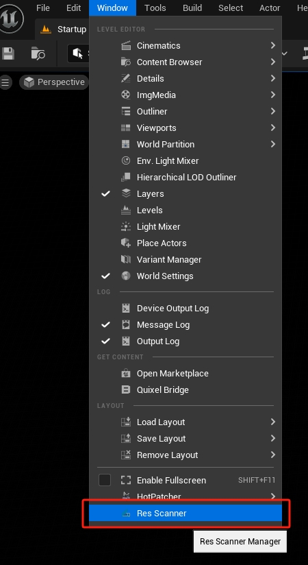

2. 打开ResScanner后,我们可以看到有很多配置项;
   
   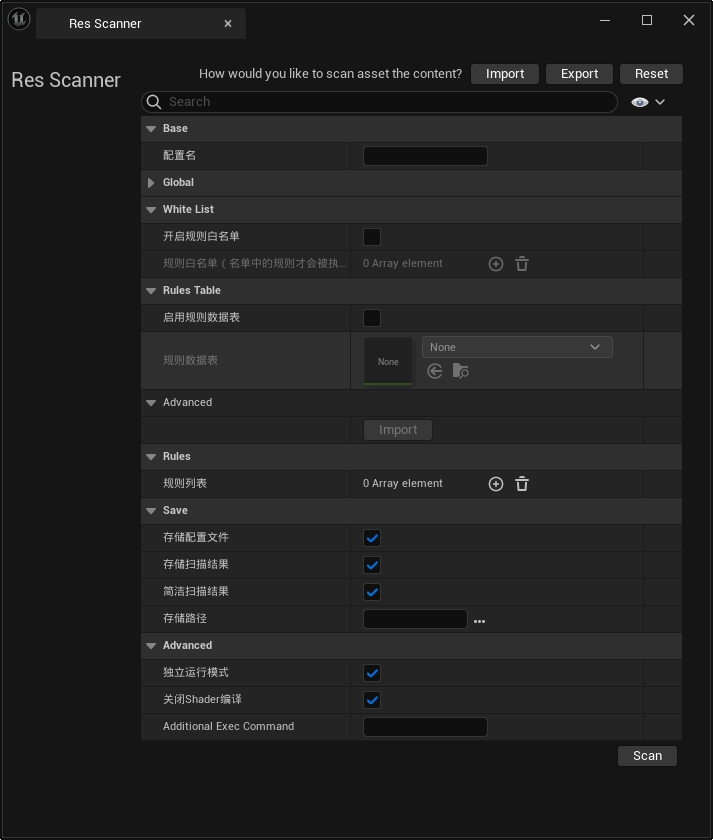

3. 尽管我们可以直接在配置界面一项一项配置规则,但规则一旦很多,再次修改时会比较麻烦,因此最好的实践是创建一个专门用来配置的DataTable;
   
   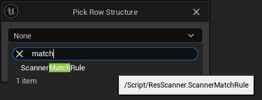

4. DataTable中我们可以对不同类型的资源设置不同的规则,案例中设置的是Texture2D和StaticMesh;
   
   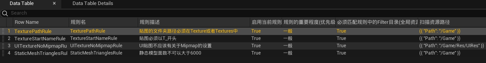

5. 回到ResScanner界面,我们设置配置名,比如"QKResRules";勾选“启用规则数据表”,并且将刚刚创建的DataTable设置给“规则数据表”;
   
   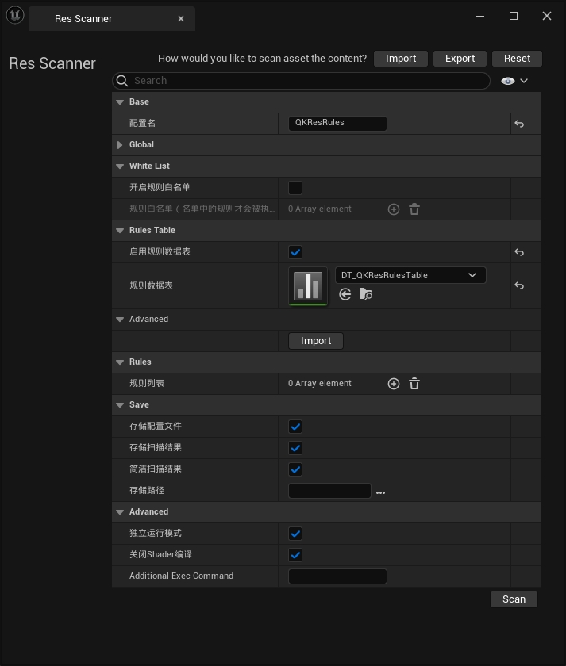

6. 【可选】去掉“独立运行模式”,如果勾选“独立运行模式”那么内部会以一个独立进程来运行检测程序,去掉勾选的话会在编辑器上直接运行并且会将输出结果直接打印在ResScanner界面上;
   
   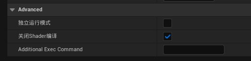

7. 直接点击右下角的 “Scan”, 然后等待扫描结果;
   
   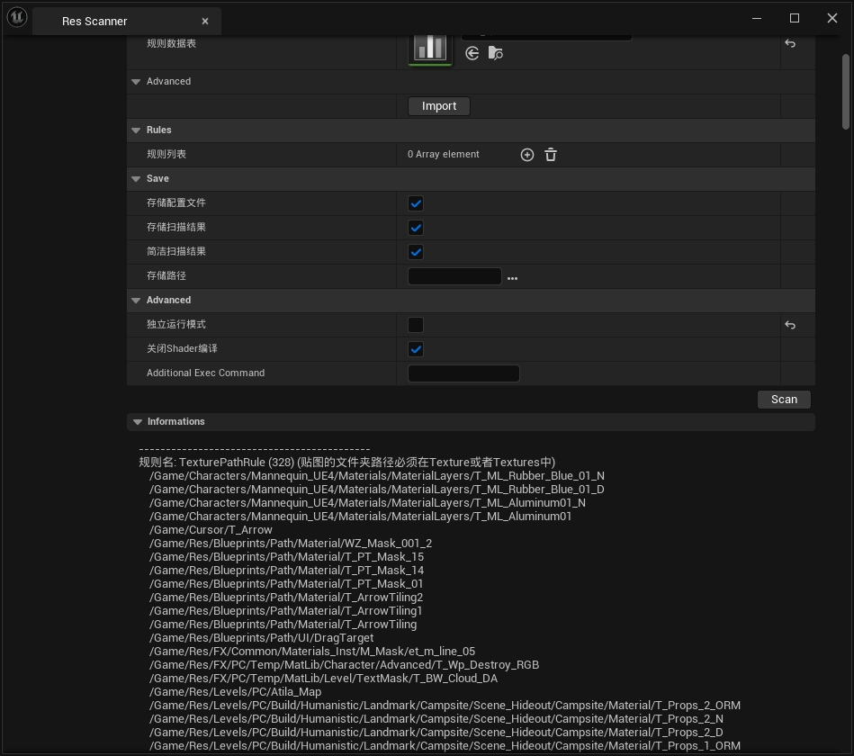


### **案例1: 贴图的文件夹路径必须在Texture或者Textures中**

开发过程中经常出现贴图随意地放在各种文件夹下,因此我们希望贴图只能放在名字为Texture或者Textures的文件夹下(或者其子文件夹下);

我们在DataTable中配置一行如下的数据：

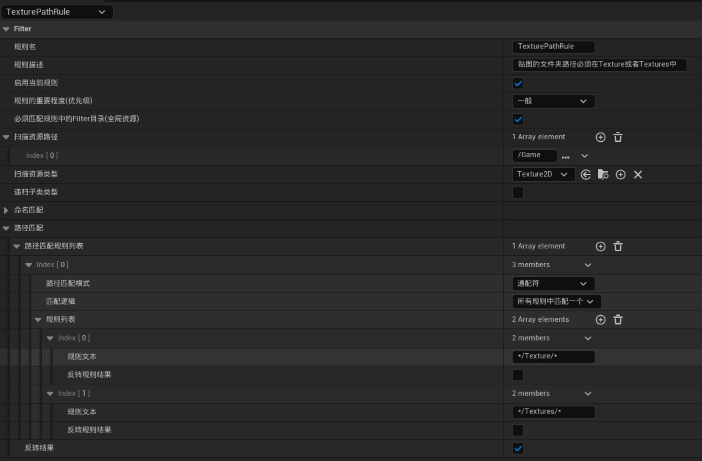

我们看下各个属性分别代表了什么含义：

* **规则名**：唯一的表示该规则;
* **规则描述**：规则的注释;
* **启用当前规则**：该规则是否生效;
* **规则的重要程度(优先级)**：当前无用;
* **必须匹配规则中的Filter目录(全局资源)**：只有在勾选“启用全局资源”的前提下才会生效;如果启用了全局资源,那么所有的全局资源都可能执行本规则的检查(必须符合“扫描资源类型”),而本规则有可能设置了下面的“扫描资源路径”,如果本属性勾选,那么全局的资源在被检查下会检查资源路径是否符合“扫描资源路径”的规则,如果不符合,**即使这些全局资源类型匹配,也不会被检查到**;
* **扫描资源路径**：从哪些文件夹里扫描资源;
* **扫描资源类型**：需要扫描的资源是什么类型,这里指定Texture2D;
* **递归子类类型**：是否“扫描资源类型”的子类型也参与扫描,我们这里指向扫描2D贴图资源,因此不勾选;
* **命名匹配**：案例2会解释;
* **路径匹配**：这个案例主要就是用到路径匹配即文件夹路径匹配;
  * **路径匹配模式**
    * **位于路径中**：判断资源的路径是不是以指定的路径作为开头的,内部使用FString::StartsWith判断;
    * **通配符**：使用通配符判断资源的路径是不是满足条件,常见的通配符有(*?-), 内部使用FString::MatchesWildcard判断;
  * **匹配逻辑**
    * **所有规则必须完全匹配**：逻辑“且”
    * **所有规则匹配一个**：逻辑“或”
  * **规则列表**：这里可以配置多个规则,根据这个案例的需求,我们需要判断贴图资源是否在Texture或者Textures文件夹中,那么就可以配置两个规则,并且“匹配逻辑”使用逻辑“或”;
  * **反转结果**：我们设置的规则是把文件夹是Texture或者Textures的贴图资源列出来,但我们实际的需求是把不符合规则的资源列出来,因此需要勾选“反转结果”即取反操作;
    
    >_使用过程中经常会疑惑是否应该设置反转结果,这里有个技巧是始终记住我们要筛选出不符合规则的资源,而**满足了规则的应该是不理想的资源**,记住这个就能很轻易的知道是否应该反转结果。_

    >_如果在同一个DataTableRow里设置了多个规则（比如即包含了命名匹配,路径匹配,也包含了其他匹配）,那么待扫描的资源会依次接受这些规则的审查,可能会出现命名匹配成功了,但是路径匹配失败了,那么这个待扫描的资源会被认定是合法的,因此要小心设置你的匹配,搞清楚你想的是只要名字匹配成功,就马上认定资源不合理还是希望先通过名字匹配过滤出一些特定资源然后做重要的路径匹配,这里不要搞错！_

通过以上的设置我们就可以把所有不在Texture文件夹或者Textures文件夹的贴图资源打印出来,结果如下：

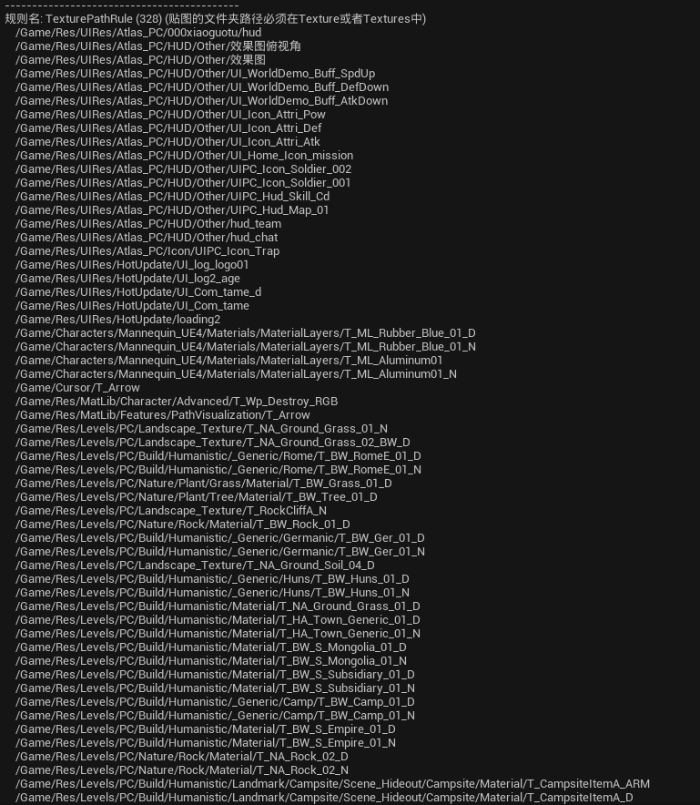

### **案例2：贴图命名必须以T_开头**

有时候新人创建的资源或者从商城里导入的资源不符合命名规范,我们需要把不符合命名规范的资源找出来;

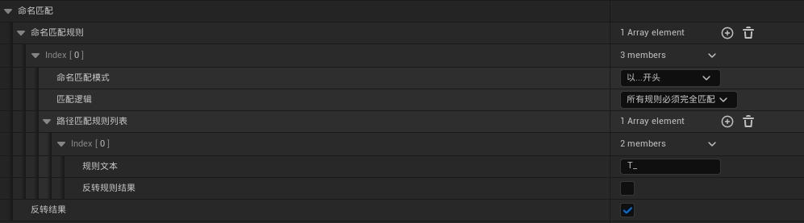

* **命名匹配模式**
  * **以...开头**：内部使用FString::StartsWith匹配;
  * **以...结尾**：内部使用FString::EndsWith匹配;
  * **通配符**：内部使用FString::MatchesWildcard匹配, 常见的通配符有(*?-);

扫描结果如下：

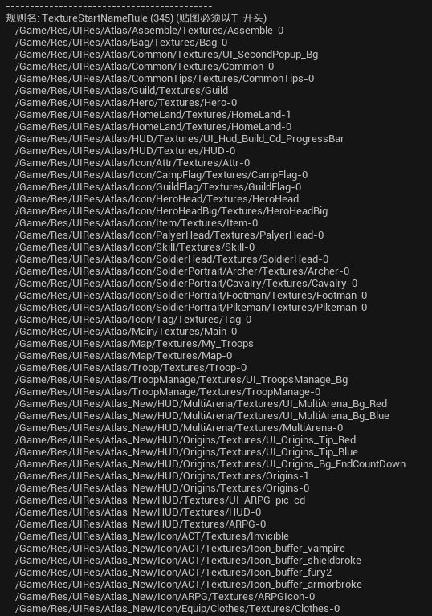

### **案例3：UI贴图不应该有关于Mipmap的设置**

检查某个资源中,是否启用了某个选项,或者检查某个属性的值,是资源合规检查中的重头。同样,对于资源属性检测也可以添加多个规则。

基于反射实现了资源的属性匹配机制,对于任意资源类型,只要有反射标记的属性,都可以通过属性名和检测值来进行匹配,对于值的检测提供了两种模式：Equal和NotEqual;

>_ResScannerUE的一大特点是利用反射系统做了很多方便的功能,比如这里的属性匹配,选择“扫描资源类型”后,属性名可以列出该资源类型所有可用的属性,同样的“值”可以列出所有可用的值,很方便！_

设置如下：

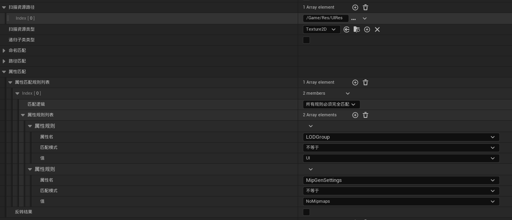

我们这里想过滤出所有LODGroup不是UI并且MipGenSettings设置的不是NoMipmaps的所有贴图资源;

扫描结果如下：

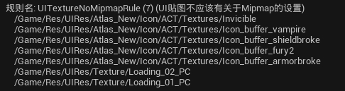

### **案例4：静态模型面数不可以大于6000**

这里我们使用自定义匹配规则,自定义匹配规则可以通过C++或者蓝图通过代码来实现检测逻辑,可以实现高度的定制;

我们创建一个蓝图类,继承自UOperatorBase, 逻辑如下：

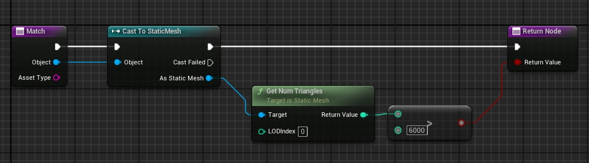

DataTableRow设置如下：

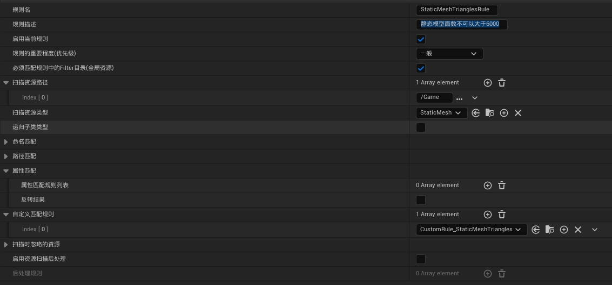

扫描结果如下：

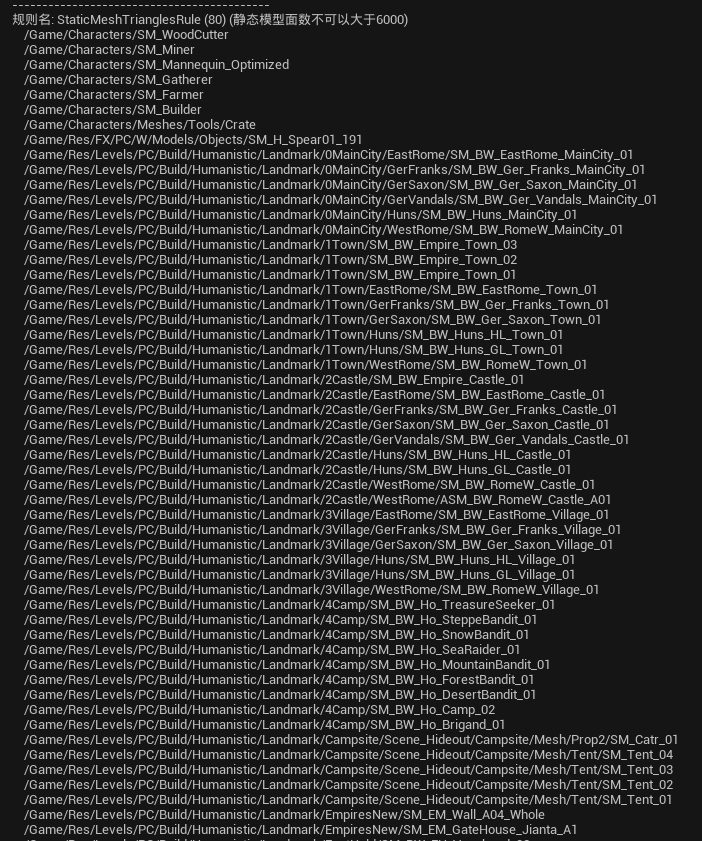

>_如果一些自定义蓝图匹配规则经常被使用,可以考虑转换为C++缩短扫描时间。_

### **其他属性解释**

* **启用全局资源**：启用后,可以在“全局扫描配置”中配置一些文件夹(配置文件夹就表示这些文件夹以及子文件夹下的所有资源)或者资源,这些资源成为GlobalAssets, 这些GlobalAssets会参与所有的规则检查;
* **屏蔽每个规则中配置的资源**：启用后,上面那些规则中指定的“扫描资源路径”将不再生效,即只检查GlobalAssets;
* **全局扫描配置**：配置GlobalAssets;
* **全局忽略扫描配置**：这里面的所有资源不参与扫描以及规则匹配;
* **Git仓库扫描配置**：能够提取Git检查提交版本中的文件进行检测;
* **开启规则白名单**：如果开启的话,“规则白名单”中存储的规则才会被检查,例如我们在DataTable中设置了4项规则, 它们的序号分别是0,1,2,3, 如果“规则白名单”中仅仅存储了3,那么只会检查最后一项规则;
* **规则白名单**：存储的是序号,基于0;
* **规则列表**：可以不依赖规则数据表,在这里直接填写多种规则;
  
  >_如果启用规则数据表的同时还手填了规则列表,那么这些都会被检查,因此不要重复设置相同的规则。_

* **存储配置文件**：当前所有的配置可以保存到json文件中,利用顶端的Import可以直接导入;
* **存储扫描结果**：扫描结果存储到json中,这对于自动化上报来说特别有用;
* **简洁扫描结果**：返回的结果仅仅是可读的字符串,**而不是json格式的内容**;
* **存储路径**：可以自定义存储的文件夹,包括配置文件和扫描结果;
* **AdditionalExecCommand**: 如果是独立运行模式,这里可以添加一些额外参数;

## **原理**

资源收集依赖AssetRegistry模块,属性匹配依赖反射机制,这些代码都可以在UFlibAssetParseHelper中找到;

```C++
// 资源收集：
IAssetRegistry& UFlibAssetParseHelper::GetAssetRegistry(bool bSearchAllAssets)
{
	FAssetRegistryModule& AssetRegistryModule = FModuleManager::LoadModuleChecked<FAssetRegistryModule>(TEXT("AssetRegistry"));
	if(bSearchAllAssets)
	{
		AssetRegistryModule.Get().SearchAllAssets(true);
	}
	return AssetRegistryModule.Get();
}

TArray<FAssetData> UFlibAssetParseHelper::GetAssetsByFilters(const TArray<FTopLevelAssetPath>& AssetTypes,
                                                             const TArray<FString>& FilterPaths, bool bRecursiveClasses)
{
	TArray<FAssetData> result;
	if(FilterPaths.Num())
	{
		FARFilter Filter;
		Filter.PackagePaths.Append(FilterPaths);
		Filter.ClassPaths.Append(AssetTypes);
		Filter.bRecursivePaths = true;
		Filter.bRecursiveClasses = bRecursiveClasses;
		
		UFlibAssetParseHelper::GetAssetRegistry().GetAssets(Filter, result);	
	}

	return result;
}

TArray<FAssetData> UFlibAssetParseHelper::GetAssetsByObjectPath(const TArray<FSoftObjectPath>& SoftObjectPaths)
{
	TArray<FAssetData> result;
	UAssetManager& AssetManager = UAssetManager::Get();
	for(const auto& ObjectPath:SoftObjectPaths)
	{
		FAssetData OutAssetData;
		if (AssetManager.GetAssetDataForPath(ObjectPath, OutAssetData) && OutAssetData.IsValid())
		{
			result.AddUnique(OutAssetData);
		}
	}
	return result;
}

// 属性匹配
FProperty* UFlibAssetParseHelper::GetPropertyByName(UObject* Obj, const FString& PropertyName)
{
	FProperty* Result = nullptr;
	for(TFieldIterator<FProperty> PropertyIter(Obj->GetClass());PropertyIter;++PropertyIter)
	{
		if(PropertyIter->GetName().Equals(PropertyName))
		{
			Result = *PropertyIter;
		}
		// UE_LOG(LogTemp,Log,TEXT("Property Name: %s"),*PropertyIter->GetName());
	}
	return Result;
}

FString UFlibAssetParseHelper::GetPropertyValueByName(UObject* Obj, const FString& PropertyName)
{
	FString Result;
	FProperty* Property = UFlibAssetParseHelper::GetPropertyByName(Obj, PropertyName);
	if(Property)
	{
		Property->ExportTextItem_Direct(Result,Property->ContainerPtrToValuePtr<void*>(Obj),TEXT(""),NULL,0);
	}
	return Result;
}
```

## **其他**

ResScannerUE 提供了Commandlet执行的方法,可以通过指定配置文件的方式启动：

```C++
UE4Editor-cmd.exe PROJECT_NAME.uproject -run=ResScanner -config="res_scanner.json"
```

可以添加 -wait 参数,在执行完毕之后等待输入,可以预览结果。