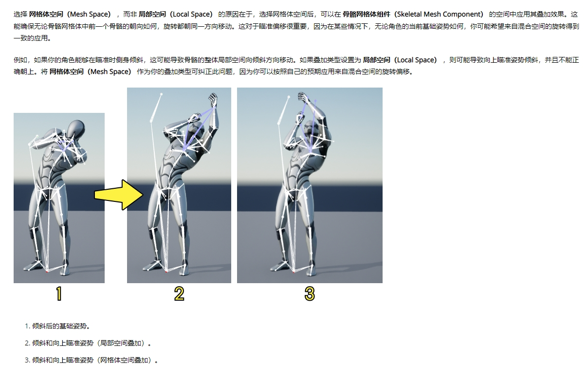

[浅谈MeshSpace和LocalSpace](https://zhuanlan.zhihu.com/p/33234659)有很基础的介绍，重点内容就是：

```C++
/* Create Additive from MeshSpace Rotation Only, Translation still will be LocalSpace. */
AAT_RotationOffsetMeshSpace UMETA(DisplayName="Mesh Space"),
```

可以看到MeshSpace仅仅Rotation需要转换到MeshSpace上，Translation依然在LocalSpace上转换。

很直观比较两者的差别的例子在[瞄准偏移官方文档](https://docs.unrealengine.com/5.0/zh-CN/aim-offset-in-unreal-engine/)中的例子。

