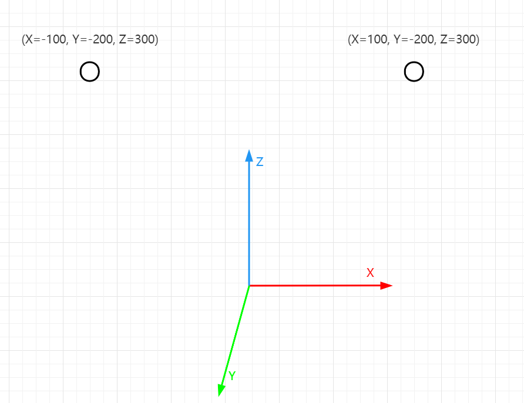

# UE5中的MotionMatching(五) Mirroring Animation

## 前言
Mirroring Animation(动画镜像)在MotionMatching应用中特别重要, 因为可以几乎零成本让动画库直接double, 如果是运行时的Mirroring Animation还不会额外占用内存，所以我们有必要了解Mirroring Animation背后的原理以及UE5是如何在PoseSearch中应用的。在阅读前我建议你先按照[UE5 Mirroring Animation官方文档](https://docs.unrealengine.com/5.0/zh-CN/mirroring-animation-in-unreal-engine/)的教程创建好工程并且运行起来，这样通过调试可以很好地理解细节问题~

我的UE5-Main是在2022.3.21日更新的，而且PoseSearch(UE5对MotionMaching的称呼)本身就处于试验阶段，所以不保证将来是否会有大的改动(其实最近一段时间一直有提交)。

PoseSearch插件路径：UnrealEngine\Engine\Plugins\Experimental\Animation\PoseSearch

如果你对Motion Matching感兴趣，可以看下我的其他文章。

[Motion Matching 中的代码驱动移动和动画驱动移动](https://zhuanlan.zhihu.com/p/432663486)

[《荣耀战魂》中的Motion Matching](https://zhuanlan.zhihu.com/p/401890149)

[《最后生还者2》中的Motion Matching](https://zhuanlan.zhihu.com/p/403923793)

[《Control》中的Motion Matching](https://zhuanlan.zhihu.com/p/405873194)

[游戏开发中的Pose Matching](https://zhuanlan.zhihu.com/p/424382326)

[MotionMatching中的DataNormalization](https://zhuanlan.zhihu.com/p/414438466)

[UE5中的MotionMatching(一) MotionTrajectory](https://zhuanlan.zhihu.com/p/453659782)

[UE5中的MotionMatching(二) 创建可运行的PoseSearch工程](https://zhuanlan.zhihu.com/p/455983339)

[UE5中的MotionMatching(三) PoseMatching](https://zhuanlan.zhihu.com/p/492266731)

[UE5中的MotionMatching(四) MotionMatching](https://zhuanlan.zhihu.com/p/507268359)

## Mirroring Animation原理
如果你没有接触过Mirroring Animation，你咋一听可能会觉得原理会很简单，位置和旋转直接镜像不得了嘛，比如下面这样:


你可能已经看不来哪里不对劲了，上面一个是左手坐标系的位置，另一个是右手坐标系的位置，Mirroring Animation可不能这么干 :)

简单来说，Mirroring Animation大致分为三个步骤:

1. 骨骼Transform从LocalSpace转换成ComponentSpace

2. MirrorTransform, 不过Scale特别简单，直接使用Source的Scale即可，重点是MirrorVector和MirrorQuat

3. 将Mirrored的Transform从ComponentSpace转换回LocalSpace  

其中第一和第三步特别简单，我们重点看下Vector和Quat是如何完成Mirror操作的。
### MirrorAxis/MirrorPlane
进行Mirror前，我们需要知道要通过哪个镜像平面进行镜像操作，比如下图:


上图表示我们需要通过X轴或者说YZ平面进行镜像操作

### Vector
从下图可以看到，MirrorVector相当简单，如果是按照X轴镜像，那么直接将X的位置取反即可



代码如下:
```C++
FVector FAnimationRuntime::MirrorVector(const FVector& V, EAxis::Type MirrorAxis)
{
	FVector MirrorV(V);

	switch (MirrorAxis)
	{
	case EAxis::X:
		MirrorV.X = -MirrorV.X;
		break;
	case EAxis::Y:
		MirrorV.Y = -MirrorV.Y;
		break;
	case EAxis::Z:
		MirrorV.Z = -MirrorV.Z;
		break;
	}

	return MirrorV;
}
```
### Quat
MirrorQuat应该算是最难理解的了，一方面Quat本身理解比较困难，另一方面还涉及到绑定骨骼的因素，两者揉到一块导致理解起来特别费劲，我们逐一解释下

我们先抛开绑定骨骼的干扰，仅仅讨论Quat在空间内的镜像，比如有一个旋转$Q_1$, 通过X轴镜像，得到$Q_2$, 他们的关系是如何呢？我们知道Quat中数据的含义为:
  
$Q_1 = [V *sin\frac{\theta}{2}, cos\frac{\theta}{2}]$

镜像时，向量$V$需要进行镜像，$\theta$需要取反，为什么呢？可以站在镜子前旋转一笔，看下镜子里笔的指向和旋转方向就明白了。我们可以得出$Q_2$:

$Q_2 = [MirrorVector(V)*sin\frac{-\theta}{2}, cos\frac{-\theta}{2}]$

整理可得：

$Q_2 = [-MirrorVector(Q_1.XYZ), Q_1.W]$

代码如下:
```C++
FQuat FAnimationRuntime::MirrorQuat(const FQuat& Q, EAxis::Type MirrorAxis)
{
	FQuat MirrorQ(Q);

	// Given an axis V and an angle A, the corresponding unmirrored quaternion Q = { Q.XYZ, Q.W } is:
	//
	//		Q = { V * sin(A/2), cos(A/2) }
	//
	//  mirror both the axis of rotation and the angle of rotation around that axis.
	// Therefore, the mirrored quaternion Q' for the axis V and angle A is:
	//
	//		Q' = { MirrorVector(V) * sin(-A/2), cos(-A/2) }
	//		Q' = { -MirrorVector(V) * sin(A/2), cos(A/2) }
	//		Q' = { -MirrorVector(V * sin(A/2)), cos(A/2) }
	//		Q' = { -MirrorVector(Q.XYZ), Q.W }
	//
	switch (MirrorAxis)
	{
	case EAxis::X:
		MirrorQ.Y = -MirrorQ.Y;
		MirrorQ.Z = -MirrorQ.Z;
		break;
	case EAxis::Y:
		MirrorQ.X = -MirrorQ.X;
		MirrorQ.Z = -MirrorQ.Z;
		break;
	case EAxis::Z:
		MirrorQ.X = -MirrorQ.X;
		MirrorQ.Y = -MirrorQ.Y;
		break;
	}

	return MirrorQ;
}
```

我们可以看下镜像前后的效果:


可以看到我们按照X轴镜像的话，除了X轴没有镜像外，其他两个轴都镜像了，利用这个现象我们也可以使用下面这种方式:

```C++
FVector Y = MirrorVector(Q1.GetAxisY());
FVector Z = MirrorVector(Q1.GetAxisZ());
FMatrix R2 = FRotationMatrix::MakeFromYZ(Y, Z);
Transform.SetRotation(FQuat(R2));
```

MirrorQuat我们已经实现完毕了，我们有以下场景：存在两个Transform以及子物体左右脚，这两个Transform模拟的是角色绑定时的左右脚骨骼的Transform, 我们有右脚的动画，需要镜像生成左脚动画


刚开始，我们可能会想直接拿到右脚的Quat调用MirrorQuat后赋值给左脚不就可以了吗，我们看下按照这个方法表现会是怎样的？(**演示工程是按照Y轴镜像生成的**)

{视频：直接调用MirrorQuat的结果}

可以看到左脚的动画明显错误了，为什么会这样呢？可以看到右脚在绑定时脚尖的方向是X轴和Z轴的中间位置，而左脚在绑定时脚尖的方向是Y轴的方向，如果不考虑绑定数据而简单地MirrorQuat的话就会出现骨骼朝向错误，顶点扭曲的问题

我们首先需要想一个问题，当左脚绑定是什么样子的时候，我们可以直接拿MirrorQuat后的结果直接用呢？我们试试改下左脚绑定时的Transform, 把左脚绑定的Quat改成MirrorQuat(RightFootBindQuat)试试，即:


然后还是按照上面的办法，每帧把右脚的Quat传入MirrorQuat做处理，把结果直接付给左脚，效果如下：

{视频：调整左脚绑定骨骼Transform后的效果}

哇，完全正确，只要我们要求美术同学绑定骨骼时完全按照这个规则就行了，收工！！！等等，貌似不太行，因为这里的Quat是ComponentSpace的，美术同学不可能每次都换算成ComponentSpace再Mirror，而且绑定时首要考虑的是Key动画方便，为了程序计算方便而让美术同学做出这么大的妥协是不现实也是绝不可能的！

所以我们必须接受一个现实：**左右脚绑定时的Transform没有任何联系**，完全是美术同学怎么方便怎么来。

我们可以利用上面得到的结论进一步思考下，我们定义绑定时右脚的绑定Quat为$Q(RBind)$, 调用MirrorQuat后的为$Q(MirroredRBind)$, 左脚的绑定Quat为$Q(LBind)$, 当右脚每帧播放动画时右脚的当前Quat为$Q(RCurrent)$, $Q(RCurrent)$镜像后的结果为$Q(MirroredRCurrent)$, 我们需要求$Q(LCurrent)$, 我们思考下$Q(MirroredRBind)$, $Q(MirroredRCurrent)$, $Q(LBind)$, $Q(LCurrent)$有什么联系？ 我们知道$Q(MirroredRBind)$转换为$Q(MirroredRCurrent)$经历了一个中间的$Q(Delta)$, 这个$Q(Delta)$通过一个旋转轴$V$以及一个旋转角$\theta$完成了旋转，如果$Q(LBind)$也应用这个$Q(Delta)$会发生什么？它也进行了正确的旋转！我们找到了他们的关系

$Q(LCurrent) = Q(MirroredRCurrent)*Q(MirroredRBind).Inverse()*Q(LBind)$

代码如下:

```C++
FQuat Q = SourceTransform.GetRotation();
Q = SourceParentRefRotation * Q;
Q = MirrorQuat(Q, MirrorAxis);
Q *= MirrorQuat(SourceBoneRefRotation, MirrorAxis).Inverse() * TargetBoneRefRotation;
Q = TargetParentRefRotation.Inverse() * Q;
```

效果如下:

{视频: 正确MirroringAnimation的结果}

完美:)

## UE5中的常规使用
[UE5 Mirroring Animation官方文档](https://docs.unrealengine.com/5.0/zh-CN/mirroring-animation-in-unreal-engine/)已经有例子说明了如何使用，我们下面主要讲下内部的实现细节

### MirrorDataTable


### AnimNode_Mirror

## PoseSearch中的应用

### PoseSearchDatabase

### AnimNode_MotionMatching

## Bonus
* 四元数的资料

* 在[Motion Matching 中的代码驱动移动和动画驱动移动](https://zhuanlan.zhihu.com/p/432663486)中，Daniel Holden同样也提供了Mirror的功能，不过并不是运行时的Mirroring Animation，而是在离线生成Mirroring Animation，[生成脚本在这里](https://github.com/orangeduck/Motion-Matching/blob/main/resources/generate_database.py)

* 顽皮狗在[《最后生还者2》中的Motion Matching](https://zhuanlan.zhihu.com/p/403923793)中明确提到，虽然优点很突出，比如不占用内存就可以轻松动画库double, 但他们的主角很少使用Mirroring Animation，因为需要对称的Idle Pose，而且运动需要完美地对称; 而四足动画因为动捕本身就比较困难，所以使用Mirroring Animation能够弥补这一不足

## 下一步计划
* FootLock(Foot Placement)

* BlendSpace的使用

* DynamicPlayRateSettings

* Debug工具

* 数据的标准化处理

* 确认Search函数中Group的Match是否存在bug

* 应用篇


如果文章有错误，记得联系我~