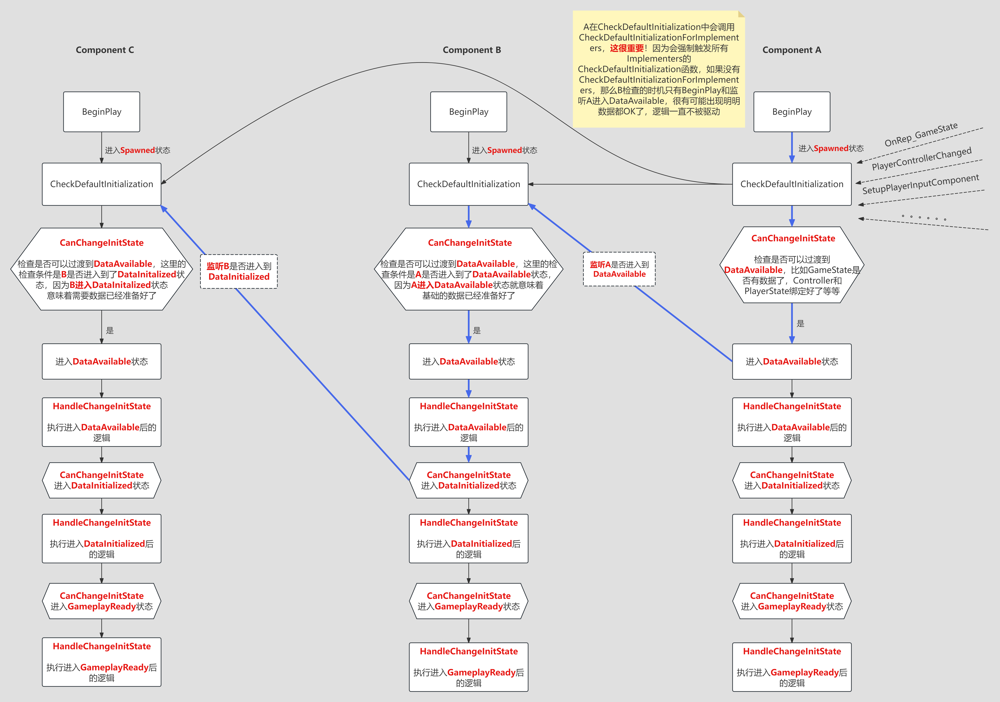

# UE5中的ModularGameplay插件

## 是什么

ModularGameplay中的Gameplay说明该插件是为游戏玩法设计的，Modular是希望玩法可以模块化设计，像乐高一样通过一些模块的组合实现不同玩法。ModularGameplay为模块化玩法提供了底层的支持。

## 解决什么问题

* 为玩法的模块化提供支持，其实UE5很多新功能都是为了实现玩法的模块化，包括GameFeatures, Lyra中的Experience，ModularGameplayActors等等，ModularGameplay只是其中重要的一环。为什么需要玩法模块化呢？原因其实跟为什么需要GameFeatures一样的，再追溯就是《Fortnite》为什么需要GameFeatures, 我们知道《Fortnite》是一个规模极其庞大的游戏，随着赛季更新和活动内容的迭代，一些类变得极其臃肿，常见的就是Controller和Character类，GameFeatures就是希望将不同的功能模块化，拆到不同的GameFeatures，根据不同的玩法动态开启或者关闭；当功能拆分的很细时，带来的好处是代码阅读性强，好维护，与其维护一个上百个函数和变量的类，按照功能拆分后的代码更容易维护；避免不相关的功能之间意外交互或依赖，在开发那些需要经常改动功能的已上线产品时，这尤为重要。

  >_必须强调的是，ModularGameplay只是模块化玩法中的一环，必须与GameFeatures, Experience等配合使用。_

* Components初始化时序问题，最经典的例子就是客户端同步创建Character初始化的问题，要知道Character身上的Components调用BeginPlay时PlayerState以及其他Components并不一定准备好了，Components在调用BeginPlay时可能Controller中的PlayerState为空，或者PlayerState的Owner还没设置为Controller等等，这跟Actors属性同步的机制有关。有一种做法是在Tick中一直轮询是否数据已经准备好了，还有一种做法是所有相关的地方都去check，比如OnRep_PlayerState时check。UGameFrameworkComponentManager提供的方案跟第二种方案类似，但框架更清晰，代码做了很好的解耦，Components在处理时只关注States和Conditions，不用去绑定很多回调去check，而且对于GameFeatures动态添加的Components也适用。

  

## 怎么用

### ModularGameplay

我们以GameFeatures为例，当GameFeatures启用时会执行配置的Actions, 其中最常用的Actions是AddComponents:


ActorClass配置了一个Class信息ClassInfoA，AddComponents主要做了两件事情：

1. 查询当前World的所有Actors, 如果Actor的类型是ClassInfoA或者祖先类是ClassInfoA, 并且Actor既要符合Client/Server的过滤条件又要保证Actors初始化完成了(IsActorInitialized)，那么会给这个Actor添加上指定的Components；
2. 后续动态创建的Actors或者通过StreamingLevel加载进来的Actors**默认不会执行检查**，即不会自动添加Components, 除非手动调用AddGameFrameworkComponentReceiver，这个函数会强制check是否这个Actor是否应该添加Components。

   >_后面提到的ModularGameplayActors会自动调用AddGameFrameworkComponentReceiver_

以上图为例，当该GameFeature启用时，不管客户端还是服务器都会给GameStateBase添加B_EliminationFeedRelay组件；如果是LyraGameState时，只会在客户端的LyraGameState上添加用于客户端辅助瞄准的B_AimAssistTargetManager组件。

当然UE5还自带了另外一些好用的GameFeatureActions, 比如AddCheats, AddWPContent等等，另外也可以写一些自定义的GameFeatureActions，比如Lyra中的AddWidget，AddAbilities等。

当该GameFeature不再激活时，会将本GameFeature动态添加的所有组件移除掉。

### Initialization States

我们以上面的客户端Character初始化举例，Character有三个组件A，B，C, B在初始化时依赖PlayerController和GameState数据，B拿到这些数据后会初始化自身的一些数据，C的初始化依赖于B的数据，而且Character需要一个时机就是所有的Components都初始化完成了，Character给这个时机命名为CharacterReady, 这个时机可以执行很多Gameplay相关的逻辑，根据之前的分析Character::BeginPlay显然不满足。使用Initialization States的步骤[官方文档](https://dev.epicgames.com/documentation/zh-cn/unreal-engine/game-framework-component-manager-in-unreal-engine)已经写的很细了，我再写只不过也是重复一遍，不过流程图可以画一下：



## 代码原理

### ModularGameplayActors

**所有希望能够有动态响应GameFeatureAction能力(比如AddComponents, AddAbilities等等)的Actors都应该继承ModularGameplayActors。**

以常见的PlayerController和Character为例，开发者肯定希望能够动态地给PlayerController和Character添加各种组件或者Abilities，那么在类定义时应该：

```C++
class LYRAGAME_API ALyraCharacter : public AModularCharacter, ...
{}

class COMMONGAME_API ACommonPlayerController : public AModularPlayerController
{}
```

一旦继承了ModularGameplayActors中的Actors,无论任何时机(Actors没有创建，Actors已经执行过BeginPlay, Actors正在初始化等等)都可以动态地给这些Actors执行各种GameFeatureActions。

ModularGameplayActors提供了AModularController, AModularCharacter, AModularGameModeBase, AModularGameState, AModularPawn, AModularPlayerController和AModularPlayerState，虽然ModularGameplayActors目前没有纳入到引擎代码中去，但如果想要使用ModularGameplay功能，ModularGameplayActors几乎是必需的。

ModularGameplayActors中的Actors是如何实现的呢？我们以AModularCharacter举例：

```C++
void AModularCharacter::PreInitializeComponents()
{
	Super::PreInitializeComponents();

	UGameFrameworkComponentManager::AddGameFrameworkComponentReceiver(this);
}

void AModularCharacter::BeginPlay()
{
	UGameFrameworkComponentManager::SendGameFrameworkComponentExtensionEvent(this, UGameFrameworkComponentManager::NAME_GameActorReady);

	Super::BeginPlay();
}

void AModularCharacter::EndPlay(const EEndPlayReason::Type EndPlayReason)
{
	UGameFrameworkComponentManager::RemoveGameFrameworkComponentReceiver(this);

	Super::EndPlay(EndPlayReason);
}
```

AddGameFrameworkComponentReceiver，SendGameFrameworkComponentExtensionEvent以及RemoveGameFrameworkComponentReceiver的作用是什么呢？我们得先看下UGameFrameworkComponentManager都负责了什么。

### UGameFrameworkComponentManager

ModularGameplay要处理的一个核心问题是：**GameFeatureAction执行的时候目标类型的Actors还没有生成呢该怎么办？目标类型的Actors正在初始化怎么办？目标类型的Actors已经生成并执行过BeginPlay该怎么办？**，要知道可以在任何时机主动去启用GameFeatures,UGameFrameworkComponentManager做的主要工作就是不管在什么时机执行GameFeatureActions，都保证能够运行正常。


UGameFrameworkComponentManager并不是一个设计很好的Subsystem, 它内部又可以拆分为三个不同的功能块，我们来看下这三个不同的功能块都处理了哪些问题。

#### AddComponents

作用：**为目标类型的Actors添加Components**

讲解这个功能需要搭配GameFeatureAction_AddComponents一起看，GameFeatureAction_AddComponents中的核心代码在于：

```C++
Handles.ComponentRequestHandles.Add(GFCM->AddComponentRequest(Entry.ActorClass, ComponentClass));
```

AddComponentRequest函数是专门用于申请创建Components的函数，它主要做了两件事情：

1. 注册信息，注册信息存储在ReceiverClassToComponentClassMap中，内容为哪个UClass应该添加什么Components

2. 在当前World中查找该Class的所有Actors, 如果**IsActorInitialized**为true那么立即创建对应的Components

AddComponentRequest能给所有已经初始化完成的Actors添加好Components，那么对于未来要创建的Actors, 是如何保证会给他们添加上Components呢？这就要回到上面ModularGameplayActors中提到的AddGameFrameworkComponentReceiver调用了，AddGameFrameworkComponentReceiver这个函数做的一个工作是查询ReceiverClassToComponentClassMap，如果里面有注册自己类的信息，那么会创建对应的Components，通过AddComponentRequest和AddGameFrameworkComponentReceiver，可以做到任何时机创建的Actors都可以正确的创建对应的Components。


这是上面为什么强调希望能够有动态响应GameFeatureAction能力(比如AddComponents, AddAbilities等等)的Actors都应该继承ModularGameplayActors。

RemoveGameFrameworkComponentReceiver就是移除Components，这里的处理就很简单了，不再多做解释。

#### ExtensionHandlerSystem

相对于其他GameFeatureActions, AddComponents逻辑特别简单，它几乎不用依赖其他的业务逻辑或者游戏状态，只要Actors初始化好了直接RegisterComponent等等，大部分的GameFeatureActions不一样，它需要一个合理的时机，不是说BeginPlay后就可以执行了，比如AddInputBinding, AddInputBinding执行的条件是InputComponent已经初始化好了，而InputComponent又依赖于PlayerState的PawnData, 因此有时候需要开发者自己定义一些Event通知GameFeatureAction现在可以执行逻辑了，而ExtensionHandlerSystem就提供了Event中转功能。

我们继续以AddInputBinding为例，当执行到GameFeatureAction_AddInputBinding时，核心调用如下：

```C++
UGameFrameworkComponentManager::FExtensionHandlerDelegate AddAbilitiesDelegate =
				UGameFrameworkComponentManager::FExtensionHandlerDelegate::CreateUObject(this, &ThisClass::HandlePawnExtension, ChangeContext);
TSharedPtr<FComponentRequestHandle> ExtensionRequestHandle =
	ComponentManager->AddExtensionHandler(APawn::StaticClass(), AddAbilitiesDelegate);
```

AddExtensionHandler内部逻辑查找当前World中的所有Pawns, 这些Pawns无非两种状态: 已经初始化完毕(IsActorInitialized返回true)或者没有(正在初始化)，跟上面AddComponents面对的问题一样，处理方式也一样，AddExtensionHandler做了两件事情：

1. 注册信息，注册信息存储在ReceiverClassToEventMap中，内容为哪个UClass应该调用哪些回调函数

2. 对于已经初始化完毕的所有Pawns，向其GameFeatureAction_AddInputBinding实例发送NAME_ExtensionAdded

我们之前说过的AddGameFrameworkComponentReceiver函数其实还有一个工作就是查找ReceiverClassToEventMap然后发送NAME_ReceiverAdded。

GameFeatureAction收到Event时需要自行处理逻辑，比如添加Abilities，添加UI, 修改配置等等。

ExtensionHandlerSystem本质上处理的还是时机问题：**GameFeatureAction执行时已经有Actors初始化完成了怎么办？后面新生成的Actors Ready了怎么办？**

如果NAME_ExtensionAdded和NAME_ReceiverAdded都不能满足所需，可以自定义一些Event比如NAME_BindInputsNow来满足特殊的需求，NAME_ExtensionAdded仅仅意味着调用这个Action时刚好有些Actors初始化完毕了而已，这些信息并不代表你接下来要执行的逻辑一定能成功。

```C++
void UGameFeatureAction_AddInputBinding::HandlePawnExtension(AActor* Actor, FName EventName, FGameFeatureStateChangeContext ChangeContext)
{
	APawn* AsPawn = CastChecked<APawn>(Actor);
	FPerContextData& ActiveData = ContextData.FindOrAdd(ChangeContext);

	if ((EventName == UGameFrameworkComponentManager::NAME_ExtensionRemoved) || (EventName == UGameFrameworkComponentManager::NAME_ReceiverRemoved))
	{
		RemoveInputMapping(AsPawn, ActiveData);
	}
	else if ((EventName == UGameFrameworkComponentManager::NAME_ExtensionAdded) || (EventName == ULyraHeroComponent::NAME_BindInputsNow))
	{
		AddInputMappingForPlayer(AsPawn, ActiveData);
	}
}
```

因此在AddInputMappingForPlayer内部逻辑一定要判断IsReadyToBindInputs，有可能出现NAME_ExtensionAdded而AddInputMappingForPlayer调用失败的情况，因此有必要添加一个自定义时间NAME_BindInputsNow表示Input相关的初始化设置已经Ready了，现在可以执行GameFeatureAction_AddInputBinding的修改了。

>_HandlePawnExtension在处理逻辑代码时响应函数要满足两点：判断是否已经调用过，如果调用过则return,比如UGameFeatureAction_AddAbilities::AddActorAbilities中的ActiveData.ActiveExtensions.Find判断；还有就是调用时不一定会成功，要做好很细的判断比如通过NAME_ExtensionAdded进入逻辑但是IsReadyToBindInputs返回false_

#### Initialization States

### Lyra

#### LyraPawnExtensionComponent

PawnExtendionComponent不适合什么回调都往里放，不仅仅越来越臃肿，而且回调发生后会通知所有实现者都check, 一些完全不在乎这个数据的实现者也不得不check,PawnExtensionComponent适合一些基础数据的check,比如PlayerController和PlayerState

#### LyraHeroComponent


## 总结

简短的核心总结

### 是什么

### 解决了什么问题

即使不使用GameFeature，InitStates也可以单独使用。

### 怎么用

### 代码细节

## 参考资料

[官方文档：GameFeaturess and ModularGameplay](https://dev.epicgames.com/documentation/zh-cn/unreal-engine/game-features-and-modular-gameplay-in-unreal-engine)

[官方文档：GameFrameworkComponentManager](https://dev.epicgames.com/documentation/zh-cn/unreal-engine/game-framework-component-manager-in-unreal-engine)

[《InsideUE5》GameFeaturess架构（一）发展由来](https://zhuanlan.zhihu.com/p/467236675)