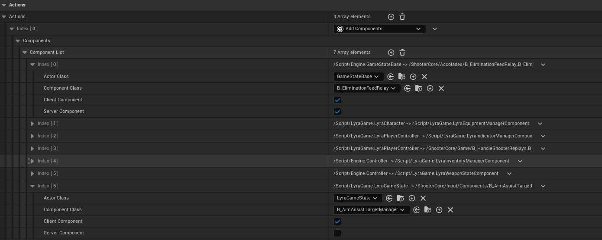

# UE5中的ModularGameplay插件

## 是什么

ModularGameplay中的Gameplay说明该插件是为游戏玩法设计的，Modular是希望玩法可以模块化设计，像乐高一样通过一些模块的组合实现不同玩法。ModularGameplay为模块化玩法提供了底层的支持。

## 解决什么问题

* 为玩法的模块化提供支持，其实UE5很多新功能都是为了实现玩法的模块化，包括GameFeatures, Lyra中的Experience，ModularGameplayActors等等，ModularGameplay只是其中重要的一环。为什么需要玩法模块化呢？原因其实跟为什么需要GameFeatures一样的，再追溯就是《Fortnite》为什么需要GameFeatures, 我们知道《Fortnite》是一个规模极其庞大的游戏，随着赛季更新和活动内容的迭代，一些类变得极其臃肿，常见的就是Controller和Character类，GameFeatures就是希望将不同的功能模块化，拆到不同的GameFeatures，根据不同的玩法动态开启或者关闭；当功能拆分的很细时，带来的好处是代码阅读性强，好维护，与其维护一个上百个函数和变量的类，按照功能拆分后的代码更容易维护；避免不相关的功能之间意外交互或依赖，在开发那些需要经常改动功能的已上线产品时，这尤为重要。

  >_必须强调的是，ModularGameplay只是模块化玩法中的一环，必须与GameFeatures, Experience等配合使用。_

* Components初始化时序问题，最经典的例子就是客户端同步创建Character初始化的问题，要知道Character身上的Components调用BeginPlay时PlayerState以及其他Components并不一定准备好了，Components在调用BeginPlay时可能Controller中的PlayerState为空，或者PlayerState的Owner还没设置为Controller等等，这跟Actors属性同步的机制有关。有一种做法是在Tick中一直轮询是否数据已经准备好了，还有一种做法是所有相关的地方都去check，比如OnRep_PlayerState时check。UGameFrameworkComponentManager提供的方案跟第二种方案类似，但框架更清晰，代码做了很好的解耦，Components在处理时只关注States和Conditions，不用去绑定很多回调去check，而且对于GameFeatures动态添加的Components也适用。

  

## 怎么用

### ModularGameplay

我们以GameFeatures为例，当GameFeatures启用时会执行配置的Actions, 其中最常用的Actions是AddComponents:

ActorClass配置了一个Class信息ClassInfoA，AddComponents主要做了两件事情：

1. 查询当前World的所有Actors, 如果Actor的类型是ClassInfoA或者祖先类是ClassInfoA, 并且Actor既要符合Client/Server的过滤条件又要保证Actors初始化完成了(IsActorInitialized)，那么会给这个Actor添加上指定的Components；
2. 后续动态创建的Actors或者通过StreamingLevel加载进来的Actors**默认不会执行检查**，即不会自动添加Components, 除非手动调用AddGameFrameworkComponentReceiver，这个函数会强制check是否这个Actor是否应该添加Components。

   >_后面提到的ModularGameplayActors会自动调用AddGameFrameworkComponentReceiver_

以上图为例，当该GameFeature启用时，不管客户端还是服务器都会给GameStateBase添加B_EliminationFeedRelay组件；如果是LyraGameState时，只会在客户端的LyraGameState上添加用于客户端辅助瞄准的B_AimAssistTargetManager组件。

当然UE5还自带了另外一些好用的GameFeatureActions, 比如AddCheats, AddWPContent等等，另外也可以写一些自定义的GameFeatureActions，比如Lyra中的AddWidget，AddAbilities等。

当该GameFeature不再激活时，会将本GameFeature动态添加的所有组件移除掉。

### Initialization States

我们以上面的客户端Character初始化举例，Character有三个组件A，B，C, B在初始化时依赖PlayerController和GameState数据，B拿到这些数据后会初始化自身的一些数据，C的初始化依赖于B的数据，而且Character需要一个时机就是所有的Components都初始化完成了，Character给这个时机命名为CharacterReady, 这个时机可以执行很多Gameplay相关的逻辑，根据之前的分析Character::BeginPlay显然不满足。使用Initialization States的步骤[官方文档](https://dev.epicgames.com/documentation/zh-cn/unreal-engine/game-framework-component-manager-in-unreal-engine)已经写的很细了，我再写只不过也是重复一遍，不过流程图可以画一下：

## 代码原理

### ModularGameplayActors

### UGameFrameworkComponentManager

#### AddComponents

#### Initialization States

### ExtensionHandlerSystem
不适合放在Manager里面

### Lyra

#### LyraPawnExtensionComponent

#### LyraHeroComponent

## 总结

简短的核心总结

### 是什么

### 解决了什么问题

即使不使用GameFeature，InitStates也可以单独使用。

### 怎么用

PawnExtendionComponent不适合什么回调都往里放，不仅仅越来越臃肿，而且回调发生后会通知所有实现者都check, 一些完全不在乎这个数据的实现者也不得不check,PawnExtensionComponent适合一些基础数据的check,比如PlayerController和PlayerState

### 代码细节

## 参考资料

[官方文档：GameFeaturess and ModularGameplay](https://dev.epicgames.com/documentation/zh-cn/unreal-engine/game-features-and-modular-gameplay-in-unreal-engine)

[官方文档：GameFrameworkComponentManager](https://dev.epicgames.com/documentation/zh-cn/unreal-engine/game-framework-component-manager-in-unreal-engine)

[《InsideUE5》GameFeaturess架构（一）发展由来](https://zhuanlan.zhihu.com/p/467236675)