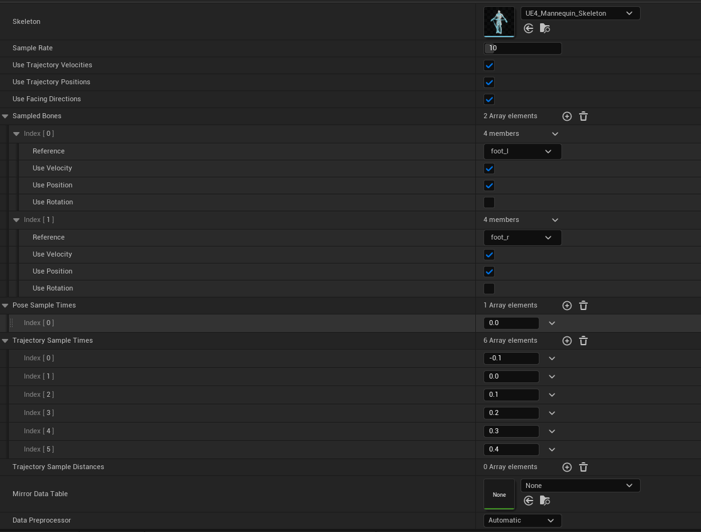
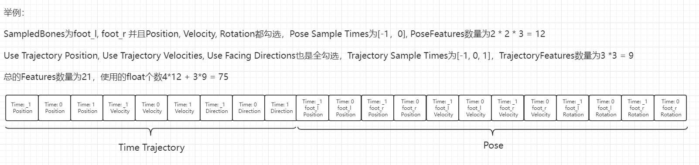
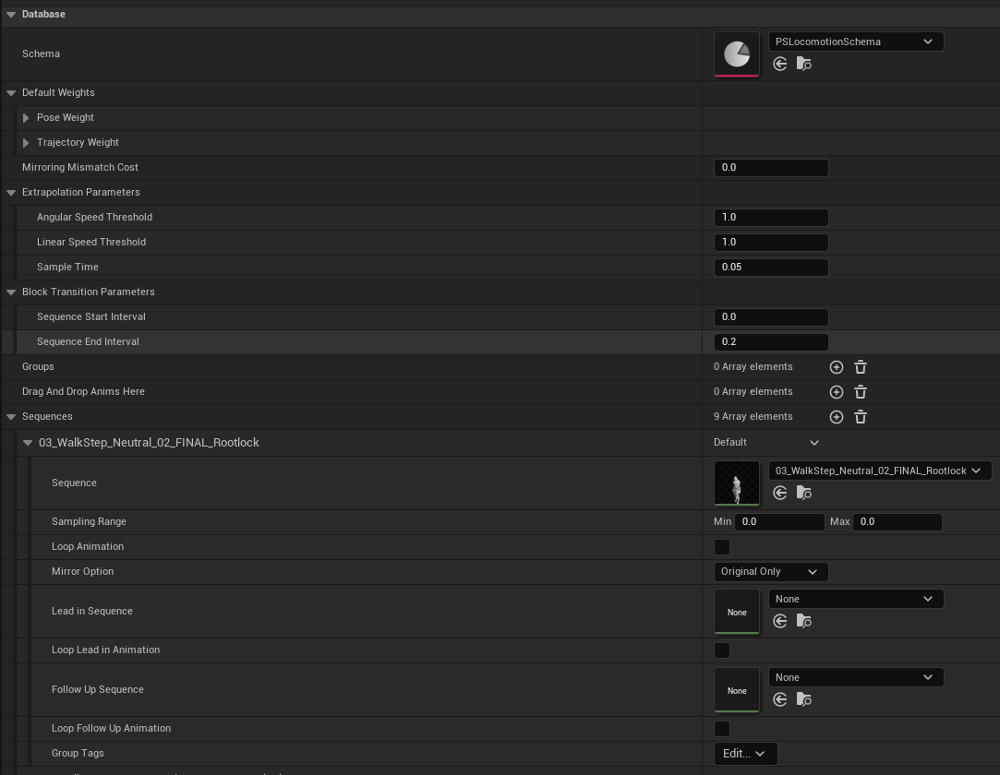
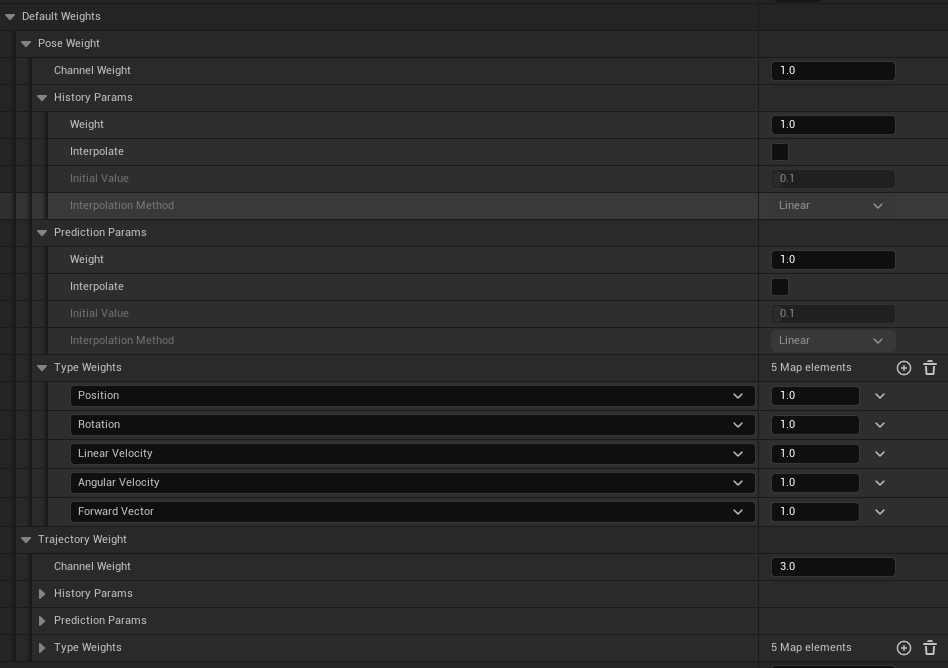
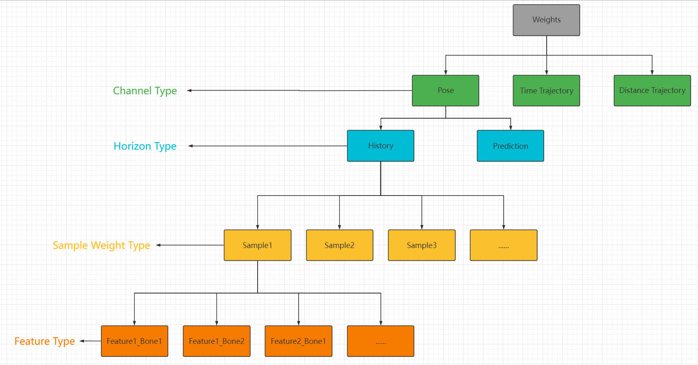
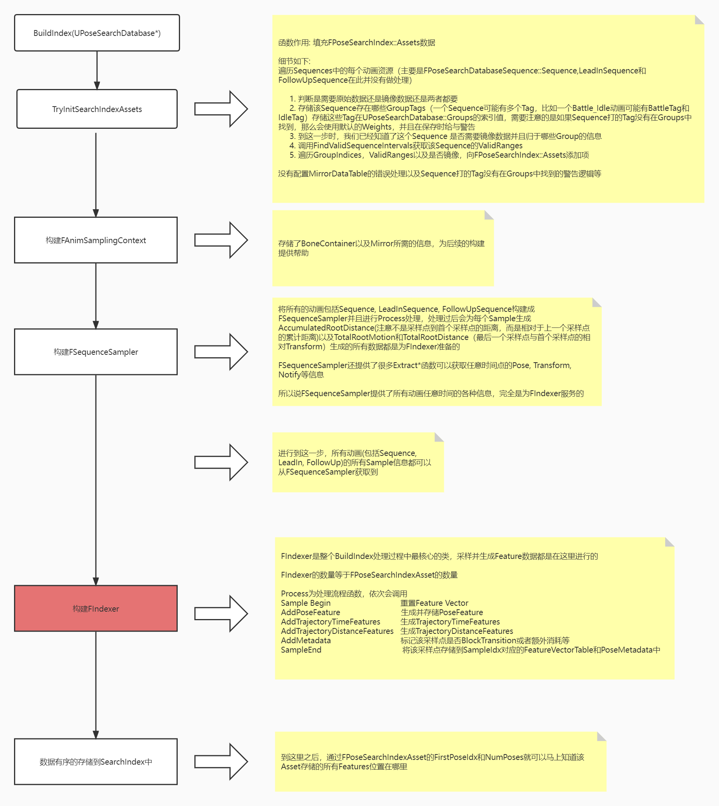
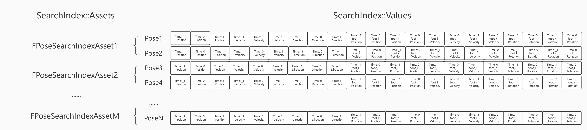

UE5中MotionMatching(四) MotionMatching

## 前言
终于要写到最核心的MotionMatching了！我会尽可能地把涉及到的细节用图表展示出来，如果有必要，我会举例说明。在阅读前我建议你先按照[UE5中MotionMatching(二) 创建可运行的PoseSearch工程](https://zhuanlan.zhihu.com/p/455983339)的教程创建好工程并且运行起来，这样通过调试可以很好地理解细节问题~

我的UE5-Main是在2022.3.21日更新的，而且PoseSearch(UE5对MotionMaching的称呼)本身就处于试验阶段，所以不保证将来是否会有大的改动(其实最近一段时间一直有提交)。

PoseSearch插件路径：UnrealEngine\Engine\Plugins\Experimental\Animation\PoseSearch

如果你对Motion Matching感兴趣，可以看下我的其他文章。

[Motion Matching 中的代码驱动移动和动画驱动移动](https://zhuanlan.zhihu.com/p/432663486)

[《荣耀战魂》中的Motion Matching](https://zhuanlan.zhihu.com/p/401890149)

[《最后生还者2》中的Motion Matching](https://zhuanlan.zhihu.com/p/403923793)

[《Control》中的Motion Matching](https://zhuanlan.zhihu.com/p/405873194)

[游戏开发中的Pose Matching](https://zhuanlan.zhihu.com/p/424382326)

[MotionMatching中的DataNormalization](https://zhuanlan.zhihu.com/p/414438466)

[UE5中的MotionMatching(一) MotionTrajectory](https://zhuanlan.zhihu.com/p/453659782)

[UE5中的MotionMatching(二) 创建可运行的PoseSearch工程](https://zhuanlan.zhihu.com/p/455983339)

[UE5中的MotionMatching(三) Pose Matching](https://zhuanlan.zhihu.com/p/492266731)

## 正文
### 基础概念
我们刚开始必须对于MotionMatching涉及到的基础概念进行解释，否则后面阅读和理解起来会特别费劲。

* Feature, 这是MotionMatching中最重要的一个概念，所有的所有都是围绕着它展开的。什么是Feature呢？**Feature是从动画中提取出来的特征数据用于MotionMatching核心算法目的是找出最匹配的下一帧动画**，Feature包括很多种，比如左右脚骨骼的位置，速度，角速度等，还有就是根骨骼的History Trajectory和Future Trajectory，某些游戏会把一些特殊的骨骼也当成Feature，比如武器骨骼或者足球的位置速度等。PoseSearch中Feature大致分为5类，分别为：
    * EPoseSearchFeatureType::Position 位置
    
    * EPoseSearchFeatureType::Rotation 旋转
    
    * EPoseSearchFeatureType::LinearVelocity 位移速度
    
    * EPoseSearchFeatureType::AngularVelocity 旋转角速度
    
    * EPoseSearchFeatureType::ForwardVector 朝向
  
  特别注意的是，Features存储的数据都是基于某个骨骼的，常见的为根骨骼，所以说Feature都是基于ModelSpace, 设计成这样后角色在大世界的任何位置和朝向不会影响到Feature的比较

* FeatureDomain, 目前Domain主要用于区分两种Trajectory, 即TimeTrajectory和DistanceTrajectory, 所以FeatureDomain主要分为两类:
  * EPoseSearchFeatureDomain::Time
  
  * EPoseSearchFeatureDomain::Distance
  
* Channel, Feature归属的大类，从最顶层区分Feature, 目前有:
  * ChannelIdxPose
  
  * ChannelIdxTrajectoryTime
  
  * ChannelIdxTrajectoryDistance
  
* Horizon, 用于区分不同区间段的Samples, 比如对于SampleTime <= 0的，说明使用的是历史数据，SampleTime > 0则需要进行预测，所以Horizon分为History和Prediction, 在调整Weight时可以设置给History和Prediction不同的权重值
  
* Weight, 计算Cost时不同的Feature重要性可能不太一样，比如我们可能会认为脚部骨骼的Position Feature权重比Rotation Feature的高，这样的话，Position Feature更能影响动画的选择。举例我们现在有两个候选Pose，[Position, Rotation]数值分别为[1, 2], [5, 8],我们当前的[Position, Rotation]为[1, 8],如果Weight为[1, 1]的话，两个候选Pose的Cost分别为6(计算过程abs(1-1)*1 + abs(2-8)*1)和4(计算过程abs(5-1)*1 + abs(8-8)*1)，MotionMatching会选择后者，因为Cost更小，但是如果Weight变成[2, 1]的话，两个候选Pose的Cost就变成了6和8，MotionMatching会选择前者

* Group TODO

### 配置PoseSearchSchema以及各参数含义

正如上面图看到的，PoseSearchSchema配置项众多，我们逐一看下各个配置项分别代表了什么含义.

* Skeletion: 骨骼信息，不管PoseMatching还是MotionMatching都是应用到具体骨骼上的

* SampleRate: 采样频率，比如**1秒长度**的动画，如果采样频率为10，表示这个动画上会生成10个采样点或者说候选Pose

* Use Trajectory Velocities: 是否将Trajectory的速度信息作为Feature

* Use Trajectory Position: 是否将Trajectory的位置信息作为Feature

* Use Facing Directions: 是否将Trajectory的朝向(Y轴的指向)作为Feature

* Sampled Bones: 设置采样骨骼作为Feature，可以选择骨骼名称，以及Feature类型. 一般情况下foot_l或者foot_r就可以了，特殊应用的话也会用其他骨骼，比如《荣耀战魂》会采样持武器的手部骨骼; 对于骨骼的采样数据我们也可以控制，包括Position Feature, Velocity Feature以及Rotation Feature等，部分需求可能只使用某几种信息，比如《最后生还者2》中使用的是Top Hip的旋转信息表示人物朝向等

* Pose Sample Times: Pose的采样时间点，可以设置多个小于等于零的值，比如Sampled Bones设置的为foot_l和foot_r, FeatureType勾选了Position和Velocity,如果Pose Sample Times设置的为[-1, 0],那么每个采样点会生成8个Feature

* Trajectory Sample Times: TimeTrajectory的采样点，基于时间的数值，可以设置多个值，可正可负可为零

* Trajectory Sample Distances: DistanceTrajectory的采样点，基于距离的数值，可以设置多个值，可正可负可为零

* Mirror Data Table: 使用镜像功能时才需配置，后面再详细将Mirroring Animation

* Data Preprocessor: 数据归一化处理，后面再讲

## 保存PoseSearchSchema
设置完上面的属性后，我们点击保存，函数会执行到UPoseSearchSchema::PreSave，PreSave有两个重要的函数，一个是ResolveBoneReferences，另一个是GenerateLayout。

* ResolveBoneReferences会将Sampled Bones转换为BoneIndex存储在BoneIndices备用，并且调用FAnimationRuntime::EnsureParentsPresent将带有所有父骨骼信息的BoneIndex存储到BoneIndicesWithParents中，比如说Sampled Bones设置的是foot_r，那么BoneIndices仅仅存储相应的BoneIndex即7，BoneIndicesWithParents存储着foot_r到root链上所有的骨骼信息即foot_r, calf_r, thigh_r, pelvis和root.

* GenerateLayout主要用来构建Features的布局情况，我们根据Schema的设置可以知道我们要使用以及不使用Features(目前可以通过Schema设置Trajectory是否使用Position，LinearVelocity，ForwardVector,设置Pose是否使用Position，Rotation以及LinearVelocity，EPoseSearchFeatureType::AngularVelocity目前没有放开使用)，现在我们知道要用哪些Features，以及每种类型的Feature都占用多少字节(GetFeatureTypeTraits)， 接下来我们可以小心地为这些Features排好位子了，如下图所示:

可以看到每个Feature的占位和Offset都是固定的，只要动画采样时Features都按照这个layout进行排列，那么后续比较Feature会非常高效.

### 配置PoseSearchDatabase以及各参数含义

PoseSearchSchema定义了我们要使用哪些Feature，但没有存储数据，我们在上节讲到，使用PoseMatching时数据存储在动画资源的UPoseSearchSequenceMetaData::SearchIndex中，如果使用MotionMatching,数据则存储在PoseSearchDatabase::SearchIndex中.我们看下PoseSearchDatabase各参数的含义:

* Schema: 设置为上面填好的Schema, 我们要用哪些Feature，FeatureLayout以及采样情况Schema负责，对哪些动画进行采样，Weight情况以及最重要的存储由PoseSearchDatabase负责

* Default Weights: 区别于下面的Group Weights，动画有指定的Group，那么在Weights计算时会使用Group中指定的Weights，否则由Default Weights来兜底. Weights分成了两大类Pose Weight和Trajectory Weight(其实是三类, 分别对应ChannelIdxPose, ChannelIdxTrajectoryTime和ChannelIdxTrajectoryDistance, 因为后两者同属Trajectory, 所以后两者合并成为了Trajectory Weight, 所以设置Trajectory Weight后会同时影响TrajectoryTime和TrajectoryDistance), 展开后，我们可以看到更多的属性
  

  * Channel Weight: 整个Channel的权重值，程序会自动归一化
  
  * History/Prediction Params: 每个Channel分成两个Horizon，分别为History Params和Prediction Params, 其中Weight就是设置本Horizon的Weight，程序会自动归一化
  
  * Interpolate: 比如Schema设置的Pose Sample Times为[-3, -2, -1, 0], 如果本属性没有勾选的话, 这4个采样点的权重都相同, 但有的时候我希望时间点0的权重高一点毕竟离的近嘛，时间点-3的权重小一点, 这时候就需要勾选Interpolate, 可以为Sample设置不同的权重值
  
  * Inital Value: Interpolate勾选的情况下有效, 首个采样点的权重值为Inital Value，最末采样点的权重值为1 - Inital Value, 中间的根据下面的Interpolation Method映射即可。这里有个技巧是当Inital Value < 0.5 时权重是升序设置的，否则为降序设置
  
  * Interpolation Method: 中间数值的插值算法
  我们使用一个图可以很好地表示上面Weight的关系
  

* Mirroring Mismatch Cost: 默认情况下，如果当前播放的动画资源是原始动画资源(非镜像资源), 那么期望下一个动画帧也是原始动画资源，如果候选帧是镜像资源，需要在原来Cost的基础上额外增加一个Cost就是Mirroring Mismatch Cost，当然了，如果当前播放的动画资源是镜像资源，那么肯定也是期望下一个动画帧也是镜像资源，如果候选帧是原始资源，也需要额外增加Mirroring Mismatch Cost

* Extrapolation Parameters: 表示外推的控制参数。当采样到[Min, Max]以外的区域时，可以通过本参数预测样点信息。如果想要小于Min时间的样点信息，算法首先算出[Min, Min + SampleTime]时间内的位移信息和旋转信息(大于Max则算出[Max - SampleTime, Max]时间内的位移信息和旋转信息)，有了位移和旋转信息后，通过SampleTime算出平移速度和旋转角速度，如果平移速度大于等于指定的阈值LinearSpeedThreshold则外推时使用该平移速度，否则速度设置为0。 旋转角速度同理，阈值为AngularSpeedThreshold

* Block Transition Parameters: SequenceStartInterval表示Sequence开头多长时间的动画禁止Transition，这样的话，后面的数据帧会有正确的Past trajectory数据。SequenceEndInterval表示末尾多长时间的动画禁止Transition, 这样的话，不仅前面的数据帧会有正确的future trajectory,并且可以避免transition后瞬间结束的现象

* Groups: 定义Group信息，包括Group名字即Tag，也可以选择是否单独使用Group Weights即Use Group Weights

* Drag And Drop Anims Here: 编辑器下可以直接在ContentBrowser中选中多个资源拖动到此属性上，编辑器会自动将选中的资源添加到下面的Sequences中,注意的一点是，如果选中的资源已经在Sequences中了，则不会再次添加

* Sequences: 动画资源数组，所需的动画资源都存于此，比如说一个精简版的Ground Locomotion需要Walk, Run, Strafing, Stop等等动画资源，这些动画资源皆存储在这个属性上。我们看下还提供了哪些可选项:
  * Sequence: 带有RootMotion的动画资源
  
  * Sampling Range: 表示采样范围，单位为时间值，如果Min, Max都为0，代码会自动设置为[0, AnimSequenceLength],不在范围内动画不会被播放。 比如说有一段很长的动画，但我只需要中间某一段，那么可以将Sampling Range设置成这个区间值
  
  * Loop Animation: 是否是循环动画，如果是循环动画，则没有必要再提供后续的Lead in Animation和Follow Up Animation
  
  * Mirror Option: 动画数据是想要原始版本，还是镜像版本还是两者都要，这个选项特别重要，因为通过简单的设置就可以让动画数据直接double
  
  * Lead in Sequence: 当Sequence并非循环动画且SamplingRange.Min = 0时，Sequence如果需要向前采样该怎么办呢，这时候就需要Lead in Animation提供采样数据了
  
  * Loop Lead in Animation: Lead in Animation是否为循环动画，为什么需要提供这个呢？假如说Sequence在0位置需要向前采样-3秒的信息，但是Lead in Animation仅仅只有2秒的长度，如果是循环动画的话，则会计算多少Cycle，每个Cycle多长位移等等
  
  * Follow Up Sequence: 与Lead in Sequence同理，不过是在Sequence末尾处向后采样时使用的(Follow Up Animation还有一个作用就是把各个Sequence连接起来，这个后面会提到)
  
  * Loop Follow Up Animation: 作用与Loop Lead in Animation同理
  
  * Group Tags: 该动画所属的组，可指定多个，需要注意的是这里指定的Tags必须在上面的Groups中有定义
  
### 保存PoseSearchDatabase
通过点击保存时会调用到UPoseSearchDatabase::PreSave，与上文[UE5中的PoseMatching](https://zhuanlan.zhihu.com/p/492266731)提到的一样，这里会调用UE::PoseSearch::BuildIndex来构建UPoseSearchDatabase::SearchIndex，我们用流程图看下BuildIndex都做了哪些工作

BuildIndex执行完毕后，UPoseSearchDatabase::SearchIndex存储的数据为如下示意图:

到这里，我们的数据已经完全准备好了！

### 动画节点MotionMatchingNode参数含义

### MotionMatchingNode运行时代码解析

### Weights Balancing

## Bonus
Games_Inu Twitter

O3de参考资料

Layout的讨论以及Simon Clavet的视频讲解

## 下一步计划
Mirroring Animation

FootLock(Foot Placement)

BlendSpace的使用

DynamicPlayRateSettings

Debug工具

数据的标准化处理

应用篇

如果文章有错误，记得联系我~

