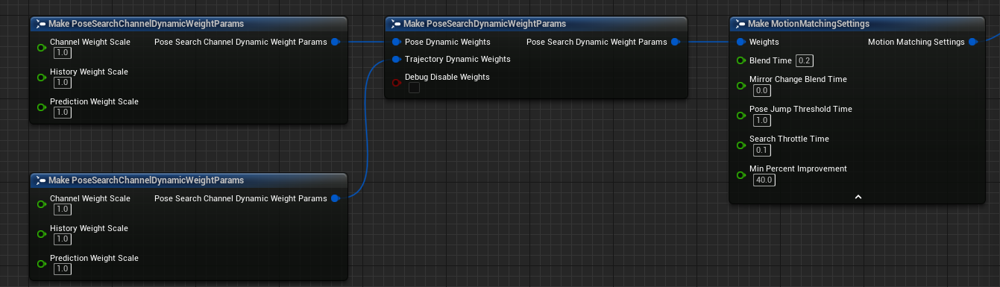

#! https://zhuanlan.zhihu.com/p/507268359
# UE5中的MotionMatching(四) MotionMatching

## 前言
终于要写到最核心的MotionMatching了！我会尽可能地把涉及到的细节用图表展示出来，如果有必要，我会举例说明。在阅读前我建议你先按照[UE5中MotionMatching(二) 创建可运行的PoseSearch工程](https://zhuanlan.zhihu.com/p/455983339)的教程创建好工程并且运行起来，这样通过调试可以很好地理解细节问题~

我的UE5-Main是在2022.3.21日更新的，而且PoseSearch(UE5对MotionMaching的称呼)本身就处于试验阶段，所以不保证将来是否会有大的改动(其实最近一段时间一直有提交)。

PoseSearch插件路径：UnrealEngine\Engine\Plugins\Experimental\Animation\PoseSearch

如果你对Motion Matching感兴趣，可以看下我的其他文章。

[Motion Matching 中的代码驱动移动和动画驱动移动](https://zhuanlan.zhihu.com/p/432663486)

[《荣耀战魂》中的Motion Matching](https://zhuanlan.zhihu.com/p/401890149)

[《最后生还者2》中的Motion Matching](https://zhuanlan.zhihu.com/p/403923793)

[《Control》中的Motion Matching](https://zhuanlan.zhihu.com/p/405873194)

[游戏开发中的Pose Matching](https://zhuanlan.zhihu.com/p/424382326)

[MotionMatching中的DataNormalization](https://zhuanlan.zhihu.com/p/414438466)

[UE5中的MotionMatching(一) MotionTrajectory](https://zhuanlan.zhihu.com/p/453659782)

[UE5中的MotionMatching(二) 创建可运行的PoseSearch工程](https://zhuanlan.zhihu.com/p/455983339)

[UE5中的MotionMatching(三) Pose Matching](https://zhuanlan.zhihu.com/p/492266731)


## 正文
### 基础概念
我们刚开始必须对于MotionMatching涉及到的基础概念进行解释，否则后面阅读和理解起来会特别费劲。

* Feature, 这是MotionMatching中最重要的一个概念，所有的所有都是围绕着它展开的。什么是Feature呢？**Feature是从动画中提取出来的特征数据用于MotionMatching核心算法目的是找出最匹配的下一帧动画**，Feature包括很多种，比如左右脚骨骼的位置，速度，角速度等，还有就是根骨骼的History Trajectory和Future Trajectory，某些游戏会把一些特殊的骨骼也当成Feature，比如武器骨骼或者足球的位置速度等。PoseSearch中Feature大致分为5类，分别为：
    * EPoseSearchFeatureType::Position 位置
    
    * EPoseSearchFeatureType::Rotation 旋转
    
    * EPoseSearchFeatureType::LinearVelocity 位移速度
    
    * EPoseSearchFeatureType::AngularVelocity 旋转角速度
    
    * EPoseSearchFeatureType::ForwardVector 朝向
  
  特别注意的是，Features存储的数据都是基于某个骨骼的，常见的为根骨骼，所以说Feature都是基于ModelSpace, 设计成这样后角色在大世界的任何位置和朝向不会影响到Feature的比较

* FeatureDomain, 目前Domain主要用于区分两种Trajectory, 即TimeTrajectory和DistanceTrajectory, 所以FeatureDomain主要分为两类:
  * EPoseSearchFeatureDomain::Time
  
  * EPoseSearchFeatureDomain::Distance
  
* Channel, Feature归属的大类，从最顶层区分Feature, 目前有:
  * ChannelIdxPose
  
  * ChannelIdxTrajectoryTime
  
  * ChannelIdxTrajectoryDistance
  
* Horizon, 用于区分不同区间段的Samples, 比如对于SampleTime <= 0的，说明使用的是历史数据，SampleTime > 0则需要进行预测，所以Horizon分为History和Prediction, 在调整Weight时可以设置给History和Prediction不同的权重值
  
* Weight, 计算Cost时不同的Feature重要性可能不太一样，比如我们可能会认为脚部骨骼的Position Feature权重比Rotation Feature的高，这样的话，Position Feature更能影响动画的选择。举例我们现在有两个候选Pose，[Position, Rotation]数值分别为[1, 2], [5, 8],我们当前的[Position, Rotation]为[1, 8],如果Weight为[1, 1]的话，两个候选Pose的Cost分别为6(计算过程abs(1-1)*1 + abs(2-8)*1)和4(计算过程abs(5-1)*1 + abs(8-8)*1)，MotionMatching会选择后者，因为Cost更小，但是如果Weight变成[2, 1]的话，两个候选Pose的Cost就变成了6和8，MotionMatching会选择前者

### 配置PoseSearchSchema以及各参数含义


正如上面图看到的，PoseSearchSchema配置项众多，我们逐一看下各个配置项分别代表了什么含义.

* Skeletion: 骨骼信息，不管PoseMatching还是MotionMatching都是应用到具体骨骼上的

* SampleRate: 采样频率，比如**1秒长度**的动画，如果采样频率为10，表示这个动画上会生成10个采样点或者说候选Pose

* Use Trajectory Velocities: 是否将Trajectory的速度信息作为Feature

* Use Trajectory Position: 是否将Trajectory的位置信息作为Feature

* Use Facing Directions: 是否将Trajectory的朝向(Y轴的指向)作为Feature

* Sampled Bones: 设置采样骨骼作为Feature，可以选择骨骼名称，以及Feature类型. 一般情况下foot_l或者foot_r就可以了，特殊应用的话也会用其他骨骼，比如《荣耀战魂》会采样持武器的手部骨骼; 对于骨骼的采样数据我们也可以控制，包括Position Feature, Velocity Feature以及Rotation Feature等，部分需求可能只使用某几种信息，比如《最后生还者2》中使用的是Top Hip的旋转信息表示人物朝向等

* Pose Sample Times: Pose的采样时间点，可以设置多个小于等于零的值，比如Sampled Bones设置的为foot_l和foot_r, FeatureType勾选了Position和Velocity,如果Pose Sample Times设置的为[-1, 0],那么每个采样点会生成8个Feature

* Trajectory Sample Times: TimeTrajectory的采样点，基于时间的数值，可以设置多个值，可正可负可为零

* Trajectory Sample Distances: DistanceTrajectory的采样点，基于距离的数值，可以设置多个值，可正可负可为零

* Mirror Data Table: 使用镜像功能时才需配置，后面再详细将Mirroring Animation

* Data Preprocessor: 数据归一化处理，后面再讲

## 保存PoseSearchSchema
设置完上面的属性后，我们点击保存，函数会执行到UPoseSearchSchema::PreSave，PreSave有两个重要的函数，一个是ResolveBoneReferences，另一个是GenerateLayout。

* ResolveBoneReferences会将Sampled Bones转换为BoneIndex存储在BoneIndices备用，并且调用FAnimationRuntime::EnsureParentsPresent将带有所有父骨骼信息的BoneIndex存储到BoneIndicesWithParents中，比如说Sampled Bones设置的是foot_r，那么BoneIndices仅仅存储相应的BoneIndex即7，BoneIndicesWithParents存储着foot_r到root链上所有的骨骼信息即foot_r, calf_r, thigh_r, pelvis和root.

* GenerateLayout主要用来构建Features的布局情况，我们根据Schema的设置可以知道我们要使用以及不使用Features(目前可以通过Schema设置Trajectory是否使用Position，LinearVelocity，ForwardVector,设置Pose是否使用Position，Rotation以及LinearVelocity，EPoseSearchFeatureType::AngularVelocity目前没有放开使用)，现在我们知道要用哪些Features，以及每种类型的Feature都占用多少字节(GetFeatureTypeTraits)， 接下来我们可以小心地为这些Features排好位子了，如下图所示:


可以看到每个Feature的占位和Offset都是固定的，只要动画采样时Features都按照这个layout进行排列，那么后续比较Feature会非常高效.

### 配置PoseSearchDatabase以及各参数含义


PoseSearchSchema定义了我们要使用哪些Feature，但没有存储数据，我们在上节讲到，使用PoseMatching时数据存储在动画资源的UPoseSearchSequenceMetaData::SearchIndex中，如果使用MotionMatching,数据则存储在PoseSearchDatabase::SearchIndex中.我们看下PoseSearchDatabase各参数的含义:

* Schema: 设置为上面填好的Schema, 我们要用哪些Feature，FeatureLayout以及采样情况Schema负责，对哪些动画进行采样，Weight情况以及最重要的存储由PoseSearchDatabase负责

* Default Weights: 区别于下面的Group Weights，动画有指定的Group，那么在Weights计算时会使用Group中指定的Weights，否则由Default Weights来兜底. Weights分成了两大类Pose Weight和Trajectory Weight(其实是三类, 分别对应ChannelIdxPose, ChannelIdxTrajectoryTime和ChannelIdxTrajectoryDistance, 因为后两者同属Trajectory, 所以后两者合并成为了Trajectory Weight, 所以设置Trajectory Weight后会同时影响TrajectoryTime和TrajectoryDistance), 展开后，我们可以看到更多的属性
  

  * Channel Weight: 整个Channel的权重值，程序会自动归一化
  
  * History/Prediction Params: 每个Channel分成两个Horizon，分别为History Params和Prediction Params, 其中Weight就是设置本Horizon的Weight，程序会自动归一化
  
  * Interpolate: 比如Schema设置的Pose Sample Times为[-3, -2, -1, 0], 如果本属性没有勾选的话, 这4个采样点的权重都相同, 但有的时候我希望时间点0的权重高一点毕竟离的近嘛，时间点-3的权重小一点, 这时候就需要勾选Interpolate, 可以为Sample设置不同的权重值
  
  * Inital Value: Interpolate勾选的情况下有效, 首个采样点的权重值为Inital Value，最末采样点的权重值为1 - Inital Value, 中间的根据下面的Interpolation Method映射即可。这里有个技巧是当Inital Value < 0.5 时权重是升序设置的，否则为降序设置
  
  * Interpolation Method: 中间数值的插值算法
  我们使用一个图可以很好地表示上面Weight的关系
  

* Mirroring Mismatch Cost: 默认情况下，如果当前播放的动画资源是原始动画资源(非镜像资源), 那么期望下一个动画帧也是原始动画资源，如果候选帧是镜像资源，需要在原来Cost的基础上额外增加一个Cost就是Mirroring Mismatch Cost，当然了，如果当前播放的动画资源是镜像资源，那么肯定也是期望下一个动画帧也是镜像资源，如果候选帧是原始资源，也需要额外增加Mirroring Mismatch Cost

* Extrapolation Parameters: 表示外推的控制参数。当采样到[Min, Max]以外的区域时，可以通过本参数预测样点信息。如果想要小于Min时间的样点信息，算法首先算出[Min, Min + SampleTime]时间内的位移信息和旋转信息(大于Max则算出[Max - SampleTime, Max]时间内的位移信息和旋转信息)，有了位移和旋转信息后，通过SampleTime算出平移速度和旋转角速度，如果平移速度大于等于指定的阈值LinearSpeedThreshold则外推时使用该平移速度，否则速度设置为0。 旋转角速度同理，阈值为AngularSpeedThreshold

* Block Transition Parameters: SequenceStartInterval表示Sequence开头多长时间的动画禁止Transition，这样的话，后面的数据帧会有正确的Past trajectory数据。SequenceEndInterval表示末尾多长时间的动画禁止Transition, 这样的话，不仅前面的数据帧会有正确的future trajectory,并且可以避免transition后瞬间结束的现象

* Groups: 定义Group信息，包括Group名字即Tag，也可以选择是否单独使用Group Weights即Use Group Weights

* Drag And Drop Anims Here: 编辑器下可以直接在ContentBrowser中选中多个资源拖动到此属性上，编辑器会自动将选中的资源添加到下面的Sequences中,注意的一点是，如果选中的资源已经在Sequences中了，则不会再次添加

* Sequences: 动画资源数组，所需的动画资源都存于此，比如说一个精简版的Ground Locomotion需要Walk, Run, Strafing, Stop等等动画资源，这些动画资源皆存储在这个属性上。我们看下还提供了哪些可选项:
  * Sequence: 带有RootMotion的动画资源
  
  * Sampling Range: 表示采样范围，单位为时间值，如果Min, Max都为0，代码会自动设置为[0, AnimSequenceLength],不在范围内动画不会被播放。 比如说有一段很长的动画，但我只需要中间某一段，那么可以将Sampling Range设置成这个区间值
  
  * Loop Animation: 是否是循环动画，如果是循环动画，则没有必要再提供后续的Lead in Animation和Follow Up Animation
  
  * Mirror Option: 动画数据是想要原始版本，还是镜像版本还是两者都要，这个选项特别重要，因为通过简单的设置就可以让动画数据直接double
  
  * Lead in Sequence: 当Sequence并非循环动画且SamplingRange.Min = 0时，Sequence如果需要向前采样该怎么办呢，这时候就需要Lead in Animation提供采样数据了
  
  * Loop Lead in Animation: Lead in Animation是否为循环动画，为什么需要提供这个呢？假如说Sequence在0位置需要向前采样-3秒的信息，但是Lead in Animation仅仅只有2秒的长度，如果是循环动画的话，则会计算多少Cycle，每个Cycle多长位移等等
  
  * Follow Up Sequence: 与Lead in Sequence同理，不过是在Sequence末尾处向后采样时使用的(Follow Up Animation还有一个作用就是把各个Sequence连接起来，这个后面会提到)
  
  * Loop Follow Up Animation: 作用与Loop Lead in Animation同理
  
  * Group Tags: 该动画所属的组，可指定多个，需要注意的是这里指定的Tags必须在上面的Groups中有定义
  
### 保存PoseSearchDatabase
通过点击保存时会调用到UPoseSearchDatabase::PreSave，与上文[UE5中的PoseMatching](https://zhuanlan.zhihu.com/p/492266731)提到的一样，这里会调用UE::PoseSearch::BuildIndex来构建UPoseSearchDatabase::SearchIndex，我们用流程图看下BuildIndex都做了哪些工作


BuildIndex执行完毕后，UPoseSearchDatabase::SearchIndex存储的数据为如下示意图:


到这里，我们的数据已经完全准备好了, 接下来我们看下动画蓝图需要做哪些工作呢

### 动画节点MotionMatchingNode参数含义

可以看到动画蓝图的AnimGraph内容非常少，Inertialization为MotionMatching节点服务，负责动画融合，PoseHistory负责存储History Pose数据，也是为MotionMatching节点服务，因为两个节点的比较简单，这里不再赘述，我们重点说下MotionMatchingNode各个参数的含义


* Database: 填入配置好的PoseSearchDatabase

* Use Database Tag Query: 是否启用TagQuery即Group查询，在PoseSearchDatabase时我们讲过每个Sequence可以指定Group信息，当启用Group查询时，只有Match DatabaseTagQuery的Sequence才会被考虑，其他不满足条件的Sequence甚至不会参与Cost比较

* Database Tag Query: 填入查询所需的Group信息， Use Database Tag Query为true时生效

* Trajectory: MotionTrajectory生成的Trajectory信息，MotionMatching的核心算法需要拿Trajectory和当前Pose情况组装成QueryFeatureVectors进行Search

* Dynamic Play Rate Settings: 动态控制每帧动画的播放速率，后面详细来讲

* Setttings: MotionMatching一些额外的控制项，如下:
  
  * Weights: 动态调整Weights，下面的Weights Balancing详细来讲
  
  * BlendTime: 当需要blend out到某个新姿势时，这里控制的是融合的时间，因为使用的是惯性化插值所以MotionMatchingNode后面需要跟上一个InertializationNode
  
  * MirrorChangeBlendTime: 如果说当前播放的Pose与Search得到的TargetPose在Mirror属性上不一致，并且MirrorChangeBlendTime大于0，那么不再使用上面的BlendTime而是使用MirrorChangeBlendTime
  
  * PoseJumpThresholdTime: Search返回的最佳候选帧ResultPose与当前帧CurPose如果同属一个FPoseSearchIndexAsset并且两帧之间的时间差小于PoseJumpThresholdTime阈值，说明候选帧就在附近，不可以Jump
  
  * SearchThrottleTime: 两次查询的最小间隔时间，一方面可以避免每帧都Search, 从动画效果以及性能上都有提升，另外，当应用MultiPoseMatching时，可以将这个值设置为一个很大的值，保证就Search一次(其实不能保证，后面代码解析可以看到，当Asset播放快完毕时会强制Search)
  
  * MinPercentImprovement: 我们发现Search返回的最佳候选帧ResultPose与当前帧CurPose相比而言，候选帧的TotalCost和Dissimilarity都要小，MinPercentImprovement这个参数表示当(CurPose.Dissimilarity - ResultPose.Dissimilarity)/CurPose.Dissimilarity 大于这个MinPercentImprovement百分比时(默认值40表示 40% )，我们才会认为有了显著的提升，进而才会考虑Jump

* Debug Draw: 是否显示调试信息

* Debug Draw Query: 是否显示QueryFeatureVector的调试信息

* Debug Draw Match: 是否显示匹配的调试信息
 
### MotionMatchingNode运行时代码解析

MotionMatchingNode的代码在AnimNode_MotionMatching.cpp中，可以看到内部包含了MirrorNode用来完成镜像功能，还有就是SequencePlayerNode完成动画采样和播放，最最核心的内容在UpdateMotionMatchingState中，里面包含了MotionMatching的核心算法，我们逐行看下它都干了啥(PoseSearch持续开发中，所以后面你看到的时候不一定是这个样子了:) )

```C++
void UpdateMotionMatchingState(
	const FAnimationUpdateContext& Context,
	const UPoseSearchDatabase* Database,
	const FGameplayTagQuery* DatabaseTagQuery,
	const FTrajectorySampleRange& Trajectory,
	const FMotionMatchingSettings& Settings,
	FMotionMatchingState& InOutMotionMatchingState
)
{
	using namespace UE::PoseSearch;
    
	if (!Database)
	{
		Context.LogMessage(EMessageSeverity::Error, LOCTEXT("NoDatabase", "No database provided for motion matching."));
		return;
	}

  // 运行时Database发生了改变，需要重新初始化
	InOutMotionMatchingState.Flags = EMotionMatchingFlags::None;
	if (InOutMotionMatchingState.CurrentDatabase != Database)
	{
		FText InitError;
		if (!InOutMotionMatchingState.InitNewDatabaseSearch(Database, Settings.SearchThrottleTime, &InitError))
		{
			Context.LogMessage(EMessageSeverity::Error, InitError);
			return;
		}
	}

	const float DeltaTime = Context.GetDeltaTime();

	// 使用PoseStepper尝试看下DeltaTime后即NextFrame是否存在有效的采样动画，内部会判断是否需要Jump
	FMotionMatchingPoseStepper PoseStepper;
	PoseStepper.Update(Context, InOutMotionMatchingState);
	if (PoseStepper.CanContinue())
	{
		// 注意，这里返回的Result仍然是步进前的状态
		InOutMotionMatchingState.DbPoseIdx = PoseStepper.Result.PoseIdx;
		InOutMotionMatchingState.SearchIndexAssetIdx = 
			InOutMotionMatchingState.CurrentDatabase->SearchIndex.FindAssetIndex(PoseStepper.Result.SearchIndexAsset);
	}

	// 构建查询所需的FeatureVectorBuilder
	if (InOutMotionMatchingState.DbPoseIdx != INDEX_NONE)
	{
		// 直接Copy DbPoseIdx存储的Pose信息
		InOutMotionMatchingState.ComposedQuery.CopyFromSearchIndex(Database->SearchIndex, InOutMotionMatchingState.DbPoseIdx);
	}
	else
	{
		// 首次调用或者Database运行时改变的时候，从PoseHistoryProvider读取历史值
		IPoseHistoryProvider* PoseHistoryProvider = Context.GetMessage<IPoseHistoryProvider>();
		if (PoseHistoryProvider)
		{
			FPoseHistory& History = PoseHistoryProvider->GetPoseHistory();
			InOutMotionMatchingState.ComposedQuery.TrySetPoseFeatures(
				&History, 
				Context.AnimInstanceProxy->GetRequiredBones());
		}
	}

	// 与Trajectory组合
	InOutMotionMatchingState.ComposeQuery(Database, Trajectory);

  // 构建查询所需的FSearchContext，需要注意的是QueryMirrorRequest，默认方案是QueryMirrorRequest请求当前播放动画资源的Mirrored情况，即当前播放的是Mirrored资源，那么请求的时候也希望是Mirrored资源，否则的话会有MirrorMisMatchCost
	FSearchContext SearchContext;
	SearchContext.SetSource(InOutMotionMatchingState.CurrentDatabase.Get());
	SearchContext.QueryValues = InOutMotionMatchingState.ComposedQuery.GetNormalizedValues();
	SearchContext.WeightsContext = &InOutMotionMatchingState.WeightsContext;
	SearchContext.DatabaseTagQuery = DatabaseTagQuery;
	if (const FPoseSearchIndexAsset* CurrentIndexAsset = InOutMotionMatchingState.GetCurrentSearchIndexAsset())
	{
		SearchContext.QueryMirrorRequest =
			CurrentIndexAsset->bMirrored ?
			EPoseSearchBooleanRequest::TrueValue :
			EPoseSearchBooleanRequest::FalseValue;
	}

	// 动态更新Weight情况,提供了外部可以实时调整Weights的机制
	InOutMotionMatchingState.WeightsContext.Update(Settings.Weights, Database);

	// 说明NextFrame找不到且不存在有效的FollowUp动画，这时候强制触发Search（因为这里的缘故，通过给SearchThrottleTime设置很大的值完成MultiPoseMatching的方案是行不通的，因为当动画快结束时会再一次触发Search）
	if (!PoseStepper.CanContinue())
	{
		FSearchResult Result = Search(SearchContext);
		InOutMotionMatchingState.JumpToPose(Context, Settings, Result);
	}

	// ElapsedPoseJumpTime累计时间超过了阈值SearchThrottleTime，需要再一次Search
	else if ((InOutMotionMatchingState.ElapsedPoseJumpTime >= Settings.SearchThrottleTime))
	{
		// 首先通过比较当前的Pose与SearchContext中的FeatureVector计算出CurrentPoseCost作为参考值
		FPoseCost CurrentPoseCost;
		if (InOutMotionMatchingState.DbPoseIdx != INDEX_NONE)
		{
			const FPoseSearchIndexAsset* SearchIndexAsset = &Database->SearchIndex.Assets[InOutMotionMatchingState.SearchIndexAssetIdx];
			CurrentPoseCost = ComparePoses(InOutMotionMatchingState.DbPoseIdx, SearchContext, SearchIndexAsset->SourceGroupIdx);
		}

		// Search查找最匹配的Frame
		FSearchResult Result = Search(SearchContext);

		// 需要比较下Result与CurrentPose,只有当Result比CurrentPose更相似并且不在附近区域的时候，我们才能认定可以进行跳转
		check(Result.PoseCost.Dissimilarity >= 0.0f);
		bool bBetterPose = true;
		if (CurrentPoseCost.IsValid())
		{
			// 这里需要特别注意，可以发现如果要认定Result是一个更好的Pose,不仅仅TotalCost要小，Dissimilarity也要更小，这里我有一个疑惑，这里过于追求Dissimilarity的相似，导致跳转条件过于严苛，即使发现了TotalCost更小的Pose，由于Dissimilarity可能更大，导致无法跳转，有没有可能跟开发者的意愿相违背呢？Debug工具明明显示出来一个更小的TotalCost而没有发生跳转，开发者还需要知道Dissimilarity这一层的比较.
			// 这种做法的优势一般不轻易发生跳转，动画流畅避免了频繁Search而导致动画一直由离散Pose形成的问题; 如果发生跳转的话，候选Pose肯定在各个方面都优于现在的Pose，Pose切换无明显视觉问题
			if ((CurrentPoseCost.TotalCost <= Result.PoseCost.TotalCost) || (CurrentPoseCost.Dissimilarity <= Result.PoseCost.Dissimilarity))
			{
				bBetterPose = false;
			}
			else
			{
				// TotalCost以及Dissimilarity都更小还不行，差值的幅度必须大于指定阈值才可以，可以说为了找到好的Pose条件设置的特别苛刻
				checkSlow(CurrentPoseCost.Dissimilarity > 0.0f && CurrentPoseCost.Dissimilarity > Result.PoseCost.Dissimilarity);
				const float RelativeSimilarityGain = -1.0f * (Result.PoseCost.Dissimilarity - CurrentPoseCost.Dissimilarity) / CurrentPoseCost.Dissimilarity;
				bBetterPose = RelativeSimilarityGain >= Settings.MinPercentImprovement / 100.0f;
			}
		}

    // 如果得到的候选Pose离当前的Pose太近也不可以跳转(当前Pose前方会导致动画循环卡住的问题；后方则没有必要切换，因为紧接着就会播放到)
		bool bNearbyPose = false;
		const FPoseSearchIndexAsset* StateSearchIndexAsset = InOutMotionMatchingState.GetCurrentSearchIndexAsset();
		if (StateSearchIndexAsset == Result.SearchIndexAsset)
		{
			// 这里采用的PoseIdx而并非AssetTime，因为对于BlendSpaces来讲，AssetTime指定并不是时间，而是在区间[0, 1]内标准化后的一个范围值，所以无法与PoseJumpThresholdTime进行比较
			bNearbyPose = FMath::Abs(InOutMotionMatchingState.DbPoseIdx - Result.PoseIdx) * Database->Schema->SamplingInterval < Settings.PoseJumpThresholdTime;

			// 处理循环动画的情况
			if (!bNearbyPose && Database->IsSourceAssetLooping(StateSearchIndexAsset))
			{
				bNearbyPose = FMath::Abs(StateSearchIndexAsset->NumPoses - InOutMotionMatchingState.DbPoseIdx - Result.PoseIdx) * Database->Schema->SamplingInterval < Settings.PoseJumpThresholdTime;
			}
		}

    // 既是好的Pose也没有离太近，这是一个更棒的选择，可以进行跳转 
		if (bBetterPose && !bNearbyPose)
		{
			InOutMotionMatchingState.JumpToPose(Context, Settings, Result);
		}
	}

	// 如果没有采用Search的结果，那么看下是否应该Jump到FollowUp的动画上
	if (!(InOutMotionMatchingState.Flags & EMotionMatchingFlags::JumpedToPose)
		&& PoseStepper.CanContinue()
		&& PoseStepper.bJumpRequired)
	{
		InOutMotionMatchingState.JumpToPose(Context, Settings, PoseStepper.Result);
		// 这时候同时标注了JumpedToPose和JumpedToFollowUp
		InOutMotionMatchingState.Flags |= EMotionMatchingFlags::JumpedToFollowUp;
	}

    // 没有发生任何Jump, 继续在当前动画上前进, 更新下ElapsedPoseJumpTime
	if (!(InOutMotionMatchingState.Flags & EMotionMatchingFlags::JumpedToPose))
	{
		InOutMotionMatchingState.ElapsedPoseJumpTime += DeltaTime;
	}
#if UE_POSE_SEARCH_TRACE_ENABLED
// TODO DEBUG
#endif
}
```

至于另外一个核心函数Search实现就比较简单了，仅仅比较Feature取出最小的Cost即可，这里就不再谈了

### Weights Balancing

运行时我们经常希望能够动态地调整Weight然后立刻看下改变后的情景，这时候就需要用到上面Setting中的Weights了



我们看下每个参数的详细含义吧：

* Pose Dynamic Weights: 动态控制PoseChannel的WeightScale
  * Channel Weight Scale: 对整个Channel的权重进行缩放
  
  * History Weight Scale: 对该Channel下History Horizon进行权重缩放
  
  * Prediction Weight Scale: 对该Channel下Prediction Horizon进行权重缩放
  
* Trajectory Dynamic Weights: 动态控制TrajectoryChannel的WeightScale
  * 同上

* Debug Disable Weights: 如果是true，表示不希望让Weights参与计算Cost，一键禁用Weights(强制把所有weight设置为1)
  


可以看到Setting中的Weights控制的是Channel Weight和Horizon Weight的缩放

## Bonus

[Inu_Games](https://twitter.com/games_inu)在推特上做了不少实践，有些总结和视频效果挺不错的，可以看看~

O3de引擎在几个月前也推出了[MotionMatching的开源工程](https://github.com/hui211314dd/o3de/tree/development/Gems/MotionMatching)，代码漂亮简洁，重要的是教程特别适合刚接触MotionMatching的同学，值得推荐！

前几天育碧官网放出了一篇介绍[《孤岛惊魂6》的MotionMatching系统Choreograph](https://news.ubisoft.com/en-us/article/27176jslYNMPt7vBfCaRQ1/far-cry-6-how-ai-helped-animate-yaras-hero)，相比于传统做法有哪些提升以及对于动画师工作流上的改变，值得一读！

[Daniel Holden在21年10月份发起过一个特别有意思的讨论](https://twitter.com/anorangeduck/status/1449420737895440393)


然后Simon Clavet在后面跟帖说了下MotionMatching中关于FeatureVectors布局的思考并且还[录制了视频](https://www.youtube.com/watch?v=jcpIrw38E-s)，强烈推荐！


## 下一步计划
* Search函数中Group的Match似乎存在bug，发个pr问下

* Mirroring Animation

* FootLock(Foot Placement)

* BlendSpace的使用

* DynamicPlayRateSettings

* Debug工具

* 数据的标准化处理

* 应用篇


如果文章有错误，记得联系我~


