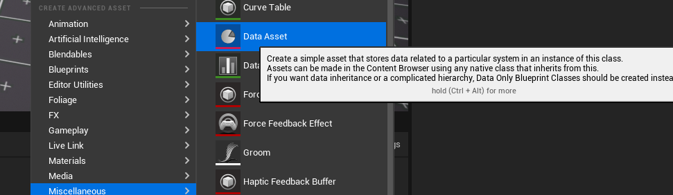
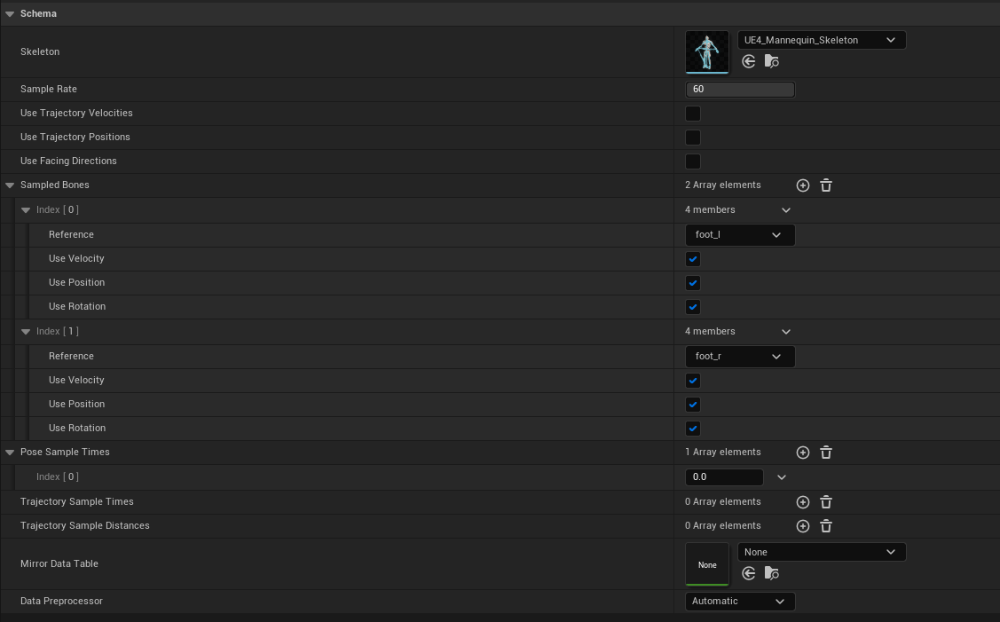

UE5中MotionMatching(三) Pose Matching的使用

## 前言
本篇主要讲述的是UE5中如何使用Pose Matching，并不会讲代码的实现细节，后面的系列文章会分享实现细节。阅读本文前建议先阅读[游戏开发中的Pose Matching](https://zhuanlan.zhihu.com/p/424382326)从而了解Pose Matching的原理和应用。

我的UE5-Main是在2022.2.12日更新，而且PoseSearch(UE5对MotionMaching的称呼)本身就处于试验阶段，所以不保证将来是否会有大的改动。

PoseSearch插件路径：UnrealEngine\Engine\Plugins\Experimental\Animation\PoseSearch

如果你对Motion Matching感兴趣，可以看下我的其他文章。

[Motion Matching 中的代码驱动移动和动画驱动移动](https://zhuanlan.zhihu.com/p/432663486)

[《荣耀战魂》中的Motion Matching](https://zhuanlan.zhihu.com/p/401890149)

[《最后生还者2》中的Motion Matching](https://zhuanlan.zhihu.com/p/403923793)

[《Control》中的Motion Matching](https://zhuanlan.zhihu.com/p/405873194)

[游戏开发中的Pose Matching](https://zhuanlan.zhihu.com/p/424382326)

[MotionMatching中的DataNormalization](https://zhuanlan.zhihu.com/p/414438466)

[UE5中MotionMatching(一) MotionTrajectory](https://zhuanlan.zhihu.com/p/453659782)

[UE5中MotionMatching(二) 创建可运行的PoseSearch工程](https://zhuanlan.zhihu.com/p/455983339)

## 正文
### 数据源为单个动画文件
我们仍然以[游戏开发中的Pose Matching](https://zhuanlan.zhihu.com/p/424382326)中的停步举例，我们先假定停步时左脚在空中，那么会使用名为RunFwdStop_LU(LeftFootUp)的动画作为过渡动画

{视频1 RunFwdStop_LU}

虽然我们假定过渡前左脚在空中，但不知道左脚在空中的哪个位置，如果RunFwdStop_LU始终从第一帧开始播放的话，有可能会出现过渡不协调的问题，从视频的慢回放中可以看到在动画切换时腿部有回拉的表现

{视频2 正常Blend带来的问题}

Pose Matching可以帮助我们解决这个问题，它会帮助我们找到最合适的动画起始帧开始播放，效果如下:

{视频3 单个动画资源的Pose Matching}

慢回放可以看到，腿部不再回拉了

{视频4 正常Pose Matching的慢回放}

那么UE5中应该如何配置呢？如果数据源为了单个动画的话，配置起来较为简单
1. 启用PoseSearch插件后，创建Data Asset选择PoseSearchSchema,假设命名为PoseMatchingSchema,根据需求设置好骨骼信息, Trajectory相关的无需设置
   
   
   

2. 打开RunFwdStop_LU动画资源，
### 数据源为多个动画文件

## 注意事项
特别早期，各种bug
MultiPoseMatching
修改Schema或者DB后需要全部保存下，否则Motion Matching会出现TPose情况

## 下一步

如果文章有错误，记得联系我~