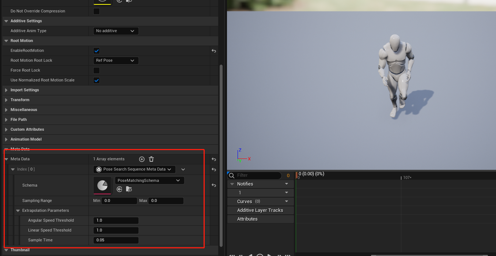
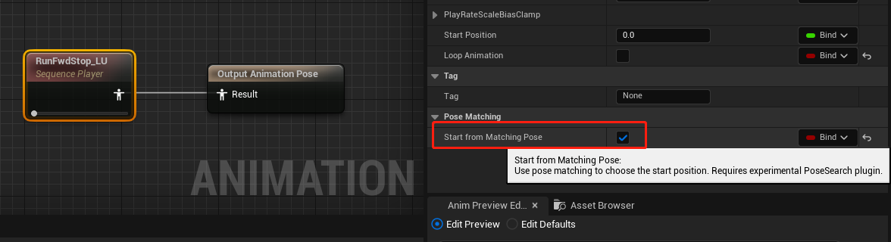
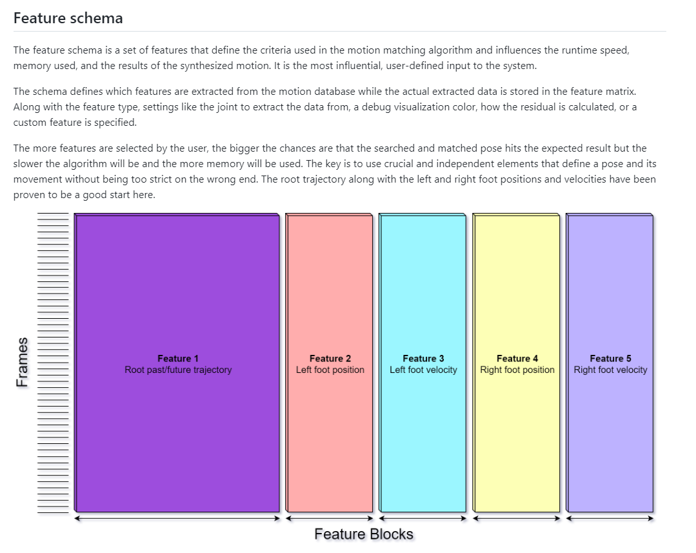
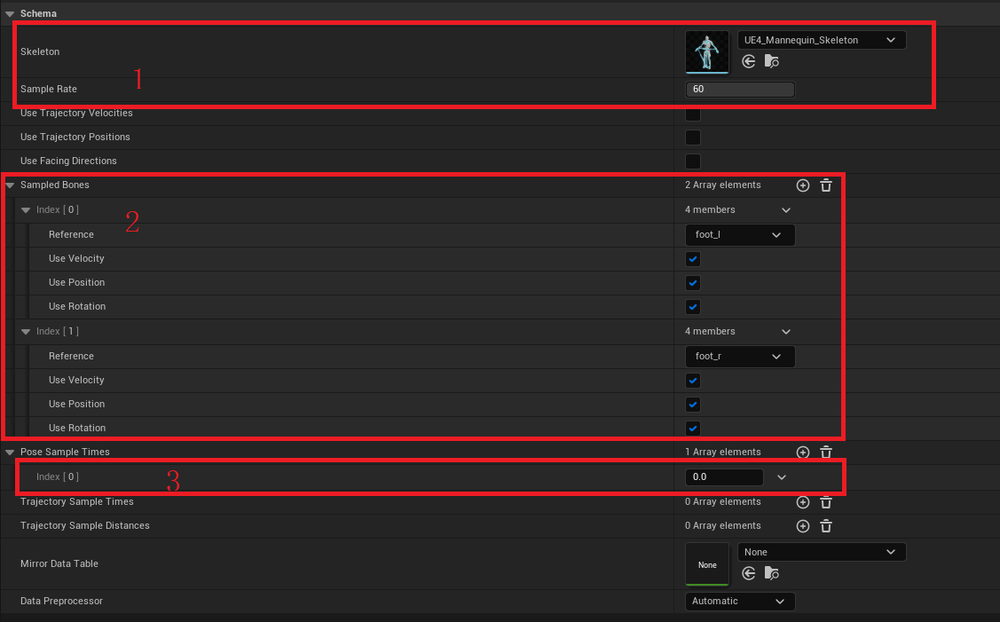
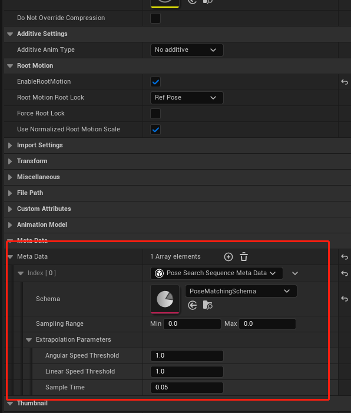
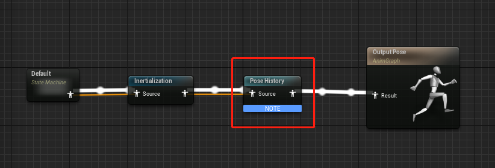

UE5中MotionMatching(三) Pose Matching

## 前言
本篇主要讲述的是UE5中如何使用Pose Matching以及代码实现细节。阅读本文前建议先阅读[游戏开发中的Pose Matching](https://zhuanlan.zhihu.com/p/424382326)从而了解Pose Matching的原理和应用。

我的UE5-Main是在2022.3.21日更新的，而且PoseSearch(UE5对MotionMaching的称呼)本身就处于试验阶段，所以不保证将来是否会有大的改动(其实最近一段时间一直有提交)。

PoseSearch插件路径：UnrealEngine\Engine\Plugins\Experimental\Animation\PoseSearch

如果你对Motion Matching感兴趣，可以看下我的其他文章。

[Motion Matching 中的代码驱动移动和动画驱动移动](https://zhuanlan.zhihu.com/p/432663486)

[《荣耀战魂》中的Motion Matching](https://zhuanlan.zhihu.com/p/401890149)

[《最后生还者2》中的Motion Matching](https://zhuanlan.zhihu.com/p/403923793)

[《Control》中的Motion Matching](https://zhuanlan.zhihu.com/p/405873194)

[游戏开发中的Pose Matching](https://zhuanlan.zhihu.com/p/424382326)

[MotionMatching中的DataNormalization](https://zhuanlan.zhihu.com/p/414438466)

[UE5中MotionMatching(一) MotionTrajectory](https://zhuanlan.zhihu.com/p/453659782)

[UE5中MotionMatching(二) 创建可运行的PoseSearch工程](https://zhuanlan.zhihu.com/p/455983339)

## 正文
### 对单个动画应用Pose Matching
我们仍然以[游戏开发中的Pose Matching](https://zhuanlan.zhihu.com/p/424382326)中的停步举例，我们先**假定停步时左脚在空中**，那么会使用名为RunFwdStop_LU(LeftFootUp)的动画作为过渡动画

{视频1 RunFwdStop_LU}

虽然我们假定过渡前左脚在空中，但不知道左脚在空中的哪个位置，如果RunFwdStop_LU始终从第一帧开始播放的话，有可能会出现过渡不协调的问题，从视频的慢回放中可以看到在动画切换时腿部有回拉的现象(单从停步这个例子来讲，其实正常播放的情况下人眼是看不出回拉现象的，所以需不需要Pose Matching需要根据项目而定)

{视频2 正常Blend带来的问题}

Pose Matching可以帮助我们解决这个问题，它会帮助我们找到该动画最合适的起始帧并播放，效果如下:

{视频3 单个动画资源的Pose Matching}

慢回放可以看到，腿部不再回拉了

{视频4 正常Pose Matching的慢回放}

那么UE5中应该如何配置呢？
1. 启用PoseSearch插件后，创建Data Asset选择PoseSearchSchema,假设命名为PoseMatchingSchema,根据需求设置好骨骼信息, 我们停步时主要关注的骨骼是左右脚，所以Sampled Bones设置的是foot_l和foot_r, Trajectory相关的无需设置
   
   
   

2. 打开RunFwdStop_LU动画资源，找到Meta Data, 创建PoseSearchSequenceMetaData, 设置如下:
   

3. 在动画蓝图中，在Stop状态时动画设置如下:
   

单个动画应用Pose Matching就是这么简单！

接下来我们看下代码是如何实现的，并且解释下相关参数的具体含义。

我们先从Schema入手,什么是Schema呢？我们看下O3de中对于Motion Matching Schema的解释:



可以看到，Schema用来定义Motion Matching使用了哪些Feature，Feature字节大小，动画数据中采样骨骼，Trajectory等，它定义了Feature标准但不负责存储Feature数据。UPoseSearchSchema作用也是一样的，我们本篇只解释用到的参数，其他参数在下一篇再详细解释。



1. Skeletion为骨骼信息，不管PoseMatching还是MotionMatching都是应用到具体骨骼上的; SampleRate为采样频率，比如1秒长度的动画，如果采样频率为60，表示这个动画上会生成60个采样点或者说候选Pose，PoseMatching会在这60个候选Pose上进行选择(真实情况下不会在1s长度的动画上都生成候选Pose,比如说0.8秒往后的动画区间上，因为可能会发生动画刚开始播放就结束了，后面会解释Meta Data中的Sample Range)
   
2. 采样的骨骼，一般情况下foot_l或者foot_r就可以了，特殊应用的话也会用其他骨骼，比如《荣耀战魂》会采样持武器的手部骨骼; 对于骨骼的采样数据我们也可以控制，包括速度，位置，旋转等，部分需求可能只使用某几种信息，比如《最后生还者2》中使用的是Top Hip的旋转信息表示人物朝向等
   
3. PoseSampleTimes表示每个采样点要存储哪些时间点的Pose信息(由SampledBones组成), 咋一听有点蒙，每个采样点只存储它那个时间点的Pose不就行了吗，这个时间啥意思？其实这里的设计更有扩展性，不仅可以采样当前Pose的信息，还可以采样前面某个时间点的信息，比如-1就可以表示采样当前时间点前一秒的Pose信息。特别注意这个数值只能设置小于等于0的数(出个问题，大家可以想想为什么不能设置大于0的值呢？)

好的，UPoseSearchSchema设置完毕之后，我们对AnimSequence添加了MetaData，我们详细介绍下MetaData中的参数



1. Schema就是上面配置好的UPoseSearchSchema引用，在保存样点信息时会经常使用Schema中的数据

2. SamplingRange表示采样范围，正如前面提到的，一个10秒长的动画并不会全部生成采样点，一般会在前半部分生成采样点，这里可以设置采样的区间，单位为时间值，如果Min, Max都为0，代码会自动设置为[0, AnimSequenceLength] (UPoseSearchSchema中设置的SamplingRange和Database设置的SamplingRange在效果上有个很重要的不同，如果UPoseSearchSchema中设置的为[0, 0.3],那么在应用Pose Matching时会在[0, 0.3]区间内找到一个合适的时间点开始播放，(0.3, SequenceEnd]中间的动画仍然会播放到;Database中设置的SamplingRange则有点不同，MotionMatching节点只播放采样区间内的动画;根本原因在于PoseMatching的机制仅仅是找到一个合适的起始帧，其他的就交给SequencePlayerNode了。Database我们下篇再详细讲)

3. ExtrapolationParameters表示外推的控制参数。当采样到[Min, Max]以外的区域时，可以通过本参数预测样点信息。如果想要小于Min时间的样点信息，算法首先算出[Min, Min + SampleTime]时间内的位移信息和旋转信息(大于Max则算出[Max - SampleTime, Max]时间内的位移信息和旋转信息)，有了位移和旋转信息后，通过SampleTime算出平移速度和旋转角速度，如果平移速度大于等于指定的阈值LinearSpeedThreshold则外推时使用该平移速度，否则速度设置为0; 旋转角速度同理，阈值为AngularSpeedThreshold

```C++
UCLASS(BlueprintType, Category = "Animation|Pose Search", Experimental)
class POSESEARCH_API UPoseSearchSequenceMetaData : public UAnimMetaData
{
	GENERATED_BODY()
public:

	UPROPERTY(EditAnywhere, Category="Settings")
	TObjectPtr<const UPoseSearchSchema> Schema = nullptr;

	UPROPERTY(EditAnywhere, Category="Settings")
	FFloatInterval SamplingRange = FFloatInterval(0.0f, 0.0f);

	UPROPERTY(EditAnywhere, Category = "Settings")
	FPoseSearchExtrapolationParameters ExtrapolationParameters;

	UPROPERTY()
	FPoseSearchIndex SearchIndex;

	// functions begin
    // ...

public: // UObject
	virtual void PreSave(FObjectPreSaveContext ObjectSaveContext) override;
   
   // functions end
};
```   

我们设置好信息后点击保存，会调用到UPoseSearchSchema中的PreSave函数, PreSave会调用BuildIndex, BuildIndex根据设置好的Schema,SamplingRange以及ExtrapolationParameters生成SearchIndex数据，供Query使用, 可以说UPoseSearchSequenceMetaData最核心的成员其实是SearchIndex，我们在前面说过，Schema定义Feature规则但不存储Feature数据，Feature数据就存储在SearchIndex中.

```C++
// 拥有UPoseSearchSequenceMetaData的AnimSequence保存时调用，用于构建UPoseSearchSequenceMetaData的核心成员SearchIndex
bool BuildIndex(const UAnimSequence* Sequence, UPoseSearchSequenceMetaData* SequenceMetaData)

// UPoseSearchDatabase PreSave时调用，用于构建UPoseSearchDatabase的核心成员SearchIndex
bool BuildIndex(UPoseSearchDatabase* Database)
```

BuildIndex是特别重要的函数，这个函数的唯一目的就是构建SearchIndex，处理过程中出现了很多Helper的类，我们一一说明下

FAnimSamplingContext: Init调用后BoneContainer会存储骨骼信息，如果配置了MirrorDataTable则初始化其他镜像功能所需的参数

FSequenceSampler: 采样的帮助类，为FIndexer服务，提供了很多函数可以获取动画采样点的位移信息。经过Init以及Process函数处理后，Output会存储各个采样点的Root位移情况

FIndexer: BuildIndex最核心的类，生成查询使用的Index信息，包括采样区间，FeatureVector数据，PoseMetaData等

FPoseSearchIndexAsset: SearchIndex中的核心成员，FPoseSearchIndexAsset具体指代什么呢？因为大部分情况我们不只是只用Origin单个的资源，可能还有它的Mirror版本，资源本身可能还有弃用的片段比如动捕时的TPose情况，所以资源被拆成了多个Ranges, 而且单个资源可能分配到了多个组里面，比如Idle和Battle组，Asset其实是众多组合可能中的一种情况，比如某个Asset可能就是[0, 20]区间Idle组的Mirror信息，一个UPoseSearchDatatable中FPoseSearchIndexAsset数量大致等于SequencesNum * GroupTags * ValidRangesNum * IsNotMirror)

BuildIndex最后会进行归一化处理，可选方案有z-score或者ZCA-cor sphering或者不做任何处理，具体算法细节我们后面再讲。

当我们点击保存后，BuildIndex生成好了SearchIndex数据，SearchIndex储存了各个采样点的FeatureVector情况以及PoseMetaData(AnimSequence中每个采样点都有对应的FPoseSearchPoseMetadata用来影响Query结果，比如Flags如果是BlockTransition的话，说明这个采样点不会被作为结果返回；CostAddend表示这一采样点有额外的Cost, 负值表示这个采样点更容易被选中，正值表示这个采样点Cost消耗更大，不那么被人喜欢)

到这里，我们的数据都保存好了，是时候开始查询了！我们看下如果设置了StartFromMatchingPose，会发生什么?


```C++
float FAnimNode_SequencePlayerBase::GetEffectiveStartPosition(const FAnimationBaseContext& Context) const
{
	// Override the start position if pose matching is enabled
	UAnimSequenceBase* CurrentSequence = GetSequence();
	if (CurrentSequence != nullptr && GetStartFromMatchingPose())
	{
		UE::Anim::IPoseSearchProvider* PoseSearchProvider = UE::Anim::IPoseSearchProvider::Get();
		if (PoseSearchProvider)
		{
			UE::Anim::IPoseSearchProvider::FSearchResult Result = PoseSearchProvider->Search(Context, CurrentSequence);
			if (Result.PoseIdx >= 0)
			{
				return Result.TimeOffsetSeconds;
			}
		}
	}

	return GetStartPosition();
}
```

可以看到，当StartFromMatchingPose为true时，会调用PoseSearchProvider::Search函数尝试返回合适的动画起始时间。

```C++
UE::Anim::IPoseSearchProvider::FSearchResult FModule::Search(const FAnimationBaseContext& GraphContext, const UAnimSequenceBase* Sequence)
{
	UE::Anim::IPoseSearchProvider::FSearchResult ProviderResult;

	const UPoseSearchSequenceMetaData* MetaData = Sequence ? Sequence->FindMetaDataByClass<UPoseSearchSequenceMetaData>() : nullptr;
	if (!MetaData || !MetaData->IsValidForSearch())
	{
		return ProviderResult;
	}

	IPoseHistoryProvider* PoseHistoryProvider = GraphContext.GetMessage<IPoseHistoryProvider>();
	if (!PoseHistoryProvider)
	{
		return ProviderResult;
	}

	FPoseHistory& PoseHistory = PoseHistoryProvider->GetPoseHistory();
	FPoseSearchFeatureVectorBuilder& QueryBuilder = PoseHistory.GetQueryBuilder();

	QueryBuilder.Init(MetaData->Schema);
	if (!QueryBuilder.TrySetPoseFeatures(&PoseHistory, GraphContext.AnimInstanceProxy->GetRequiredBones()))
	{
		return ProviderResult;
	}

	QueryBuilder.Normalize(MetaData->SearchIndex);

	::UE::PoseSearch::FSearchContext SearchContext;
	SearchContext.SetSource(Sequence);
	SearchContext.QueryValues = QueryBuilder.GetNormalizedValues();
	::UE::PoseSearch::FSearchResult Result = ::UE::PoseSearch::Search(SearchContext);

	ProviderResult.Dissimilarity = Result.PoseCost.TotalCost;
	ProviderResult.PoseIdx = Result.PoseIdx;
	ProviderResult.TimeOffsetSeconds = Result.AssetTime;
	return ProviderResult;
}
```
可以看到，这个函数刚开始需要构造QueryBuilder，QueryBuilder用于存储当前的Feature情况，比如当前的Pose(比如foot_l和foot_r的位移旋转速度信息)，那么Pose如何获取呢？哦！我这里忘了介绍一个关键的AnimNode，它就是PoseHistoryNode，动画蓝图利用这个Node可以存储一段时间内的Pose信息，通过PoseHistoryProvider可以很容易拿到查询所需的Pose信息



紧接着就是构造查询的传入参数FSearchContext，这里面最重要的两个点一个是SetSource，SetSource会把MeataData中的SearchIndex指针传过去，这一步相当重要，另外一个就是设置QueryValues, 这就等同于我目前的状况QueryValues给你了，存储着所有候选Pose的SearchIndex也给你了，你帮我查下就可以了。FSearchContext还有其他众多参数，包括镜像查询设置， Weight权重调整等等，不过幸运的是，PoseMatching并不需要这些参数，所以构建起来比较简单。

接下来调用到了整个PoseSearch最最重要的函数::UE::PoseSearch::Search，它会帮你进行查询，我们看下Search做了哪些操作:

```C++
FSearchResult Search(FSearchContext& SearchContext)
{
   // 略去检查代码
   // ...

	FPoseCost BestPoseCost;
	int32 BestPoseIdx = INDEX_NONE;

	const UPoseSearchDatabase* Database = SearchContext.GetSourceDatabase();

	for (const FPoseSearchIndexAsset& Asset : SearchIndex->Assets)
	{
		// 略去Group相关代码
      // ...

		const int32 EndIndex = Asset.FirstPoseIdx + Asset.NumPoses;
		for (int32 PoseIdx = Asset.FirstPoseIdx; PoseIdx < EndIndex; ++PoseIdx)
		{
			const FPoseSearchPoseMetadata& Metadata = SearchIndex->PoseMetadata[PoseIdx];

			if (EnumHasAnyFlags(Metadata.Flags, EPoseSearchPoseFlags::BlockTransition))
			{
				continue;
			}

			FPoseCost PoseCost = ComparePoses(PoseIdx, SearchContext, Asset.SourceGroupIdx);

			if (PoseCost < BestPoseCost)
			{
				BestPoseCost = PoseCost;
				BestPoseIdx = PoseIdx;
			}
		}
	}

	ensure(BestPoseIdx != INDEX_NONE);

	Result.PoseCost = BestPoseCost;
	Result.PoseIdx = BestPoseIdx;
	Result.SearchIndexAsset = SearchIndex->FindAssetForPose(BestPoseIdx);
	Result.AssetTime = SearchIndex->GetAssetTime(BestPoseIdx, Result.SearchIndexAsset);

	SearchContext.DebugDrawParams.PoseVector = SearchContext.QueryValues;
	SearchContext.DebugDrawParams.PoseIdx = Result.PoseIdx;
	Draw(SearchContext.DebugDrawParams);

	return Result;
}
```

可以看到，Search会把当前的SearchContext和每个候选Pose进行ComparePoses的比较，而ComparePoses最核心的是调用CompareFeatureVectors:

```C++
static inline float CompareFeatureVectors(int32 NumValues, const float* A, const float* B)
{
	double Dissimilarity = 0.f;

	for (int32 ValueIdx = 0; ValueIdx != NumValues; ++ValueIdx)
	{
		const float Diff = A[ValueIdx] - B[ValueIdx];
		Dissimilarity += Diff * Diff;
	}

	return (float)Dissimilarity;
}
```

哇！计算Cost太简单了吧，只需把每个Feature提取出来，做差值然后平方即可，累计的值就是所需的Cost(这里省略了Weights和CostAdd的计算，不过都很简单)

到这里我们终于弄清楚了PoseMatching的流程：SequenceNode在获取起始帧时间时调用Search函数，利用PoseHistory传入当前的Pose情况, 并且也会用MetaData中的SearchIndex作为参数传入，Search函数会把所有的候选帧和当前的QueryValues进行比较，找出Cost最小的那一帧并计算出时间返回。

### 数据源为多个动画文件
上面我们假定了停步时左脚在空中，这在游戏中怎么可能呢！如果右脚在空中时在RunFwdStop_LU中会始终找不到满意的帧，这时候我们多么希望UE5能够提供一个数组，里面传入多个动画，然后Search会把所有的候选帧都比较下，选出最合适的那个动画以及起始帧并返回，UE5有吗？

可以说有，也可以说没有，有是因为UE5提供了PoseSearchDatabase并且利用MotionMatching的Node完成这个需求，而且PoseSearchDatabase可以设置镜像数据，你只需传入RunFwdStop_LU动画并且勾选同时生成源数据和镜像数据，它会帮你生成一份RunFwdStop_LU镜像动画，它的效果就是右脚在空中的情况呀！可以说功能非常强大！说没有是因为目前使用上并不是那么简单，其实PoseMatching只需要Search一次，后面顺序播放即可，而如果使用MotionMatching节点的话，需要将Setting中的SearchThrottleTime设置的很大才行，而且还要注意有没有其他情况下MotionMatching强制Search(其实是存在的，目前MotionMatching在检测到目前动画快要播放完的时候会强制Search), 目前希望官方能有使用上的建议或者例子。

如果你不想使用MotionMatching来完成MultiPoseMatching的话，自己创建一个节点并实现起来还是挺容易的。

如果你想了解如何配置PoseSearchDatabase以及使用MotionMatching功能，我们下篇再讲！

## 注意事项
目前PoseSearch尚处于开发中，不少bug，我也提交了两个PR并且采纳了，开心~
修改Schema或者MetaData或者Database后需要全部保存下，否则Motion Matching会出现TPose情况

## Bonus
在[游戏开发中的Pose Matching](https://zhuanlan.zhihu.com/p/424382326)中，有位大佬毛狼给了distance matching和PoseMatching的建议，我觉得特别有用，分享下~

我目前也在做相关动画工作，有一些思路你可以参考一下：
1. 对多个停止动画做distance match，选出每个动画距离上最合适的起始帧。然后对这几个最合适的动画帧进行pose match，选出和当前脚步位置最匹配的动画开始播放。这个方法需要多提供几组脚步状态不同的停止动画以尽可能在给定的距离上匹配到最合适的起始帧
2. Pose match的优先级比distance match要低，因为pose match的候选帧应当是“等价”的。例如：移动循环动画从任何一帧开始都对后续播放没有影响。而非循环动画有播放时间上的约束，root motion有移动距离上的约束，所以最好先满足其他约束，再结合第一步的方法通过pose match找到最接近结果
3. 实际项目上往往只需要少数几个不同版本动画（例如文中提到的左右脚起步）就可以达到比较理想的效果。可以根据实际效果适当增加不同起始脚步位置。一般说来跑步停止比走步停止更难注意到不匹配

## 下一步
MotionMatching的代码分析
Mirror原理
标准化处理
FootLock

如果文章有错误，记得联系我~
