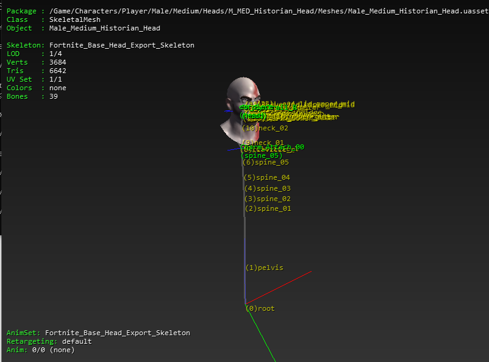
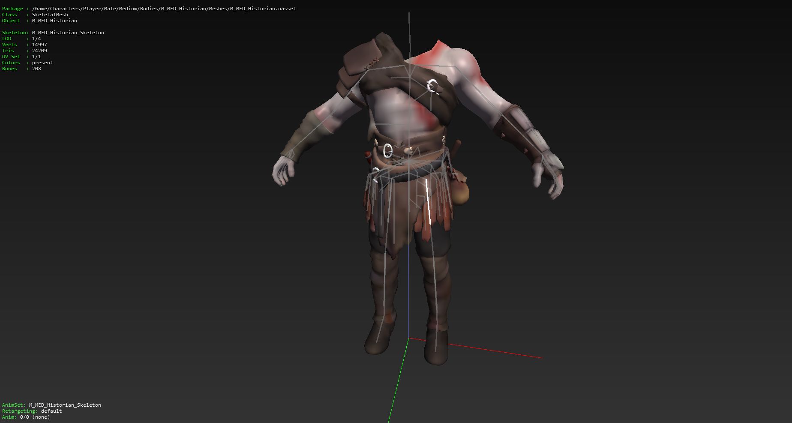
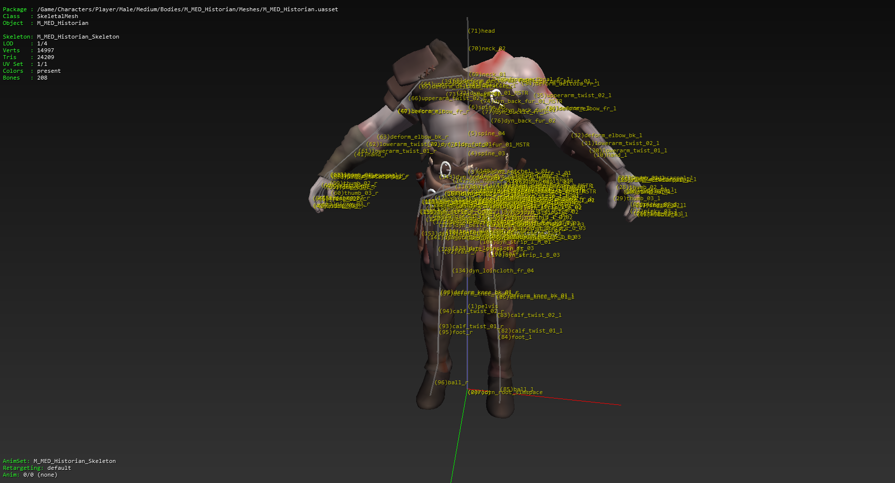
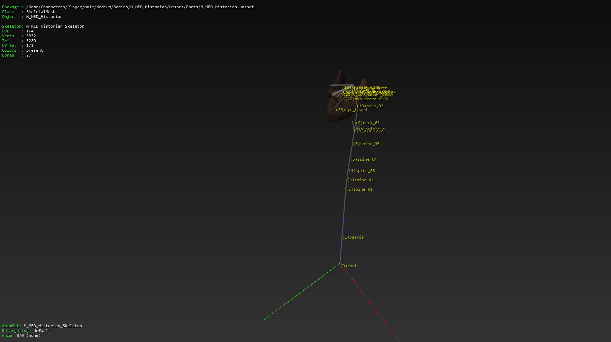
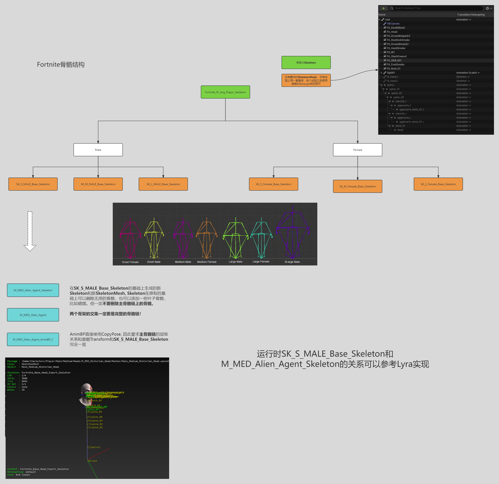

## 使用模块化角色

[使用模块化角色官方文档](https://docs.unrealengine.com/5.1/zh-CN/modular-characters-in-unreal-engine/)中列出了常用的三种方法，即SetMasterPoseComponent, CopyPoseFromMesh以及SkeletonMeshMerge, 本文主要是比较前两种方法：

SetMasterPoseComponent优点就是轻量，简单，高效，可以说它的使用特别简单，比如Character被拆分为base,torso，legs, head等，base为一个很小的三角形单面体，具体作用我们后面讲，它们之间的关系为

base

&nbsp;&nbsp;&nbsp;&nbsp;--torso

&ensp;&ensp;--legs

&emsp;--head

我们设置base为Leader, torso，legs, head设置为Follower即可，后面Followers的BoneTransform会直接使用Leader的。

我们主要说下SetMasterPoseComponent的缺点：

1. 使用一套骨骼，导致base骨骼越来越臃肿，不同的角色有的时候为了凸显个性会添加一些定制骨骼，如果使用SetMasterPoseComponent的话，则必须将该骨骼添加到base上，并且所有的动画文件都需要更新下,一些跟这些特定骨骼毫不相关的动画/角色也需要更新，这对于资产管理来讲极其不能接受
2. 失去灵活性，最典型的就是ChildMesh上的PostprocessAnimationBluePrint无法被执行，有的时候希望通过PostprocessAnimationBluePrint在某些Mesh上添加一些次级动画，但使用SetMasterPoseComponent的话无法做到这一点
3. 渲染线程成本

base骨骼臃肿，不能使用PostprocessAnimationBluePrint生成次级动画，这两个问题就是CopyPoseFromMesh要解决的。

AnimNode_CopyPoseFromMesh是这个方案的核心，这个节点的原理也特别简单即**将SourceMesh和TargetMesh具有相同名称的骨骼数据，从SouceMesh拷贝给TargetMesh**, 注意这里没有要求两个Mesh必须是同一个Skeleton，这就给了我们极大的灵活性，我们的base Skeleton始终是最为通用的那些骨骼，比如Hips, Spline, Head, Foot等等，普通的角色也都是基于这个Skeleton进行蒙皮，但有些角色可能会有一些定制化的东西，比如某个角色有摆动的耳坠，那么可以为这个Head单独加一个骨骼用于摆动。由于每个Mesh都拥有自己的动画蓝图和PostprocessAnimationBluePrint，可以添加更加表现丰富的次级动画。

我们有如下几个建议：
1. childmeshSkeleton在保留baseSkeleton主骨骼链的前提下，适当添加叶子骨骼
2. FollowMeshComponents不应该有应该玩法的核心逻辑，它的逻辑只能是一些纯表现层的东西
3. EventGraph代表了游戏逻辑，AnimGraph代表了表现，即使PostprocessAnimationBluePrint在使用SetMasterPoseComponent时AnimGraph没有执行，但EventGraph却依然在执行

> 制作时常记的一个原则是保留主骨骼链的情况下尽可能删除无关的骨骼，比如制作Head时，保留Root到Head之间的骨骼链，再加上Head特有的骨骼比如表情骨骼，可能还需要加上clavicle，其他不相关的统统删除(比如Legs, Thigh等等)，不管Head导入引擎时是选择BodySkeleton还是新建Skeleton，CopyPoseFromMesh和SetMasterPoseComponent(Leader不存在的骨骼按照RefPose显示)都可以兼容，这样我们可以通过LOD的方式动态使用两种方法

再说下Lyra和Fortnite的base都为一个单面体，这样base执行骨骼位置运算以及跑核心逻辑，它的child纯负责表现，具体角色是否长尾巴它也不需要知道，这样有个很大的好处是DS端可以不生成这些childMesh

《Fortnite》部分Mesh:

