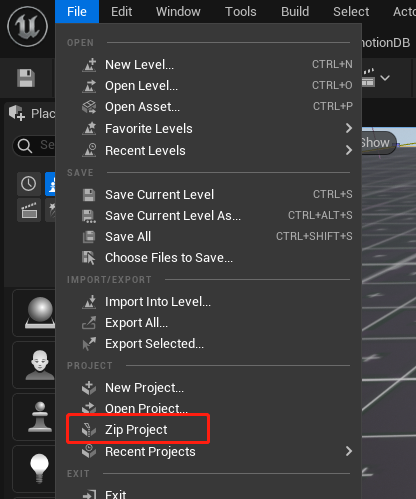
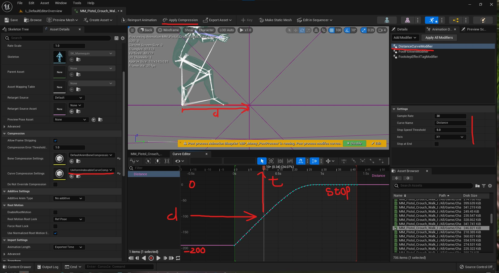

## 文本转语音
[虚幻5 TextToSpeech官方文档](https://docs.unrealengine.com/5.0/en-US/text-to-speech-quickstart-in-unreal-engine/)

底层采用的是[Flite](https://github.com/festvox/flite)第三方库

## 一键打包工程

一键生成工程的Zip文件，特别方便！

## Rewind Debugger

[虚幻5 Rewind Debuuger官方文档](https://docs.unrealengine.com/5.0/en-US/animation-rewind-debugger-in-unreal-engine/)

特别棒的调试工具，可以记录Runtime时的状态，并且实时回放，查看每个时间点的状态，并且有很强的扩展性，是调试Animation的完美工具。

这个工具对于PoseSearch也是不可或缺的，我们参考下《Control中的MotionMatching》以及《最后生还者2中的MotionMatching》就知道带有回放功能的调试器是多么重要了~
[视频123]

## Stride Warping, Distance Matching, OrientationWarping, SlopeWarping
之前Paragon分享所提到的程序化生成动画的全部功能也随着UE5一起放出了~

(上面图片来源于推特大佬[games_inu](https://twitter.com/games_inu))
## Mirroring Animation
[虚幻5 Mirroring Animation官方文档](https://docs.unrealengine.com/5.0/en-US/mirroring-animation-in-unreal-engine/)

后续我会出一个专门介绍Mirroring animation的文档

## TODO 持续更新！