《Control》 中的MotionMatching
============

嘉宾：Llkka Kuusela, Ville Ruusutie 

视频地址：[GDC 2021 Animation Summit: Take 'CONTROL' of Animation](https://www.gdcvault.com/play/1027146/Animation-Summit-Take-CONTROL-of) 

ppt地址：[GDC Vault PPT](https://www.gdcvault.com/play/1026988/Animation-Summit-Take-CONTROL-of) 

Remedy(绿美迪娱乐)游戏产品： 

 
 

## Go!

本次演讲会涉及到以下内容：
* 如何建立自己的动画技术栈和流程
* 如何提升游戏的响应灵敏度
* 如何从头使用MotionMatching
* 如何建立对动画师友好的工具集
* 如何解决中途出现的一系列问题

《Control》是个什么游戏呢，视频介绍下。

{视频1}

随后，我们制定了游戏的一些核心目标：
* 专注于Gameplay
* 提升动画质量但不影响控制手感
* 比《Quantum break》响应灵敏度要求更高
* 更多的同屏敌人数量
* 包括飞行，投掷等超能力

那么如何才能提升响应灵敏度呢？  
* 代码驱动移动
* 无动画的情况下也能正常运行
* 设计人员能够针对手感问题进行快速迭代
* MotionMatching是个不错的尝试方案！ 

那么什么是MotionMatching呢？
MotionMatching是在UbiSoft在2015 Nucl.ai上被Michael Buttner提出，2016 GDC上Simon Clavet做过《荣耀战魂》MotionMatching应用的演讲, MotionMatching背后是一堆动画数据，我们会先生成path(trajectory),如果是玩家的话，基于玩家的输入数据，如果是NPC/AI的话，基于他们的路径数据，有了path和current pose后，会在动画数据库里面查找最适合的帧进行播放，这个过程每帧都会执行。  

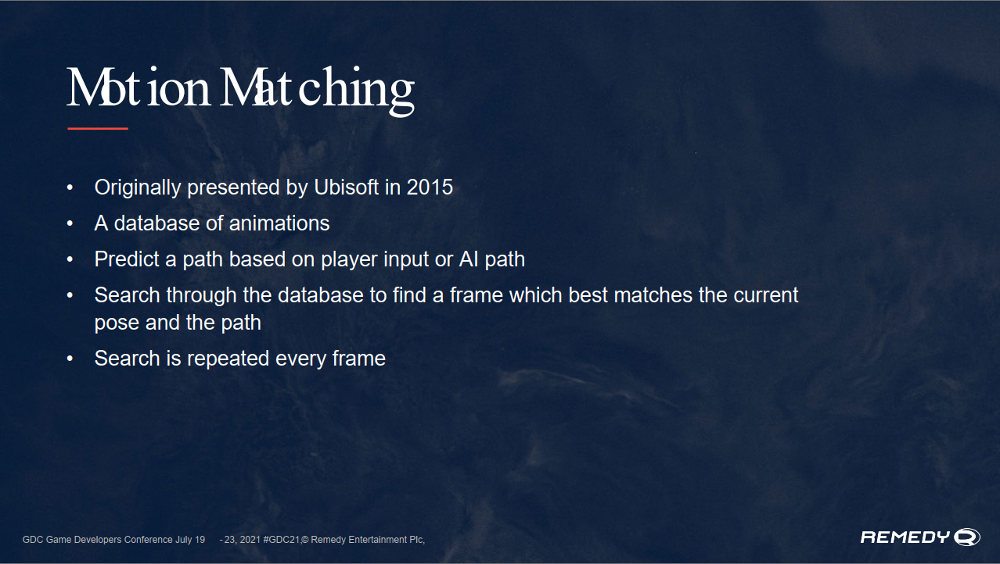

视频讲解了原理。(需要注意的一些信息是: path预测点使用past点和future点。ankle位置速度，hip direction, head height。)

{视频2}

我们这时候开始制作MotionMatching的原型，我们使用的是Morpheme的第三方中间件(后面埋下了伏笔...)，我们自定义了MotionMatching的节点，制作了简单path预测，动画资源使用的是育碧的dance cards([github地址](https://github.com/ubisoft/ubisoft-laforge-animation-dataset)), 我们定义了MotionShader,用于计算pose和trajectories如何比较，可以进行快速迭代。(MotionShader的详细说明可以参考[Michael Buttner的演讲](https://www.youtube.com/watch?v=z_wpgHFSWss))

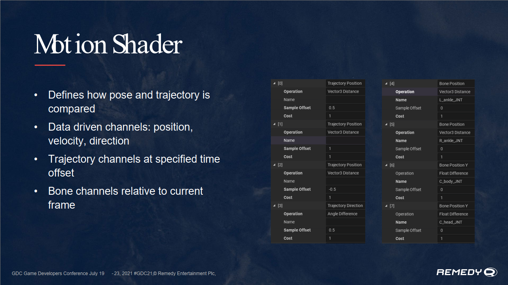

为了更好更精确地控制使用动画，我们添加了Tags，我们把locomotion state分为了Idle,Start,Stop和Move,并在动画上做了标记。

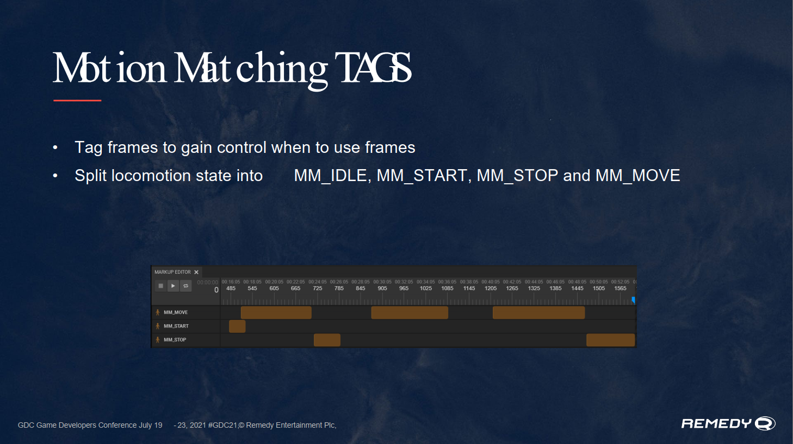

做完运行我们看下效果。我们直接使用的raw data，没有对动画数据做过任何调整，表现的相当出色！

{视频3}

目前来看，它的表现很棒，对于path的改变能做出反馈，runtime情况下，motionmatching内部维护的state特别少，只有animation index和start time,并且对于内存的使用也可以接受，每帧内存量是固定的。总的来说，特别好！  

但是天不遂人意。我们使用的第三方中间件Morpheme下架了......我不得不停止了原型的开发，开始评估下一步如何办。市面上确实有不少中间件但大部分都不太满足我的需求，我们还需要基于它们做大量的二次开发，而且这些中间件也有潜在的下架隐患，所以我们决定建立我们自己的工具和流程。 

我们制定了一些计划：
* Runtime性能以及快速迭代
* 为了简化Player Graphs，我们提供了下面这些有用的Node
  *  MotionMatching 的Node，作为一个核心功能
  *  之前的PlayerGraph有大约一万个Node，大部分都是一些Math Node，导致Graph很复杂
  *  我们提供了Expressions表达式的Node，用来简化Graph
* 从之前的中间件汲取营养，实现一些实用的功能
* No state machines，后面解释。  
  
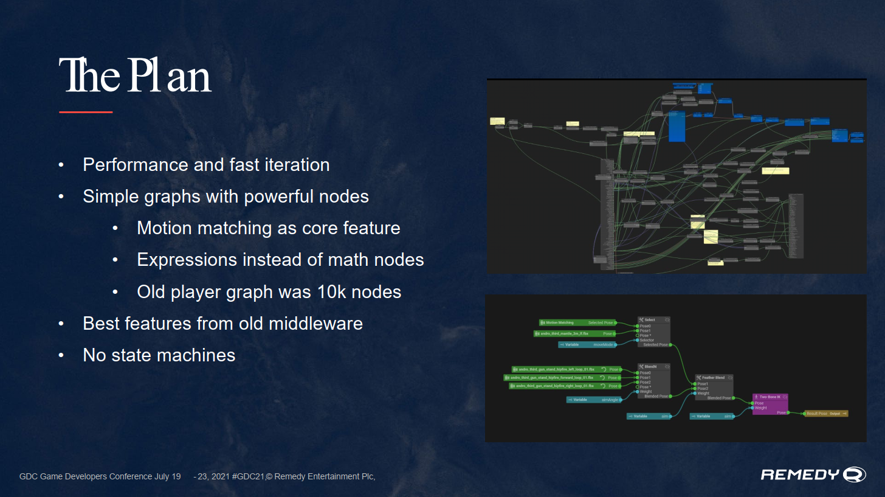

我们最开始制作了一些基础功能，Code driven movement only，提供了一个blend tree，input和内部var, expressions等。 

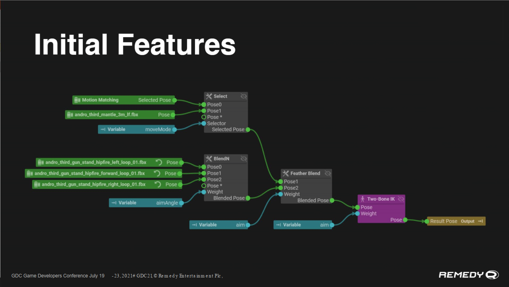
 
(feather blend应该是用于分层的，比如上面的动画应用到upper-body上)

针对与expressions的功能，我开发了用于expressions的语言，语法类似与shader中的HLSL,它的运行时机在graph evaluated之前，可以接收input用于计算，也可以导出一些计算后的变量供其他节点使用。

我们提供了expression node，可以放到任何graph需要的地方，只有当这个node active的时候才会执行，在我们开发一些功能原型时，这个节点特别有用。

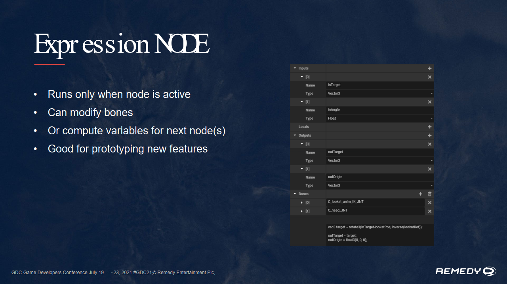

这时候新需求来了，E3 Demo！只有6个月的时候，玩家需要若干技能，4种敌人，而且所有的功能都要运行在我们新的工具和技术上(嘉宾战术喝水)。

我们需要指定下紧急计划：  
* 所有的locomotion使用motion matching
* 将graphs拆成不同的layer，不同的动画师可以协同工作
* 使用expression去完成缺失的功能项
* 幸好还有些时间在新的tech上去完成这些

为此，我们添加了Animation Mixer,它允许指定每个Graph的顺序，并且可以指定运行时是在physics前还是physics后(或者dialogue前后)，并且可以指定自己要处理的bones Set，基于此，Graphs可以在不同的characters共享。

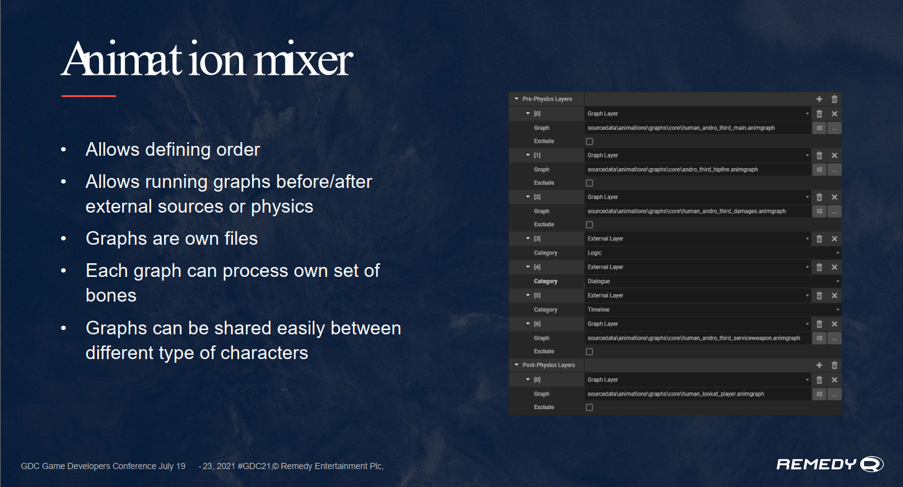

为了支持layer，还开发了Input Pose，Input Pose是上一个layer返回的bones信息，当然了，如果上一个layer没有active，那么Input Pose就会skip,这是一个常见的优化方式。

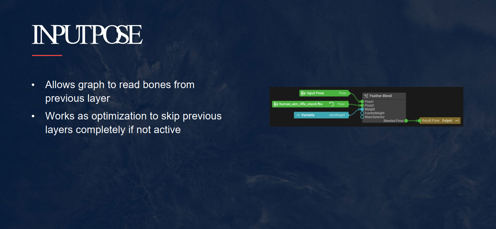

上面我们提到了“No State Machine”, “No State Machine”是指“No animation specific state machine”, 减少不同系统间出现的state machine不匹配的问题。《量子破碎》游戏中出现一直跌落的bug就源于此，花了1个月还是没有完全修复。

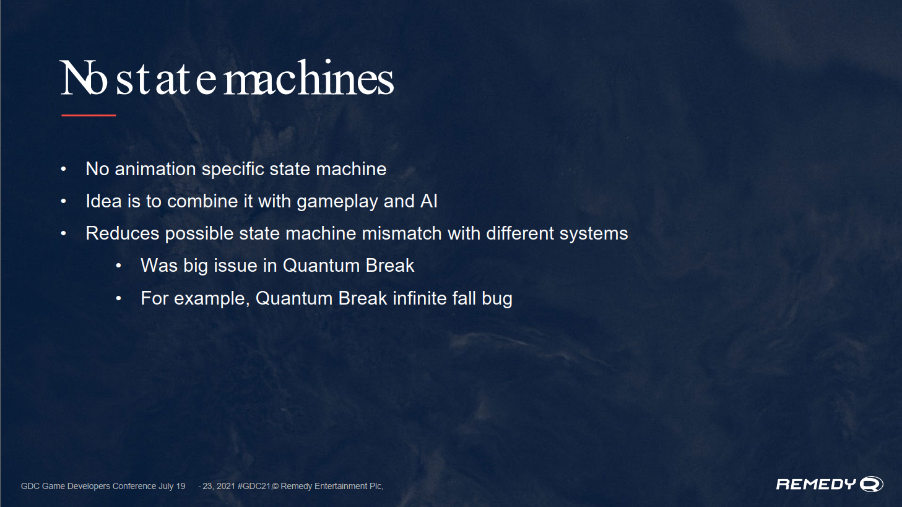

举例来讲，如果其他状态切到Idle时我们会先执行一个Transitions到Idle，然后执行Idle Loop，MotionMatching在这里处理Transitions，执行完毕后紧接着执行Idle。其他Running切换也是这个道理。

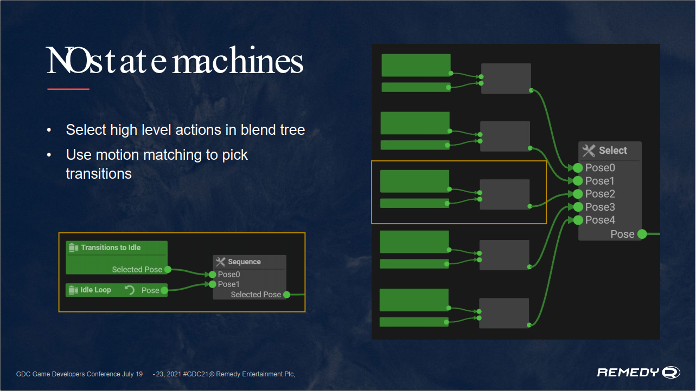

现在很遗憾的是我们这个功能还没有做完(嘉宾战术偷笑)，所以目前使用expression的方式写状态机脚本，使用timer完成transitions，虽然不建议，但是能跑。(关于No State Machine我的理解是logic应该是状态机，尽量不要在动画执行上面也加入状态机的机制，否则可能出现不匹配而导致bug)

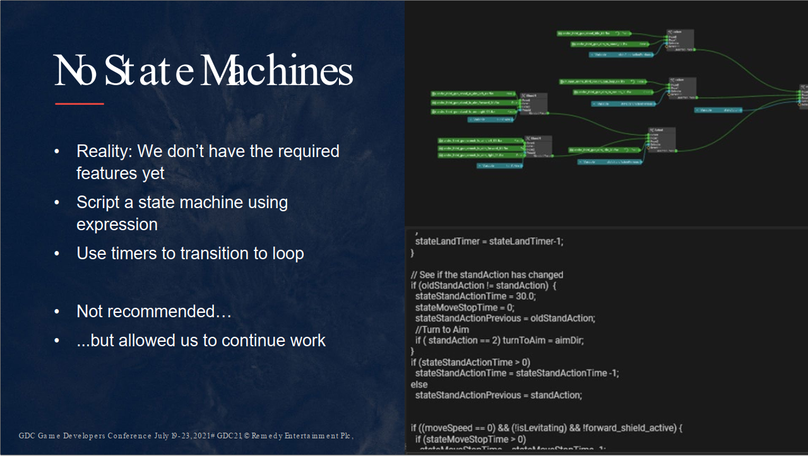 

同时我们也开发MatchNode, MatchNode背后是一堆动画数据，需要从code传入目标位置和朝向，MatchNode会找出最合适的动画帧并运行。为了能够完美匹配目标点，我们内置了Motion Warping功能，同时我们也支持Animation driven movement。

我们开发了一些Markup, Matching用于哪些区间段的帧可以用于MotionMatchingSearch，Position Warping和Rotation Warping用于Motion Warping。  

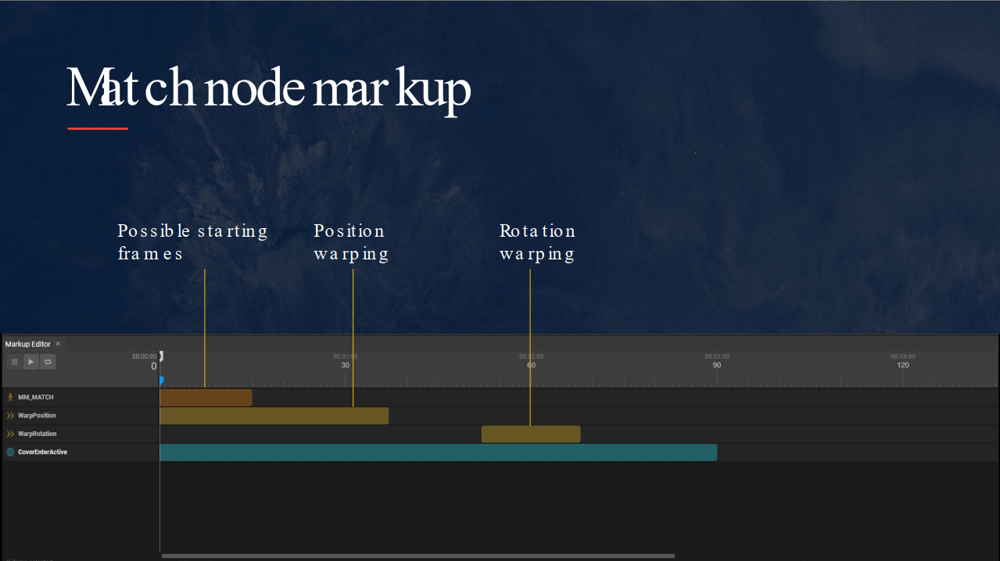 

然后视频展示了NPC在Moveto指定Transform位置时的表现(视频提到了73%的Poision Warping不知道啥意思，后面研究下Motion Warping应该就知道了)。

{视频4}

(至此，Ville老哥的演讲结束了，换成了llkka。 吐槽下，Ville其实全程在读ppt，细节没有多说一些)

在制作E3 Demo时我们面对的第一个挑战就是如何使用MotionMatching来制作locomotion，我们在制作中发现了不少问题，包括如下:
* Start动画经常不能正常播放
* Stop动画不能正常播放
* 有滑步，当切成code driven motion时，滑步现象更加严重。
* 会出现动画卡住的现象(get stuck)
* 跑步时loop动画表现怪异，通过debug发现loop一直从不同的Animation中反复切cycle。

{视频5}

这时候大家都在为E3 Demo做开发，没有时间去提升Motion Matching本身，所以我们只能利用目前手头现有的东西去提升质量。

在解决问题前，我们心里必须清楚MotionMatching的原理和算法，站在算法的角度上去想，如何才能让MotionMatching选中我想播放的那个动画，没有选中我想要的动画，哪里出现了问题等等。

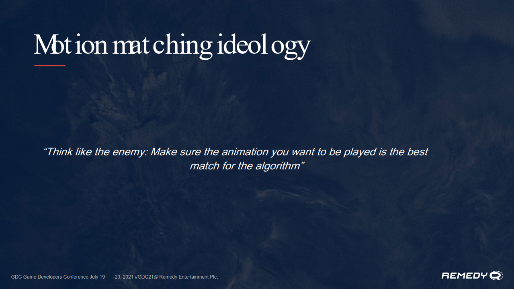 

我们试想下，如果game发出了请求，我们动画库中有完美契合的动画，那么效果肯定会特别棒的。所以我们尝试着修正动画来满足Motion Matching一些关于Path的请求，修正方法是按照Gameplay的信息去精确调整速度，调整加速度曲线(这也是顽皮狗反复强调的数据一致性)，通过这种办法可以有限的减少滑步现象，对于MotionMatching效果有特别明显的提升。

我们视频举例看下，刚开始我们模拟了游戏内的运动情况，包括填入速度，加速度，转向等，紧接着我们让动画同步动起来，我们发现动画在后半段已经偏离motion太远了，调整动画后可以看到motion已经和动画完美契合了。  

{视频6}  

但是我们不可能把动画库中所有的动画都处理掉(可能是因为E3 Demo的缘故，我觉得应该把发布时所需的动画都处理下)，为此我们创建了一个小的动画集，里面包括了已经修正过的动画包括Start,Stop,Loop等traditional locomotion set，我们的Motion Matching在这个动画集中运行良好。

通过上面的操作，我们解决了Start,Stop不能正常播放的问题，同时也解决了滑步的问题。不过我们仍然存在偶现角色在一个Pose上卡住的问题，现象像下面视频展示的这样。  

{视频7}  

我们发现当玩家弧度转向的时候就会出现这种问题。原因是为了保持这种转向，玩家一般会一直改变摇杆的input，但是预测的路径一般是先有一段弧形的转弯然后拉直，所以MotionMatching会一直返回turning animations的后半段动画帧，一直播放这个动画帧就会导致卡住的问题，这其实挺难解决的，但是我们仔细想了想，出问题的动画帧其实不应该被直接jump to的，只有在turn animation完整播放时这些动画帧才有意义，基于这个思路，我们添加了一个Ignore的Tag,被此Tag标记的区间段不允许被直接Jump to，但是在continuous playback时可以正常使用。像下图看到的，Move仅仅头10帧支持Search。

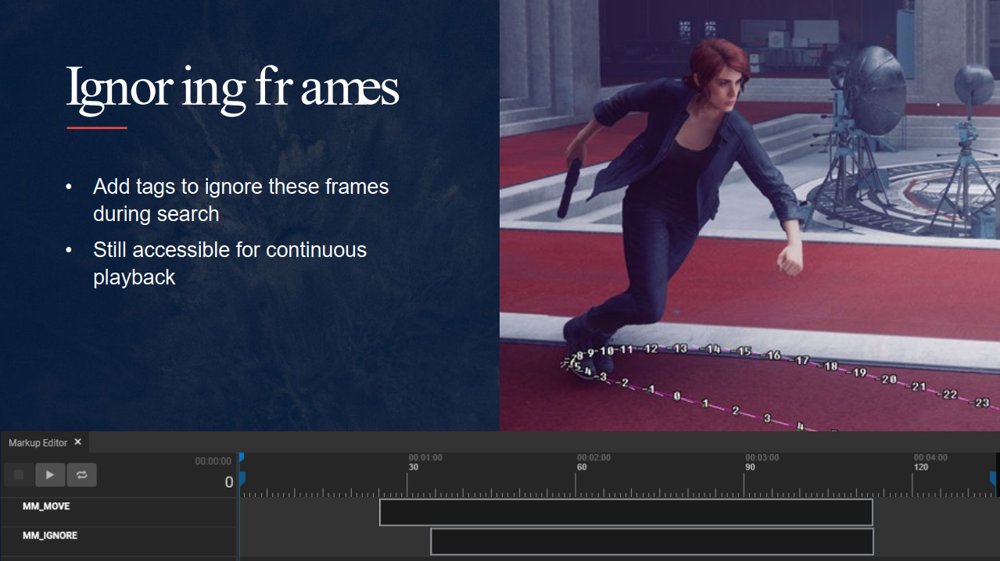 

可以看到对于精确控制MotionMatching, Ignore Tag是个特别有用的工具，不仅仅可以解决上面提到的卡住问题，你还可以用它来解决一些风格取向的事情(比如你想让stop动画始终用单脚plant的，那你可以把双脚plant的动画Ignore)，同样的，如果希望你的Start动画也始终从头播放的话，那么后Start后面的部分Ignore即可。还有需要Ignore的是transitions的tails部分，因为游戏内会存在很多的transitions动画，这些动画后面都应该接上Loop帧,所以最终你的动画库里面会分布着很多相同的Loop帧的动画，这也是为什么会出现播放Loop动画的时候，效果都是一些琐碎的帧拼凑的，我们通过Ignore的方式可以指定这些Loop帧只有在播放Transition的时候才能播放，这就解决了我们Loop的时候也出现Stuck的问题，还有就是non-looping的动画末尾也需要添加上Ignore，因为即使跳到这些帧上播放的话，很快又要跳到别的动画上去，所以说跳转到这些帧上毫无意义。通过Ignore我们Motion Matching查询上也快了~20%左右。  

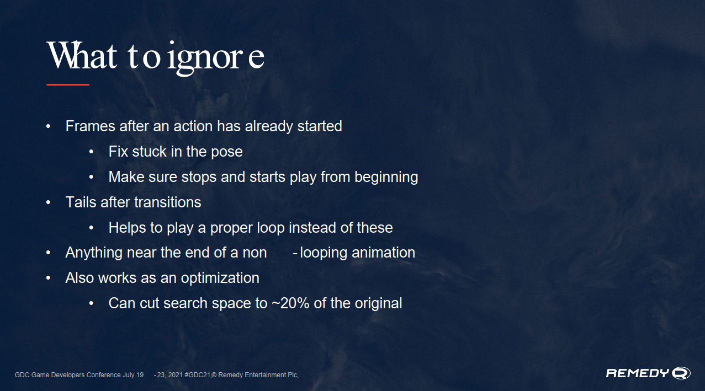 

至此，上面提到的那些主要问题都得到了解决。  

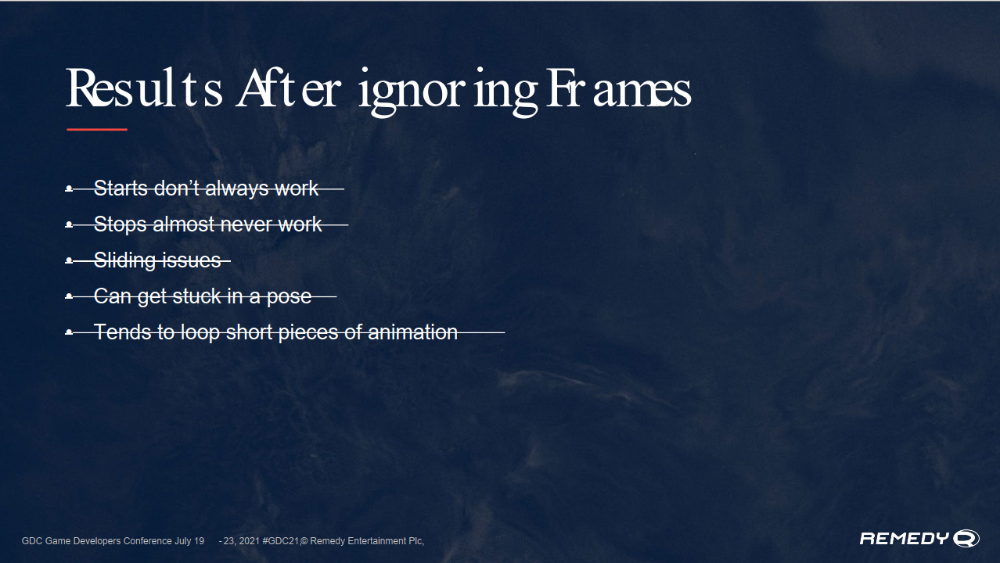  

最后我们需要跟Abilities结合，还是传统upper-body融合那一套，因为是non-strafe移动，所以所有动画都要支持各个角度的，特定情况下需要用Fullbody动画。

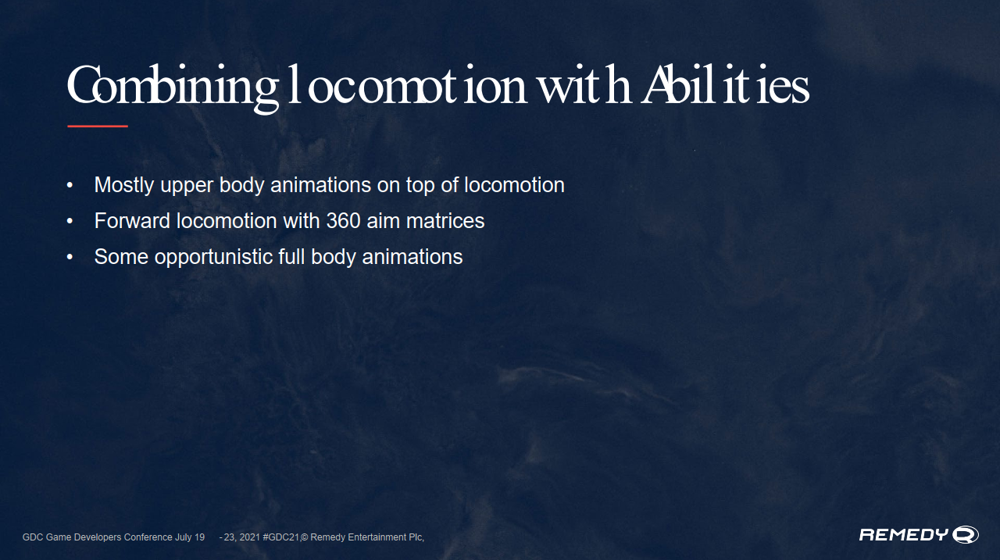  

E3 Demo Done!!!

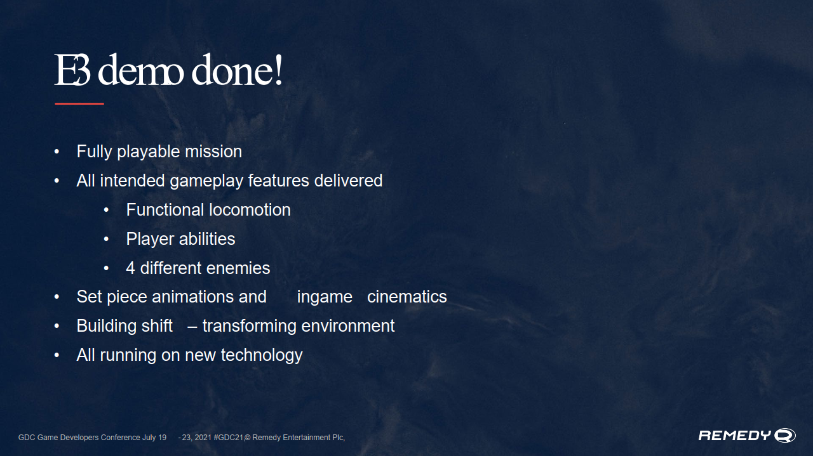  

{视频8}

E3 Demo之后，我们基本上完成了我们的基础工作，我们也正朝着我们的目标继续前进，包括游戏的反馈更灵敏，Runtime性能更好，以及对于动画师能够快速迭代等，目前看，Match Node确实是一个很大的成功。  
但使用中我们也发现，使用Motion Matching也存在很多困难，其中包括:
* debug和控制好它仍然不是很容易。
* strafe locomotion仍然存在问题。

先说下我们的debug，我们的debug刚开始很简陋，只有一些很简单的信息，比如当前的Animation id, frame, cost，还有就是如果动画发生了切换，那么cost值应该是多少的时候才能切换回来等。其实后面我们更想知道一些更重要的信息，比如为什么我的动画被打断了，为什么某个我觉得合适的动画没有被pick呢。

  

接下来视频演示了下最新的debug工具，工具能显示所有的动画集和每帧的情况，右边高度图显示的是每帧的Cost高度值，鼠标放上去可以显示这一帧的cost详细，也包括tag信息等，你同样可以切换到motion shader查看修改值，每当你修改时，所以的帧会重新计算cost值来响应改变。你可以暂停游戏修改值然后继续游戏来查看变化。最后我们添加了一些路径和skeleton的可视化，然后提供了一个滚动条可以查看游戏录像，可以查下某一帧为什么没有选取你觉得理想的动画帧。  

{视频9}  

为了更精细化地控制Motion Matching,我们添加了一种"data-driven category tagging system",它允许我们在动画中添加一些自定义的category Tag/Event,随后我们在游戏内可以请求播放带有指定category的动画,这套机制也被称为soft category tags，是因为我们可以设置惩罚值，惩罚没有从指定category选取动画，如果我们严格要求必须从指定的category里面选取动画，可以把惩罚值设置的高一些，如果不是严格要求的话，可以设置低点，这样的话，当指定的category都不太满足时，会选取一个不是指定category的动画帧。

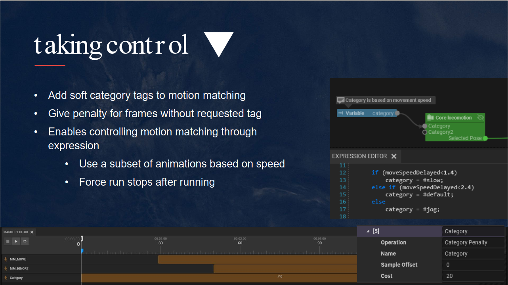  

接下来我们解决strafe过程中的滑步问题，滑步问题出现的原因是我们动画库里不可能有各个方向的motion，当出现路线和选取的动画不一致时，就会出现滑步，我们只要旋转下lower-body就可以解决了。下面图中可以看到，橙色的线时玩家想走的路径，绿色的是选取最接近的动画路线。  

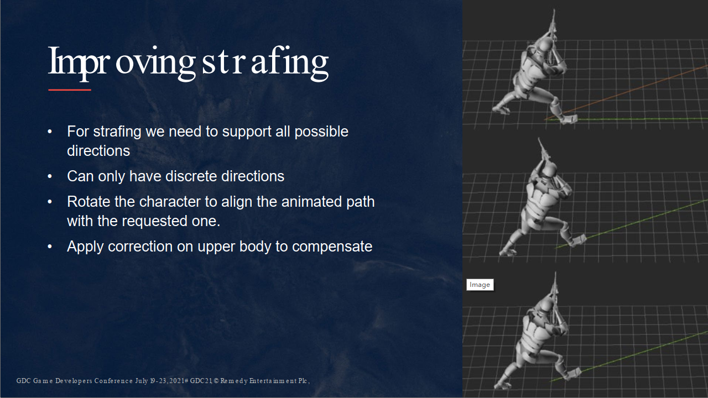  

这时候关于Enemy的工作已经越来越完善了，动画师对于Motion Matching的理解越发深刻，使用Motion Matching创建动画越来越得心应手。同时我们Player的movement有待提升，下面的视频可以看到，当运动的情况过于复杂时，发现了Player后背方向开枪，技能切换时动画衔接不流畅，有些很重要的动画被吞掉了。

{视频10}

我们的目标是减少由于changing input带来的问题以及使main action能表现地更好一些。  

我们先解决罪魁祸首之一 Hip Fire,我们想摆脱由于upper-body和lower-body结合导致的表现僵硬的问题，我们用Full-body动画进行了替换。我们制作了strafe locomotion，这时候角色不会在moving的时候不得不转向了，经过测试，在复杂的input情况下表现得更好了。  

{视频11}  

为了hip-fire和normal-locomotion可以正常transitions,过渡到hip-fire的transition动画放到hip-fire动画集中，过渡到normal-locomotion的transition动画放到normal-locomotion动画集中。对于transition到hip-fire,我们使用category播放我们理想的transition动画, 对于transition到normal，我们没有设置category，使用默认的即可(后面说timed for maximum responsiveness，应该是对过渡时间有要求，比如两帧，能够快速响应开枪。我听的好像是这意思)。

接下来介绍了Lanuch功能，Lanuch功能点其实跟hip-fire类似，因为最后没有时间再重新做Lanuch动画了，所以大部分的做法是拿hip-fire的动画，旋转90度，改变下Pose，齐活！  
(后面视频主要说了下Lanuch功能的一些动画细节部分比如可以支持Full-body以及Upper-body，支持两者的blend以及最后的效果)  

{视频12}

We made it!游戏发布了，游戏制作花费了3年。

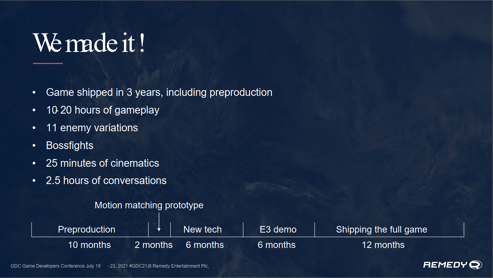 

## Bonus:Beyond Control
游戏发布已经有一段时间了，我们期间做了其他相关的工作。我们更加关注提升游戏品质和工作流。  

### Animation Driven Motion Matching
最大的一项功能就是Animation驱动Motion Matching。
* Animation Driven最大的好处就是**more grounded,organic feel**
* 这些功能可以应用到Player和NPC上，对于Player，只有有需要的时候才会使用，大部分情况下还是Code Driven，对于一些情况我们觉得动画质量比Control更重要的时候，我们会切成动画驱动。对于NPC，默认是动画驱动的，当前也允许设计师根据应用场景进行切换。在路线行走的问题上，我们应用Animation Driven的方式是角色仍然会按照正确的路线行走以避免pathfinding带来的问题，行走的速度来源于动画。
* 为了配合Animation Driven，相关的工作流也做了微调，比如之前是movement生成trajectory，然后找动画去适配它，现在变成先animation,然后基于动画数据再进行trajectory。

对于Animation Driven Motion Matching的使用方式，我们有两种：一是使用动画数据中的rotation and position, 另外一种是仅仅用rotation，position还是code driven,第二种方式对主控玩家来讲特别好，因为既保留了控制的灵活性还解决了旋转上的movement和动画不同步问题。我们制作了相关的Tag，指定哪些帧要被用于Animation Driven。比如有个180度的转身，可以把转身区间设置成Animation Driven，这样转身的时候更自然更准确，由于其他区间还是Code Driven，又能保证Control的灵活性。
### Distance Based Matching
我们新增了Distance Based Matching，不像之前那种，需要指定1秒之后我应该在哪里，换成了，我沿着路径走1米，应该停留在哪里，这样完全跟Speed剥离了，如果动画集中有众多速度的动画，采用这种方式往往能pick出更好的动画。

### New Channels
为了保证Animation Driven正常工作，我们新增了Channel。当玩家在strafing移动时，由于Code不再驱动character rotate到正确的方向，这时候就很难找到正确的动画了，添加这个Channel是告诉MotionMatching我当前的朝向和运动方向偏差是多少，辅助找到正确的动画。

(完)

## 我的总结
* 快速迭代, 大厂都特别关注快速迭代，不管是效果还是工具，都必须支持快速调整。
* Debug工具, 其实也是为了快速迭代。
* Trajectory 同时使用past和future。
* Motion Warping与MotionMatching的结合方式需要研究下。
* 数据一致性也提到了。
* Animation Driven的本质是希望动画效果更真实，更扎实，更自然！