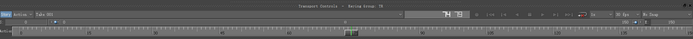

# 《MotionBuilder ProTips》01 - Basics - UI Overview

本系列是我学习MotionBuilder过程中做的笔记内容，学习的是[Jonathan Colin](https://www.jonathan-colin.com/)在油管上的《MotionBuilder ProTips》系列。

## Dropdown menus

左上角的菜单项会在下一篇专门来讲，这里顺便提了一嘴Window Menu，为了在双屏幕下编辑方便，可以在Window中创建单独的窗口并放到另外一个屏幕上。

## Viewport

A: 编辑场景内的坐标系  
B: 会显示选中物体的名字  
C: 位置，旋转或者缩放的信息，会显示为WorldSpace或者LocalSpace  
D: 工具栏，可在此设置WorldSpace还是LocalSpace，位置还是旋转还是缩放，还有一些方便框选的工具  

## Timeline

可以用鼠标拖动，使用``鼠标中键``点击也可以跳到直接位置。按住Shift + 框选可以在Timeline选择多个关键帧

## Navigator

Navigator如同Maya中的Outliner一样，场景中的物体按照类型分类列举在此，双击物体可以查看属性。

## Dopesheet and FCurves

Dopesheet个人从来没有用过，因为Timeline已经很方便了。

FCurves如同Maya中的GraphEditor一样，可以在此编辑修改关键帧的信息。其中一个技巧是选中多个物体后可以只修改其中的X位置信息。

## Story Mode

Story特别重要，它如同Maya中的TimeEditor, 可以在此创建Track并且添加动画，如果想在场景内激活生效，可以点击左上角的Story按钮

## Key Control
无新内容

## Layer

Layer Mode默认情况是Additive

## PoseControl
无新内容

## Properties

默认情况是Default(Type)，建议选择为All

Enable Transformation: 是否锁定Transformation，false的话则锁定，不让拖动不让修改

Enable Selection: 是否可以被选中，一般Model不勾选此项

K表示该属性可以被Key值，Key值成功后会变成红色；
A表示Animatable, 是否可以被Key值，如果整个MotionBuilder所有的Take中该值没有被Key过，会显示成深灰色，点击A可以使之可以被Key值；
在该属性已经被Key值的情况下再次点击A，会弹窗提醒是否删除掉所有该属性的Key值，使之变为unAnimatable

某个属性可以被Key值也意味着该属性可以被RelationConstraint设置。

也可以在PropertyEditor中为该物体创建自定义属性。

只有选中该属性后才可以在Timeline看到key值的情况，不选择任何属性时，默认显示KeyControls选择的TR

## Filters

无新内容

## Asset Browser

可以在此添加自己的文件夹，可以向场景内拖入Constraint, Marker, Cube, Material, Script等。

Marker通常用于ControlRig, Marker的外观可以在属性内进行编辑

## Groups

可以对一些物体打组然后批量处理，比如视频中_EXPORT存储Bake所需的骨骼体，ALL_CTRLS存储所有的Ctrls, Male_Base是所有的Models, 可以批量设置其不可被Pick和Trs(对应属性内的Enable Selection和Enable Transformation)

## Character Controls

如果刚开始只有骨骼体和Model, 第一步要做的就是建立Character