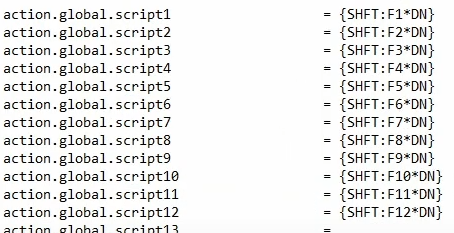

# 《MotionBuilder ProTips》03 - Basic - Layout and Customization

<!--  -->

摁住Ctrl拖动子窗口可以让子窗口独立显示，否则的话，窗口会自动停靠到最近的位置

自定义Layout时可以创建多个Navigator, 并且可以设置Navigator的Filters

作者自定义了多个
JoCo_Default:
JoCo_Expert_Mode: 导出动画时使用
JoCo_Full_Navigator: 方便查找资源，编辑属性，约束以及Story等
JoCo_MonoScreen: 所有项目都同屏，方便教学使用
JoCo_Tuto:

## User Settings saving locations

自定义创建的Layout会存储在Documents/MB/{Version}/Config/Layouts

Preference的配置也是txt, 名字为 *.Application.txt, 路径是Documents/MB/{Version}/Config/ 

## Scripts keyboard mapping

快捷键触发python脚本的方法：
bin/config/Scripts/ActionScript.txt 配置ScriptID对应的py路径
然后在快捷键文本Maya.txt上配置对应的快捷键

## Download

[作者分享了他的配置](https://drive.google.com/drive/folders/17gnx5rZNJQYhOJTKS2wbzuLcaMgyd8Rz)