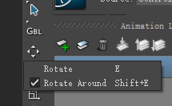

# 《MotionBuilder ProTips》04 - Basic - Viewport

<!--  -->
## Viewport

角色在MotionBuilder的朝向应该是Z轴正方向，此时Ctrl+F切到前/后视图，Ctrl+R切到右/左视图 Ctrl+T 切到顶/底视图

Alt+Enter或者View菜单FullScreen都可以进入全屏

## Undo Redo

Ctrl+Z 回滚Undo, Ctrl+Y Redo

Alt+Z Camera Movement Undo, Alt+Y Camera Movement Redo

## Schematic View

节点模式特别的重要，你可以在这里看到物体之间的组织关系，当场景里的物体隐藏或者不可被选择了，你依然可以在节点模式里选择它们

如果节点太多显示杂乱的话，可以右键重新排列他们。勾选Auto Arrange的话，重新排列会自动完成

点击图片中的减号可以把子节点折叠起来

(TODO: 各个节点不同颜色代表着什么含义？)

## Display and Shading

快捷键2, 3, 4, 5, 6, 7可以以不同模式显示，比如无textures, wireframe等等，如果选中了Model再按快捷键，可以仅仅对选中物体做不同模式的显示

## Gizmo and Transformation tools

摁小键盘的+和-可以调整Gizmo的大小

最外层的黄圈是相对于屏幕空间旋转的

## Rotate Around

设置为RotateAround后，可以看到旋转的Gizmo最外圈颜色由黄色变成了橙色, 选中ControlA, 再选中ControlB再进行旋转，可以看到ControlA在围绕ControlB进行旋转, 这个功能特别有用

## Trajectory curve

勾选右上角的Trajectories，在选中Control后可以看到它的轨迹数据。如果希望即使不选中也始终显示Trajectory, 可以去属性窗口勾选Show Trajectories(前提是勾选了Viewport右上角的Trajectories)