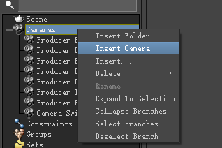
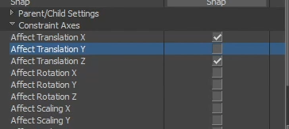
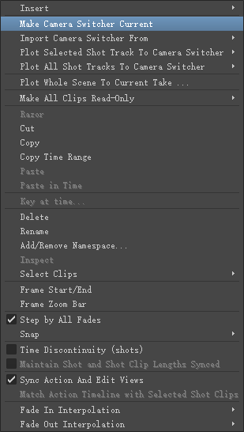
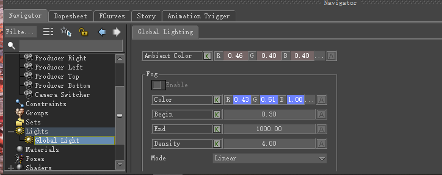
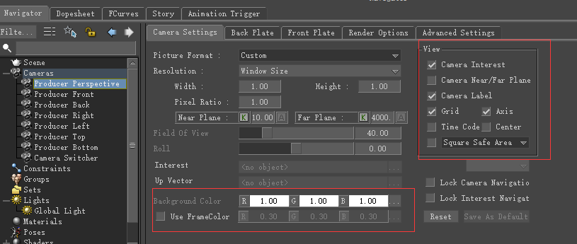

# 《MotionBuilder ProTips》05 - Basic - Camera

<!--  -->
## Camera Setup

两种方式可以创建Camera, 一种是直接向Viewport内拖入Camera, 另外一种是Navigator中右键创建

## Constraining the Camera

作者演示了下Camera始终跟随Root_Ctrl的操作

1. 拖入Camera后，再拖入一个Null, 将Null设置为Camera的父节点(Ctrl+W进入节点模式，框选Camera和CameraInterest, 按住X, 拖动到Null节点上，指定为Parent)
2. 创建一个Parent-Child的约束，约束物体是刚才创建的Null, Source为Root_Ctrl
3. 通常需要对约束的属性进行编辑，比如旋转和Y向位移不生效等等

## Camera Animation

如果仅仅对位置进行Key值，那么Key Controls仅仅设置TR即可，如果需要对FOV或者其他的Camera属性Key值，可设置为CurrentCamera

## Shots

将不同的Camera拖到Story Shot Track中可以编辑相机动画(放入所有轨道后记得MakeCameraSwitcherCurrent)

$\color{red}{TODO: 这里有个问题是Clip1动画帧是[0, 30], Clip2动画帧是[0, 20], Clip1和Clip2首尾相连播放时，Clip1播放完毕时Clip2其实已经播放完了，再切换相机没有意义了，应该有相关的设置}$

## Light & Camera Settings

GlobalLight可以设置环境颜色以及Fog相关

相机设置更为丰富，可以设置背景色，以及是否显示帧号，是否显示网格，是否显示安全区等等