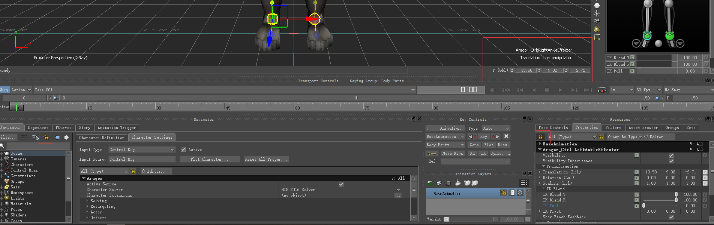

# 《MotionBuilder ProTips》06 - Basic - Navigator

<!--  -->
## Navigator

Navigator按照类型进行分类，有的类型下面没有任何物体，表示场景内没有该类型的物体

## Takes

可以在Navigator切换也可以在下拉框切换

## Keep Selection

如果在Take1中选中了某个Ctrl, 这时在Navigator双击了另外一个Take2, 那么刚才选中的Ctrl就会失去选择，因为在Navigator双击的操作会告诉MotionBuilder当前要查看Take2的属性。如果通过下拉框选择Take2的话，Ctrl会继续保持选中状态，这在有的情况下特别有用

还有一种情景是希望锁住某个物体的属性框，即使当前选中了其他物体，比如为了方便比较属性。左边的Lock图标是锁住Navigator属性框，右边的Lock图标是锁住右边Properties的属性框。通过上图可以看到，当前右下角Lock的是角色LeftAnkleEffector的属性，但当前选中的是RightAnkleEffector

## Lists organization

通过创建新的文件夹方便我们整理和组织数据，但Takes和PoseControls中无法创建Folder, 作者手动创建了特殊的Takes并使用---进行前缀命名进行分割归类，也算是一种小技巧吧

## Select Branches

在Navigator选中一个物体后，效果也仅仅是选中了这个物体本身，而不会选中它所有的子物体，如果想删除该物体以及所有子物体的话会非常不方便。右键物体选择Select Branches则会选中所有与此物体相关的物体，选中后再删除。

