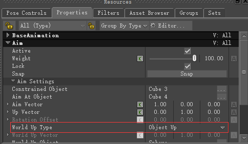
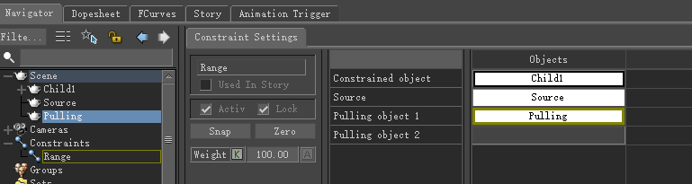

# 《MotionBuilder ProTips》07 - Basic - Constraints

<!--  -->

[MotionBuilder2022 关于Constraint的官方文档](https://help.autodesk.com/view/MOBPRO/2022/ENU/?guid=GUID-716BCDA2-4D3E-4187-830E-F792FCFA02BB)

[MotionBuilder2022 关于Constraint Settings的官方文档](https://help.autodesk.com/view/MOBPRO/2022/ENU/?guid=GUID-01B6416C-3DA5-4D76-9760-8D641BA293CC)

## Parent-Child

这里提到了一个技巧是想让Cube变大时设置的不是物体本身的Scale, 而是Transformation Pivots/Geometry Offset/Scaling, 这个属性设置的是视觉显示本身。


SkeletonRoot和Null可以在属性框 SkeletonRoot Settings/Size，Null Settings/Size中设置

Snap表示保持Parent和Child的相对位置不变，可以看到移动和旋转SkeletonRoot的时候Cube也会跟着移动或者旋转，此时也可以手动旋转Cube，它们之间的相对位置信息保存在Parent-Child Constraint的属性中


但大部分情况下我们不希望用户可以手动旋转Cube, 这时候可以勾选Lock，就会锁住相对位置信息，即被约束对象不再可以被单独旋转


有时候不希望有任何Offset，即Parent和Child的Transform(不单单是Position)信息是一一对应的，那么可以设置Zero

Parent-Child可以设置多个Parent，Child最终的位置受Parent-Child Constraint属性中的Weight影响


## Weight and Baking

被约束的物体在约束前就有一个位置P1, 被约束后的位置为P2, 约束属性中的Weight就是控制这个权重的，当为100时位置为P2, 为0时位置为P1


常见的一个错误操作是Child是被约束物体，Parent是约束物体，Weight设置了一个数值比如20，当Key完动画并且将Child位置bake到轨道后(此时Child的位置就已经发生变化了)，如果约束继续Active的话，会发现位置向Parent靠近了，记得把Active的勾选去掉

## Point Constraint

Position Constraint只能约束物体的位置，当Source旋转时，Constrained Object停留在原地且不旋转。当Parent-Child去掉Affect Rotation后是不是效果就一样了呢？


我们可以通过视频看下不同：

{Parent-Child与Position的区别.mp4}

可以看到，即使Parent-Child去掉了Affect Rotation，当Parent旋转时，Child的位置依然发生了变化，不过Child的全局朝向不再发生改变了，而在Position Constraint中，当Source旋转时，Constrained Object的位置始终不发生改变。另外一个注意的点是，即使Lock生效了，Constrained Object也可以被手动进行旋转

Rotation Constraint同理，只对旋转生效，而且这时Rotation Constraint的Zero表示Source和Constrained Object设置为相同朝向，而不是相同位置

## Anim Constraint

Anim Constraint可以控制让Constrained Object始终指向Anim At Object，比如常见的眼球控制，具体用哪个轴指向，以及Up Vector指向哪里(或者指向什么物体)都可以在Properties中控制。如果World Up Object指定了场景物体，那么Properties中的World Up Type需要指定为Object Type



## Three-Point Constraint

Three-Point Constraint本质是个Rotation Constraint, 它使用三个物体的Position来控制Constrained Object的旋转信息


根据官方文档的解释，Origin和Target的位置决定了Constrained Object的X轴朝向，Up决定了Constrained Object的Y轴朝向

## Multi-Referential Constraint

Multi-Referential Constraint在官方文档里举了个例子，比如人靠近车，上车跟着人一起行驶，然后下车等，可以设置人为Rigid Object，而将车设置为Parent Object，如果KeyControls中的Ref没有设置车(即Parent Object)，这时候车和人都是独立的，人上车后可以Ref设置为车(即Parent Object), 这时候车和人就成为了类似Parent-Child的关系。

$\color{red}{TODO: Multi-Referential Constraint中的Parent Object是不是只能与KeyControls配合的时候才有效果呢？ 没有KeyControls的参与如何使用看Parent Object的效果呢？}$

在视频里提到的是Multi-Referential Constraint的另一个用途：

```
You can also use the Multi-Referential constraint with multiple Rigid objects and no Source object to create a multiple-pivot effect. The Rigid object currently selected in the Reference (Ref) field is used as the Source object.
```

简单总结就是设置多个Rigid Objects不设置Parent Objects就可以让Rigid Objects互为父子关系, 这个用途就很广了，比如在枪口位置添加一个Null, 然后将枪和Null同时加入到Rigid Objects中，需要围绕枪旋转时可以选中枪再旋转，如果想围绕枪口旋转，选中Null再旋转

## Mapping Constraint

Mapping Constraint在官方文档中的解释是：

```
The Mapping constraint lets you map one Parent/Child relation to another Parent/Child relation. You can use it to scale movement between limbs or other structures of different sizes.
```

本质就是使用一个Parent/Child去映射另外一个Parent/Child


如上图所示，Child1是Constrained Object, Parent1可以看作是Child1的Parent, 其他两个设置项是Child2, Parent2, Mapping做的就是Child2相对于Parent2的偏移映射到Child1到Parent1上

## Range Constraint



如图所示，Child1是Constrained Object, 当约束激活时Source与Pulling的距离为L, 移动Pulling时如果Pulling与Source的距离小于L，那么Child1会重叠在Source上，当Pulling与Source的距离大于L后，Child1会跟着Pulling移动，保证Child1与Pulling的距离为L。可以看做Pulling与Child1之间有一条长度为L的软绳一样。

当不移动Pulling而移动Source时会产生一个有趣的现象就是Child1的移动范围始终在以Pulling为圆心，半径为L的区域内

## Relation Constraint

Relation Constraint特别重要，它是基于节点编辑的，如图所示：


MB提供了很多基础计算的节点，包括Bool，Vector，加减等，将任何物体拖动到编辑面板后会出现子菜单，Sender/Receiver，Receiver就是Constrained Object, Sender就是提供额外信息的