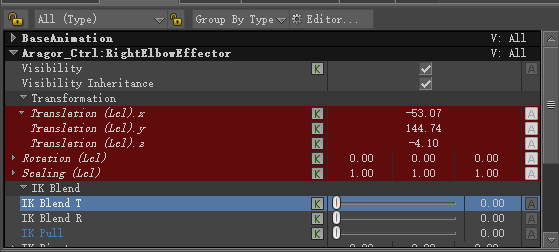
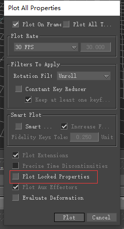
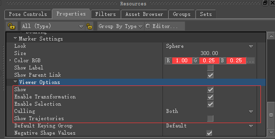
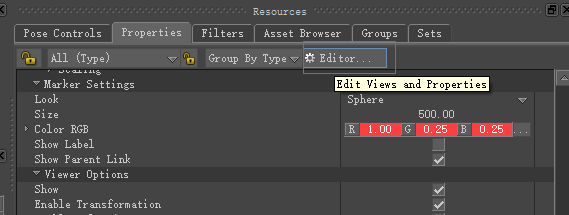
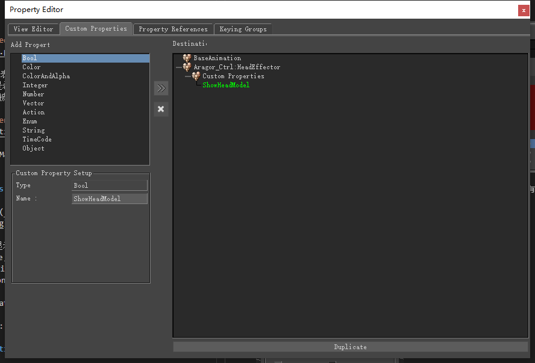
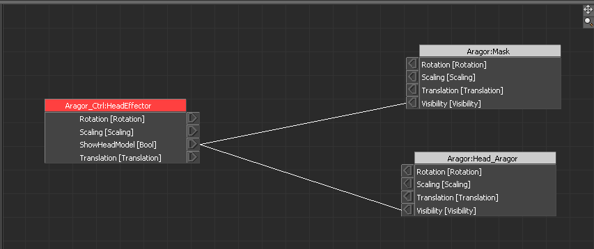
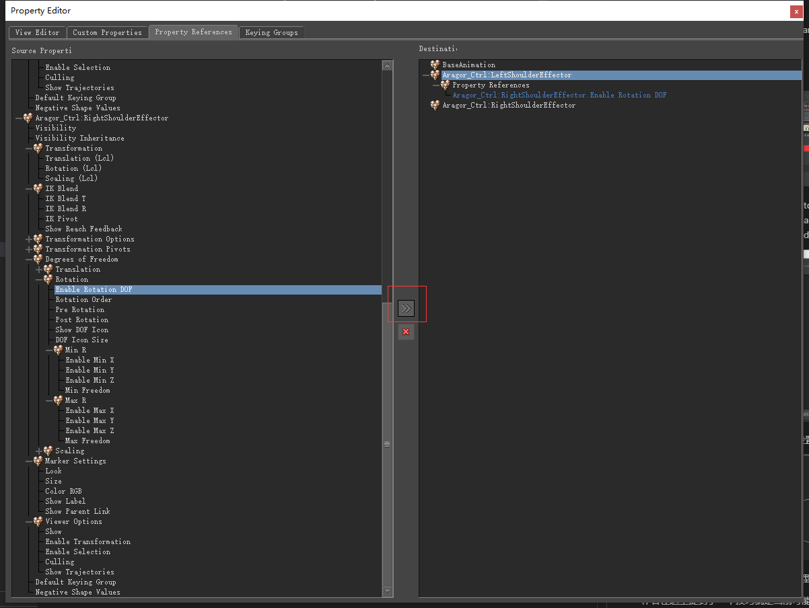

# 《MotionBuilder ProTips》08 - Basics - Properties

<!--  -->

## Properties

如果属性显示为红色表示该属性被Lock住了，右键可以Unlock。Lock属性有个作用是希望Plot selected(All Properties)时可以选择不Bake 那些被Locked的属性

作为Control常用的Marker可以在Marker Settings中设置外观，Size以及颜色等

## Viewer Options

Show: 该物体是否显示其实可以设置Visibility, 但设置Visibility为false，可能会把所有的Children也隐藏掉，这时候可以将Children的Visibility Inheritance设置为false,或者就设置ViewerOptions的Show

Enable Transformation: 是否允许改变Transformation

Enable Selection: 是否允许被选中

## Custom Properties

点击物体再点击上图的Editor，切到Custom Properties页签就可以创建自定义属性了。比如我们在HeadEffector上创建一个bool类型的属性，名字叫ShowHeadModel

随后可以创建一个Relation Constraint设置HeadModel的显隐

通过这样就可以通过自定义属性控制模型的显隐了。

作者在这里提到了一个技巧就是当前可能有多个Takes,并且每个Take设置的ShowHeadModel值都不同，这时候希望所有Take的ShowHeadModel都设置为true并且不想一个一个选择设置，这时候可以在Relation Constraint中将HeadEffector设置为Receiver, 设置ShowHeadModel为true, 因为Relation Constraint对所有Take生效，所以可以执行批量操作

## Reference Properties

出于某些原因可能需要在Hip Effector的属性中显示Head Effector中的ShowHeadModel属性，选中CtrlA和CtrlB后，可以点击Property Editor的Property References页签，可以将CtrlA中的属性设置给CtrlB，这样CtrlA和CtrlB都可以显示和设置ActrlA的属性

