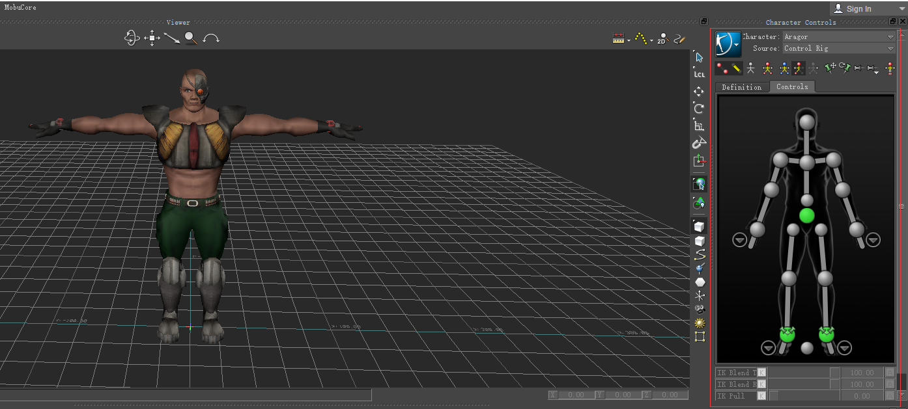
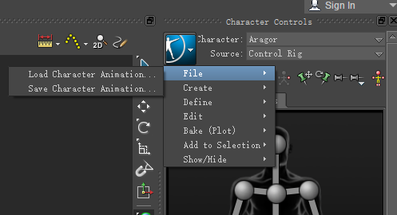
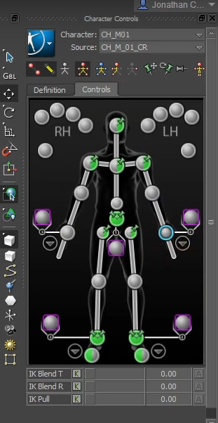
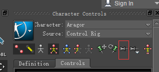
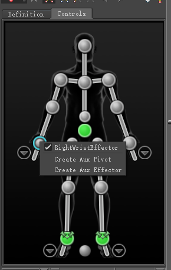

# 《MotionBuilder ProTips》09 - Basic - Character Controls

<!--  -->

## Character Controls

上图就是Character Controls的面板。刚开始拖入到场景的是Skeletal Mesh，即Skinned mesh + bones(sent to game engine), 常说的Characterize角色化就是给Skeleton创建一个Control Rig。一旦创建了Control Rig就可以看到右侧的GUI, 里面的Animation Picker就是动画师常用来调整动画用的。Definition页签由Tech Animator定义。顶部有Character和Source两个下拉框，当场景里有多个角色时Character会显示这些个角色，Source表示当前的动画由谁来驱动，比如Control Rig就表示由红色的IK Effectors和黄色的FK Controllers驱动。设置None表示由raw skeleton使用baked fk data驱动。

激活Control Rig可以从Source的下拉框选择激活，也可以在Navigator找到选中该Character，在属性栏中设置Active Source为true

## Toolbox

File/Load Character Animation: 加载动画文件直接重定向到当前Character上

File/Save Character Animation: 保存动画文件

Bake(Plot)/Bake(Plot) to skeleton: 将当前动画Bake到Skeleton上。动画师Key动画都是在Control Rig上Key值的，发送给引擎的都是Skeleton的fk data，所以最后需要bake到Skeleton上

Bake(Plot)/Bake(Plot) Control Rig: 将当前动画Bake到Control Rig上。导入一些动画文件需要二次修改的话，就需要把Skeleton的fk data Bake到当前的Control Rig上再进行编辑

新建一个Layer, 然后在该Layer上编辑动画，然后Bake到ControlRig上，这时会Bake到BakeAnimation上，新建的Layer可以Mute或者移除掉

想Bake到Skeleton上还有一种办法就是在节点模式下，按住空格键并且右键Root骨骼，会自动选中该骨骼以及所有子节点，然后再选择Key Controls中的Animation/Plot Selected

上图可以看到作者自定义了一些Effectors，比如Left Hand和Right Hand，本来Character Controls提供了左右手的Effectors, 但是在SubView中, 容易误操作。

## Animation Picker UI

ReleaseAllPinning可以临时禁掉Pinning的作用

点击Controls的空白处可以全选所有Objects; 想选择多个Ctrls时需要按住Ctrl键然后点选，按住Shift选择时会选择所有涉及到的IK Effectors; 在Viewport想多选摁住的键是Shift而不是Ctrl;

## Auxiliary Effectors

想在Controls面板中创建额外的Effector比如RootCtrl可以选中一个Effector然后右键选择Create Aux Effector,即可创建, Effector的类型为Marker，可以在属性Marker Settings中更改其外观。

$\color{red}{TODO: Aux Effector如何生效？ 如何向LH RH那样自定义位置以及不显示加号？Aux Pivot干啥的？}$

## Character Extensions

[Character Extensions官方文档](https://help.autodesk.com/view/MOBPRO/2022/ENU/?guid=GUID-74B56BB9-7A04-48C2-9EBE-F6AE0CC312F0)

角色扩展，没有详细讲，只提到Character本身的东西在ControlRig中，额外另加的需要保存到Character Extensions中，比如RootCtrl, Weapon/Prop, Wing等