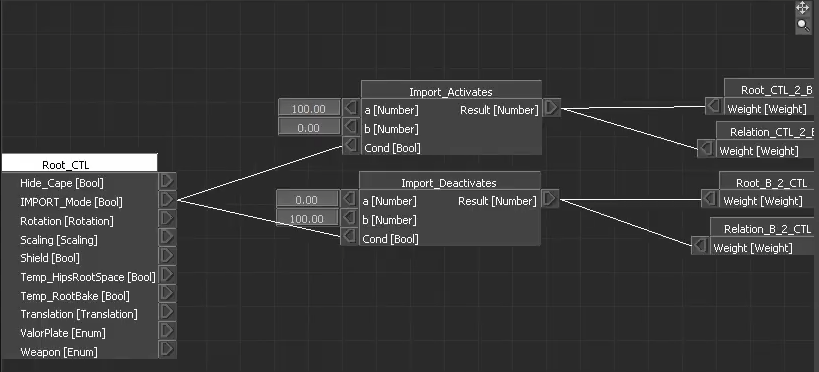
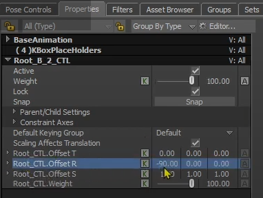
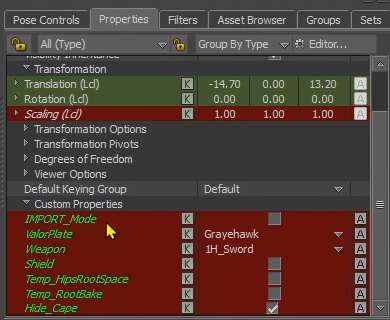
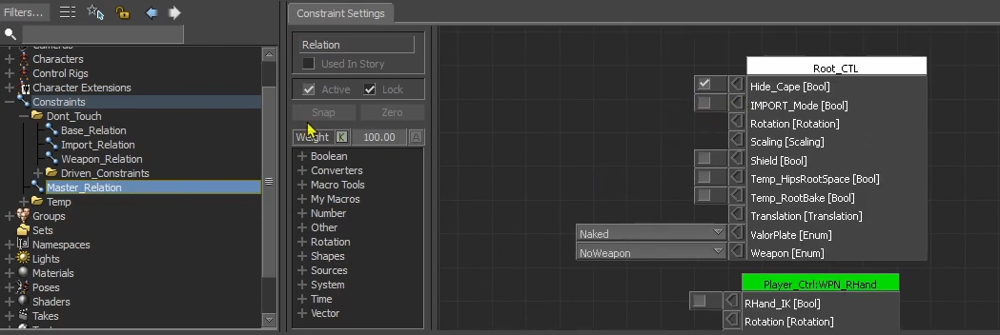
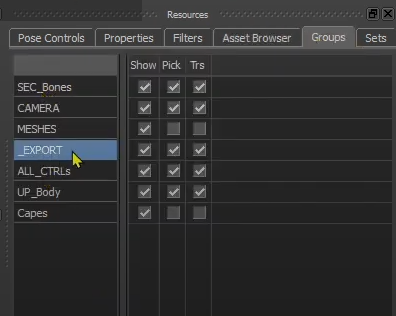
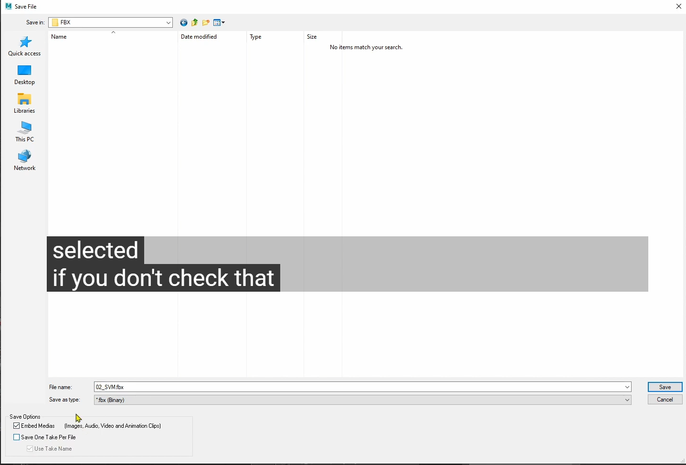
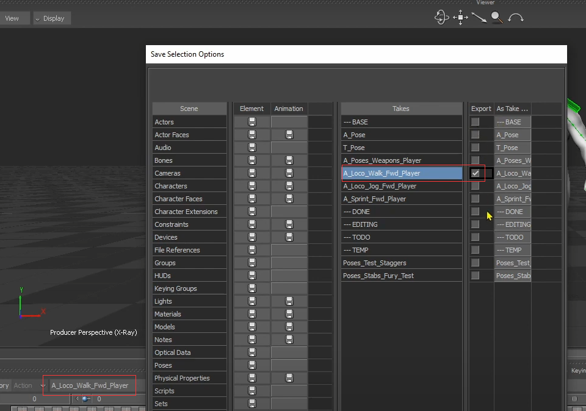

# 《MotionBuilder ProTips》10 - Basics - FBX Import Export

<!--  -->

## FBX Import

1. 将Character Controls中的Source切到None, 这样导入的动画数据是应用到Skeleton而不是Control Rig上
2. 至少选中Skeleton上的一根骨骼
3. 点击File/Motion File Import, 选择导入的动画文件
4. Import Options中有很多选项，可能场景中有多个角色，所以我们在第2步中选择了一个骨骼，In Selected Hierarchy就是导入到选择的骨骼链中，其他选项的更多解释可以参考[官方文档](https://help.autodesk.com/view/MOBPRO/2022/ENU/?guid=GUID-BB1AE0BF-3883-41B2-A8D5-9408351DA6A0)
5. 导入动画后Source依然为None, 动画可以正常播放，但Source切到Control Rig后发现角色没有动画，那是因为需要执行Bake(Plot) Control Rig的操作

## Import an Anim with Root Motion

作者演示了导入RootMotion动画后发现角色并没有位移，那是因为定义了多个RootCtrl相关的约束，而root骨骼因为约束的缘故而没有发生位移。比如Dont_Touch/Driven_Constraints/Root_B_2_CTL, 这是一个Parent/Child类型的Constraint, Child为root骨骼, Parent为Root_CTL, 另外还有一个功能相反的约束Dont_Touch/Driven_Constraints/Root_CTL_2_B, Child为Root_CTL, Parent为root骨骼, 导入后是Root_B_2_CTL生效(Weight为100)，Root_CTL_2_B不生效(Weight为0), 因为是Root_CTL控制了root的表现而不是刚导入Animation Data，作者称之为Animation Mode，但我们希望导入数据阶段时能够保留住，当然我们可以手动去激活Root_CTL_2_B，手动禁用Root_B_2_CTL，但我们也可以再单独创建一个Relation Constraint去控制他们，路径在Dont_Touch/Import_Relation

当ImportMode设置不同的值时，Relation会分配相应的Weight给Root_CTL_2_B和Root_B_2_CTL。

这里需要注意的是属性中的OffsetR为-90或者90, 这是为了方便Maya和MotionBuilder，UnrealEngine之间的转换。

通过ImportRelation的图我们可以知道通过设置Root_CTL的属性值IMPORT_Mode可以设置，但这里把这些属性Lock住了(不可以手动修改了)，那是因为不希望误操作把这些值Key到动画里，那该怎么设置呢？ 作者提供了另外一个Constraint：Master_Relation

可以看到这里可以有很多的控制项，之前我们提到过Relation Constraint的好处那就是对全部Scene,全部Takes生效。勾选好IMPORT_Mode后可以看到角色的根骨骼移动了，这时再执行Bake(Plot) Control Rig, Bake后记得取消勾选IMPORT_Mode，否则的话Root_CTL不能再被修改了。

## Export

在导出前一定要确定IMPORT_Mode是没有勾选的，我们点开Group:

我们之前在讲Group中提到过会把导出所使用的Bones都放入_EXPORT组中，可以点击_EXPORT后会自动选中所有相关的骨骼，这里提到了一些骨骼不会放到_EXPORT中，比如一些仅仅用于FingerIK使用的骨骼(FingerTip指尖)，选中好骨骼后，点击KeyControls中的Animation/Plot Selected(All Properties), 这时会把动画Bake到Skeleton上，将Character Controls中的Source设置为None可以验证下，这时继续保持选中_EXPORT组，点击菜单File/Save Selection进行保存。

Save One Take Per File就是每个Take生成单独的fbx, 不勾选的话就会生成到一个fbx内，不太方便，所以默认勾选。然后选择到保存的Take，最后保存即可。

