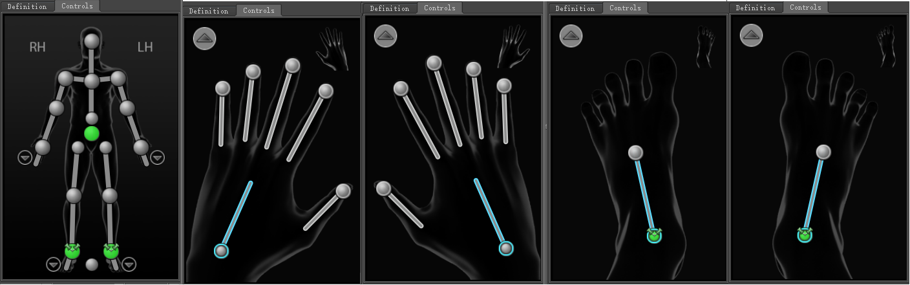
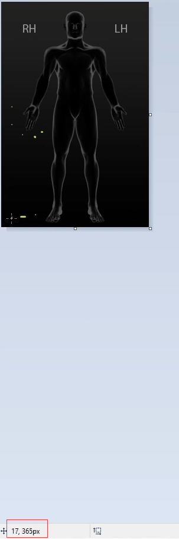
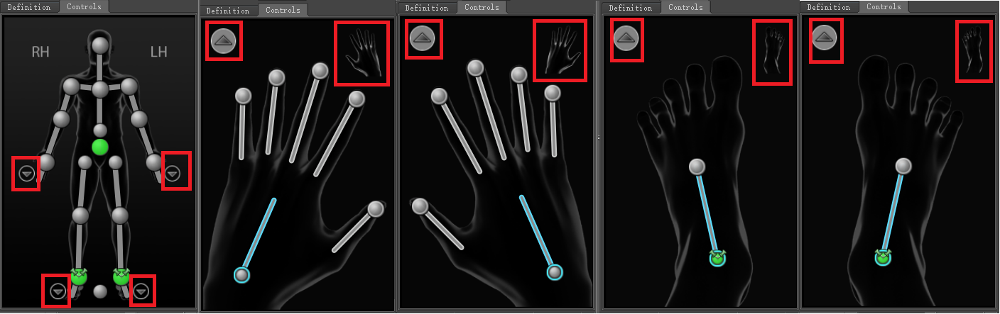

# 《MotionBuilder ProTips》11 - Basics - Picker Customization

<!--  -->

## Intro


本文主要讲的就是如何自定义Picker面板中的Ctrls, 在介绍之前先推荐一个[GDC2014的演讲	Technical Artist Bootcamp: Hacking MotionBuilder: 10 Things You Aren't Doing but Should Be!](https://www.gdcvault.com/play/1020639/Technical-Artist-Bootcamp-Hacking-MotionBuilder), 本文的内容来源于此。

## Loading a custom UI

作者[分享了他相关配置的文件](https://drive.google.com/drive/folders/17gnx5rZNJQYhOJTKS2wbzuLcaMgyd8Rz), 下载好后将bin文件夹拷贝到安装目录中去，拷贝过去的其实就两个文件，一个是FullBody.png, 在原来的图上增加了LH，RH的文本显示，另外一个是名为CharacterControlsConfig_JoCo的xml文件。拷贝完成后点击下图的Load UI Configuration, 加载刚才拷贝的xml文件就显示出来了。


## Understanding the XML file

```xml
<View resource="FullBody">
  <Anchor name="navLHand0"      x="220" y="205"/>
  ...
  <Navigation anchor="navLHand0" goto="1" layer="5" resource="GoToArrow" tooltip="Go to Left Hand view"/>
  ...
  <IK anchor="ikHips0" body_part="Hips" id="0" layer="2" resource="Effector" tooltip="Hips">
    <Expander anchor="expHips0" item_offset="22" direction="down" max_shown="4" resource="Handle" layer="4"/>
  </IK>
  ...
  <FK anchor1="ikRWrist0" anchor2="ikRHand0" body_part="RightArm" id="14" layer="3" tooltip="Right Hand"/>
  ...
</View>

<View resource="LeftHand">
  ...
</View>

<View resource="RightHand">
  ...
</View>

<View resource="LeftFoot">
  ...
</View>

<View resource="RightFoot">
  ...
</View>
```

xml的大致结构如上，LeftHand, RightHand, LeftFoot, RightFoot, FullBody依次代表如下视图：



每个view开头都定义了该view下所有物体的名字以及像素点位置，比如navLHand0这个Anchor的坐标信息为(220， 205), FullBody, LeftHand, RightHand, LeftFoot, RightFoot的图片存放在bin/system/CharacterControls/DefaultImages中，通过MSPaint打开后可以在左下角看到当前鼠标的坐标信息:



知道了怎么获取位置信息，我们就就可以去修改原来的Ctrl坐标信息或者在哪些位置新增一些自定义的Ctrl了。

继续往下看可以看到Navigation的节点信息，该节点定义了那些跳转按钮，如下图所示的这些:



我们以FullBody中的navLHand0举例，它的坐标在(220, 205)的位置，goto的值为1表示此按钮的作用是跳转到LeftHand View(以0开始计数，即0表示FullBody, 1表示LeftHand依次类推)，layer为表示当两个按钮挨得很近时谁拥有更高优先级，数越小优先级越高越在上面，resource表示按钮资源，tooltip就是按钮Tips。

继续往下可以看到IK的节点信息，IK就是Controls界面上的那些控制球，body_part需要定义角色的哪一部分，id指定了内部的一个EffectorID，作者说这些信息对应CharacterDefinition中的下标，其实我不太认同，它应该对应了内部的的一个长度为43的Effector映射表格，每个id对应了Navigator的Effector实体，我们以id="9"的SplineOrign举例，id等于9按照作者的说法应该是LeftForeArm，但显然应该是ChestOriginEffector, 具体哪个id对应哪个Effector在xml中查询就可以了，MB中应该没有可以直接查询的地方; body_part指定了属于身体的哪一部分，我们在Character Controls中切到Body_Part模式，当选中某个Effector时，跟这个Effector同属一个body_part的所有Effectors都会被高亮选中


IK节点内部可以定义Expander节点，我们以下图的Expander举例，Expander节点可以定义那些可以被展开的节点，item_offset和direction定义了展开的节点创建的位置，如果在下面偏移22个像素点的位置，max_shown表示最多显示多少个


最后是FK节点，FK没有定义自己的Anchor，它的作用是把提供的两个IK Anchor连接起来，因为IK Anchor已经有位置信息了，所以这里会自动连上, FK节点需要提供的id和IK节点提供的id是不同域内的，fk id应该对应的是Ctrl下非Effector的那些实体


## Editing the XML file

上面原理已经讲过了，这里没什么好说的了，就需要注意一点，新增的Anchor名字保证唯一，这样不会出现位置错乱的情况，作者在这一节讲述了如何添加左右脚到FullBody View上，可以自行练习，不懂的再看源视频即可。

