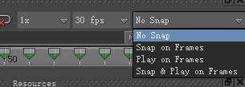
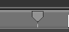
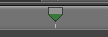
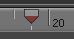
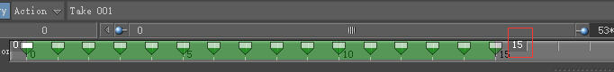
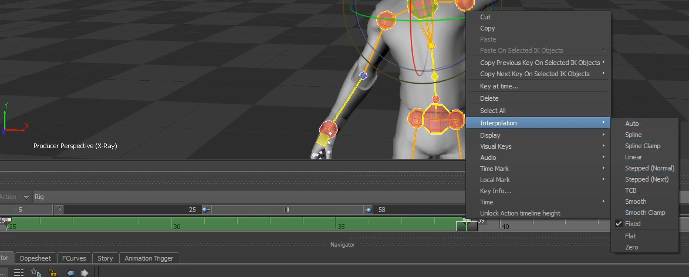

# 《MotionBuilder ProTips》12 - Animation - Timeline and Keys

<!--  -->

## Timeline



No Snap: 拖动时间轴或者播放时会经过Frames之间的位置，方便查看插值细节

Snap on Frames: 拖动时间轴时会自动对齐到Frames上，播放依然可以经过Frames之间的位置

Play on Frames: 相反，拖动时间轴时可以经过Frames之间的位置，但播放时会对齐到Frames上

Snap & Play on Frames:  拖动时间轴或者播放时都自动对齐到Frames上

## Setting Keys

在不同模式下的Key是不同的：



Selection: 在时间轴上显示为灰色，仅仅对选中的物体 K值



BodyPart: 可能存在两种颜色黄色或者绿色，如果是Character Extensions的话为黄色，如果是Base HumanIK一部分的话就是绿色，BodyPart对所有所有BodyPart相关的物体 K值，比如修改了Hand并K值的话，会对肩肘腕都进行K值



FullBody: 红色，会对所有物体 K值

当处于FullBody时在时间轴上移动一个Ctrl上的Key会同时移动其他Ctrl上的Key，BodyPart模式仅仅会移动BodyPart相关的Key

Only (Unlocked) Animatable Properties get keyed

## Editing Keys



比如动画长度为15帧，现在想Scale到30帧，可以像上图那样选中所有Key并且将15改为30即可，不过需要注意的是需要设置为No Snap或者Play On Frames，否则有些关键帧因为计算结果没有在整数帧上而被丢弃(Mode应该选择为FullBody)

## Key Controls



设置插值类型

## Move Keys

Move Keys是特别特别有用的功能，比如一个动画是从原点面向X轴向X轴正方向走去，但希望是面向Z轴向Z轴正方向走去即需要旋转90度，仅仅修改旋转第一帧是不可以的，后面的所有帧都需要应用这个变化，这时候可以做如下操作: 

1. 选中需要操作的Ctrl，可以是Root_Ctl或者Hips
2. 选中需要改变的所有的关键帧，时间轴设置在第一个需要的关键帧位置上
3. 拖动或者旋转选中的Ctrl到目标位置上，我们在这里旋转Hips90度
4. 点击Move Keys即可

Move Keys可用于Reposition Clips, motion capture clips or realign an entire clip to a certain angle

使用Move Keys的话需要禁用Auto Key

```
StoryMode也提供了类似功能，比如旋转、平移整个Takes
```