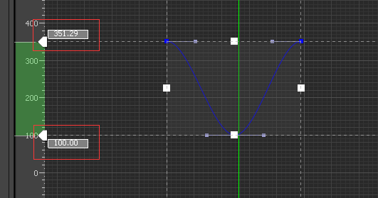
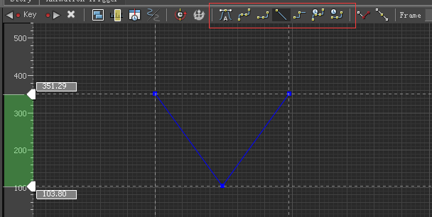
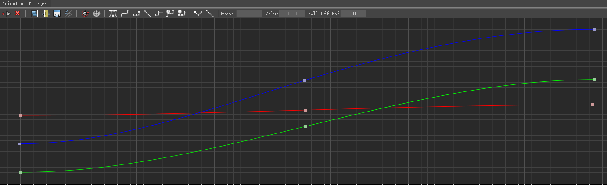
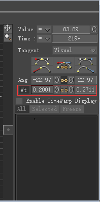
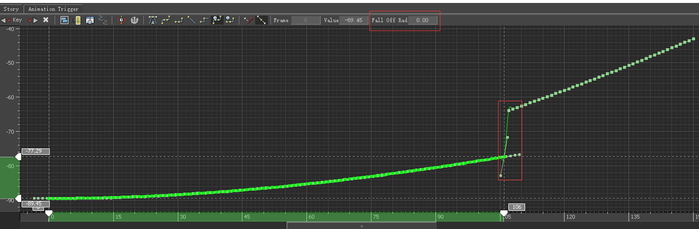
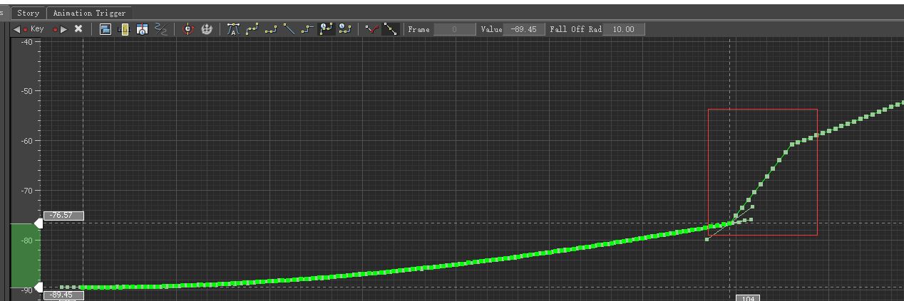
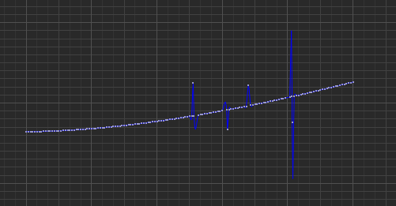
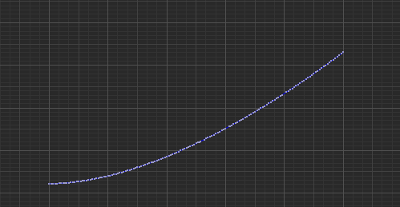
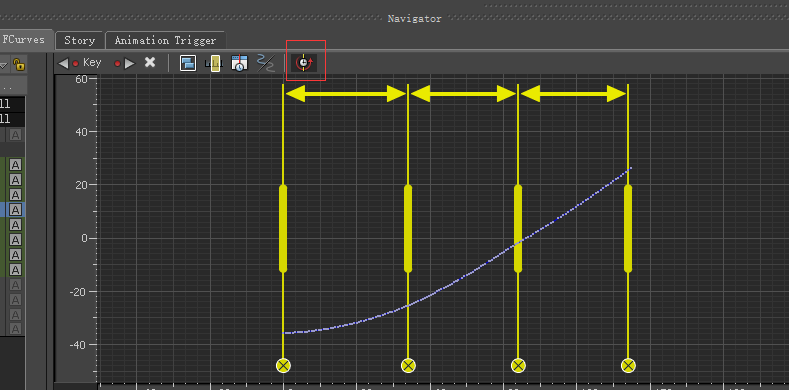

# 《MotionBuilder ProTips》13 - Animation - FCurves

<!--  -->

## Curve Editor

Curve Editor添加关键帧的几种方法:

* 按住`M`键的同时在目标位置使用鼠标中键，可以在目标位置添加关键帧

* `Alt + I`在当前位置插入一个关键帧

手动输入上下两个范围值表现不同，输入上面的值可以做到翻转或者拉伸的效果，比如输入-350则以100为轴做镜像，而下面的值则是整体偏移的效果比如输入200，则所有的点向上移动100单位，即下限移动到200的位置上

`框选若干待设置的关键帧`后，可以设置插值方法，比如Auto, Linear等

有时候希望选中某条Curves的一段，一种办法是按住`Shift`的同时点击所有关键帧，但容易误操作点到其他点上，还有一种有效的方法是按住`Ctrl`+ `Shift`的同时点击Curve上的开始帧和结束帧，这样会自动选中该Curve区间上的所有关键帧

## Edit Tangents

中间的链子按钮表示是左右同时缩放Weight还是左右单独控制Weight

## Edit Baked Curves

选中关键帧向下移动时希望后面的关键帧能有一些反应，而不是直接断开这种，FallOffRad就是设置后面多少时间范围内的关键帧有反应

## Filters

Butterworth用来去除噪点和抖动，可以平滑曲线的工具

Smooth也是用来平滑，但要小心使用，可能对于表演有一些微妙的改动

KeyReducing 减少关键帧

Mocap数据经常出现这种错误数据，全选后使用PeakRemoval即可消除

## Retime Tool

点击RetimeTool的工具可以对时间分段，可以缩放某个区间内的关键帧数据