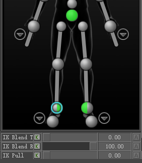

# 《MotionBuilder ProTips》14 - Animation - HIK Control Rig

<!--  -->

## HIK Control Rig

再次提到Character Controls中Source可以设置为None，显示目前的FK Data即导出给游戏引擎使用的数据，当然你也可以在FK上直接K数据，不过极不方便，比如想移动Hips的时候双脚需要锁定等等，所以可以将Source设置为ControlRig

Character可以拥有Character Extensions, 包括Root, Weapons, Props等

## IK and FK controllers

Control Rig由两种Controllers组成: FK Controller(黄色的操纵杆) 和 IK Controller(红色的操纵球)

节点模式下FK Controller通过Parents组织关系，而所有IK Effectors都直接以Ctrl:Reference为父类


## IK Blending

Selectiton Mode移动Hips两脚也跟着移动，但这时希望两脚是锁住的，可以选中两脚后，将IK Blend T和IK Blend R设置为100，再拖动Hips时双脚已经锁住了(除非拉的太远)

IK Blend设置后，Picker上的Ctrl变成了绿色，左半边对应T，右半边对应R



```
IK Blend = maintains WORLD transform of an object

Is my object driven by IK(World Space) or FK(local space)?可以通过这个问题来选择使用IK还是FK

```

## Seamless IK and FK

BodyPart和FullBody Mode下，MB是极其聪明的，因为它知道物体间彼此的关联，当修改Ctrl并Key值后，可以看到相关联的FK的数据也同时发生了变化。

```
Key in Body Part = IK and FK are updated TOGETHER!
```

## Interpolation


通过旋转肩部使手的位置发生了变化，仔细看HandCtrl的FCurve明明是直线，但Trajectory显示为曲线，这是因为IK Blend为0，所以Hand最终位置依赖于FK而不是IK，如果将IK Blend设置为100，则Trajectory变成了直线。

```
要这么说的话，是不是拖动HandCtrl到一个指定位置并K值，是不是最终动画也不是这个位置呢？当然不是了，上面已经说过，当K值的时候FK和IK同时改变了，所以肯定所见即所得

这里为什么会出现曲线问题是因为我们K值的时候只K了起始和结束位置，即FK和IK都记录了起始和最终位置，当IKBlend为0时，Hand的位置依赖于FK数据，而FK数据显示是胳膊转了90度，所以Hand听FK数据的话是曲线；当IKBlend为100时，Hand的位置依赖于IK数据，HandCtrl K的是什么就是什么
```

## Pinning

在某一帧摆Pose阶段，移动FK或者IK，两种Controller都是无缝配合的，即都会临时改变(还没K帧嘛)

```
Pinning is when POSING, IK Blend handles the interpolation
```

Pinning在某一帧摆Pose阶段生效，而IK Blend在处理插值时生效，在Update Pose时Pinning不会干扰IK Blend

## FullBody

Pinning在不同的编辑模式下有不同的行为，比如在FullBody模式下，身体的各个BodyPart都知道彼此，相互配合，因此身体的所有部位都对对方的Pinning做出反应

## Body Part

FullBody模式下，当选中一个Ctrl后所有的BodyPart都会高亮显示(高亮显示意味着当你Key值或者移动时所有的Ctrl都会响应)，但在BodyPart模式下，你选中某个Ctrl，只有同属一个BodyPart的Ctrls才会高亮/响应，我们有如下几个BodyPart: RightArm, LeftArm, LeftFingers, RightFingers, Spline, Hips, LeftLeg, RightLeg, Head等。角色被拆分成了这些BodyPart, 上面说过在BodyPart模式下，你选中某个Ctrl，只有同属一个BodyPart的Ctrls才会高亮/响应，所以当Pin住左手时，移动旋转左肘左肩，Pin始终生效，因为他们同属一个BodyPart，会相互配合响应，但如果此时移动旋转Spline时，左手的Pinning就会失效/被忽略，因为他们属于不同的BodyPart，BodyPart模式下不同的BodyPart互相不配合响应

## Selection


## Manipulation Tips

