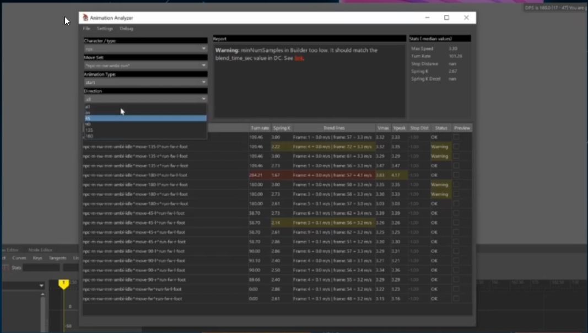
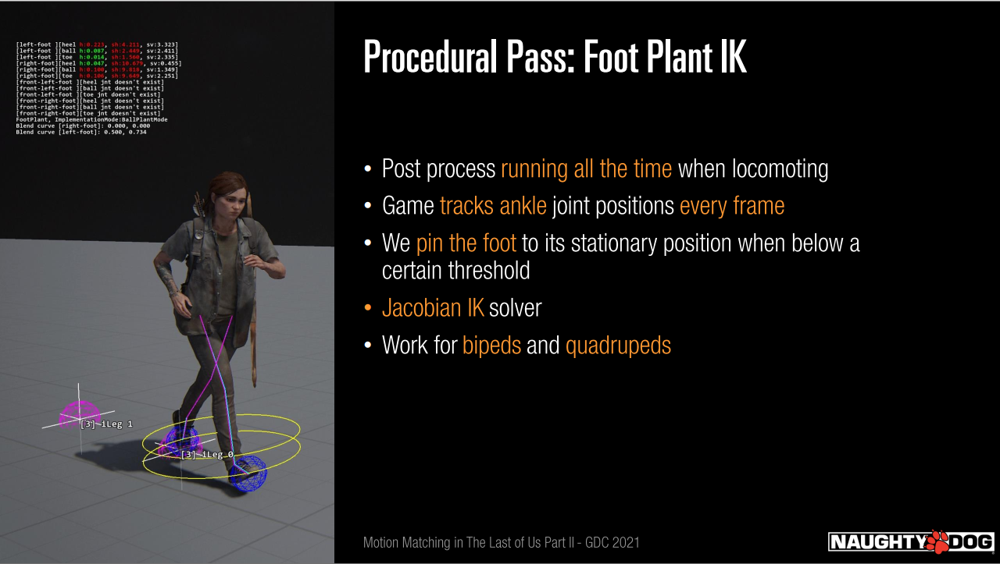

# 《最后生还者2》 中的MotionMatching

演讲者：Michal Mach, Maksym Zhuravlov  
## 前言
由于演讲视频需要GDCVault会员才可以看，所以尽可能地不放演讲视频了，有条件的可以去GDCVault上去看。  
[ppt链接](https://www.gdcvault.com/play/1027118/Motion-Matching-in-The-Last)

下面视频是《最后生还者2》中使用的部分动画技术，可看下使用后的效果。

{视频0}

## MotionMatching的简要概述
育碧三位大佬的三次演讲。
* [GDC 2016 Simon Clavet演讲](https://www.gdcvault.com/play/1023280/Motion-Matching-and-The-Road)
* [GDC 2016 Kristjan Zadziuk演讲](https://www.youtube.com/watch?v=KSTn3ePDt50)
* [Nucl.ai 2015 Michael Buttner演讲](https://www.youtube.com/watch?v=z_wpgHFSWss)

总的来说, MotionMatching的工作流程如下：  
1. 基于摇杆的输入或者AI Pathing的Motion Model提供目标路径。
2. 每帧按照目标路径和Pose在动画库里查找最匹配的Frame。
3. 找到最理想的帧后在角色身上进行播放。
4. 对动画进行一些程序化的调整。
5. 按照第1步再次循环。  
   
对于我们来讲还是特别有挑战，因为这是新的技术，而且没有真正技术落地的经验。    

我们的目标是一个高质量，应用范围广，效果稳定自然，易于使用的locomotion系统。

初版实现的一些问题：  
* 动画播放的连续性和稳定性。对于一些预设角度(45度等)可能只是轻微的抖动，但其他角度(非45度)的表现的令人头大!
* 动画的不确定性。动画集合中完全可能存在路径和Pose都相似但目的不同的动画片段,结果就会出现动画效果不理想。
* 动画频繁切换。角色一直在几个相似的动画clip之间频繁切换，虽然blend保证了效果的平滑，但是由于动画的频繁切换导致丢失了动画资源本身的一些细节。
* MotionMatching是基于信息去查询的，对于动画师不够友好。
* Transitions的效果比较糟糕(Transitions tend to either "stuck" or get completely "swallowed" depending on settings)。 

{初版实现的视频1} 

接下来介绍下顽皮狗关于MotionMatching的解决方案。  

## Our take on Motion Matching  
首先说下RootMotionNode, RootMotionNode是用来驱动胶囊体和RootMotion，在我们系统中我们称之为“Align”，动画中骨骼的Update/Evaluate都是在Align Space下进行的。  
对于每个动画Clip，我们都会**手动**做如下操作：
* 调整运动曲线，拉直或者拉平滑。
* 移除无用的动画。
* Align的旋转要符合后面提到的MotionModel，保持一致。
* 在动画需要的地方“粘贴”上Idle Pose或者Core Pose，这样后续PoseMatching的时候以及动画之间过渡时特别有利。  

(动画的运动曲线跟MotionModel一致性是最最关键的地方。)  

### MotionModel
MotionModel表示的是玩家的Align应该如何移动，是玩家运动的Simulation。（我的理解是跟UE4的Movement类似）使用阻尼弹簧模型去模拟位置，速度，转向速度等变化。(跟育碧一样的)  

在游戏中，我们有几种MotionMode,对于玩家来讲，有Strafe，Non-Strafe(角色和运动同方向), Cover(掩护)等，如果骑马的话，还有Horse Motion Mode, NPC的话，主要是Path Fllowing(沿着路线走)和Path Transition(发现新路线，需要过渡到新路线)。

### MotionModelParameters
大部分参数都是跟方向相关的，因为有可能玩家用不同的速度朝不同的方向走，所以参数都是八方向设置的。 后面还有就是Acceleration spring, Deceleration spring, 最大限制速度，朝向速度等(刚开始没有这项，但是后面发现无法准确预测Future Trajectory的朝向，所以加上了)。最后是RootMotionAllowance，MotionModel生成了预期的运动路线，动画移动玩家，但是玩家不能偏离MotionModel太远否则影响玩法了，所以对于NPC来讲，我们允许Align在MotionModel半径0.3-0.6m的偏移，这样可以保留动画原生的效果。对于主角我们因为要求精确运动，所以不允许RootMotionAllowance。

### MotionMatchingPoseSample
双足使用的是双脚和Top Spine骨骼，四足类使用4个脚加Top spine骨骼，Top Spine主要是为了匹配朝向。

### MotionMatchingTrajectorySample
Future是3个采样点，Past是一个采样点，数据有位置，速度，朝向，转向速度等。

### Animation Data
我们不采用long dance card动画或者unstructed data,主要有以下几个原因：
* 导演指导以及演员表演都不舒服，对于十来分钟的dance card来讲，演员会吃不消，疲惫后会影响动画质量。
* 很多无用的冗余数据，导入游戏后又会引发内存问题。
* 动画师在修改打磨这种动画数据也特别费劲。数据太多，软件打开特别慢。
  
取而代之的是medium to short。

### Player Specific Animation Data
Locomotion应该是个什么样子呢？我们对主角的动画提出了如下要求：
* 玩家直着向前稳定推动摇杆下，动画不应该切来切去。这时候玩家应该用Start,Loop,Stop三个动画，不是五个，更不是十五个。
* 玩家直着向前稳定推动摇杆下，动画过渡应该play out in full(比如从Loop到Stop停脚的过渡,看下面视频演示)。
* 动画后续需要反复打磨修改，可能偏离了原来的样子。
* 动画易复用。
* 给与导演和演员足够的自由，按照他们舒服的方式表演。

{视频2}

早期的探索：
* 动画的内容应该尽可能minimum-enough coverage,移除不理想的动画内容。
* 类似Start,Stop这种类型的动画，同类型动画尽可能长度相同。
* 动画内合适的位置“粘上”Core Pose，在Pose Matching时特别有帮助。
* Convention的动画单独切出来并且单独命名，将来查找编辑更方便。  
 

* lifting COM Pos指的是什么---（Center Of Mass）
* SetRangeEnd时提到the time of future MotionModel trajectory干啥？ --- 没有说，应该是说留出FutureTrajectory的时间
* 180r = 257DPS---（5846-5825 /30fps = 0.7s 180/0.7 = 257.14DPS）
* 编辑的时候旋转的是什么骨骼或者控制器？ --- 应该是Align的方向，而且旋转Align并没有改变动画数据的偏移
* 绿色的方向箭头是根据MotionModel SpringDamper参数生成的吗？ --- 无法确定，可以确定的是旋转是按照固定速率来的

(Maya中如何操作来满足上面提到的所有的点呢，介绍了Maksym在maya开发的工具，包括曲线数据平滑，修改Transition动画能够与Loop动画完美贴合，其他没有搞明白*_*，后续明白后再加上吧。)

上图说下主角的动画数据统计。  

接下来我们说下NPC相关的，我们的挑战：
* 数量繁多的NPC，不同性别，Size，性格等。
* 我们想通过调整weight让NPC locomation尽可能地表现自然。
* 希望跟Player在一个Level上。

### NPC Specific Animation Data
我们对NPC也提出了一些动画要求：
* 上面Player提到的那些要求。
* 尽可能少的滑步。
* 让AI尽可能少的限制去导航移动。
* NPC精确导航移动。
* 无缝进入剧情。

我们做了很多工作，包括动画共享，mix已有动画生产新的动画，所有动画都有左右脚的版本(视频没有听懂如何惩罚Wrong foot Version的)，程序化生成镜像动画，Runtime，不占用内存，不过没有用于Human，因为需要有配套的Idle动画等，主要用于四足动物，因为动捕的话不方便，程序生成更好一些。

  

再次强调，数据的一致性是MotionMatching的关键。我们采用半自动化的方式生成Align Trajectory(Maya auto tangents在处理速度上有一点点问题),为了尽可能地把原汁原味的动画显示出来，需要结合下动画数据和MotionModel(还是一致性的问题)。但这里出现了一个问题，动画数据要配合MotionModel进行调整，比如匹配速度变化，最大速度，转向速度等等，但是这些信息对于动画师来讲太难进行调整了(比如某个动画的一个片段速度变化不符合MotionModel的Spring变化并且待检查的动画量还巨大)。  

Michal Mach介绍了他写的工具“Animation analyzer”,它可以程序化检查所有动画，根据MotionModel的要求，检查出哪些片段不规范，黄色的话是Warning，红色的话是Error，通过一些可视化的界面(比如Align速度曲线可视化，可以查一些速度突变的问题)辅助动画师。

  

接下来是NPC动画的一些统计数据：

  

  

## Weights Balancing
Weights的调整和权衡是特别费力气的事情，因为一旦动画发生改变的话，一些weights也需要调整。所以需要把跟Group相关的放到Group级别下，设置系数，还需要一个结构体供快速迭代使用。
接下来说了下Data Normalization对于调整系数的重要性，说如果要搞MotionMatching，这个是特别重要的。

 

MotionMatching经常要解决的一个问题是在众多Trajectory相似的move clips中选择合适的那个, 为了解决这个问题，我们有一个“Bias偏好”功能来解决这种问题。  
### Natural Bias
我们“偏爱”选择我们当前正在播放的那个Animation。
* “偏爱”选择当前播放动画的NextFrame。
* 有个好处是不用去切动画了(小概率cache miss)。
* 但不能太过于“偏爱”，否则Transition可能会播放延迟。

### Core Loops Group
在稳定输入的前提下，我们有两个候选move动画，他们Trajectory特别相似，一个是Loop动画，另外一个不是，我们“偏爱”选择使用Loop动画，从下面的视频比较来看，Loop动画表现的更自然，Bias关闭的话，动画的Transition一直在进行，动画表现僵硬没有细节。我们倾向于把Loop和Idle放到Loops Group内。

{视频3}

### Moveing Group
从下面图片中看到，两个动画的曲线和速度变化特别相似，这时候玩家想要停步，可能系统会返回一个FootPlant的动画。

* 增加动画到MovingGroup，如果玩家想要保持moving的话，这里的动画特别适合。
* 其他动画在默认组里面。
* 通过什么条件触发启用呢？
  * Player根据Motion Model Speed情况下选择是否启用。
  * NPC很容易，根据locomotion state就可以。  

 

### Custom User Layers
我们主角本身有多种站姿，比如Relaxed,UnEasy, Combat等，我们以蹚水移动为例，我们可以在Core Loops中创建一个Layer，当我们入水时Layer中有Wade Loop动画并且设置的Cost特别高，当水中开始移动时，我们不再惩罚Wade Loop反而惩罚Core Loops中的动画，这样很自然地MotionMatching会选择Wade Loop。Layer的好处是不用给各种状态下做Transition了。

 

### Weight Strategy:Player
面临的挑战：
* Motion Model是基于Spring模型变化的，比实际演员动捕的要快一些。
* 不同于AI可以知道将来要去哪儿，我们只能尽可能地预测路线。
* 因为运动精度的要求，No Rootmotion Allowance。
* 在近距离的相机的情况下，如果Transition表现不够自然可靠，玩家很容易察觉到。

策略：
* 因为No Rootmotion Allowance的原因，Pose Cost Weight系数比Trajectory Weight高1.3-1.5倍。(即使选错了动画效果也能过得去)
* 0.4-0.7s的previous trajectory，也是特别重要的点，比如可以区分是RunStart还是FootPlant。
* Medium-far future trajectory 1.2-1.8s,通过previous往前看1米，future往后看2，3米，通过trajectory shape选择合适曲线的动画。
* 降低current velocity cost，主要是上面提到的MotionModel的加减速要求比动画资源要快，所以主要velocity cost过高的话，会导致动画频繁切换。
* 降低grouping bias(high bias影响transition),medium coninuous playback bias能够抵抗由于MotionModel overaccelerated带来的动画频繁切换问题。
* 最后就是Transitons动画的Sample长度要求比Cost重要，比如future trajectory希望有一个30 frame的动画，有个候选动画是40frame，[0,10]为起始的可以考虑，10frame往后的就不用考虑了。(这也是为什么上面提到要把Transitions裁成特定长度，而且说到动画里没有mark event的操作，主要依赖这个特性)。  
 

### Weight Strategy:NPC
挑战：
* NPC行走的路线多为预设好的或者生成的直线片段集合，而动画内部的线路为平滑Trajectory，所以在匹配Trajectory存在挑战。
* 希望运动尽可能真实，准确，不要到处滑动。
* 因为玩家全程能看到NPC的行动，所以如果发现了运动的不连续或者滑步，都能很明显看出来。

策略：
* NPC不同于主角，NPC路线是知道的，可预测的，而且RootMotionAllowance是允许的,所以Trajectory weight比Post weight要高1.2到1.5倍。
* 因为剧情需要严格朝向对齐，所以directional weight要高一些。
* Low Natural Bias避免动画不切换导致越过goat point。
* 其他(等有需要再着重看吧！)。 

## 程序化调整
由于时间关系，Michal Mach仅仅读了一遍ppt，但是跟上篇《荣耀战魂》里的差不多，所以直接看ppt就行了。

## Debugging
先说了下他们的测试关卡，里面有NPC各种场景的下的move，当有动画发生变动时，直接在测试关卡里看下是否有异常就可以了，而且其他人员找你说你的测试关卡哪个哪个不正常了，你直接在测试关卡里修复就可以了，特别方便。  
演示了他们工具的使用，可以手动暂停住，然后手动选择候选动画进行播放，对比better动画没有播放的原因是什么，是Pose Matching吃亏了还是其他的因素，而且可以调整参数再试试。

## Connecting With Other Systems

### Landing Recovery
我们有各种Idle,比如Combat Idle, Tense Idle, Relaxed Idle, UnEasy Idle等等，此外我们还有Jump,Climb等move，我们还镜像处理了这些move，比如jump后可以左脚在前，也可能右脚在前，假如我们要为每个move 恢复到各种idle制作动画的话，工作量巨大，使用MotionMatching的话，我们仅仅制作左右脚recovery transitions,然后放到每个locomotion set中就可以了。  

* 左脚在前落地时动画播放：ellie-jump-ground-run-leap(空中)->ellie-land-soft^idle(落地起身)->ellie-mm-tense-idle-new(Idle)  
* 右脚在前落地时动画播放：ellie-jump-ground-run-leap(空中)->ellie-land-soft^idle(落地起身)->ellie-mm-tense-idle-mirror^idle(Recovery Transitions)->ellie-mm-tense-idle-new(Idle)

### Exiting "Canned" Animations
举例用的是推门进行后的摇杆操作，推门动作是预制的动画，推门动作完毕后可以紧接着进行移动，效果特别棒，而且是0成本。

 

### Move-to
我们希望接近交互目标时看起来很自然，通过人类正常的整体语言去表达而不是死板的转转转。我们制作了相当多的动画各种朝向各种角度各种姿态等。有一点需要说的是当靠近goal时仍然会有轻微的拉拽，因为剧情需要严格对齐位置。

{视频4}

### NPC Entry System
NPC Entry System是游戏内应用相当广泛，举例来说,NPC会在点A触发无缝进入剧情，NPC在gameplay时必须完美移动到A点并且Pose，Velocity也要和剧情的第一帧的Pose, Velocity相同。  
早期做法一直walk就行，为了匹配foot phase可以提前调整缩放步伐等，MotionMatching仅仅是数据的大杂烩，而且它甚至不能保证那个时候会播放你需要的Walk Loop。  
解决方案是NPC的位置和目标点生成Spline trajectory, 设置好提前减速的位置，需要让MotionModel在指定距离减速到目标速度(需要一堆数学反推)，标记“matching loop”的动画。然后找出最符合的match帧，往前反推，步伐上会存在不一致需要进行error矫正，然后NPC的Align一点点挪过去，循环进行。  
游戏内用的地方还是挺多的。  

 

### Preserving Character Weight
出现的问题是NPC在拐角处没有减速，直接就转过去了，不符合真实情况，而且存在滑步，主要原因还是上面所说的，Motion Model和动画的数据不一致，Motion Model运动模型脱离了natural motion的样子。

 

解决方案也很简单，增加Motion Matching Settings以及Runtime收集拐角，相应调整speed即可。

 

(ppt上有NPC Traversal Action Packs的内容，但是视频上没有说，问了下Michal Mach，因为时长的缘故把这些内容砍掉了，后续会考虑出一个单独的视频，这些缺失的内容也特别重要！)

 

 

 

 

 

 

## 四足(马和狗)
使用structured clip，会提前把动捕路线给训练狗的人，让他们很早就可以训练了，狗狗有的时候不太听话，所以后面会采用unstructured路线，而且很多情况没有捕捉到，后续需要手key。  
马的话应该可以骑着人动捕，所以比狗好点，马是大size的动物，所以pivot跟人不一样。为了马的真实性做了很多功能，由于时间的缘故，没有做Slope相关的处理，直接用的FullBodyIK，效果还可以。

 

 

## 性能
 

## 总结
* 优点：动画之间的Transition更容易，动画表现更真实，性能好，稳定性强，如果能够创建好pipeline，再创建Sets会极其简单。
* 缺点：需要至少一名资深动画TA，内存占用更多，建立pipeline和技术积累需要高投入，Motion Model创建容易但后期可能会生成瓶颈，需要大量的动捕数据，为了把真实性做好很多动画都需要左右脚的版本。
(完)  

## 我的总结
* MotionMatching肯定是将来高品质游戏的标配，可以看到顽皮狗在游戏的方方面面都使用了MotionMatching。
* MotionModel和动画的一致性是MotionMatching的关键，这是不小的工作量。
* 相对于育碧，顽皮狗在Weight的抉择上扣的更细致。
* Maya上配套的工具是必须的，可以高效工作。
* 尽可能避免Animation Shredding,如果切换过于频繁，应该找美术同学看下是否符合预期，查下是动画问题还是weight问题。
* 顽皮狗的演讲虽然很细致，但是具体流程演示有点少，听着有点虚，还希望根据自身项目进行调整。
* TAPs没有放出来，这一部分挺关键的，后续再补充吧。

