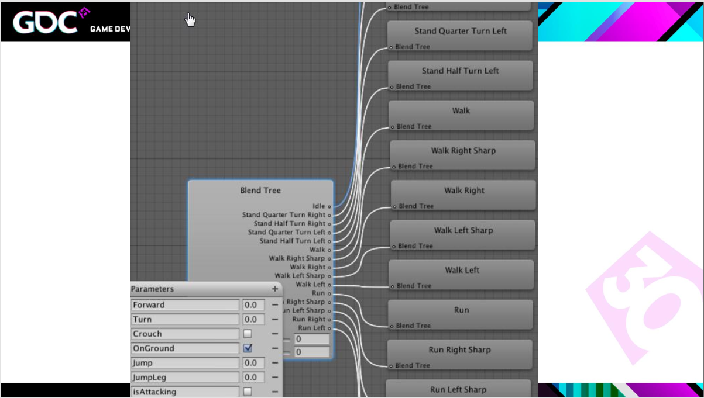

《荣耀战魂》 中的MotionMatching
============

嘉宾：Simon Clavet 

视频地址：[GDC 2016 Motion Matching and The Road to Next-Gen Animation](https://www.gdcvault.com/play/1023280/Motion-Matching-and-The-Road) 

ppt地址：[GDC Vault PPT](https://www.gdcvault.com/play/1022985/Motion-Matching-and-The-Road) 

嘉宾简单介绍： 

 
 
 
## 前言
Simon Clavet的这篇演讲对于研究MotionMatching的小伙伴来讲极具价值, 因为相对于其他演讲来说(比如我们将来要说的《最后生还者2》中的MotionMatching)，这个演讲对新手更加友好一点，对一些基础概念解释的更清楚，所以想了解MotionMatching的话，这个演讲都是必看的。 

我个人水平有限，如有出现解释的错误，请在评论区告诉我~ 

## Go!
一段视频介绍了《荣耀战魂》的玩法和背景，主要是由武士，维京，骑士三大阵营组成的多人在线格斗砍杀游戏。 

{视频1} 

《荣耀战魂》是一款硬核的格斗游戏，所以必须要有相当精确的gameplay，还有就是真实可信的动画。 

 

我们先看一下应用了MotionMatching后的游戏表现。 

{视频2}

## 动画系统的发展历史
最开始的时候，上帝发明了PlayAnim函数。 

 

你的代码最终肯定要调用到这个函数上。这时候我们有个需求如下代码所示: 

 

这时候可能觉得上述代码不太方便，没有可视化，随后有了如下的状态机: 

 

不过随后随着项目需求越来越多，状态越来越多，最后的状态机可能会变的特别复杂，如下: 

 

 

我们接下来提出四个问题:
### 问题一
我接下来做一个动作(下面的视频)，如何给这个动作命名呢？如何放入到游戏内呢？ 

{视频3} 

 

 

(对应到UE4里面其实就是做BlendSpace，如果仅仅是2维的话可能还比较容易，但是当参数有3，4个的时候，工作量就比较大了，比如下面的做法就是配表，然后提供一个查询函数)。 

 

### 问题二
有没有统一的方式去处理Start-Loop以及transitions这种常见的动画需求呢？  
比如我们走路动画，一般都会制作成Start-Loop-End，动画之间需要通过Blend来完成，其实很难决定Start到哪个时间点的时候再执行Loop(我觉得作者其实想表达的是程序需要关注的细节问题太多了，比如有可能刚执行了Start玩家就想Stop了，如果使用状态机实现的话，需要处理这些情况),transitons也是一样的。 

我们现在看下2002年的一个paper，MotionGraphs, 它给我们提供了一种思路。

 

 

[这篇文章说的很清楚了，我就不拷贝了](https://zhuanlan.zhihu.com/p/50141261)(如果你的动画集覆盖的比较全的话，整个人物的动画表现是非常流畅的，但有个问题是操作反馈有很大的延迟，不过它确实为后面的Motion Fields和MotionMatching提供了很好的思路。)
### 问题三
接着上面，第三个问题是，我们应该如何从选择下一个动画呢？  
这里有几种思路，可以使用机器学习/加强学习的办法，2013年GDC上，Michael Buttner曾经为《杀手5:赦免》做过这些工作，特别精彩的演讲，大家可以去看下。现在Michael Buttner已经是我们育碧的人了-.-(育碧赛高)。 

 

(Michael Buttner在[Nucl.ai 2015](https://www.youtube.com/watch?v=z_wpgHFSWss)也做过Motion Matching的演讲，同样也是必看内容)

上面大家已经看到了MotionGraphs的不足之处，操作反馈的延迟问题，当你想要转向的时候，动画必须得走到过渡点的时候才能进行transitions。这种办法用于NPC还可以，但是对于需要操控的主角来讲还是不行。 

 

另外一篇paper, 这是另外一种思路，是在**Runtime**的时候通过查询帧来合成动画，这是他的解决方案以及跟MotionGraphs的对比，MotionFields能够及时反馈。 

{视频4}

为什么目前游戏内没有使用MotionFields呢？可能有的认为是性能或者内存问题，但是Simon Clavet认为主要因为它的算法过于复杂了，让人望而却步。但我们从这篇paper里获得了巨大的启发。

 
### 问题四
最后一个问题，比如跑步过程中停步了，停步是一个慢慢减速停下的动画，我们应该从停步动画的哪一帧开始播放呢？ 

 

有如下几个可以考虑的点：
* Pose Matching. 如果准备播放停步动画时玩家是左脚向前，为了Pose对应上，从左脚向前的那一帧开始播放。
* Velocity Matching. 假如我们准备停步时玩家的速度是5，停步动画开始的速度是10，如果完整播放的话，视觉上会特别奇怪，理想的是从速度5那里开始播放。
* precise end position matching. 其实是distance matching的方案，停步期望停到世界上一个期望点。(虚幻“帕拉贡”的distance curve matching就是这种)
* 一种上面都考虑的方案。
  
## MotionMatching
其实MotionMatching的算法特别简单。 

 

"**每一帧，遍历所有的动画帧，找到最好的那一帧(Cost最小)进行播放**" 

接下来引入一个概念:**Cost**,每个候选帧都会计算出一个Cost值，如果该候选帧完美地符合当前的运动情况(Pose以及Velocity)以及也完美契合我们想要行进方向(Future Trajectory)的话，那么这帧的Cost就为0。 

 

### 首次尝试
2013年的时候，我们开始了尝试。该算法的输入数据是一批动捕数据，我们当时随机动捕了5分钟左右，动画内容是“疲惫”状态下的一些动作，比如Walk,Start,Stop,Turn等等，导入到引擎后，我们看下效果，下面的角色一直在Follow箭头的方向，箭头方向由玩家控制： 

{视频5} 

我们把动画内的blend关闭掉，就可以看到其实角色一直在很频繁地在切动画。 

{视频6} 

另外一个行走的例子，游戏每帧都向系统发送desired trajectory，红色的就是desired trajectory调试信息，蓝色的是当前正在播放动画帧的trajectory调试信息。 

{视频7} 

### Mocap Dance Card
我们游戏内有各种阵营的角色以及性别的区分，我们开始迭代我们的动捕路线，最后的动捕路线时长15-20分钟，分成6，7个shot不等，其中包括原地转向，interrupted start, reposition(小幅度周围移动，用于类似move-to系统最后的矫正，后面会介绍用法) Start/Stop，Circle,Plant, Strafe等等,一套动作下来动捕演员已经很累了，这时候可以再动捕下“疲惫”状态下的动作。 

{视频8} 

### Code
([关于代码的部分，已经有人介绍的很多了，不太想再复述了，下面就说下注意的点](https://zhuanlan.zhihu.com/p/315908910)) 

由于游戏Gameplay的原因，Pose/Velocity Matching的时候需要匹配Weapon Poision。 

 

如果把Pose/Velocity Matching的匹配关闭掉会怎么样呢(Pose不再参与Cost计算)？ 

{视频9}

可以看到脚步动作没有正常的cycle动画，主要是因为在切换动作时，Pose不参与计算，不知道这时候脚步骨骼位置在哪儿，所以选取的动画跟现在的脚步Pose不搭，所以出现了这种问题。 

 

Pose Matching着眼于现在的Pose，Trajectory Matching着眼于未来的动画趋势，responsivity是一个比较微妙的参数，根据游戏类型，designer偏好，设置的参数也不同。

 

### Now we can match more things!
我们的角色有很多种站姿，比如左方持剑，右方持剑等，我们会在动画手动mark event，表示这时候的动画是左手还是右手，每个动画上会标注大量的跟gameplay相关的event，供match使用。如上面图所示，我们希望在将来某个时间点上切换站姿(左手换右手)，那么当前的这个候选帧就会特别有优势，因为这个候选帧后面一段时间后完成了站姿切换。  
通过这种办法我们找到了一种特别优雅的方式处理动画间的transitions,如果我们在运行过程中发现某两个状态之间是程序blend的，我们可以动捕下这两个状态切换的动画，添加到动画库里面就可以直接运行了！

### 优化
演讲中并没有过多讲优化的细节问题，可能将来出一个单独的演讲吧。  

 
* LOD 远处的角色不用满帧运行。
* KD-Tree 优化动画数据库存储结构，查询更快。
* Motion Shaders [Kristjan Zadziuk的演讲有提到](https://www.youtube.com/watch?v=KSTn3ePDt50)

### 谁来决定移动？
目前有两种方式，一是播放动画的时候，角色自动移动，这是动画驱动的方式(RootMotion驱动)。而是Simulation驱动移动，动画只是作为显示。两种方式都有各自优势。《荣耀战魂》主要采用的是第二种方式，主要是designer希望对移动有更大的掌控权。我们有两个实体，Entity代表着你看到的Skeleton，SimulationPoint真正控制移动的实体，我们要做得是**尽可能让这两个点靠近，但不等同于完全一致**。  

### Trajectory Simulation
如何构造Trajectory呢？答案就是基于Spring Damper On Velocity,主要原因是兼顾predictable和comportatble。而且predictable更重要。所以运动的加减速和转向角度都应该基于spring damper模型去改变。(这是特别关键的一步，如果路线不可预测，那么motion matching就变成了pose matching) 

{视频10}

刚才我们说过了是Simulaton驱动移动的，但我们有些情况需要动画来驱动移动，下面视频看到的，角色一直在尝试追着一个点，最后的时候，主角使用Reposition动画(上面动捕的时候有提到)修正了最后的位置。 

{视频11}

上面提到过Entity和SimulationPoint不用完全一致，我们设置的Clamp值为15cm，表示Entity可以在SimulationPoint半径15cm内活动，Clamp可以使动画更加生动和真实，比如有些Idle动画是有点左右摇摆的，还有就是一些跑步动画风格是side to side，这样腿部就有空间支持这么跑了。 但Clamp值不能太大，这样Entity和Simulation差的太大了，影响玩法的判定。

{视频12}

最后就是提到Trajectory可以结合Simulation和Collision做一些有趣的时候，比如碰到墙/悬崖边停下来，Corner的话转向或者停下等等。 

 

## 工作流
 

* 动捕数据精修打磨，导入然后标记上Event
* 运行时Gameplay发送请求(desired trajectory和event约束)
* 动画系统找最满足的那个动画进行播放
* 程序化处理动画满足gameplay和environment要求。

如果发送request时没有传入event，那么很可能你想Navigation，如果你传入了event,那么你可能想在将来某个时间点发生点什么事。

在游戏的开发过程中，我们仍然需要状态机，但我更偏向于game logic是状态机模型，而动画是无结构的平铺数据。又简单说了下他们编辑器下Clip是logic概念，而并且真实动画，clip拉长表示动画播放时间被拉长，播放期间如果满足某些条件了(比如玩家按键)，可以branch out到其他clip上。

 

Animation Setup的主要工作就是标记event，常见的event就是站姿，比如这一帧的时候换成左手了，另外一帧换成右手了，武器Hit开始等等，把一些gameplay用到的信息标记到动画上，动画上可以标记很多很多有用的信息。

 

Clip发出请求。

Event的属性信息，根据gameplay和动画的情况，进行自定义Event类型和属性值。当然也可以对动画进行分组，添加一些组属性等等。

### 移动
因为designer需要对移动有一些精确控制，所以说下移动相关的操作。
开头说了下编辑器内调整Movement速度的话，动画系统会切到对应的动画匹配你的速度。然后可以在编辑器内设置攻击时的位移值等等。 

{视频13} 

对于一些特别复杂的移动，可以使用动画驱动移动的方式实现。比如视频中看到的，一个角色把另外一个角色拉开，因为是双人动画，涉及到两个角色同步到syncPoint,如果让designer控制的话会比较复杂，动画驱动移动的话，可以直接播放一个类似于Reposition的动画，移动到同步位置。

{视频14} 
## 程序化的调整

### Procedural Rotation 

大前提是动画决定Entity Rotation。

后面会出现一些角度的问题，原因是播放的动画不可能实时跟Trajectory方向完全一致的(就像按照45，90角度动捕一样，不可能把1度到90度之间的都动捕下)，当不一致时，就发现上图出现的问题，人的朝向和脚步动画是蓝线方向，行走是红色方向。解决的办法也很简单，就是实时地把Entity的朝向矫正到红线方向就可以了。下面视频展示了修正前和修正后的样子。 

{视频15} 

如果朝向比位置更重要的话(比如锁敌)，那么不用计算角度，实时地矫正到想要的朝向就可以了(当然也可以根据需要gameplay分层去矫正)。

{视频16} 
### TimeScale

由于动捕动画的Trajectory和Simulation Trajectory速度的不同，可能会导致一些轻微的动画脚步不匹配。如果范围在正负(10%-20%)范围内的话，使用TimeScale效果比较好，否则的话，只能依靠后面提到的IK来解决。TimeScale算法也很简单，对比两个Trajectory的error，应用到动画上即可。 

### 滑步
说了下滑步的两个主要原因，一是我们的MotionMatching一直在反复地切动画，切动画就会导致blend的发生。二是动画要跟玩法对齐，玩法千奇百怪，动画就这些。。解决的办法就是IK锁住脚，当然也有很多细节问题需要处理。

完。
(后面说了下Slope Warping相关的东西,我没有这方面的经验，后面需要的时候再研究吧。)

