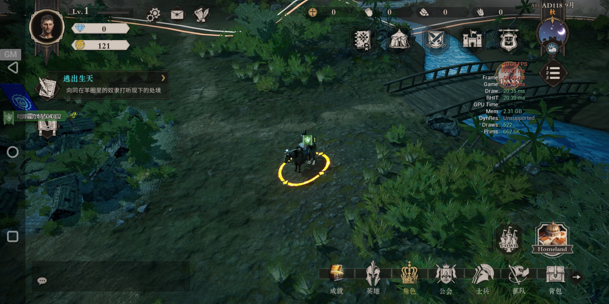
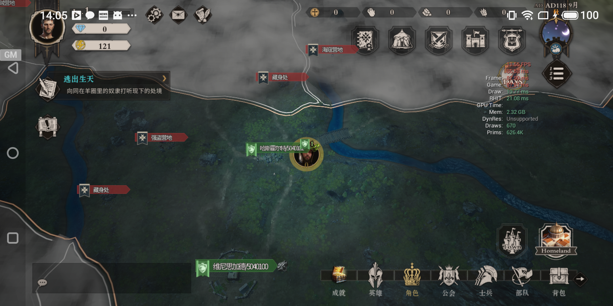
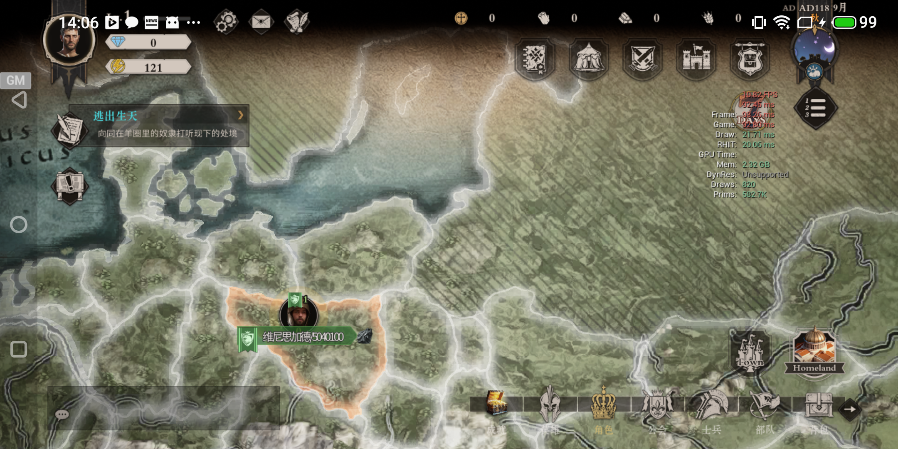
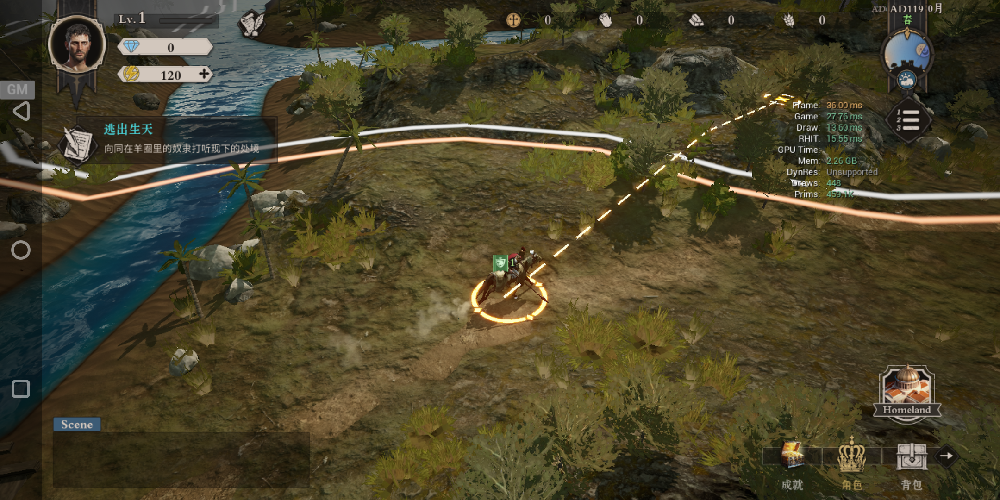
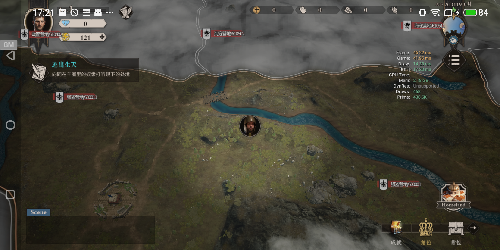
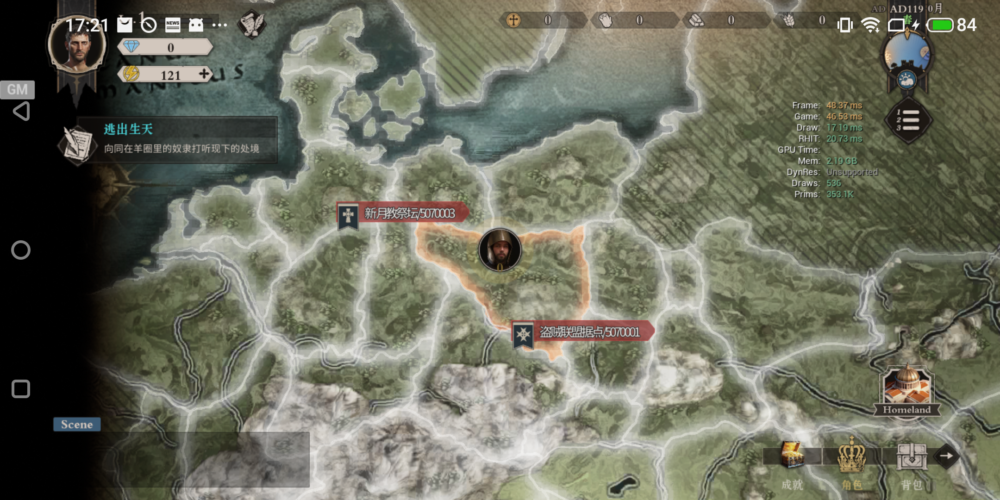
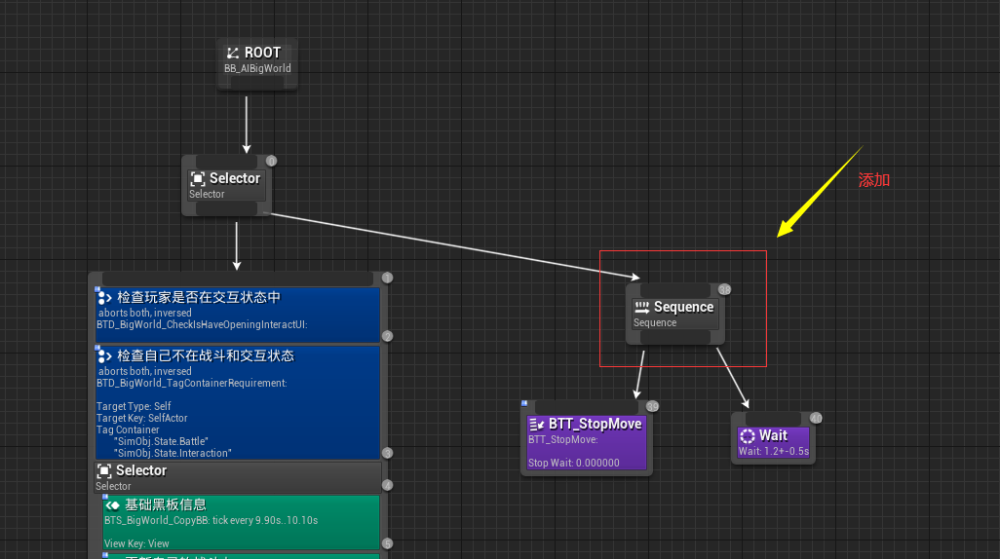

# 大世界第一次优化报告和遗留问题总结

## **结果对比**

* 设备名称：魅族16th
* CPU: 骁龙845

优化前, GameThread平均每帧消耗93.27ms
，平均帧率为10.72FPS。

优化后，GameThread平均每帧消耗38.75ms
, 平均帧率为25.8FPS
, 性能提升58%

## **优化内容项**

1. 移除BP_BigMapCharacter，BP_BigWorldMineActor中的ReceiveTick函数，逻辑按照事件触发，因为场景中有大量NPC，采集物使用这些类，因此可以节省很多消耗；

2. 优化CharacterMovementComponent代码，比如当不在可视区域内时，将ProjectNavMesh选项关闭，这样避免了一些投射查询的调用；

3. 优化UI_BigWorld_SimObjDetail_Controller_C::Tick的代码逻辑，其中涉及到很多物体的的LuaTick以及UI的刷新，改为UI对象池以及事件驱动；

4. 优化行为树逻辑，避免每帧无效调用；

   

5. 优化迷雾相关代码逻辑，当NPC不参与迷雾相关行为逻辑时，BP_BigWorldViewFogComponent没有必要Tick；

6. 美术BP_Plate_Path_Base工具的刷新逻辑减频并且不集中刷新；

7. 通过UI池的实现可以有效减少总的UIDraw时间；

8. 重构BP_SimParty_C中的SimulateUpdateNumber和SimulateUpdateVisible逻辑，有效减少了OnLuaTick中的调用的花费时间；

## **尚未解决的问题**
1. GameThread依然没有降到理想的帧数，导致CPU一直超负荷运行，一段时间手机发热手机降频，然后就会越来越慢；

2. BT_BigWorld_Bandit行为树大量运行仍然有严重的效率问题，这可能跟ObserverAborts设置有关；

2. UI的渲染压力依然没有解决，如果要开启bExplicitCanvasChildZOrder就意味着UE同学需要重新过一遍出问题的UMG并且手动调整其ZOrder, 使用一些专门用于优化的Panels, 程序同学需要调整相关逻辑，否则可能一个UMG会高达几十个Drawcalls, 由于时间原因这个目前没有办法解决；

3. OnLuaTick/RegisterTickObj这套系统需要重构，因为大世界中需要模拟的逻辑太多，使用简单的注册更新机制特别容易引起卡顿，将来可能需要重度使用事件驱动或者带时间预算的OnLuaTick;

4. CharacterMovement需要更为激进的优化，比如按照优先级排序对于优先级低的(不可见)的不再每帧都更新，去掉物理检测等；

5. 由于时间原因，目前并没有对美术资源做相关的分析；