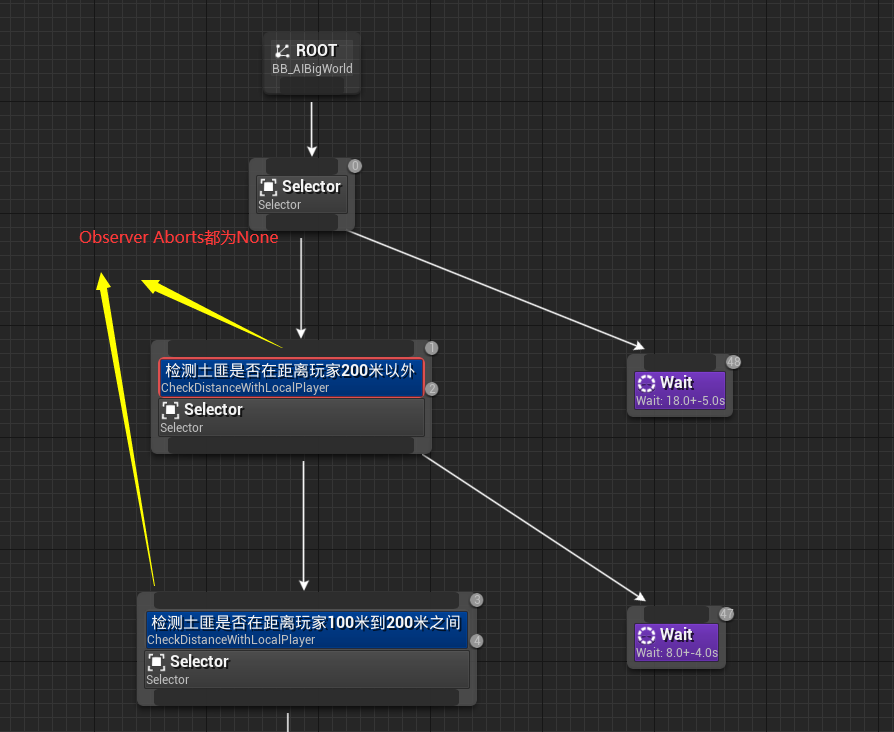
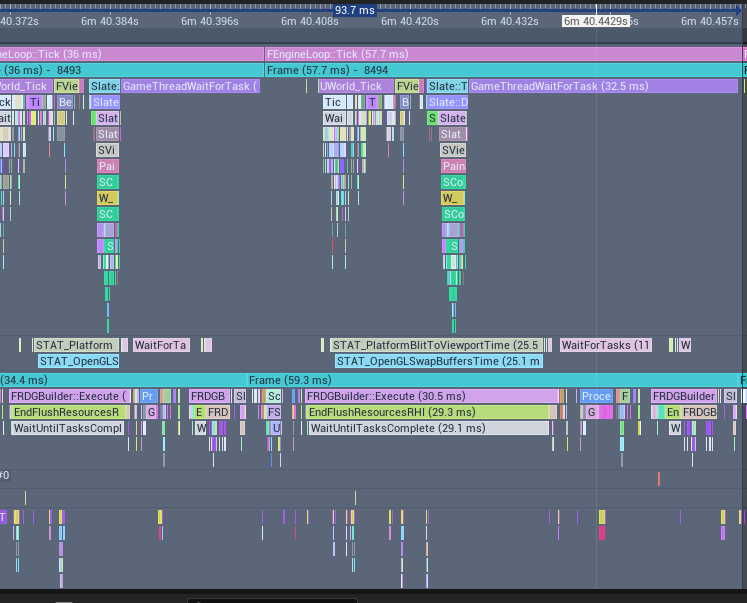

## **CPU优化内容项**

1. 【重要】不在可视范围内的CharacterMovement设置bProjectNavMesh为false， 设置SweepWhildNavWalking为false;

    >_警告：存在bug，由于没有地形检测，物理检测，可能会导致NPC浮空问题，完整解决方案参考：【Fortnite关于CharacterMovement的优化建议】

2. 【重要】BP_BigWorldCharacter添加类似SignificanceManager的处理，当NPC较远或者不可见时将一批Components(包括CharacterMovement)的TickInterval调整为一个数值（动态调频）

3. 采集物的相关BPs去掉无用的Ticks以及UseParentBounds, 以及调整SkeletonMesh的TickOptions为OnlyTickPoseWhenRendered

4. 高频执行的Decorator替换为C++版本

5. 去掉MBDataPoolComponent中的Tick设置

6. 【重要】土匪AI添加距离判断，当距离玩家很远时会Wait等待 
    

## **GPU优化项**

1. 使用QualitySwitch对M_Landscape_Android01优化，对高中低适配；

2. FoliageMode Paint页签下对所有Foliages勾选Enable Density Scaling和Enable Cull Distance Scaling，方便后续不同机型不同设置；

3. 场景中BP_Plate_Path BoundBox计算有问题，导致一些很远的BP_Plate_Path依然在绘制；

4. 对于植被(草，树，石头)等做LODs分级，目前只有一级LOD，可以分多级；

5. 对于植被的材质做QualitySwitch处理，对于低端设备可以不进行WorldPositionOffset和PixelDepthOffset的设置【影响ShadowPass】；

## **大世界经验总结**
1. 自己建立 打包-查看帧率-Profiler分析-针对优化-再测试 的流程，切勿没有根据的优化，避免优化一些繁枝末节的内容； 
2. CPU调优的几大法宝：去调无用Tick, 按Significance对现有的Ticks调整调用频率(SetActorTickInterval, SetComponentTickInterval)、开启/关闭物理检查等，高频调用替换为C++版本，缓存结果（空间换时间）； 
3. 早早引入SignificanceManager，SignificanceManager可以理解为游戏逻辑的Scalability系统，引入越早对于后续动态调频越方便；
4. CharacterMovement需要重点关注在NavWalking下尽可能减少物理检测，最重要的是利用SignificanceManager动态调整组件Tick频率, 见参考资料中的【Fortnite关于CharacterMovement的优化建议】；
5. BehaviorTreeComponent很难优化，因为SetComponentTickInterval和BT中的Wait冲突，导致调频失败，因此需要提前花时间确定AI的技术方案（自定义BTComponent, BT会根据距离失活等）
6. 在做GPU优化时经常出现CPU, GPU, RHI帧率都20ms左右，DrawCalls和三角形都不算太高，但是总体帧耗时就是很长，UnrealInsight总是长这个样子, 好像每个线程都在等，其实是在等GPU绘制，DrawCalls不高很有可能有些大量绘制的物体三角面有点高，最有可能得原因在于量大的那些物体(树，草，石头等)没有做LODs以及Landscape的材质复杂度过高；
   

## **参考资料**

[Fortnite关于CharacterMovement的优化建议](https://udn.unrealengine.com/s/question/0D52L00005AiQOPSA3/improving-ai-movement-times-with-cmc_)