# 新手村第一次优化报告和遗留问题总结

## 结果对比

* 设备名称：Mi8
* CPU: 骁龙845

优化前, GameThread每帧消耗42.98ms。

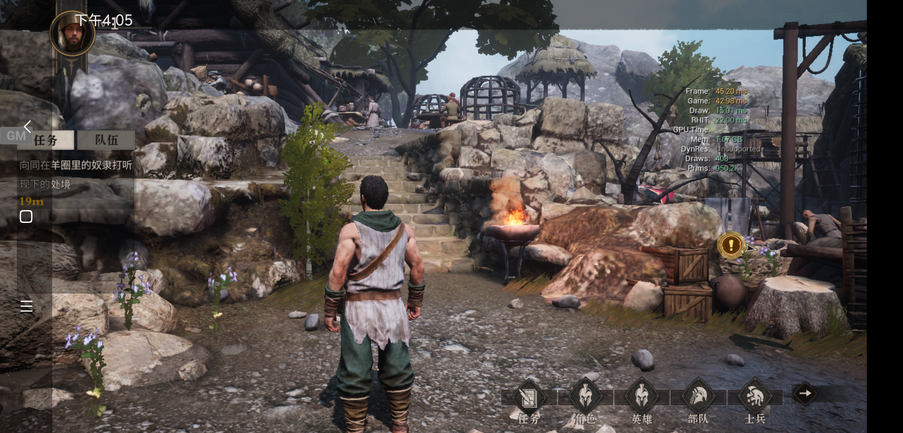

优化后，GameThread每帧消耗25ms, 性能提升40%

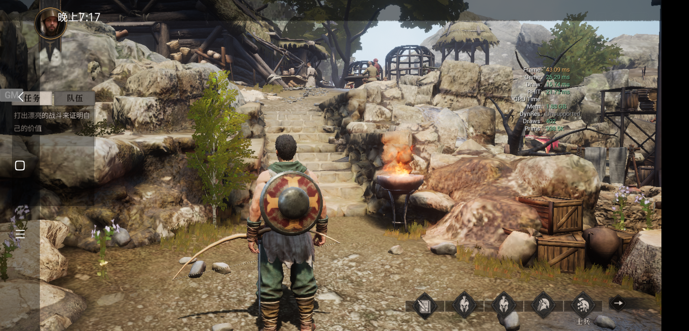

## 优化内容项

* CharacterMovement的默认运动模式从Walking改为NavWalking，可以去掉一大部分物理判断逻辑；
  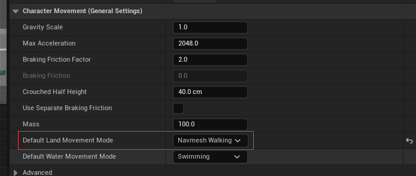

* 去掉NPC身上GenerateOverlapEvents, 目前NPC不需要Overlap相关检测，并且Overlaps检查也有一定消耗；
  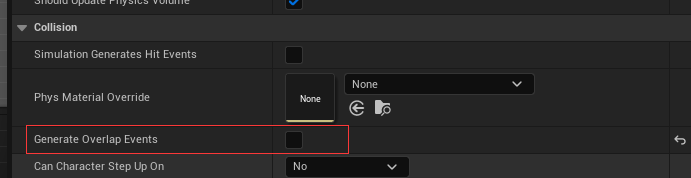

* NPC去掉SpringArm组件，SpringArm组件每帧都会物理检测相机位置，将SpringArm替换为其他无Tick的SceneComponent即可；

* 去掉一些特殊组件的Receive CSM Shadows属性；
  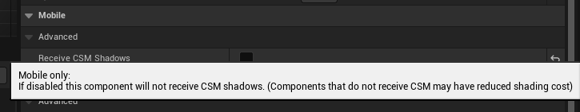

* SkeletalMesh的TickOptions设置为OnlyTickMontagesWhenNotRendered，当SkeletalMesh不可见时不更新UpdateFunction和EvaluationFunction;
  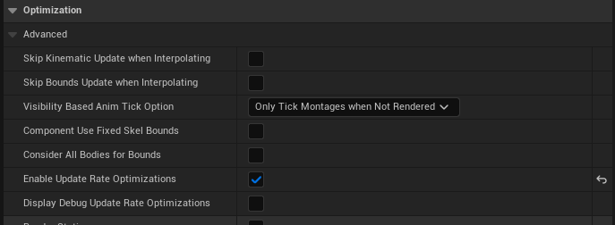

* 新手村开启URO并且设置DistanceFactor参数，并且启用插值，使远处的NPC执行动画时可以跳帧，而近景的NPC通过插值也可以平滑播放动画；
  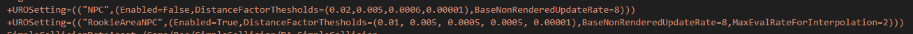

  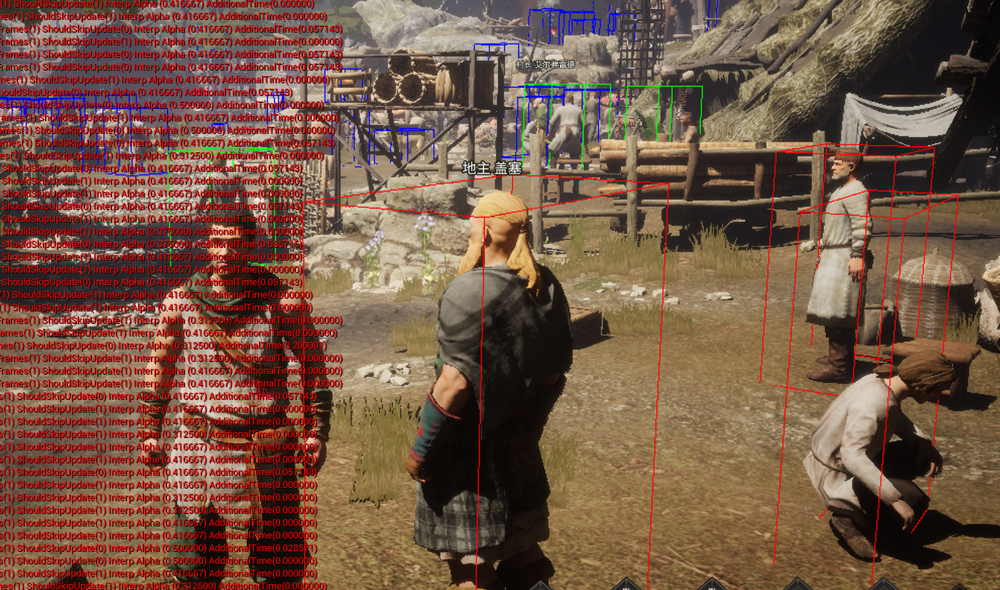

* BP_NPC_Interaction_Master去掉Tick(Actor及其SkeletalComponent,StaticMeshComponent)，使其仅仅作为一个数据BP；

* NPC动画蓝图跟改为多线程版本，能够缓解Gamethread的压力；
  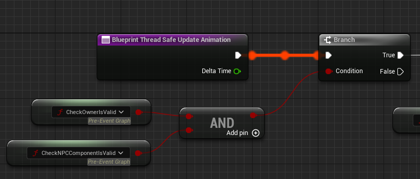

* 减少CharacterMovement更新频率，目前使用UpdateOnlyIfRender参数,即显示才会更新运动（TODO 将来考虑跟URO一样减少频率而不是不更新）
  

* 更改QuestNPC的基类，以前基类为NPCHuman，这个基类有大量战斗，骑马等逻辑，而接任务对话的NPC不需要这些，因此换成更改简单高效的MBNPCCharacter，并且将一些无用的组件(CommonData, AbilityComponent等)禁用Tick;

* 场景内直接放置的SkeletonMeshActor(比如兔子，牛等动画)设置TickOption为OnlyTickPoseWhenRendered, 并且同样开启URO等；

## 尚未解决的问题

1. 最大的问题在于由于渲染压力导致总帧率依然没有降下来，这跟场景内的StaticMesh有很大关系，我删除掉游戏玩法相关的BP只跑场景，帧率依然很高, 下图可以看到GameThread已经是15ms, 由于上一帧的渲染结果迟迟没有同步过来，GameThread最后只能空等，通过命令可以看到可视化的staticMesh数量只有33个，视椎剔除了238个，硬件查询剔除3个，并且总的剔除时间占用了5.11ms, 因此怀疑跟资源的设置有关，**这个问题需要美术同学审查下StaticMesh相关的资源**；
   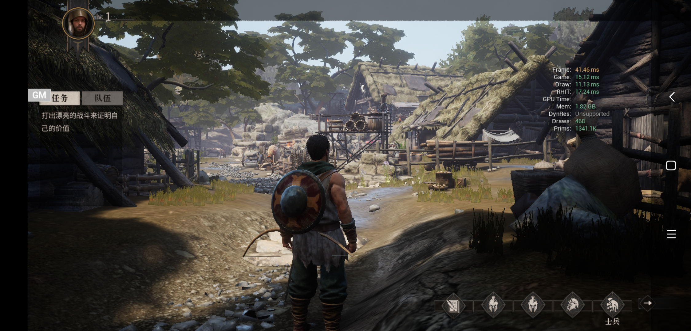

   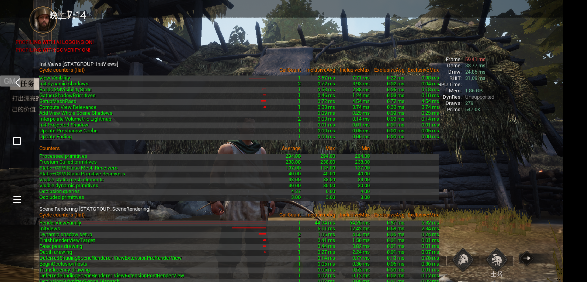

2. UI的渲染压力依然没有解决，如果要开启bExplicitCanvasChildZOrder就意味着UE同学需要重新过一遍出问题的UMG并且手动调整其ZOrder, 使用一些专门用于优化的Panels, 程序同学需要调整相关逻辑，否则可能一个UMG会高达几十个Drawcalls, **由于时间原因这个目前没有办法解决**；

3. 在登录界面内存就高达1.3G，这跟一些配置比如AbilityData, UIWnd中的资源硬引用有关，需要相关程序更改配置类型及其调用地方的代码，**由于时间原因这个目前没有办法解决**；