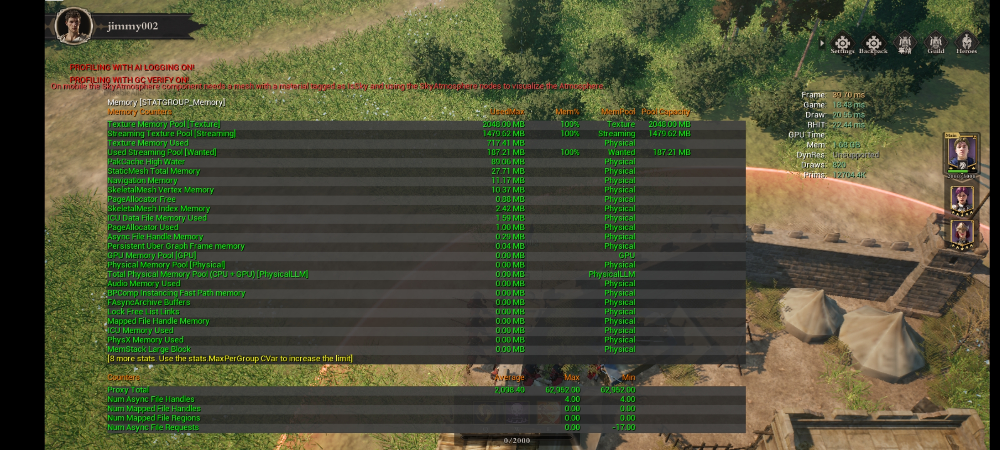
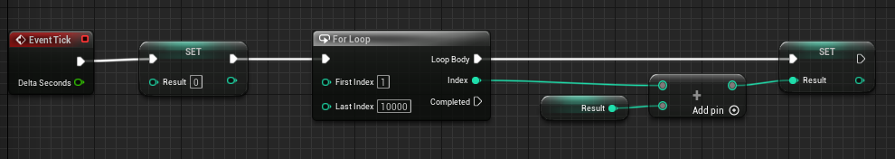
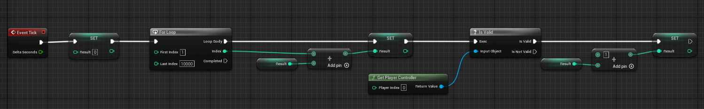
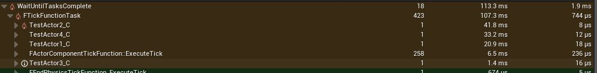
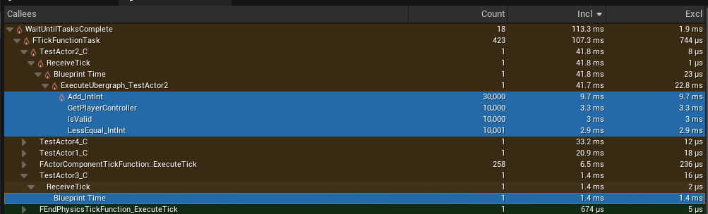

# 一般步骤

1. stat unit看下大概的性能情况
2. trace.start frame,cpu,gpu, 运行一段时间trace.stop，通过UnrealInsights看下具体细节
3. memreport -full通过日志看下内存占用情况
4. stat scenerendering查看场景绘制情况
5. ShowFlag一点一点缩小范围
6. 如果怀疑是三角面太多，可以强制设置所有的LODs r.ForceLOD 3
7. ProfileGPU可以在log看到所有DrawCalls的分布情况
8. FreezeRendering可以冻结渲染，并且角色可以自由移动，这对于查看剔除情况特别有用

# 指令

trace.start frame,cpu,gpu | trace.stop 开始停止数据追踪

利用上面的trace方法无法生成stats的分析数据比如SCOPE_CYCLE_COUNTER(STAT_CharPhysNavWalking)，原因在于程序启动参数需要添加-statnamedevents, 手机上添加启动参数有多种办法：

1. adb shell setprop debug.ue.commandline '-statnamedevents'，然后手机启动程序，执行命令trace.start/stop等；
2. 添加 UECommandLine.txt, 添加到Android/data/com.xxx.yyy/files/UnrealGame/ProjectName文件夹下。内容可以如下：

```
-tracehost=192.168.10.16 -trace=default,memory,metadata,assetmetadata
```

>_上面的命令可用于电脑UnrealInsights捕获手机的Traces_

stat unit 命令显示项目的 Frame 、 Game 、 Draw 、 GPU 、 RHIT 和 DynRes 线程的性能信息

stat game能查阅游戏逻辑在特定情况下的每帧更新耗时

stat engine显示总体渲染统计，帧长以及被渲染三角形总面数

dumpticks命令它能列出正在更新的所有Actor以及它们的总数

stat RHI，triangles drawn就是面数

r.VSync 0  -  垂直同步（0 关闭，1 打开）

r.screenpercentage [0, 100] 设置渲染分辨率百分比

每个draw call都有固定的开销，draw call越多，你来回绘制所耗费的时间就会呈线性增加，情况会越来越糟糕。可以使用stat scenerendering 命令随时查看场景绘制

要想找出这个阶段中的问题，一个简单的方法就是，关掉各个功能特性，关掉Static mesh静态网格体，关掉Skeletal骨骼网格体，关掉Particles粒子效果。ShowFlag命令对此非常有用

```C++
ShowFlag.StaticMeshes
ShowFlag.SkeletalMeshes
ShowFlag.Particles
ShowFlag.Lighting
ShowFlag.Translucency
ShowFlag.ReflectionEnvironment
ShowFlag.InstancedStaticMeshes
ShowFlag.Landscape
```
ProfileGPU

不仅可以在编辑器中运行它，还能在开发版本李运行ProfileGPU会生成一个文件。所有发送给GPU的命令，它的时间戳都会显示在其中，让你能轻易的检查特定帧的每一步渲染过程，它会按照时间顺序排列命令。并且显示相关命令的处理时间，以及那一帧的耗时，也许你就能找到场景中某个特定部分的问题原因。它也可以通过快捷键Ctrl+Shift+，来使用。这很简单，能帮你找出游戏中的后期处理反射或者体积雾是否会导致问题

ShowFlag.QuadOverdraw
Quad Overdraw四边形过度绘制对于美术师来说，解决过渡着色的一大方法就是在检查创作内容时，使用所谓的“Quad Overdraw”四边形过度绘制模式，这个模式还能在很多其他平台上运行。它基本会显示所有可以用LOD简化的区域，以及需要用LOD大量优化的区域，它是一个渐变的形式从蓝到白，越接近白色情况就越糟糕

ShowFlag.ShaderComplexity
Shader Complexity 着色器复杂度，也很好用。它能将你在屏幕上绘制的每个像素的着色器的复杂度以视觉化形式呈现出来，它还能视觉化呈现潜在的过度绘制问题。过度绘制不仅有可能在你处理屏幕上众多顶点时发生，也有可能在你使用很多alpha通道时，在你需要处理alpha通道的各个图层时发生。引擎并不知道哪个在哪个的下面，所以引擎会处理所有的表面，才能绘制像素的最终色彩。所以着色器复杂度可以用来显示着色器的开销，要尽量避免红色和白色斑块的出现，因为它们会导致性能问题

ShowFlag.LightComplexity
关于光照复杂度，通用的建议是要尽量减少动态光源的数量，它们是实时渲染的，每帧都是。GPU需要做大量处理和运算，才能得出像素在光照影响下得最终色彩。所以要尽量减少动态光源的数量，如果你真的要用到它，你应该尽量缩小它的范围。这样它只会照亮对你比较重要的区域也就是关卡的某一部分，你还可以减少动态光源所影响的对象数量。你可以让对象和光源使用light channel光照分层功能，阴影投射的开销也很大。所以如果你有动态光源，但又不是真的需要投射阴影，那就关掉它


a.VisualizeLODs 1 可以看到每个SkeMeshLOD的信息，Debug信息是打印在每个角色的头顶上，而且还可以看到MaxDistanceFactor信息，这对于设置URO参数来说特别有用

* 白色：LODLevel 0
* 绿色：LODLevel 1
* 黄色：LODLevel 2
* 红色：LODLevel 3


## 内存
stat memory



* Texture Memory Pool(Texture) 设置的r.streaming.poolsize的池大小
* Texture Memory Used: 当前纹理占用的真实大小


memreport -full

* Process Physical Memory：实际占用的物理内存，与stat unit显示的Mem一致；
* Lua Memory：Lua占用的物理内存；
* TEXTUREGROUP_UI：TEXTUREGROUP_UI贴图占用的物理内存；
* TEXTUREGROUP_World: TEXTUREGROUP_World贴图占用的物理内存；
* Texture 2D Memory: 所有2D贴图占用的总物理内存；
* Render Target 2D Memory：所有RT占用的总物理内存；
* StaticMesh Total Memory：所有StaticMesh占用的总物理内存；
* Navigation Memory：所有Navigation占用的总物理内存；
* NumKB为对象大小，MaxKB为对象大小峰值
* ResExcKB：Only include memory used by non-UObject resources that are directly owned by this UObject. This is used to show memory actually used at runtime(参考：ResourceSizeExc.GetTotalMemoryBytes()和enum EResourceSizeMode)
* obj list -resourcesizesort: 所有不同class内存占用的排序，可以关注count, NumKB, ResExcKB等参数；
* 紧接着看下各个详细资源的排序结果，比如Texture, SkeletalMesh，StaticMesh等；
* 搜索Total size可以查看一些统计后的结果;

>_当不知道为何某个资源会被加载到内存时，可以尝试打开LogStreaming的Verbase日志_

参考资料：

[UObject控制台命令](https://www.cnblogs.com/kekec/p/13969408.html)

[UE5 Profile 内存](https://blog.csdn.net/qq_29523119/article/details/131628733)

## UI

stat slate

Slate.Showbatching 0/1：关闭或打开批次颜色，根据颜色看当前批次

Slate.showOverDraw 0/1：关闭或打开OverDraw颜色，越白OverDraw越厉害

Slate.ShowClipping 0/1： 显示裁剪

Slate.InvalidationDebugging

* 白线框：Widget has a tick function. 动画或者需要tick的节点
* 绿线框：Widget has an active timer that needs to update 当前Widget有激活中的Timer需要更
* 蓝线框：Needs repaint because the widget is volatile。每帧tick
* 黄色框: Widget was invalidated.当前Widget需要重绘,. 黄色到红色渐变，越接近红色，越是最近发生重绘
* 红线框：说明这个Widget一直被刷新


## 动画

>_拷贝自《UE动画优化之URO(UpdateRateOptimizations)源码解析》_

1. AlwaysTickPoseAndRefreshBones（始终更新姿势并刷新骨骼）：无论角色是否被渲染，都会Tick Pose和Refresh Bone Transforms。这意味着动画系统始终处于活跃状态，可能会消耗更多的计算资源

2. AlwaysTickPose（始终更新姿势）：无论角色是否被渲染，都会Tick Pose。但是，骨骼变换仅在角色被渲染时刷新。这种方式仍然会消耗一定的计算资源，但相对于第一种方法，当角色不在视野范围内时，可以减少一些性能开销。当启用这个选项时，无论角色是否处于渲染状态，其姿势（Pose）始终会被更新。这可以确保动画与游戏逻辑保持同步，但可能会增加性能开销。这意味如果你开启了AlwaysTickPose（总是刷新姿势）功能，那么当物体或角色再次进入视野时，动画表现通常不会显得突兀。动画状态机和逻辑将继续运行，以确保游戏中的角色与游戏逻辑保持同步。这有助于防止动画跳转和其他潜在问题。
骨骼变换负责将角色的姿势转换为实际的屏幕上的图像。如果角色不在视野内或被其他物体遮挡，那么计算和渲染骨骼变换是没有意义的。因此，仅在角色被渲染时刷新骨骼变换可以降低性能开销。在这种情况下，即使动画姿势始终在更新，但骨骼变换的刷新仅发生在角色被实际渲染时。这样可以实现动画与游戏逻辑的同步，同时避免了不必要的性能消耗。

3. OnlyTickPoseWhenRendered（仅在渲染时更新姿势）：只有当角色被渲染时，才会Tick Pose，但是不执行Refresh Bone Transforms。这种方式在角色不在视野范围内时，可以最大限度地降低性能开销，因为动画系统处于非活跃状态。但是，这可能会导致角色在突然出现在视野范围内时，动画从当前状态开始播放，可能会出现不自然的表现。

4. OnlyTickMontagesWhenNotRendered（仅在不渲染时更新蒙太奇）：当角色被渲染时，会Tick Pose和Refresh Bone Transforms；当角色不被渲染时，全部不执行，仅更新蒙太奇（Montages），并跳过其他所有内容（包括动画蓝图图表的更新）。这种方式在角色不在视野范围内时，可以大幅减少性能开销，因为它不会执行完整的动画更新。

这个选项意味着：

当角色被渲染（在摄像机视野内）时，引擎会正常更新角色的姿势（Tick Pose）和刷新骨骼变换（Refresh Bone Transforms）。这保证了角色的动画在摄像机视野内看起来是连贯和准确的。
当角色没有被渲染（在摄像机视野之外）时，引擎不会执行常规的动画更新，而是仅更新蒙太奇。这意味着引擎仅确保蒙太奇中的动画片段按预期顺序播放，但不会执行其他动画计算，如动画蓝图（AnimBP）中的状态机、变量更新等。
在此选项下，引擎会在角色不被渲染时优先降低动画计算的性能开销。这意味着，虽然蒙太奇动画序列的播放状态会被更新，但与其他动画计算（如动画状态机、动画蓝图、动画变量等）相关的骨骼变换将会被跳过或延迟计算。因此，在这种情况下，引擎会尽量减少性能开销，同时仍尽可能地保持蒙太奇动画的连贯性。
然而，这也可能导致一些潜在问题，比如动画与游戏逻辑不同步，或者在角色重新渲染时出现突兀的动画跳转。因此，在实际使用时，需要权衡性能优化与动画效果之间的平衡。

举个例子，假设一个角色在摄像机视野之外开始从站立状态过渡到跑步状态。由于在不渲染时，引擎仅更新蒙太奇而跳过了其他动画计算，因此角色的走路、跑步等状态变化不会被及时处理。当角色突然进入摄像机视野范围内时，它的动画状态可能与实际游戏逻辑不符，例如角色应该已经处于跑步状态，但在视野内它可能仍然显示为站立状态，然后才开始过渡到跑步状态。这种情况下，动画可能会显得不自然或突兀。这是因为，在不渲染时，引擎仅关注蒙太奇动画的更新，而忽略了其他动画计算，如动画蓝图中的状态机、变量更新等。这种方式的优点是降低了性能开销，但缺点是可能导致动画不连贯或与游戏逻辑不一致。在选择这个选项时，开发者需要根据项目需求和性能考虑来权衡动画连贯性和性能之间的平衡。

## 剔除

在编辑器(或真机)上运行场景，通过正常游戏操作使摄像机位于想要调试的方位。

控制台输入FreezeRendering冻结渲染数据的刷新（再次输入即可解冻）。

控制台输入ToggleDebugCamera，然后移动相机进入其他方位对目标点的优化效果进行观察。

控制台输入r.VisualizeOccludedPrimitives 1/0可以显示（隐藏）被剔除物体的包围盒。

控制台输入r.AllowPrecomputedVisibility 1/0可以开关预计算遮挡剔除功能来对比DrawCall数量的变化。

控制台输入stat initviews可以查看当前被剔除的物体总数。

控制台输入stat scenerendering可以查看当前的静态物体DrawCall总数。

## Lua VS 蓝图

TestActor1 纯蓝图：



TestActor2 纯蓝图并且调用C++接口：



TestActor3 纯Lua：

```Lua
function TestActor3_C:ReceiveTick(DeltaSeconds)
    self.Result = 0

    for i = 1, 10000, 1 do
        self.Result = self.Result + i
    end
end
```

TestActor4 纯Lua并且调用C++接口：

```Lua
function TestActor4_C:ReceiveTick(DeltaSeconds)
    self.Result = 0

    for i = 1, 10000, 1 do
        self.Result = self.Result + i

        local pc = UE.UGameplayStatics.GetPlayerController(BP_GameInstance_Inst, 0)
        if pc:IsValid() then
            self.Result = self.Result + 1
        end
    end
end
```

性能对比数据：



可以看到Lua性能更佳



>_TimingInsights中的Excl数据列表示没有统计到的占用时间为多长, 以上图举例，ExecuteUbergraph_TestActor2的Excl时长为22.8ms，并不意味着ExecuteUbergraph_TestActor2这个函数的本身的消耗就是这么长，而是这个函数总时长41.7ms, 下面已经被统计到的有(9.7ms, 3.3ms, 3ms, 2.9ms)总计18.9ms, 没有被统计到的有41.7ms - 18.9ms = 22.8ms, 同理下面的BlueprintTime Excl为1.4ms并不是说蓝图调用就消耗了1.4ms，而是代表着没有被统计到的有1.4ms_

## 手机温度

```Shell
@echo off
:Loop

adb shell dumpsys battery | findstr temperature

timeout /t 1 /nobreak >nul 2>nul
goto Loop

pause
```

## 参考资料

[UE4 Unreal Insights基本使用](https://zhuanlan.zhihu.com/p/511148107)  
[UE4 UI性能优化](https://zhuanlan.zhihu.com/p/532437923)  
[UE4渲染-slate合批流程](https://zhuanlan.zhihu.com/p/529040584)  
[UE4渲染-slate渲染流程](https://zhuanlan.zhihu.com/p/528826488)  
[资产优化](https://zhuanlan.zhihu.com/p/622541522)  
[性能工具-内存篇](https://zhuanlan.zhihu.com/p/452214767)  
[UE动画优化之URO(UpdateRateOptimizations)源码解析](https://zhuanlan.zhihu.com/p/629602637)
[UE4/UE5 动画的原理和性能优化](https://zhuanlan.zhihu.com/p/545596818)
[可视性和遮挡剔除](https://dev.epicgames.com/documentation/zh-cn/unreal-engine/visibility-and-occlusion-culling-in-unreal-engine)
[高效调试：命令行参数启动 UE Android App](https://imzlp.com/posts/29169/)
[移动端指定启动参数](https://ue5wiki.com/wiki/26262/)