#! https://zhuanlan.zhihu.com/p/461809751
# 前言
本篇是我翻译Daniel Holden的第二篇文章，之前一篇是[Motion Matching 中的代码驱动移动和动画驱动移动](https://zhuanlan.zhihu.com/p/432663486)

如果你看过MotionMatching的文章，那你必然会经常听见这个词“Spring”或者“Spring Damper”，中文即弹簧阻尼，Daniel Holden从简单的Damper(阻尼器)讲到SpringDamper(弹簧阻尼)，然后延伸到游戏开发中常用的Critical Spring Damper(临界弹簧阻尼)，最后给出了很多开发中的例子。Daniel Holden本身喜欢写作，可以看到他的文笔特别流畅，方案抉择背后的原因，方案的原理以及推导特别清晰明了，读完后收获颇丰，翻译此篇希望对你也有所帮助~

当然了，我能力有限，如有出现错误，欢迎批评指正！

Daniel Holden最近宣布从育碧跳到了Epic Games，担任Principal Animation Programmer，他主要研究的方向是机器学习和角色动画相关，UE5本身就内置了大量机器学习的模块，相信Daniel一定能将UE5的机器学习和角色动画推向新的高度，恭喜~~

(前几个月，[《荣耀战魂》 中的MotionMatching](https://zhuanlan.zhihu.com/p/401890149)的Simon Clavet也跳槽去Cloud Chamber做生化奇兵了，育碧损失两员大将了...)


# 正文
Springs和游戏开发有什么关系呢？如果你有此疑问，那说明你来对地方了，本篇会讲述大量与Springs相关的东西。即使你之前使用过Springs的功能，但我猜，Springs本身各种复杂的方程式你可能也从来没有碰过，数学公式虽然棘手，但Springs本身特别有趣，而且也用途广泛，在计算机应用中随处可见, 如果你对游戏开发，动画，物理模拟感兴趣的话，我相信你肯定能从Springs中收获良多。

接下来我们会说到what they are, what they do, how they do it, and what they can be used for

我们先介绍第一个概念：The Damper

## The Damper
作为一个游戏开发者，你肯定碰到过这个场景：我们意识到某个物体应该在另一个位置(可能是服务器同步过来的新位置或者之前再处理其他事情现在这个时候需要移动该物体了)，我们希望的是平滑地移向目标位置而不是瞬切过去

一个简单可行的办法是使用blend函数传入当前位置x以及目标位置g并且传入一个固定的factor比如每帧0.1

C++的代码可能像下面这个样子，代码处理的是单个float，如果想应用到position上, 单独应用每个vector分量即可

```C++
float lerp(float x, float y, float a)
{
    return (1.0f - a) * x + a * y;
}

float damper(float x, float g, float factor)
{
    return lerp(x, g, factor);
}
```

每帧调用时我们都应用固定的factor， 这样我们就能够平滑地向目标点靠近并且不会发生瞬切，我们甚至可以通过调整factor的值来控制插值的速度

```C++
x = damper(x, g, factor);
```

下面的视频可以看到可视化的运动，x轴代表时间，y轴代表物体的位置

{视频 damper.m4v}

```
 注:这里有几个问题大家想下
 1. 速度在视频内是如何表示的？
 2. lerp明明是线性插值，为什么视频里的表现是曲线呢？哪里调用跟lerp常规使用不太一样？这样调用有什么优势？

 我建议往下阅读前先想想这几个问题
```

但这个方案有个问题，如果调整游戏的帧率(timestep)会发现damper行为会不一致，简单来说，帧率越低那么物体运动的就越慢...

{视频damper_dt.m4v}

仔细想想这种表现是说的通的，因为每秒60 fps比每秒30fps在调用次数上要多一倍，所以60fps的趋向目标位置更快一些。一个简单的做法是factor乘以dt整体作为factor,这样的话，dt大的趋向目标位置也快了~

```C++
float damper_bad(float x, float t, float damping, float dt)
{
    return lerp(x, t, damping * dt);
}
```

表面上看起来工作良好，但其实还存在着两个比较大的问题，首先我们需要设置一个叫damping的参数，这个参数很难理解，第二个问题更严重，如果我们设置damping或者dt太大(比如damping * dt > 1),那么效果会变得极其不稳定...

{视频 damper_bad.m4v}

当然我们也可以利用clamping将damping * dt限定在小于1的范围内，但是这里面还存在着一个问题，我们假设damping * dt等于0.5，我们会发现调用两次产生的结果与dt乘以2调用一次产生的结果不一致，调用两次的结果是趋向目标位置75%的位置，dt剩余2表示damping * dt * 2 = 1产生的结果是直接移动到目标位置，如何修复这种问题呢？ 
### The Implicit Damper
我们假设dt为1，goal为0，factor为0.5，我们调查下x数值变化的图像表：

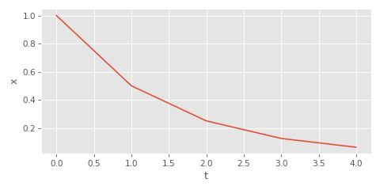

可以看到当多次调用lerp时效果是以指数的形式向目标位置靠近：


如果传入lerp的factor为0.5，方程式可以写为$x_t = 0.5^{t}$.看起来是一种指数关系，这种关系是如何产生的呢？我们利用递推公式来揭示这种关系~

**Recurrence Relation**

我们先定义一个单独的变量$y$满足$y = 1 - damping * ft$,目的是为了后面表达式能够简化一些。假定$ft$是一个固定值，$dt$假设为$1/60$这样的小值，我们将lerp函数进行展开：


我们从$t + 1$推导到$t + 2$

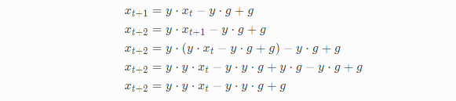

如果我们继续推导，则发现方程的范式就出现了

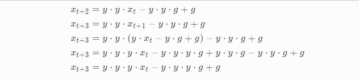

通用公式如下：

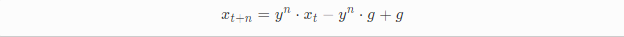

指数表达式出现了，我们整理下公式然后用lerp函数表示: 


再做一次调整把指数变成负数(注：数据稳定性？)

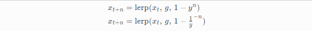

需要注意的是$n$代表$ft$的次数，如果任意给$dt$需要通过$n = dt/ft$转成$n$, C++代码如下：

```C++
float damper_exponential(
    float x,
    float g, 
    float damping, 
    float dt, 
    float ft = 1.0f / 60.0f)
{
    return lerp(x, g, 1.0f - powf(1.0 / (1.0 - ft * damping), -dt / ft));
} 
```

我们来看下它的表现，可以看到跟之前的表现完全相同，并且即使我们将$dt$和$damping$设置的很大表现也是稳定的

{视频 damper_exponent.m4v}

所以我们的问题是解决了吗？emm...我们实质上是通过damper匹配一个特定的timestep从而允许衰减速率(rate of decay)可变的，本例中$1 - ft * damping$就是衰减速率，它表示经过$ft$时间后移向目标位置的距离比例，当我们的$ft$足够小时$1 - ft * damping$永远不会超过1，那么它的表现会保持稳定

**The Half-Life**

我们用另一种更好的办法解决上面的问题，相对于固定timestep值，我们可以选择固定衰减速率这个值从而让timestep可变. 初听起来有点怪但实践中可以发现这样处理可以把事情变得更简单！方法很简单，我们将衰减速率设置为$0.5$,我们通过控制一个叫half-life的变量，这个变量大致表示移动到目标点一半距离消耗的时间：


这种方式简化了我们的代码并且给了一个相当直观的参数控制damper,现在我们再不用担心是否damping设置的值太大了或者ft是否足够小...

```C++
float damper_implicit(float x, float g, float halflife, float dt)
{
    return lerp(x, g, 1.0f - powf(2, -dt / halflife));
}
```

为了代码整洁，我们把底数变成$e$,通过$dt * ln(2)$即可完成换底，其中$ln(2) = 0.69314718056$,最后我们添加epsilon避免halflife太小时的除零问题

```C++
float damper_implicit(float x, float g, float halflife, float dt, float eps=1e-5f)
{
    return lerp(x, g, 1.0f - expf(-(0.69314718056f * dt) / (halflife + eps)));
}
```

通过上面公式的转换我们发现另外一个有意思的事情，那就是之前我们改变衰减速率的方式和在指数上缩放$dt$的方式是没有区别的，通过改变衰减速率达成的效果完全可以通过改变halflife实现！

这里还有一个技巧是，通过泰勒公式的截断式粗略计算e的负指数

```C++
float fast_negexp(float x)
{
    return 1.0f / (1.0f + x + 0.48f*x*x + 0.235f*x*x*x);
}
```

至此，我们将一个不稳定的damper进化成了一个快速稳定并且参数清晰明了的damper!我们看下它的表现

{视频 damper_implicit.m4v}

完美~~
## The Spring Damper
implicit damper虽然能够处理一些需求但它存在一个很严重的问题，那就是当目标位置快速发生变化时会产生运动的不连续，通过上面的视频可以看到当物体正向某一个方向移动时目标位置切到了反方向这时候就会发生运动突变

问题主要原因在于速度的不连续，无论之前的帧发生了什么damper始终是直接向目标位置移动的，我们看下应该如何修复这个问题. 我们回过头来看下之前写的bad damper的例子从中挖掘一些有用的信息


我们可以看出来有点像物理公式而$damping * (g - x_t)$代表速度


这个系统看起来像是一个质点的速度始终为当前位置到目标位置的比例值，这就解释了为什么会发生不连续的原因，速度始终与当前位置和目标位置相关，丝毫没有考虑到之前的速度信息

如果我们不再直接设置速度值，取而代之的是平滑地改变速度值是不是就可以解决我们的问题了呢？比如我们可以在原来速度的基础上加上一个能趋势我们移向目标位置的速度，这个值通过一个$stiffness$的参数控制缩放.


这样就会出现另外一个问题，质点只有经过目标位置后才会减速导致质点被拉到另外一个方向上去了，为了解决这个问题我们添加另外一个参数$q$表示goal  velocity,保证最后能够趋向于这个速度值，这项被$damping$的参数控制


当$q$值很小时我们可以把它看成摩擦项负责减速，当$q = 0$并且$dt * damping = 1$时摩擦项刚好能够抵消完现有速度，随之回归到damper起初的样子

另外一种角度看就是把整体项看成加速度，下面的公式可以很清晰地看出来：


我们假定质点的质量为1，而且我们可以想象成整个过程有两个独立的力，一个力驱使我们把质点移动到目标速度上另外一个力驱使我们把质点移动到目标位置点，$dt$足够小的情况下我们把这些functions合到一起就会模拟出能够速度连续的damped spring，函数如下(使用[半隐式欧拉积分](https://gafferongames.com/post/integration_basics/)):

```C++
void spring_damper_bad(
    float& x,
    float& v, 
    float g,
    float q, 
    float stiffness, 
    float damping, 
    float dt)
{
    v += dt * stiffness * (g - x) + dt * damping * (q - v);
    x += dt * v;
}
```

看下它的表现:

{视频 springdamper_bad.m4v}

不幸的是，我们又碰到了之前出过的问题，当$dt$足够大并且$stiffness$和$damping$设置到特定数值后效果变得不再稳定，像$stiffness$和$damping$这种不直观的参数又带我们走进了迷雾...

{视频 springdamper_unstable.m4v}

这次我们能不能像处理damper时那样用些数学推导解决问题呢？可以是可以，不过从这里开始，事情变得有点复杂了...
### The Implicit Spring Damper
如果用简单的递推公式求SpringDamper太过于复杂，所以本次我们换一种思路，我们先猜一个差不多公式，然后基于它计算出相关的参数比如$damping$和$stiffness$

如果我们分析之前spring的运动可以发现它存在两个特点一是指数级衰减趋向于目标位置，还存在振荡，有点像$cos$或者$sin$函数的图像。我们尝试构建一个能够满足这些特点的公式，比如下面这个公式怎么样？


其中$j$代表振幅，$y$代表衰减花费的时间，有点像half-life参数，$t$表示时间，$w$表示振荡的频率，$p$表示振荡的相位，$c$表示垂直轴的偏移，这个公式跟我们看到的Spring行为是相匹配的

再求解这些未知参数之前，我们先对$t$进行求导，分别求出一阶导数$v_t$和二阶导数$a_t$


> 注：这是我推导的详细过程

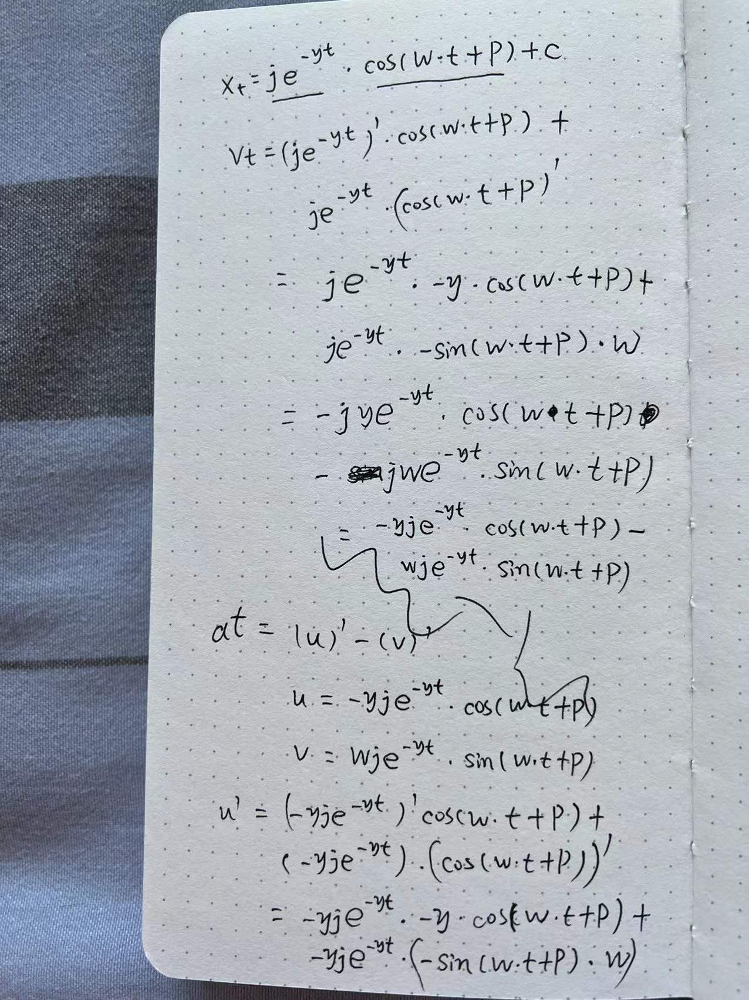

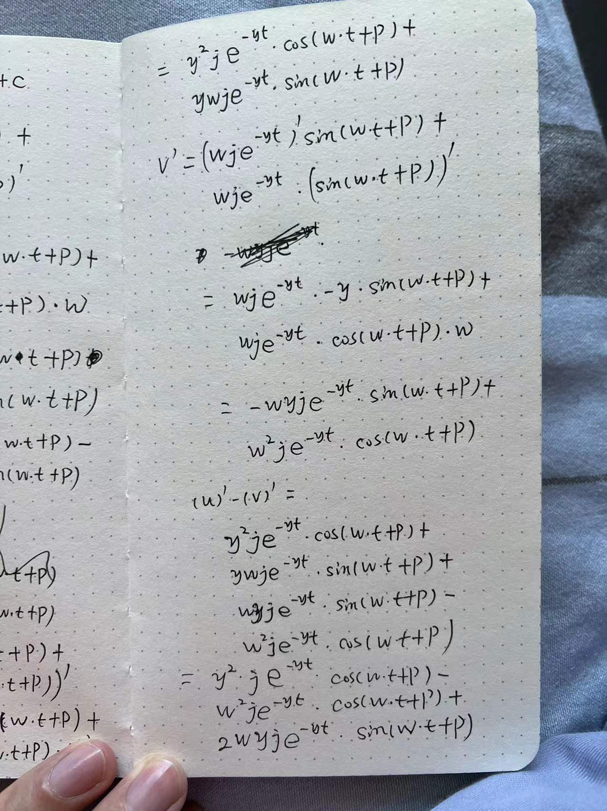

公式看起来有点复杂，我们把公式简化下


**Finding the Spring Parameters**

我们会按照如下的办法求解这些未知参数：我们把上面的$x_t$$v_t$以及$a_t$带入到另外一个公式$a_t = s * (g - x_t) + d * (q - v_t)$其中$d = damping$以及$s = stiffness$，我们可以基于此求解出$y, w, c$最后利用这些参数求解出$s, d, q, g$

我们首先对运动公式最一些整理，方便后面使用.


把刚才创建的$x_t,v_t$和$a_t$带入进去：

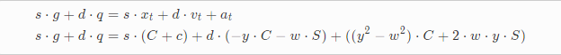

公式展开把系数为C和S的项合并:

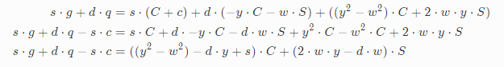

另外有一个事实我们可以利用下，那就是C和S本质就是$cos$和$sin$函数，它们有相同的相位，振幅以及频率，我们假设左项等于0，那么如果右项也等于0的话只能是它们的系数等于0，得到下面三个公式：

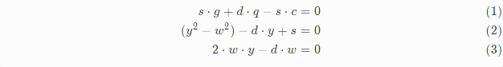

求解$c$

利用公式$(1)$可以求解出第一个未知参数$c$!


求解$y$

整理公式$(3)$可以解得参数$y$:


求解$w$

将$y$的解带入公式$(2)$中得到$w$:


Finding the Spring State

现在还有两个未知参数$j, p$,分别表示振幅和相位，不像$y, w, c$,这两个参数是又spring的初始条件决定的，所以我们给定初始位置以及初始速度$x_0, v_0$,我们将$t = 0$带入公式中求$j, p$:

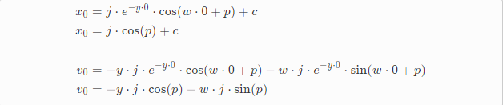

求解$j$

先整理$x_0$关于$p$的公式：


随之带入到$v_0$的公式中:

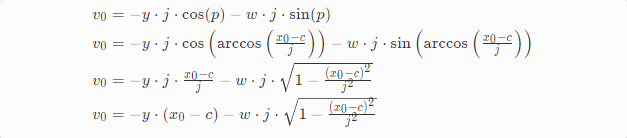

最后整理公式得到$j$:

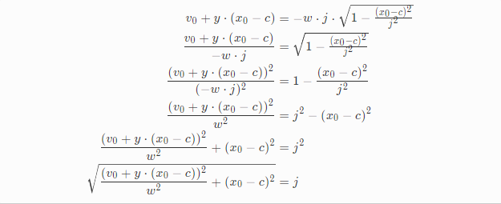

因为是平方和平方根的公式，所以符号丢失了，在这个例子中，如果$x_0 - c <0$的话，$j$需要取负值

求解$p$

整理$v_0$关于$j$的公式:


带入到$x_0$公式中求解$p$:

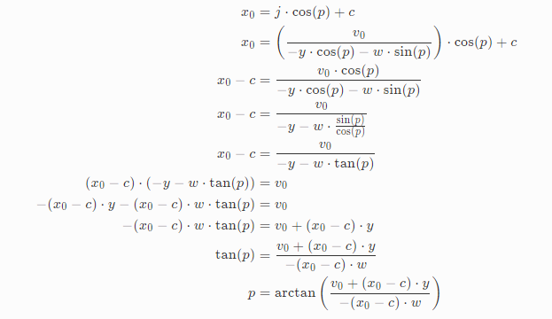

把所有的公式合在一起：

```C++
float fast_atan(float x)
{
    float z = fabs(x);
    float w = z > 1.0f ? 1.0f / z : z;
    float y = (M_PI / 4.0f)*w - w*(w - 1)*(0.2447f + 0.0663f*w);
    return copysign(z > 1.0f ? M_PI / 2.0 - y : y, x);
}

float squaref(float x)
{
    return x*x;
}

void spring_damper_implicit(
    float& x, 
    float& v, 
    float x_goal, 
    float v_goal, 
    float stiffness, 
    float damping, 
    float dt, 
    float eps = 1e-5f)
{
    float g = x_goal;
    float q = v_goal;
    float s = stiffness;
    float d = damping;
    float c = g + (d*q) / (s + eps);
    float y = d / 2.0f;
    float w = sqrtf(s - (d*d)/4.0f);
    float j = sqrtf(squaref(v + y*(x - c)) / (w*w + eps) + squaref(x - c));
    float p = fast_atan((v + (x - c) * y) / (-(x - c)*w + eps));

    j = (x - c) > 0.0f ? j : -j;

    float eydt = fast_negexp(y*dt);

    x = j*eydt*cosf(w*dt + p) + c;
    v = -y*j*eydt*cosf(w*dt + p) - w*j*eydt*sinf(w*dt + p);
}
```

哇！它动起来了~即便$dt$和$stiffness$数值设置的很大，运动表现依然很稳定，我们利用一些高中的知识就完成了这样复杂的推导~~

{视频 springdamper_implicit.m4v}

### Over, Under, and Critical Damping
等下...大家有没有注意到上面有个地方有点问题？


这是个平方根...但是我从来没有说过这个式子不可能为负，事实上，当$d$足够大时，表达式会成为负值！

负的平方根意味着什么呢？是不是当$damping$足够大时没有正确的方案呢？是否应该放弃了？不是这样的...

事实上当我们构造spring的原始公式时，并没有注意到根据$damping$和$stiffness$的关系，可以推导出三种不同运动方式的spring

当$s - \frac{d^2}{4} > 0$时被称为欠阻尼，会引起振荡运动，上面我们推导的就是这种. 当$s - \frac{d^2}{4} = 0$时称之为临界阻尼，意味着尽可能快地到底目标位置，没有任何振荡. 当$s - \frac{d^2}{4} < 0$时称之为过阻尼，意味着比较慢地向目标位置靠近,也是不存在任何振荡

每种类型的spring都由不同的公式所驱动，所以跟我们已推导出的公式也有所不同，为了节省一些时间以及篇幅所限，我们就直接把公式列出来了~

欠阻尼：


临界阻尼:

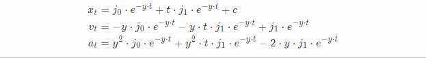

过阻尼:


上面我们已经推导过欠阻尼的情况了，接下来我们采用类似的方法求解其他两种

**Solving the Critically Damped Case**

先求解最简单的临界阻尼，其中$c$和$y$的值与欠阻尼的值相同，$c = g + \frac{d * q}{s}$以及$y = \frac{d}{2}$,当$t = 0$时将$x_0, v_0$带入也很容易求出$j0, j1$

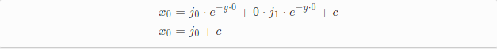

以及关于速度


最终得到


easy!!!

**Solving the Over Damped Case**

过阻尼稍微麻烦点，首先对复杂项进行归纳让公式变的清晰一些

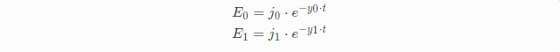

整理后：


首先我们先求$y0, y1$，方法跟之前一样，整理合并项：

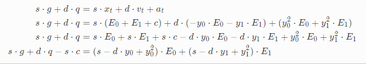

同样的，如果左侧等于0，那么必然是系数等于0才能匹配上，得到:


可以看到$y0, y1$同为二次方程式，利用二次求根公式可得:

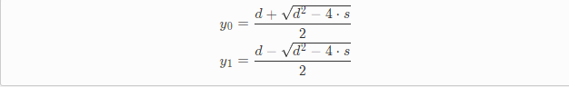

接下来我们求解$j0, j1$，同样的，将$t = 0, x0, v0$带入可得:


重新整理$x0$中的$j0$:


带入到$v0$中解得$j1$:

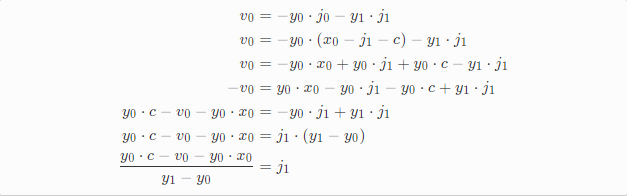

这时候$j0$也很容易求出了:

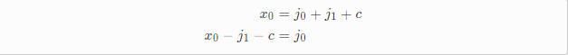

我们把spring的三种情况都添加到代码中:

```C++
void spring_damper_implicit(
    float& x, 
    float& v, 
    float x_goal, 
    float v_goal, 
    float stiffness, 
    float damping, 
    float dt, 
    float eps = 1e-5f)
{
    float g = x_goal;
    float q = v_goal;
    float s = stiffness;
    float d = damping;
    float c = g + (d*q) / (s + eps);
    float y = d / 2.0f; 
    
    if (fabs(s - (d*d) / 4.0f) < eps) // Critically Damped
    {
        float j0 = x - c;
        float j1 = v + j0*y;
        
        float eydt = fast_negexp(y*dt);
        
        x = j0*eydt + dt*j1*eydt + c;
        v = -y*j0*eydt - y*dt*j1*eydt + j1*eydt;
    }
    else if (s - (d*d) / 4.0f > 0.0) // Under Damped
    {
        float w = sqrtf(s - (d*d)/4.0f);
        float j = sqrtf(squaref(v + y*(x - c)) / (w*w + eps) + squaref(x - c));
        float p = fast_atan((v + (x - c) * y) / (-(x - c)*w + eps));
        
        j = (x - c) > 0.0f ? j : -j;
        
        float eydt = fast_negexp(y*dt);
        
        x = j*eydt*cosf(w*dt + p) + c;
        v = -y*j*eydt*cosf(w*dt + p) - w*j*eydt*sinf(w*dt + p);
    }
    else if (s - (d*d) / 4.0f < 0.0) // Over Damped
    {
        float y0 = (d + sqrtf(d*d - 4*s)) / 2.0f;
        float y1 = (d - sqrtf(d*d - 4*s)) / 2.0f;
        float j1 = (c*y0 - x*y0 - v) / (y1 - y0);
        float j0 = x - j1 - c;
        
        float ey0dt = fast_negexp(y0*dt);
        float ey1dt = fast_negexp(y1*dt);

        x = j0*ey0dt + j1*ey1dt + c;
        v = -y0*j0*ey0dt - y1*j1*ey1dt;
    }
}
```

太棒了！现在即使$damping$设置的再大也能正常运行了~

{视频 springdamper_implicit_fixed.m4v}

### The Half-life and the Frequency
我们快要完成了~不过我们的函数现在使用的还是令人难以理解的$damping$以及$stiffness$的参数，我们能不能把这些参数换成有意义好理解的参数呢？当然可以了，就想之前那样通过$exp$函数将$damping$换成$halflife$那样:

```C++
float halflife_to_damping(float halflife, float eps = 1e-5f)
{
    return (4.0f * 0.69314718056f) / (halflife + eps);
}
    
float damping_to_halflife(float damping, float eps = 1e-5f)
{
    return (4.0f * 0.69314718056f) / (damping + eps);
}
```

这里$ln(2)$乘以4，这里的4仅仅是个粗略的系数，原因主要是基于$y = \frac{d}{2}$以及spring公式是两个指数公式的和

如何处理$stiffness$这个参数呢？ 我们把这个参数转成一个叫做$frequency$的参数:

```C++
float frequency_to_stiffness(float frequency)
{
   return squaref(2.0f * M_PI * frequency);
}

float stiffness_to_frequency(float stiffness)
{
    return sqrtf(stiffness) / (2.0f * M_PI);
}
```

Which is close to what will become $w$ in the under-damped case.

需要注意的是，spring表现出的行为和这两个参数的名字有一点点出入，比如$halflife$并不是准确地表示一半路程消耗的时间，$frequency$更像是一个伪频率值，与振荡速率类似也受$damping$值影响，不过这两个参数比$damping$和$stiffness$要更直观一些

{视频 springdamper_implicit_halflife.m4v}

按照上面的思路，当在临界阻尼的情况下(比如当$\frac{d^2}{4} = s$时)这两个参数的设置函数也特别有用，比如说一些设置默认值或者我们只想设置一个参数的时候

```C++
float critical_halflife(float frequency)
{
    return damping_to_halflife(sqrtf(frequency_to_stiffness(frequency) * 4.0f));
}

float critical_frequency(float halflife)
{
    return stiffness_to_frequency(squaref(halflife_to_damping(halflife)) / 4.0f);
}
```

critical_halflife大部分情况下没有什么意义因为临界阻尼不存在振荡现象，但是在某些情况下仍然是有用的. 综合上述的信息我们整理下我们的接口(更加友好了)和代码:

```C++
void spring_damper_implicit(
    float& x, 
    float& v, 
    float x_goal, 
    float v_goal, 
    float frequency, 
    float halflife, 
    float dt, 
    float eps = 1e-5f)
{    
    float g = x_goal;
    float q = v_goal;
    float s = frequency_to_stiffness(frequency);
    float d = halflife_to_damping(halflife);
    float c = g + (d*q) / (s + eps);
    float y = d / 2.0f; 
    
    ...

}
```

下面的视频可以看到通过给定的一个$halflife$求出临界情况下$frequency$是多少. 到这里，我向大家保证，我们终于完成了隐式弹簧阻尼器！！

{视频 springdamper_implicit_critical.m4v}
### The Critical Spring Damper
相对于隐式弹簧阻尼器, 我们更加关注临界弹簧阻尼器(游戏开发中经常用到)，不仅仅是因为它的无振荡，快速移向目标位置的特性，而是它计算更简单快捷并且参数还少. 我们接下来构造下这个函数，这个函数允许我们移除掉$frequency$这个参数，并且我们添加了一些优化

```C++
void critical_spring_damper_implicit(
    float& x, 
    float& v, 
    float x_goal, 
    float v_goal, 
    float halflife, 
    float dt)
{
    float g = x_goal;
    float q = v_goal;
    float d = halflife_to_damping(halflife);
    float c = g + (d*q) / ((d*d) / 4.0f);
    float y = d / 2.0f;	
    float j0 = x - c;
    float j1 = v + j0*y;
    float eydt = fast_negexp(y*dt);

    x = eydt*(j0 + j1*dt) + c;
    v = eydt*(v - j1*y*dt);
}
```

函数没有欠阻尼和过阻尼的特殊情况所以编译后执行的更快.对于某些常用的特殊情况，单独创建新的函数特别有用，比如临界阻尼场景下目标速度$q = 0$的时候...

```C++
void simple_spring_damper_implicit(
    float& x, 
    float& v, 
    float x_goal, 
    float halflife, 
    float dt)
{
    float y = halflife_to_damping(halflife) / 2.0f;	
    float j0 = x - x_goal;
    float j1 = v + j0*y;
    float eydt = fast_negexp(y*dt);

    x = eydt*(j0 + j1*dt) + x_goal;
    v = eydt*(v - j1*y*dt);
}
```

还有就是目标位置也为0的情况(速度也是0)...

```C++
void decay_spring_damper_implicit(
    float& x, 
    float& v, 
    float halflife, 
    float dt)
{
    float y = halflife_to_damping(halflife) / 2.0f;	
    float j1 = v + x*y;
    float eydt = fast_negexp(y*dt);

    x = eydt*(x + j1*dt);
    v = eydt*(v - j1*y*dt);
}
```

另外一种有效的优化方法是给出一个$halflife$预计算出$y$和$eydt$的值，当很多spring需要更新时并且这些spring使用相同的$halflife, dt$参数，预计算对于性能有很大的提升.

## Applications
### Smoothing
在游戏开发中可能最常用的就是做平滑了，实时运行的情况下任何噪声信号都可以轻易地被平滑处理掉并且half life可以很好地权衡平滑度和灵敏度

{视频 application_smoothing.m4v}

### Filtering
同样地，作为滤波器可以过滤掉一些抖动的信号，甚至于即便half-life设置的很小也可以过滤掉一些抖动信号

{视频 application_filtering.m4v}

### Controllers
游戏开发中另外一个常见用途就是作为控制器移动角色.常见流程是将输入设备的输入转成目标速度，将这个速度设置为spring的目标值, 每帧我们tick spring，它将产生一个速度值，我们使用这个速度值来移动角色. 这样的话，我们可以通过调整spring的相关参数实现运动的平滑度以及灵敏度 

需要注意的是，我们是把速度信息设置给了spring的posotion，意味着，spring的速度信息对应的是角色的加速度

假定角色期望速度不变的话，我们可以预测未来时间点的速度信息，方法就是给一个大的$dt$

如果还想求未来某个时间点的位置信息, 我们可以用临界阻尼公式对time求积分，可以让我们很准确地预测角色的位置信息


把公式转成代码...

```C++
void spring_character_update(
    float& x, 
    float& v, 
    float& a, 
    float v_goal, 
    float halflife, 
    float dt)
{
    float y = halflife_to_damping(halflife) / 2.0f;	
    float j0 = v - v_goal;
    float j1 = a + j0*y;
    float eydt = fast_negexp(y*dt);

    x = eydt*(((-j1)/(y*y)) + ((-j0 - j1*dt)/y)) + 
        (j1/(y*y)) + j0/y + v_goal * dt + x;
    v = eydt*(j0 + j1*dt) + v_goal;
    a = eydt*(a - j1*y*dt);
}
```

可以看到，代码和临界阻尼的代码很类似，不过添加了角色速度和位置的计算. 如果你想预测future trajectory，我们可以传入不同时间点的$dt$：

```C++
void spring_character_predict(
    float px[], 
    float pv[], 
    float pa[], 
    int count,
    float x, 
    float v, 
    float a, 
    float v_goal, 
    float halflife,
    float dt)
{
    for (int i = 0; i < count; i++)
    {
        px[i] = x; 
        pv[i] = v; 
        pa[i] = a;
    }

    for (int i = 0; i < count; i++)
    {
        spring_character_update(px[i], pv[i], pa[i], v_goal, halflife, i * dt);
    }
}
```

我们可以很准确地预测未来任意时间点的Spring情况

{视频 application_controller.m4v}

视频可以看到一个点在世界中的运动情况，其中输入转换成了角色的速度信息，通过调整$halflife$可以权衡运动的平滑度和灵敏度，红色的显示出了spring预测的每个时间点的位置信息.

在论文[Learned Motion Matching](https://theorangeduck.com/page/learned-motion-matching)就是使用的这种办法预测Future Trajectory

### Inertialization
在游戏动画中，[惯性化插值](https://www.youtube.com/watch?v=BYyv4KTegJI)是用于淡入或者淡出两个动画Offset的融合方法. 通常这是一种用于融合的高性能替代方案原因在于每次只评估一个动画树(注: 只评估target动画树，source记录好状态后不再评估)在原始演讲中作者采用多项式平滑地融合Offset, 当然了，我们采用springs也可以做到

思路如下: 我们有两条不同的动画数据流用于切换，在切换的那一刻我记录下当前播放的动画与想要切换到的目标动画的Offset，然后我们切到目标动画上不过需要加上记录的Offset, 随后我们一直平滑地衰减这个Offset直到Offset为0, 这种场景下我们需要使用spring damper

代码如下，在切换那一刻我们记录下$src$动画和$dst$动画关于位置和速度的Offset:

```C++
void inertialize_transition(
    float& off_x, float& off_v, 
    float src_x, float src_v,
    float dst_x, float dst_v)
{
    off_x = (src_x + off_x) - dst_x;
    off_v = (src_v + off_v) - dst_v;
}
```

紧接着我们切到新的动画上，随后我们每帧衰减Offset直到0，并且将结果加到当前播放的动画上

```C++
void inertialize_update(
    float& out_x, float& out_v,
    float& off_x, float& off_v,
    float in_x, float in_v,
    float halflife,
    float dt)
{
    decay_spring_damper_implicit(off_x, off_v, halflife, dt);
    out_x = in_x + off_x;
    out_v = in_v + off_v;
}
```

视频效果如下:

{视频 application_inertialization.m4v}

正如视频里看到的，当点击transition按钮时，红色的点会在两条$sin$波上来回切换，蓝色的点利用惯性化插值平滑地移动

不像原始演讲中使用多项式处理Offset, spring不会提供一个固定的blend time并且会很容易出现overshoot（注：会吗？）然后指数级的衰减意味着平滑且快速，另外，还不用记录上次切换时的时间，代码非常简单,并且因为我们使用的是decay_spring_damper_implicit版本的spring，处理的就更快了，特别是不同骨骼使用相同的$halflife$和$dt$参数时

在论文[Learned Motion Matching](https://theorangeduck.com/page/learned-motion-matching)就是使用的这种办法切换动画的

### Interpolation
使用spring时有个技巧是关于time dimension不是说必须传入time的，它可以是单调递增任意东西，比如沿着一条曲线可参数化的采样点，把它当成time dimension可以生成一条有意思的spline.

比如如下就是一些分段的2D控制点，下面函数用来生成位置和速度信息(X轴和Y轴通过两个spring控制)

```C++
void piecewise_interpolation(
    float& x,
    float& v,
    float t,
    float pnts[],
    int npnts)
{
    t = t * (npnts - 1);
    int i0 = floorf(t);
    int i1 = i0 + 1;
    i0 = i0 > npnts - 1 ? npnts - 1 : i0;
    i1 = i1 > npnts - 1 ? npnts - 1 : i1;
    float alpha = fmod(t, 1.0f);
    
    x = lerp(pnts[i0], pnts[i1], alpha);
    v = (pnts[i0] - pnts[i1]) / npnts;
}
```

我们生成了一条趋向于控制点的spline曲线，通过调整$halflife$和$frequency$可以生成一些特别有意思的曲线，但是整体表现可能会有些奇怪，比如不对称或者没有到达最终点等等，可能需要你添加一些有趣的想法，比如添加两个spring从两端出发最后合并结果等等

{视频 application_interpolation.m4v}
### Resonance
(感兴趣的请阅读原文)

{视频 application_resonance.m4v}

## Other Springs
### Double Spring
你是否会觉得spring damper的图像有点不对称？开始比较陡峭随后快速平坦，如果把另外一个spring作为目标的话可以实现“S”形状的spring,我们称之为"double spring"

```C++
void double_spring_damper_implicit(
    float& x, 
    float& v, 
    float& xi,
    float& vi,
    float x_goal,
    float halflife, 
    float dt)
{
    simple_spring_damper_implicit(xi, vi, x_goal, 0.5f * halflife, dt);
    simple_spring_damper_implicit(x, v, xi, 0.5f * halflife, dt);
}
```

如下表现:

{视频 double_spring.m4v}

视频中，红色的表示中间所需spring xi，蓝色的就是double spring，可以看到在开始和结束时的“S”形状

### Timed Spring
有些时候，我们不希望spring快速到达目标位置，而是希望它在指定的时间后到达，当然，当目标位置快速切换时我们仍然需要能够有平滑和过滤噪点的特性. 这是spring的另外一种变种版本，需要传入goal time，会粗略地在这个时间内移动到目标位置上. 总体思路一段时间内spring的goal是线性插值的一个目标点(当靠近目标位置时给spring时间去做最后的blend)

```C++
void timed_spring_damper_implicit(
    float& x,
    float& v,
    float& xi,
    float x_goal,
    float t_goal,
    float halflife,
    float dt,
    float apprehension = 2.0f)
{
    float min_time = t_goal > dt ? t_goal : dt;
    
    float v_goal = (x_goal - xi) / min_time;
    
    float t_goal_future = dt + apprehension * halflife;
    float x_goal_future = t_goal_future < t_goal ?
        xi + v_goal * t_goal_future : x_goal;
        
    simple_spring_damper_implicit(x, v, x_goal_future, halflife, dt);
    
    xi += v_goal * dt;
}
```

{视频 timed_spring.m4v}

### Velocity Spring
同样的道理，如果spring想始终维持一个固定速度的话，那就去track一个中间的target,这target始终以一个固定速度移向目标

```C++
void velocity_spring_damper_implicit(
    float& x,
    float& v,
    float& xi,
    float x_goal,
    float v_goal,
    float halflife,
    float dt,
    float apprehension = 2.0f,
    float eps = 1e-5f)
{
    float x_diff = ((x_goal - xi) > 0.0f ? 1.0f : -1.0f) * v_goal;
    
    float t_goal_future = dt + apprehension * halflife;
    float x_goal_future = fabs(x_goal - xi) > t_goal_future * v_goal ?
        xi + x_diff * t_goal_future : x_goal;
    
    simple_spring_damper_implicit(x, v, x_goal_future, halflife, dt);
    
    xi = fabs(x_goal - xi) > dt * v_goal ? xi + x_diff * dt : x_goal; 
}
```

视频可以看到，中间的target为红色

{视频 velocity_spring.m4v}

### Quaternion Spring
simple spring damper的简化代码可以很容易地适应诸如四元数的需求.主要的思想是把四元数换算为[角速度](https://theorangeduck.com/page/exponential-map-angle-axis-angular-velocity)然后可以与其他项有很好的交互

```C++
void simple_spring_damper_implicit_quat(
    quat& x, 
    vec3& v, 
    quat x_goal, 
    float halflife, 
    float dt)
{
    float y = halflife_to_damping(halflife) / 2.0f;	
	
    vec3 j0 = quat_to_angular_velocity(quat_mul(x, quat_inv(x_goal)));
    vec3 j1 = v + j0*y;
	
    float eydt = fast_negexp(y*dt);

    x = quat_mul(quat_from_angular_velocity(eydt*(j0 + j1*dt)), x_goal);
    v = eydt*(v - j1*y*dt);
}
```

作为练习大家可以自行推导一些其他变种的spring~~
## Source Code

https://github.com/orangeduck/Spring-It-On

(正文完)
# 我的总结
## 阅读前的疑问以及解答
1. Spring与速度的联系？
   
   首先要想下为什么需要速度，速度平滑才能让整个运动平滑，所以速度是运动平滑的关键，这就区别于传统的lerp

2. 正常图像中的速度如何表示的？
   
   刚开始看图像的时候很容易被误导，红点一直在移动，说明一直有速度呀，其实不是的，速度指的是y轴的移动速度，y轴上没有移动，说明速度为0

3. Spring与惯性化插值的特点，区别和应用场景？
   
   可以看到Spring和惯性化插值的数学推导特别相似，其实应用也特别类似，惯性化插值首先优化是第一位，其次原理上也是计算offset,然后衰减offset,最后时刻offset = 0, v = 0, a = 0,与decay_spring_damper_implicit行为一致（作者说可能会overshoot，没有太理解，需要问问作者），Spring可以理解出惯性化插值的超集，可以干更多的事情.

4. 惯性化插值完成时刚好速度，加速度为0吗？
   
   看怎么去理解，公式推导时假定了最后offset = 0, v = 0, a = 0,说的offset的速度加速度为0，最后的表现是目标动画 + offset, 目标动画速度可能不为0，可以看下UE4官方的惯性化插值的例子，可以看到Idle到WaveLoop也是惯性化插值，并不是说惯性化插值完成那一刻会停一下

5. Spring是否速度，加速连续？
   
   是的，速度加速度都是连续的(加速度没有验证，不过根据$a_t = s * (g - x_t) + d * (q - v_t)$推断应该也是连续的)

6. 现在的位置为x,速度为v1,目标位置是g,目标速度是v2,SpringDamper和惯性化插值是否都可以使用？
   
   原理上讲，都是可以使用的，先计算位置Offset和速度Offset,然后将位置Offset趋于0，速度Offset也趋于0，每帧都是目标位置+位置Offset,目标速度+速度Offset

## 题外话
1. 读懂文章太难了，到现在一些数学东西还是一知半解...
2. 从纯数学角度大致了解Spring模型，可以看到没有提到胡克定律之类的物理概念
3. 如果你是上大学的学生，还是强烈建议学好数学，比如微积分，常微分方程以及数值分析等，进入社会后数学和英语能决定你的上限，而不是你知道多少API，是否用过虚幻或者Unity
4. 后续计划把四元数的相关加入到数学学习关卡中...

# 其他参考资料汇总
Simon Clavet看过Daniel Holden的文章后还专门发了两个视频详细推导讲解下[Spring damper solution](https://www.youtube.com/watch?v=RGOUPe-GfCk)

知乎大佬sincezxl的文章[UE4中的阻尼弹簧平滑](https://zhuanlan.zhihu.com/p/412291354)，从物理角度推导的阻尼弹簧，并且分析了UE4, UE5的实现，强力推荐！！！

同样是sincezxl的文章[UE4实现基于预测的FootIK](https://zhuanlan.zhihu.com/p/380222928)里面提到了阻尼弹簧的一个用途

游戏编程精粹4-1.10，用临界阻尼实现慢入慢出的平滑，不过里面有个错误需要说明下，正确的应该为红色的公式
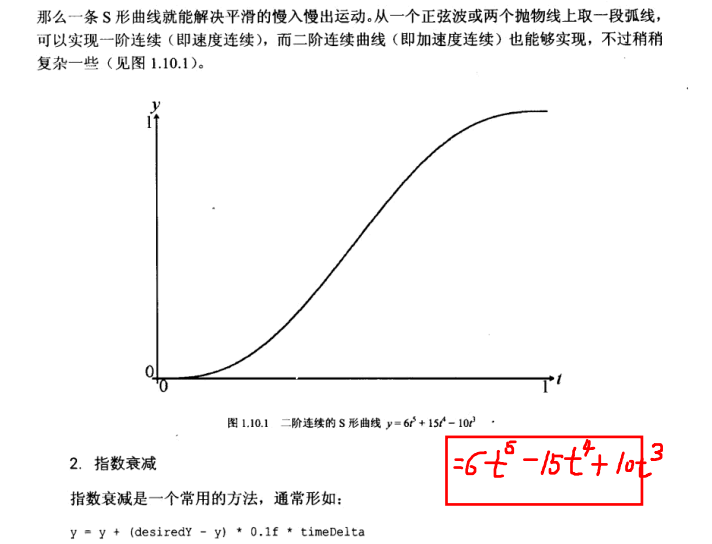

[Inertialization: High-Performance Animation Transitions in Gears of War](https://www.youtube.com/watch?v=BYyv4KTegJI&list=PL2e4mYbwSTbbHAJT7OdK5mv-idhlLOTl0&index=12)惯性化插值的视频讲解

[Inertialization视频的文字版](https://zhuanlan.zhihu.com/p/73284882)

[惯性插值-优异的动画过渡算法](https://zhuanlan.zhihu.com/p/390476167)