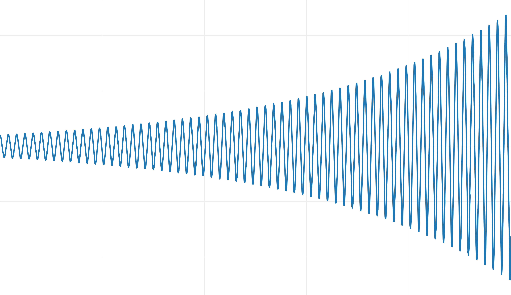

#! https://zhuanlan.zhihu.com/p/471410434
# 游戏物理模拟中的积分

## 前言
文章的原文地址[点这里](https://gafferongames.com/post/integration_basics/)

我是在翻译[游戏开发中的阻尼器和阻尼弹簧](https://zhuanlan.zhihu.com/p/461813778)时发现这篇文章的，属于物理模拟的基础性知识，刚好最近在看物理模拟相关的，所以翻译学习下~

(而且我翻译有个喜好，就是看看作者是否是业内知名人物，作者是Glenn Fiedler，看了下他的推特，Epic几位技术主管都有关注他，并且还有Simon Clavet和腾讯的Milo Yip，嗯是大牛。哈哈，这篇文章发布于2004年6月1号，那时候我还在上小学过儿童节...)

## 介绍
大家好，我是[Glenn Fiedler](https://gafferongames.com/), 欢迎来到[游戏物理系列](https://gafferongames.com/categories/game-physics/)

如果你对计算机物理模拟内部的原理感兴趣的话，那你就来对地方了！这一系列文章就是来讲解这个话题的. 阅读本文前我假定你能熟练使用C++以及有一些基础的数学和物理的储备知识，其他就没有了，只要你能够集中精神阅读代码示例

物理模拟的工作方式大致为基于物理方程做许多小的预测，这些预测其实也很简单，大致就是“这个物体在这，高速向那个方向移动，一段时间后这个物体应该在那”，我们利用数学方法执行这些预测就叫做积分

我们本文的主题就是来讨论如何正确地实现积分

## 对运动方程进行积分
你可以还记得在高中或者大学时所学的物理公式，力等于质量乘以加速度

$F = ma$

我们把这个公式转换为加速度等于力除以质量，这个可以很直观地解释为什么重的物体更难投出去

$a = F/m$

而加速度的定义是速度经过一定时间的改变量：

$dv/dt = a = F/m$

类似地，速度是位置经过一定时间的改变量:

$dx/dt = v$

这就意味着，如果我们知道了物体当前的速度和位置，以及作用到物体上的力，那么我们通过积分可以知道在未来某个时间点的位置和速度情况.

## 数值积分
如果你在大学里没有学过微分方程也不用担心，我们本篇不会解析微分方程，我们会使用一种称为数值积分的方法来解决问题

数值积分是如何工作的呢？首先先给出初始位置和速度，然后进行一次步进求出未来时间点的位置和速度，然后重复这个过程.持续步进的操作，然后用本次得到的结果作为下次迭代的开始初始值.

问题是我们如何求出一次步进后的位置和速度呢？

答案依赖于`运动方程式`

我们定义当前的时间为$t$, 一次步进为$dt$或者称为'delta time'.

我们写下运动公式，很简单

```
 acceleration = force / mass
 change in position = velocity * dt
 change in velocity = acceleration * dt
```

举个很直观的例子就是如果一辆车以每小时60km的速度行驶，那么一个小时后这辆车将在路上行驶60km的距离，同样的，如果这辆车以(10km/小时/秒)的加速度行驶，那么10秒后，速度将会比之前快上(100km/小时) 左右

当然了，上面的逻辑是基于速度和加速度是常量的情况的，不过，即使不是常量，作为近似算法仍然是个不错的开始.

我们把上述逻辑写到代码里.初始条件为物体重量为1kg,静止停留在原点位置，我们随后持续施加一个10牛顿的力，每次步进的时间为1秒：

```C++
    double t = 0.0;
    float dt = 1.0f;

    float velocity = 0.0f;
    float position = 0.0f;
    float force = 10.0f;
    float mass = 1.0f;

    while ( t <= 10.0 )
    {
        position = position + velocity * dt;
        velocity = velocity + ( force / mass ) * dt;
        t += dt;
    }
```

结果如下:

```
    t=0:    position = 0      velocity = 0
    t=1:    position = 0      velocity = 10
    t=2:    position = 10     velocity = 20
    t=3:    position = 30     velocity = 30
    t=4:    position = 60     velocity = 40
    t=5:    position = 100    velocity = 50
    t=6:    position = 150    velocity = 60
    t=7:    position = 210    velocity = 70
    t=8:    position = 280    velocity = 80
    t=9:    position = 360    velocity = 90
    t=10:   position = 450    velocity = 100
```

正如上面我们看到的，我们知道物体每次步进后的位置和速度信息，这就是数值积分.
## 显式欧拉积分
上面我们用到的积分方法有一个名字就是显式欧拉积分.

为了避免将来的尴尬，我想提醒下Euler的发音是“Oiler” 而并非 “yew-ler”，这个名字是为了纪念首次发现该方法的瑞士数学家[Leonhard Euler](https://en.wikipedia.org/wiki/Leonhard_Euler)

显式欧拉积分是特别基础的一种积分方法，它只有在变化速量为常量时才100%准确.

上面的例子可以看到，加速度为常量，所有通过积分求出的速度是没有误差的.

然而，我们想通过对速度积分求位置，但是速度因为加速度的缘故却一直在变化，这就意味着通过积分算出的位置是存在误差的.

那么这个误差有多大呢？我们来算一下！

下面的公式是运动的闭式解(注:也可以称作解析解),我们用这个来比较数值积分后的结果和正确的结果相差多少.

```
    s = ut + 0.5at^2
    s = 0.0*t + 0.5at^2
    s = 0.5(10)(10^2)
    s = 0.5(10)(100)
    s = 500 meters
```

可以看到10秒后物体应该运动500米，但显式欧拉积分的结果是450，短短10秒结果就相差了50米！

这个结果看起来相当的差，不过，在游戏模拟中步进的时间不会有1秒这么长，步进的长度经常与显示的帧率类似.

这次我们把$dt = 1/100$再试试

```
    t=9.90:     position = 489.552155     velocity = 98.999062
    t=9.91:     position = 490.542145     velocity = 99.099060
    t=9.92:     position = 491.533142     velocity = 99.199059
    t=9.93:     position = 492.525146     velocity = 99.299057
    t=9.94:     position = 493.518127     velocity = 99.399055
    t=9.95:     position = 494.512115     velocity = 99.499054
    t=9.96:     position = 495.507111     velocity = 99.599052
    t=9.97:     position = 496.503113     velocity = 99.699051
    t=9.98:     position = 497.500092     velocity = 99.799049
    t=9.99:     position = 498.498077     velocity = 99.899048
    t=10.00:    position = 499.497070     velocity = 99.999046
```

可以看到这个结果相当不错，对于游戏来讲完全足够了.
## 为什么显式欧拉积分还是不够好呢
可以看到，当$dt$足够小并且加速度为常量时，显式欧拉积分得到的结果确实令人满意，但如果加速度不是常量呢？

一个加速度不是常量的好例子就是[弹簧阻尼系统](https://ccrma.stanford.edu/CCRMA/Courses/152/vibrating_systems.html)

在这个系统中一个有质量的物体绑到弹簧上，它受到一些力使得运动衰减. 运动过程中存在两种力，一种力与物体的距离正相关，该力将物体推向原点位置(弹簧力).另外一种力与速度正相关，不过方向相反，使得物体速度降下来(阻尼力).

现在加速度随着时间不再是常量了，加速度受位置和速度共同影响，并且位置和速度自身随着时间也是连续变化的.

这是一个[阻尼谐振子](https://en.wikipedia.org/wiki/Harmonic_oscillator#Damped_harmonic_oscillator)的好例子并且还存在闭合解，可以用来和数值积分解进行比较.

我们试下欠阻尼的情况，欠阻尼就是物体在原点附近振荡并且慢慢降速.

我们质量-弹簧系统的输入参数如下:

* 质量：1kg
* 初始位置: 离原点1000米的位置
* 胡克定律中弹簧的系数$k = 15$
* 胡克定律中阻尼系统$b = 0.1$

闭合解的图像如下:


我们应用显式欧拉积分得到如下结果:



可以看到，不仅在原点位置没有衰减以及收敛，相反，它的能量随着时间在持续增加！

显式欧拉积分在$dt = 1/100$时仍然是不稳定的

不幸的是，除了我们使用小的步进值，没有其他可用的选项来提升准确度了.即使我们减小了步进值，依然会存在一个对应的k使得整体表现像上面一样.

## 半隐式欧拉积分
还有一种积分方法称之为[半隐式欧拉积分](https://en.wikipedia.org/wiki/Semi-implicit_Euler_method)

需要常用的商业物理引擎就是使用的这种积分方法.

将显式欧拉积分转换成半隐式欧拉积分特别简单:

```C++
    position += velocity * dt;
    velocity += acceleration * dt;
```
换成

```C++
    velocity += acceleration * dt;
    position += velocity * dt;
```

应用$dt = 1/100$的半隐式欧拉积分后将会得到一个非常接近闭合解的稳定结果：


虽然半隐式欧拉积分和显式欧拉积分同为一阶精度，但前者的结果更加准确，因为半隐式欧拉积分属于[辛积分器](https://en.wikipedia.org/wiki/Symplectic_integrator).

## 常见的其他积分方法
[隐式欧拉积分](http://web.mit.edu/10.001/Web/Course_Notes/Differential_Equations_Notes/node3.html)也是一种积分方法，在对刚性方程积分时，它比其他积分方法更加稳定. 不过它的缺点是需要每次步进时解析系统方程

[韦尔莱积分](https://en.wikipedia.org/wiki/Verlet_integration)精度比隐式欧拉法更高并且内存使用更少，尤其是在模拟大量粒子时. 这是个两阶精度的辛积分器.

还有就是著名的龙格－库塔积分法，这是一类方法，其中就包括显式欧拉积分. 它包含了更好精度的积分方法，其中最常用的被称为龙格－库塔四阶积分法简称RK4.

龙格－库塔积分法由数学家卡尔·龙格和马丁·威尔海姆·库塔于1900年左右发明.

RK4的四阶精度意味着更加精确，相比之下，显式欧拉和隐式欧拉法只有一阶精度.

虽然说RK4精度更高，但并不意味着RK4是最棒的积分法或者说它要比半隐式欧拉法更优秀，这个东西很难说.

不管怎么样，RK4确实是一个值得学习的积分法.
## 实现RK4
关于RK4网上已经有很多不错的教程了，比如[这里](https://en.wikipedia.org/wiki/Runge%E2%80%93Kutta_methods)，[这里](http://web.mit.edu/10.001/Web/Course_Notes/Differential_Equations_Notes/node5.html)还有[这里](https://www.researchgate.net/publication/49587610_A_Simplified_Derivation_and_Analysis_of_Fourth_Order_Runge_Kutta_Method),我强烈建议你看下这些教程，可以从数学的角度理解这个算法.不过本篇文章的听众都是编程人员，不是数学从业人员所以我们仅仅实现它即可. 我们现在开始!

我们先用C++定义物体的状态，将位置和速度信息存储到同一个结构体中:

```C++
    struct State
    {
        float x;      // position
        float v;      // velocity
    };
```

我们再创建一个结构体存储状态的导数:

```C++
    struct Derivative
    {
        float dx;      // dx/dt = velocity
        float dv;      // dv/dt = acceleration
    };
```

接下来我们定义一个函数将物理状态从$t$推进到$t + dt$,并且在那里我们计算新状态下的导数:

```C++
    Derivative evaluate( const State & initial, 
                         double t, 
                         float dt, 
                         const Derivative & d )
    {
        State state;
        state.x = initial.x + d.dx*dt;
        state.v = initial.v + d.dv*dt;

        Derivative output;
        output.dx = state.v;
        output.dv = acceleration( state, t+dt );
        return output;
    }
```

接下来acceleration函数用来驱动整个运动模拟，我们根据弹簧阻尼系统返回加速度信息(假定质量为1):

```C++
    float acceleration( const State & state, double t )
    {
        const float k = 15.0f;
        const float b = 0.1f;
        return -k * state.x - b * state.v;
    }
```

接下来是RK4积分算法本身的逻辑:

```C++
    void integrate( State & state, 
                    double t, 
                    float dt )
    {
        Derivative a,b,c,d;

        a = evaluate( state, t, 0.0f, Derivative() );
        b = evaluate( state, t, dt*0.5f, a );
        c = evaluate( state, t, dt*0.5f, b );
        d = evaluate( state, t, dt, c );

        float dxdt = 1.0f / 6.0f * 
            ( a.dx + 2.0f * ( b.dx + c.dx ) + d.dx );
        
        float dvdt = 1.0f / 6.0f * 
            ( a.dv + 2.0f * ( b.dv + c.dv ) + d.dv );

        state.x = state.x + dxdt * dt;
        state.v = state.v + dvdt * dt;
    }
```

(TODO 等我完全理解RK4之后再补上, 不影响本文的阅读)

## 半隐式欧拉积分 VS RK4
现在我们测试下RK4的效果

因为RK4精度更高，所以是不是RK4比半隐式积分肉眼可见的更精确呢，是这样吗？


错误的!!!两者从结果上看如此的接近，以至于从图像上看不出有什么区别.并且两者在$dt = 1/100$时都很稳定并且接近于闭合解.


如果我们再放大结果可以看出RK4确实更加精确，但是RK4本身算法复杂并且运行时消耗更大，这值得吗？ 这个很难下定论.

我们再把难度加大一点，看能不能发现两者积分方法一些特别不同的地方.不幸的是，阻尼系统过一段时间后就归零了，不方便我们继续观察，所以我们换成[简谐运动](https://en.wikipedia.org/wiki/Harmonic_oscillator#Simple_harmonic_oscillator)进行试验.

这是简谐运动的闭合解的样子:


我们把难度加大一点，将步进时间改为0.1秒进行测试.

下面的结果是运行90秒后的缩放结果:


可以看到90秒后半隐式欧拉积分(橙色)的phase脱离了闭合解因为它的frequency有一点点不同了,绿色的RK4虽然完全匹配了frequency但是能量正在逐步减弱！

为了更清晰的看出差别，我们把步进值改为0.25秒.

可以看到RK4的frequency依然正常，但是能量正在减弱:


半隐式欧拉在这里表现的更出色一点，整体上看，能量并没有减弱:


但phase然后有问题. 所以说不能觉得RK4精度更高所以RK4更'好'，这里面还是有权衡和差别的

## 结论
所以在游戏中我们应该使用哪种积分呢？

我的建议是`半隐式欧拉积分`, 因为它实现起来特别简单并且比显示欧拉更为稳定，在极限条件下整体维持着能量.

如果你确实需要比半隐式欧拉积分更高精度的积分法，我建议你从为[哈密顿系统](https://en.wikipedia.org/wiki/Hamiltonian_system)设计的[辛积分器](https://en.wikipedia.org/wiki/Symplectic_integrator)中寻找比RK4更合适的积分方法.

最后，如果你仍然在用下面的代码工作:

```C++
    position += velocity * dt;
    velocity += acceleration * dt;
```

花点时间改成这个样子吧!

```C++
    velocity += acceleration * dt;
    position += velocity * dt;
```

(正文完)

## 我的总结
1. RK4的部分我以后再补上
2. 学习物理模拟需要数值分析，线性代数，微积分等学科的知识

## 相关的参考资料
[《GAMES103：基于物理的计算机动画入门》](https://link.zhihu.com/?target=http%3A//games-cn.org/games103/)

[GAMES103笔记 Lecture3 刚体动力学](https://zhuanlan.zhihu.com/p/439565088)

[游戏引擎架构第2版](https://book.douban.com/subject/34864920/)

[基于物理的建模与动画](https://book.douban.com/subject/35287308/)

[图形学物理模拟领域资源整理 999 In 1](https://zhuanlan.zhihu.com/p/444931303)