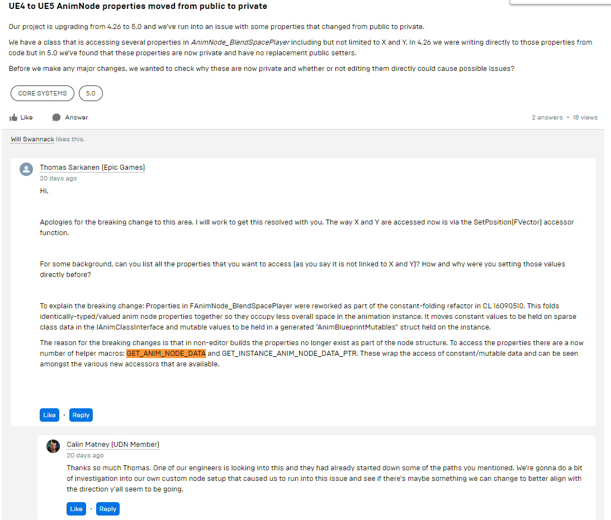

## 自定义AnimNode

/* 节点初始化使用，可能被调用多次 */  
virtual void Initialize_AnyThread(const FAnimationInitializeContext& Context);
 
 
 
 
 
 

/* 更新weight信息 */  
void FAnimNode_SequencePlayer::UpdateAssetPlayer(const FAnimationUpdateContext& Context)
 
 
 
 
 
 

/* 打开动画蓝图BP时，SequencePlayerNode节点的Debug显示，去掉的话，可以看到SequencePlayerNode下面的Frame滑块不再更新了，仅编辑器使用。 */  
DebugData->RecordSequencePlayer(Context.GetCurrentNodeId(), GetAccumulatedTime(), Sequence != nullptr ? Sequence->SequenceLength : 0.0f, Sequence != nullptr ? Sequence->GetNumberOfFrames() : 0);
 
 
 
 
 
 

TRACE_ANIM_SEQUENCE_PLAYER和TRACE_ANIM_NODE_VALUE系列函数供UnrealInsights使用。
 
 
 
 
 
 

/* 供ShowDebug Animation使用 */  
void FAnimNode_SequencePlayer::GatherDebugData(FNodeDebugData& DebugData)
 
 
 
 
 
 

### 疑问
GetEvaluateGraphExposedInputs().Execute(Context)执行什么。  
答：AnimGraph中Node有些输入引脚需要实时计算，Execute是进行计算的。

为什么需要重构成这个样子？仅仅减少占用空间吗，对运行时如何影响的？
GET_ANIM_NODE_DATA and GET_INSTANCE_ANIM_NODE_DATA_PTR

[CL 16090510](https://github.com/EpicGames/UnrealEngine/commit/16eee0289d427a4a2682aa4be5976ff1e1639115)

参考资料:

https://zhuanlan.zhihu.com/p/405437842

https://zhuanlan.zhihu.com/p/393884450

https://zhuanlan.zhihu.com/p/382058353

https://zhuanlan.zhihu.com/p/439150072

https://zhuanlan.zhihu.com/p/499277229

https://blog.csdn.net/qq_23030843/article/details/109103433
